# 用逻辑回归建立神经网络。

> 原文：<https://medium.com/analytics-vidhya/building-neural-network-with-logistic-regression-ef5fdd700810?source=collection_archive---------17----------------------->

逻辑回归作为一个基本的神经网络，是的，我们将讨论如何实现逻辑回归的神经网络工作。我假设你知道一些神经网络的基础知识，当我们说建立神经网络时，我们必须定义如何建立神经网络的几个步骤，是的，在我们将神经网络实现为逻辑回归之前，有一些关于神经网络的基础知识，让我们看看如何实现？

首先，我们看了正向传递，它包括输入和权重、产生输出的非线性函数，以及用于计算预测输出与实际输出相比的损失的成本函数

第二，我们来看看后向传递，包括使用梯度下降算法最小化损失函数，并通过计算梯度找出最终输出的理想权重，以将权重调整到实际输出，这称为优化。

这两个基本要素是构建神经网络的基本构件，我们将在继续学习时讨论这一点，我们刚刚看了概述，我们将看到细节

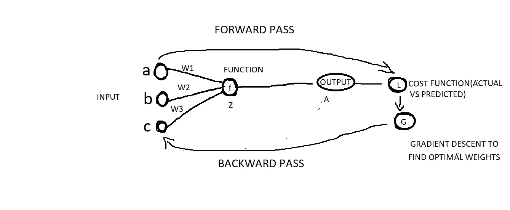

# 逻辑回归

逻辑回归是二元分类器

例如:给定一些狗或猫的图像，我们必须识别图像中是否有猫或狗，如果猫存在，我们标记为 1，如果猫不存在，我们标记为 0，就这么简单。那么我们如何表现这个形象呢？我们人类生来就有一些能力，我们可以识别它是否是猫，但是计算机如何识别它呢？为此，我们必须将数据呈现为计算机能够理解的形式，在此之前，这里的图片表示为像素，像素具有值，让我们来看看

猫图像 rgb

上面是猫的图像，下面是相应的像素值和图片本身的 3 个通道

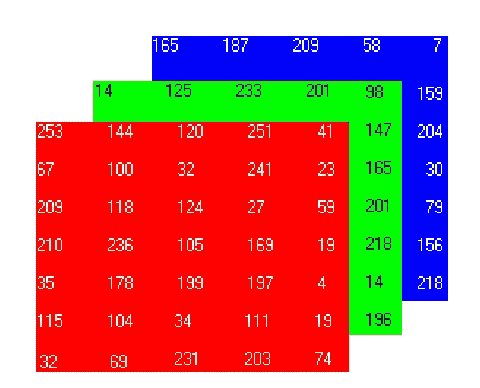

RGB 通道

r-红色、G-绿色、B-蓝色这里我们有 7*5 的 3 个通道，也就是 7*5*3 像素

正如您在上面看到的 cat 图像具有超过 7*5*3 的维度，但是在这里，例如我们在第二个图像中看到了 7*5*3 的维度，我们不能使用此图像来构建神经网络，我们必须将所有像素值取消排列为矢量化格式，例如:7*5*3=105 个像素

然后，我们将图片表示为 nx *1 向量的特征向量，其中 nx =像素数(105)，这是一个列向量，这是一个图像，但实际上我们会有数千个图像，因此我们将所有这些图像向量垂直堆叠，如下所示。

这里我们需要输入特征向量来得到输出是否为猫

这里 x1 表示单个图像向量，即具有 nx*1 维列向量的特征向量

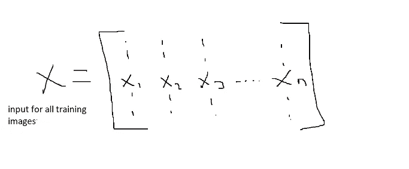

带有 nx*m 训练示例的矩阵

我们将堆叠所有的输入图像向量，即来自 x1、x2、x3、x4…xn 的特征向量，并且我们将它们垂直堆叠，您可以参考上面的解释，每一列是作为特征向量的单个训练图像，并且在所有列上我们表示为大写 X

这是神经网络输出

我们有输入向量 x，我们想要预测的输出(即 y^=p(y=1/x)

其中 y 是相对于输入 X 为 1 的概率

这里，输出 y^是 x 个输入的线性组合，权重为 w，偏差为 b

那就是 y^= wTx+b

您可以看到上面的输出产生了线性输出，这在本质上是连续的，我们在这里不需要，在逻辑回归中，我们预测 0 和 1，所以我们必须将 sigmoid 函数应用于此输出，以获得 0 和 1 之间的值，其中 sigmoid 是 1/1+e-z，z 是 y^的线性输出

这里我们如何表示 a = sigmoid(Z)，从而产生 0 和 1 之间的值，关于逻辑回归的更多内容可以参考在线资料。下图是 sigmoid 函数

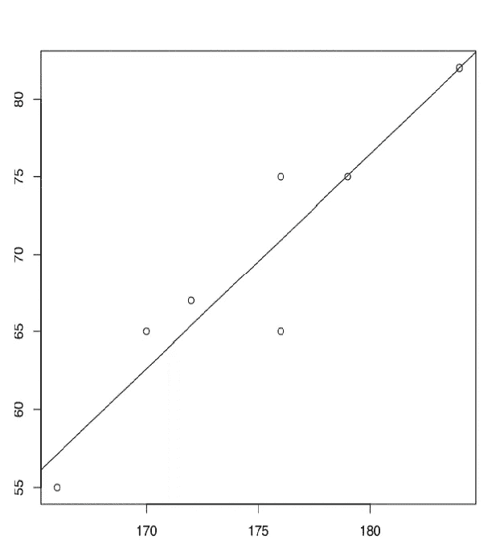

线性输出

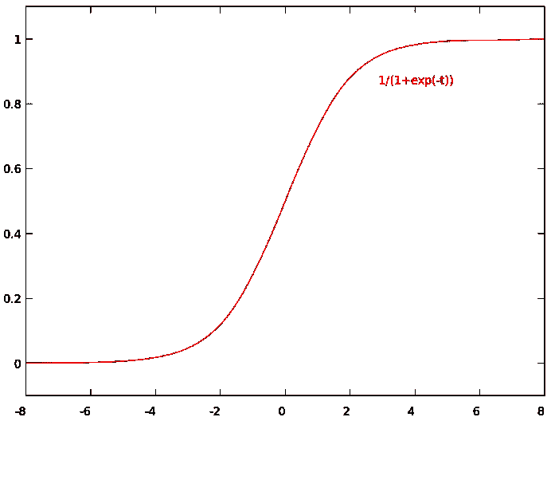

乙状结肠输出

# 价值函数

这里，我们使用的成本函数就是我们的损失函数(对于单个训练示例，我们使用损失函数，但对于所有训练示例，我们使用成本函数)，成本函数的目的是计算所有训练示例相对于实际的损失，并输出所有训练图像的损失，以便为我们的模型找到正确的 w 权重偏差，因为我们首先已经定义了成本函数，一旦找到损失，我们就可以调整权重

对于单个训练示例，我们将损失定义如下

l(y^,y)=-(y^+(1-y)日志(1-y^))

其中 y 是实际输出，y^是预测输出，所以这里我们使用负号，因为我们必须最小化损失函数

如果 y=1，损失函数变成 L(y^,y)=-log y^，因为-log y^必须尽可能小，然后 y^将变成接近 1 的大值

如果 y=0，损失函数变成 L(y^,y)=-log(1- y^，对于对数(1- y^)，必须尽可能大，然后 y^将变成接近 0 的小值

对于整体训练示例，我们使用成本函数来计算损失(成本)

即成本函数 J(w，b)=1/m 从 I 到 m L(Y^(i),Y(i 的总和)

代价函数:J(w，b)=-1/m sum I to m[(y(I)log y^(i)+(1-y(i)log(1-y^(i)))

其中，负号用于最小化损失以最大化概率，w 和 b 是损失函数的参数，I 到 m 是所有训练示例，我们必须对损失进行求和并求平均值，我们将所有训练示例的平均损失作为成本函数

现在我们已经定义了我们的成本，接下来我们将看到如何找到 w 和 b 的最佳参数，以降低所有图像的成本函数

# 梯度下降

我们有计算图像损失的成本函数，现在要做的是减少损失，以使我们的预测输出与实际输出相匹配，我们在这里使用的方法是梯度下降算法，它为我们的图像预测找到最佳权重和偏差参数，让我们看看它在下图中是如何工作的

在这里，我们将看到下面的凸损失函数，以了解梯度下降

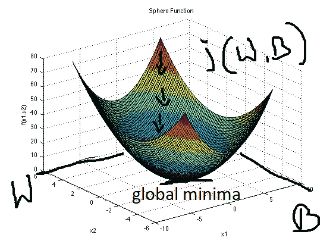

凸函数

高于成本(损失)函数，其中曲线的高度和宽度代表整体权重和偏差，当随机初始化我们的权重时，当我们计算成本函数时，权重位于该曲线上的某个位置，梯度下降将做什么，它将采取步骤向下方向，其中损失最小，即全局最小值。梯度下降在最速根中采取步骤，直到找到全局最小值以减少损失。

让我们看看下面

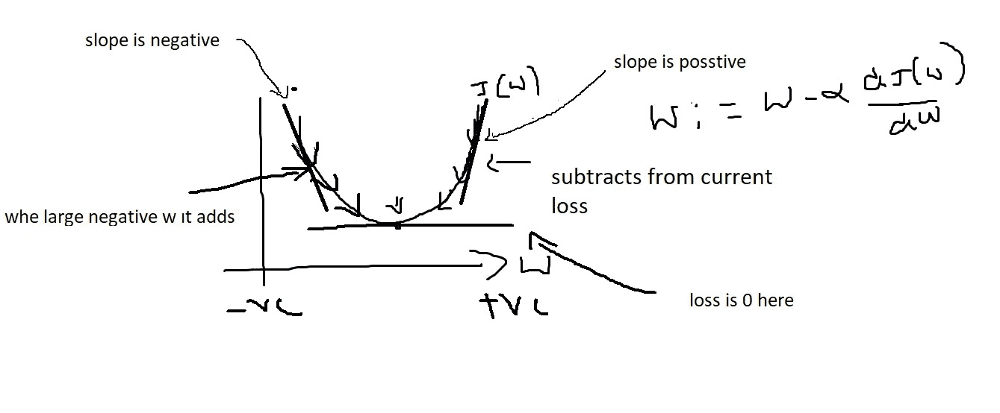

更新凸损失函数的权重

我们的工作是找出位于你能看到的表面之下的最小损失，我们将在每次朝着最小损失采取措施时找到损失函数的导数，关于导数我们在这里不讨论，你可以找到在线材料，为了理解导数意味着斜率，我们必须找到损失的水平斜率，你可以参考上面的水平斜率

上面是成本函数，当我们初始化权重时，w 将位于曲线的顶部，这意味着当 w 是大值时，我们必须将方向转向 w 的左侧，并从当前损失中减去，通过使用所谓的学习率，我们将发现学习率是决定在特定方向上采取多大步骤的一个因素，当 w 大时，我们采取相反的步骤

当 w 为负时，通过学习率，我们朝着正的方向前进，上瘾就会发生

我们的最终目标是达到全局最小值，这就是梯度下降每次通过减少损失来更新权重并找到全局最小值

总的目标是找到最佳的 w 和 b 参数，因为我们不能在这里改变输入

只有使用 w 和 b，我们才能优化损失

# 计算图(向前传递和向后传递)

前进传球

神经网络的计算包括两种方式，第一种是前向传递，其中我们将计算输出的成本函数，第二种是后向传递，其中我们计算成本函数的梯度。

假设我们有一个函数 j (a，b)=4(a+bc)

让我们看看向前传球的计算图

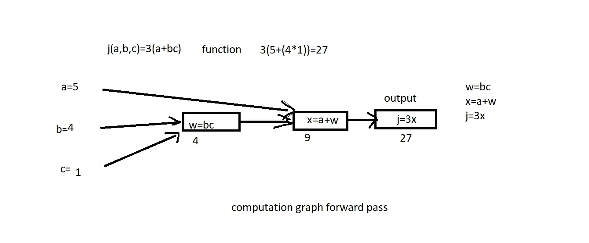

前向传递或前向传播整体思想是计算函数 j，即计算输出损耗，在示例中，我们采用简单函数计算前向传递计算图，我们可以先将 b 和 c 相乘，然后将 w 乘以 a，最后将 x 乘以 3，得到函数输出，以计算输出和前向传递损耗。

偶数道次

在后向传递中，我们必须找到相对于输出 j 和 I 的导数，即使用导数数学概念找到权重和偏差，我们现在不讨论导数，但让我们看看它是如何工作的，导数的意思是说，通过调整权重输入，我们可以通过频繁更新这些权重来将损失降至最低

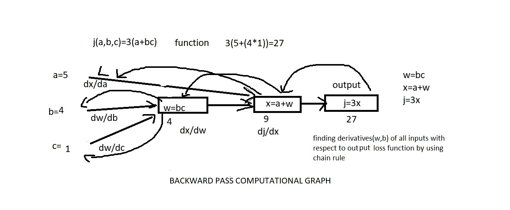

你可以在上面的图像中看到反向传播看起来有多简单，我们必须找到所有输入相对于输出函数 j 的导数，为了做到这一点，我们使用导数的链式法则

首先我们计算输出相对于 x 的导数，即 dj/dx，如果改变 x，j 的输出会改变多少，然后我们通过改变 w i，e dx/dw，找到 x 的导数，通过改变 a i，e dx/da，找到 w 的导数，分别改变 b 和 c，即 dw/db/，dw/dc

这就是简单的反向传播，为此，你必须知道导数的链式法则，这里我们找到了输入 a、b、c 和偏差相对于反向传播中的损失或成本函数的权重

# 逻辑回归梯度下降

这里我们将讨论如何计算导数来实现逻辑回归的梯度下降，让我们用计算图来做这件事，我们现在将回忆逻辑回归

z = wTx+B—-相对于输入 x 的线性输出

## 线性输入的 Y^=a=sigmoid(z)-逻辑 sigmoid 输出

L(a，y)=-(ylog(a)+(1-y)log(1-a))-单个训练示例的 sigmoid 输出的损失函数

下图解释了单个训练示例

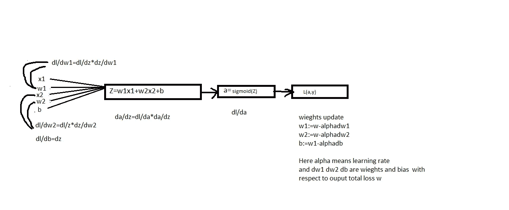

计算逻辑回归的导数

这里我们讨论关于计算单一训练样本的梯度

下面我们来讨论一下 m 训练的例子

让我们计算所有训练示例的成本函数

J(w，b)=1/m sum from i to m L(a(i)，y(i))

其中 I 到 m 是所有损失的总和，a/m 是所有损失的平均值，a(i)或 y(i)是指所有训练样本

a(I)= y(I)= s 形(Z(I))= s 形(wTx(i)+b)

我们已经计算了 sigmoid 和成本函数 j

让我们看看如何计算所有训练示例的总成本函数的导数

d/dw1*j(w，b)=1/m sum from i to m d/dw1*L(a(i)，y(i)

其中 dw1(i)相对于所有训练示例(x(i)，y(i)

像这样，我们计算 w2，b 的权重和偏差

d/dw2*j(w，b)=1/m 从 I 到 m 的和 d/dw2*L(a(i)，y(i)

d/db*j(w，b)=1/m 从 I 到 m 的和 d/db*L(a(i)，y(i)

现在我们已经知道如何为所有训练示例找到权重 dw1(i)，dw2(i)，db(i)

让我们来看看如何实现这个逻辑

Z(i)=wTx(i)+b

a(i)=sigmoid(z(i)

并且我们对所有训练示例循环成本函数是 j+=[y(I)log a(I)+(1-y(I)log(1-a(I))

并且 z(i)=a(i)-y(i)对所有训练示例的损失 a 的导数

dw1+=x1(i)dz(i)

dw2+=x2(i)dz(i)

db+=dz(i)

以上是所有输入和所有训练样本的权重和偏差

所有成本函数 j/m 平均损失，其中 m 是训练示例的

所有训练样本 m 的最终权重为

所有训练示例的 dw1/m、dw2/m/db/m

权重更新如下:w1:= w1-αdw1，w2:= w2-αdw2

b:= b-αdb，其中α指的是学习率

我们已经看到了如何为所有训练示例的逻辑回归实现梯度下降

在这里，对于所有训练示例，当您与没有平均的单个训练示例进行比较时，我们取平均损失 1/m。

# …向量化…

矢量化是为了避免在代码中实现 for 循环，当我们在大型训练集上训练我们的模型时，由于 for 循环在迭代中进行，因此需要很长时间来训练，因此我们使用矢量化来避免这种情况

让我们看看如何

当你计算 z=wTx +b 时，这里 w 和 x 是大的 nx*1 大的向量，为了计算这两个向量，我们必须对向量的每一行使用 for 循环。所以要避免

我们所能做的就是使用 NumPy 库，使用 NumPy 中的下面的函数来做这件事

Z=np.dot(w，x)+b 它等于 wTx+b

这里，我们将输入向量作为单个向量水平堆叠

让我们看看下面如何做逻辑回归

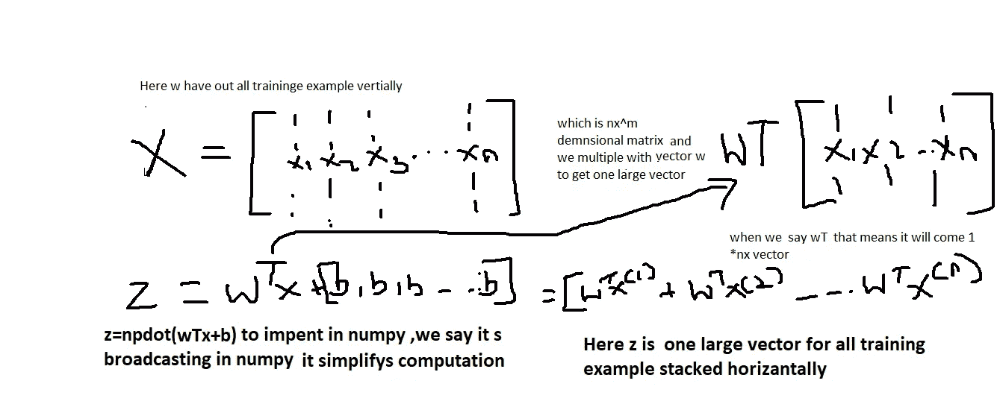

…向量化…

从上面我们可以看到，通过使用 NumPy 库，我们可以将它水平堆叠起来，在 NumPy 中进行广播，这比循环更好，也更节省时间。

现在，我们了解了如何使用所有必要的组件将逻辑回归作为基本的神经网络来实施，我们在这里进行了简单的讨论，但您可以探索更多有关使用在线资源的信息，这里的主要组件是计算成本的向前计算和通过实施梯度下降的向后计算，我们可以找到正确的权重和偏差，并减少损失。

快乐学习！！！！！