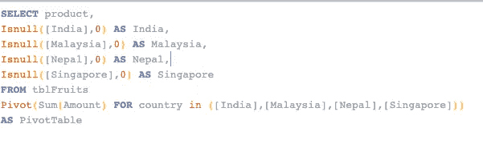

# 在 Excel、Pandas、SQL 上构建数据透视表

> 原文：<https://medium.com/analytics-vidhya/building-pivot-table-on-excel-pandas-sql-e5f97053bbec?source=collection_archive---------11----------------------->


数据透视表是帮助计算、汇总和分析数据的强大工具。最常见的情况是，我们将数据透视表与 Excel 表相关联，因为在 Excel 上广泛使用了这一功能来进行快速分析。

数据透视表是任何日常生活围绕使用 MS-Excel 的人的首要工具。

在这篇文章中，我们不仅要看如何在 Excel 上构建一个数据透视表，还要将同样的想法扩展到 SQL 和 Python(Pandas)。我们将尝试选取一个样本数据，然后在所有 3 个不同的数据操作工具中使用相同的数据，并构建数据透视表。

*参考数据:-*


样品水果桌

> 在这种情况下，我们试图解决的问题是:“每个国家每种水果的总量分配是多少？”

# **1。MS- EXCEL**

让我们首先为上面的案例创建一个数据透视表

1.  上表包括:-

*   水果:4 种不同的水果(分类栏)
*   金额(单位) :与该水果相关的总金额(数字)
*   国家:国家列表(4 个独特的国家，分类栏)

2.为了计算每个水果和每个国家的总金额，我们需要将水果的名称作为行标题，将国家名称作为列标题。

3.记住上面的直觉，选择整个表格并点击**插入>数据透视表**

4.在**下选择放置数据透视表的位置**选择**新建工作表>** 然后选择**确定**

5.现在在数据透视表字段窗格中:根据第 2 点的想法，将**水果**列拖放到**行**中，将**国家**列拖放到**列**中


数据透视表字段视图

6.最后，为了获得跨水果和国家的合计金额值，将**金额**列拖放到**值**数据透视表字段中，以便在值部分显示**金额**的总和

7.瞧..您的数据透视表已经准备好了，它看起来像这样


最终数据透视表

8.因此，我们可以很容易地看到每个国家每种水果的数量。

# 2.Python(使用熊猫)

从拖放和点击开始，使用 Pandas 库编写一些 Python 代码。

1.  让我们创建一个精确的数据框架，类似于我们用于 Excel 的样本数据集

> 注意:为了简单起见，将 DataFrame 视为 Python 世界中的一个表

2.下面是按照**从字典构建数据帧的方法**构建数据帧的代码

> (使用每列的名称作为字典的键，并将该列的所有值作为值)


以上片段摘自朱庇特笔记本

3.让我们试着构建一个和 Excel 完全一样的数据透视表。使用的函数是: **pivot_table** (相当简单，根本不用记)。下面是让你兴奋的解决方案！！


使用熊猫的数据透视表

4.上面的代码看起来简单容易。让我们继续下去，并打破这个函数，记住我们的直觉，当我们使用 Excel 建立数据透视表。

5.想法是使用: **Product values(fruits)** 作为数据透视表中的行标题，因此，我们将把该列传递给数据透视表函数中的**索引参数**。

6.接下来我们需要获取国家作为列标题，所以让我们将**国家**列传递给透视表函数中的**列参数**。

7.为了在这个数据透视表中得到一个值，我们需要将数值列传递给数值参数，因此**金额**列被传递给**数值参数**。

> 8.这之后剩下的唯一一件事就是告诉数据透视表应该如何聚合这些值。在当前情况下，我们需要对来自金额列的数据求和，因此将 **sum** 作为一个值传递给 **aggfunc 参数**
> 
> 注意:聚合规范可以是字符串，如`'sum'`、`'mean'`、`'count'`、`'min'`、`'max'`等，也可以是实现聚合的函数(如`np.sum()`、`min()`、`sum()`等)。

9.为了计算行和列的总数，我们可以使用*=***True***。margin 的默认值为 ***False'*** ，不会提供行和列的总和。*

*10.如果数据透视表中有任何单元格没有数据，熊猫透视函数将显示为 ***NaN。*** 为了让这个数据透视表看起来和 Excel 一模一样，我们可以提供***fill _ value =“”***它会将所有 NaN 变为空单元格。*

*11.这里是最终的 python 代码，如果你想节省时间，可以从上面添加的图片中输入代码*

```
*fruits_df.pivot_table(index='Product',columns='Country',
          values='Amount',aggfunc='sum',margins=True,fill_value='')*
```

# *3.结构化查询语言*

1.  *类似的表格在 Excel 和 DataFrame，我们也需要在我们的数据库中类似的表格。*
2.  *下面的代码可用于在数据库中创建一个表，然后将所有记录添加到该表中*

**

*在数据库中创建表的 SQL 查询*

> *注意:MS-SQL 已被用作本文的一部分*

*3.创建表之后，我们需要做的下一步是将观察/行添加到表中*

**

*添加表中所有元素的 SQL 查询*

*4.使用选择查询验证表是否包含所有记录*

**

*从表中选择所有元素*

*5.让我们看看数据透视表查询和结果，然后我们将理解这个查询是如何工作的。*

**

*数据透视表查询*

**

*数据透视表查询和结果输出(上表)*

*6. ***了解查询:****

*a.**支点**功能/操作器有 **2 部分**:*

*   ***聚合函数** : ***sum*** 在这种情况下，将用于该聚合的**数字列(金额)**作为参数传递给聚合函数*
*   *最终的输出表包含列(印度、马来西亚、尼泊尔、新加坡)，这些列基本上是**(国家列)中的唯一值。因此，需要从 pivot 操作符返回这些列，以便外部选择查询可以显示这些列***

```
*FOR country in ([India],[Malaysia],[Nepal],[Singapore])*
```

*b.因此，透视查询是将原始表**的**国家**列中的唯一列值** (India，Malaysia，Nepal，Singapore)转换为输出中的列，同时对**金额**列执行聚合。*

*c.外部查询仅用于从**TBL ruits**表中选择 **product** 列，以及从数据透视表中选择旋转列。*

*d.如果上面的数据透视表中有任何单元格有空值，我们可以使用 isnull 函数**将该空值替换为 0***

```
 *Isnull([India],0) as India*
```

*e.这是快速参考的最后一个查询，如果你想从上面添加的图片中节省输入查询的时间*

```
*Select product, 
Isnull([India],0) as India, 
Isnull([Malaysia],0) as Malaysia,
Isnull([Nepal],0) as Nepal,
Isnull([Singapore],0) as Singapore
from tblFruits
Pivot(Sum(Amount) for country in ([India],[Malaysia],[Nepal],[Singapore]))
as PivotTable*
```

# *结论*

*因此，我们可以看到，数据透视表可以跨 Excel、Python 和 SQL 实现，这取决于您熟悉哪种工具。Pivot 是一个方便的工具，可以很容易地用来分析数据。*

*这篇文章可以作为想使用上述三种工具中任何一种做 Pivot 的人的快速参考。*

# *参考*

*[微软 Excel 数据透视表](https://support.microsoft.com/en-us/office/create-a-pivottable-to-analyze-worksheet-data-a9a84538-bfe9-40a9-a8e9-f99134456576#OfficeVersion=Windows)*

*熊猫。DataFrame.pivot_table 文档*

*[熊猫透视表篇](https://towardsdatascience.com/pivot-tables-cross-tabulation-data-aggregation-tools-in-python-dd6791dbe3cd)*

*[SQL Server 中的透视](https://www.youtube.com/watch?v=h3BtudZehuo&t=347s)*

# *接触*

*如果你想和我讨论任何与数据科学和机器学习相关的话题，你可以联系我:*

1.  *[领英](https://www.linkedin.com/in/ved-prakash-dwivedi-2054aa17/)*
2.  *[电子邮件](http://vedprakash.nitjsr@gmail.com)*