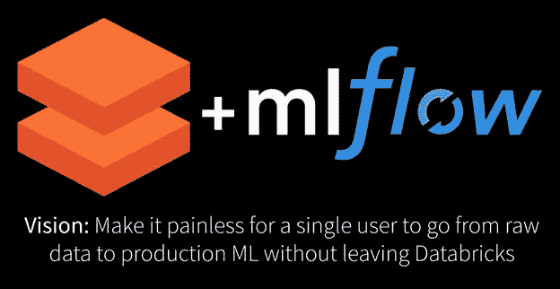
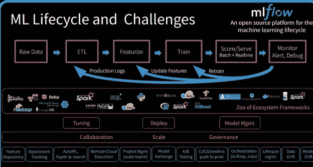
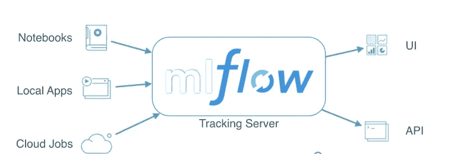

# 使用 DataBricks 和 MLFlow 构建生产数据科学管道:在 Azure/ AWS 上使用 Apache Spark 引擎进行机器学习:第 1/3 部分

> 原文：<https://medium.com/analytics-vidhya/building-production-data-science-pipelines-using-databricks-and-mlflow-machine-learning-using-31473eb6b0f0?source=collection_archive---------13----------------------->

图片提供:databricks

构建和管理数据科学或机器学习管道需要使用不同的工具和技术，从数据收集阶段到模型部署和监控。它涉及软件工程、数据科学、数据工程、数据分析和 devops 以及云计算的知识。如果每个人都有熟练的员工，那么恭喜你，你已经从一些麻烦中拯救了自己。

但是我个人喜欢工作和构建端到端的流程，管理整个流程在大多数时候变得很麻烦。

图片提供:Databricks

Data bricks 使用其统一分析平台解决了这一问题。该平台使用 Apache spark 引擎，可以在几分钟内处理大量数据。该平台还支持 Python/ SQL / Scala /R 编程，它还声称拥有基因组学的[**最快的 DNASeq 管道**](https://databricks.com/blog/2018/09/10/building-the-fastest-dnaseq-pipeline-at-scale.html?_ga=2.135724402.2130877622.1591738925-1404637655.1583328902) 。

如果你希望创建分析或数据科学管道，我强烈推荐尝试这个 [**平台**](https://databricks.com/try-databricks) 。关于 Databricks 的其他特性，您可以查看我的 [**帖子**](/@anuragbisht12/databricks-should-you-learn-it-e7b6f40208f1) **。**

在这个由 3 部分组成的系列中，我们将构建和部署生产级可扩展数据科学管道。在这篇文章的这一部分，我们将介绍机器学习生命周期术语的基础知识(数据块和 ML 流)，你可能会在接下来的两篇文章中遇到。

1.  **笔记本:**

编写代码的集成开发环境。

**2。跑:**

当代码以一组指定的参数执行时，它被称为 run。

**3。实验:**

顾名思义，科学家所做的就是用不同的组合得到一个结果来得出推论。

我们可以在这里使用相同的类比，具有不同参数的每个运行可以被聚集为一个实验。我们也可以进行多次实验。

**4。参数:**

代码的输入参数的键值对。

**5。指标:**

机器学习模型的评价指标。

6。来源:

最初运行实验的代码。

**7。神器:**

任何格式的任意输出文件。这可以包括图像、酸洗模型和数据文件

**8。切入点:**

任何一轮实验的起点。

**9。终点:**

其他应用程序可以使用公开的 REST API url 来获得预测。

**10。环境:**

软件和硬件配置以及使代码能够运行的任何代码依赖项。

11。ML 流量成分:

**MLflow Tracking** : API 和 UI，用于在运行机器学习代码时记录参数、代码版本、指标和工件，并在以后可视化结果。

图片提供:mlflow

**MLflow 项目**:封装可重用数据科学代码的标准格式。每个项目只是一个包含代码的目录或 Git 存储库，并使用描述符文件或简单的约定来指定其依赖项以及如何运行代码。

**MLflow Models** :以多种风格包装机器学习模型的约定，以及帮助你部署它们的各种工具。

**MLflow Registry** :集中式模型存储、一组 API 和 UI，用于协作管理 MLflow 模型的整个生命周期。它提供了模型沿袭(MLflow 实验和运行产生了模型)、模型版本化、阶段转换(例如从阶段转换到生产或归档)和注释。

**12。口味:**

Python 模型的通用文件系统格式，并提供了将模型保存到该格式和从该格式加载模型的实用程序。例如，Keras、pytorch、sklearn

**13。工作空间:**

创建任何笔记本的文件夹结构。

14。工作流程:

笔记本/代码的执行顺序。例如，收集->特性创建->训练->测试->部署/预测

15。DBFS:

数据块文件系统。

16。拼花地板:

Apache 用于存储大文件的开源高效列存储格式。

17。集群:

以分布式方式工作的一组可扩展的计算资源(如本地计算机)。

18。API:

应用程序编程接口，通过 web 使用任何 [REST](https://en.wikipedia.org/wiki/Representational_state_transfer) 请求公开为可调用的 URL。

**19。批次/作业:**

按指定计划运行的脚本或代码。

在下一篇文章中，我们将使用最佳实践在 Databricks workspace 上创建机器学习模型。希望你喜欢这篇文章，请关注下一篇。