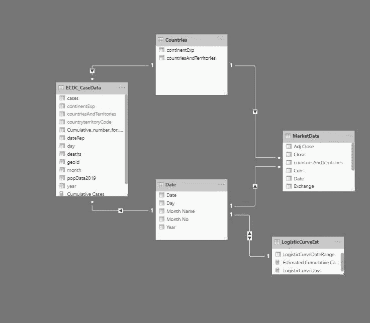
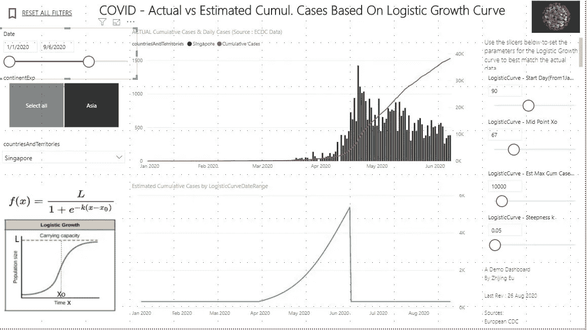
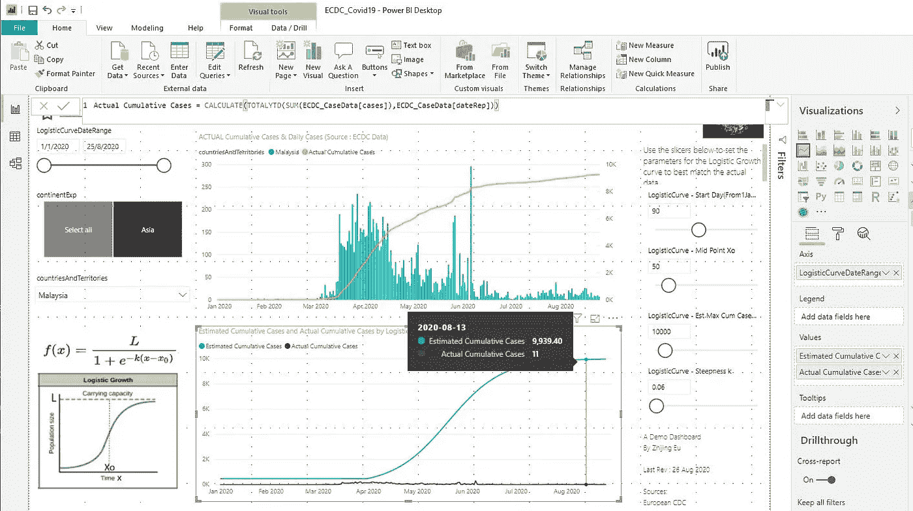

# 在线构建和发布 MS PowerBI 新冠肺炎分析仪表板

> 原文：<https://medium.com/analytics-vidhya/building-publishing-a-dashboard-online-with-ms-power-bi-a1f76997e114?source=collection_archive---------13----------------------->

[点击下面的链接](https://app.powerbi.com/view?r=eyJrIjoiZjZmZmVlNWEtOTY3OS00NzUxLTgyNjctN2FmNTlkNTRkMWQwIiwidCI6IjNkZjMzNzhmLWY4ZTItNDYzNy04ZjUxLTkzNDQ3N2Q4OGFkMCIsImMiOjEwfQ%3D%3D&pageName=ReportSection) :-

 [## 电源 BI 报告

### 由 Power BI 支持的报告

app.powerbi.com](https://app.powerbi.com/view?r=eyJrIjoiZjZmZmVlNWEtOTY3OS00NzUxLTgyNjctN2FmNTlkNTRkMWQwIiwidCI6IjNkZjMzNzhmLWY4ZTItNDYzNy04ZjUxLTkzNDQ3N2Q4OGFkMCIsImMiOjEwfQ%3D%3D&pageName=ReportSection) 

(【2021 年 1 月编辑 — *注意，图表不再显示“实时”数据，因为 ECDC 从每日* ***切换到每周*** *进行新冠肺炎报告，并从 12 月 14 日起停止每日更新，有效地“打破”了我设置的自动更新规则。因此，在我想出如何“合并”历史每日和每周数据之前，仪表板只显示 2020 年的数据*

## ***TLDR 版:***

*Power BI 是一款出色的工具，具有一系列有用的“开箱即用”功能，应该适合大多数标准数据可视化和分析任务。一大优势是友好的学习曲线，特别是如果你已经熟悉 Excel 和一些基本的 SQL。*

*如果你刚开始接触 PBI，我的建议是:*

*1。让你的数据模式尽可能的简单***——相信我，这将会为你省去悲伤，避免以后复杂的 DAX 查询**

**2。了解 DAX 是如何工作的，尤其是它如何评估上下文/行过滤器——DAX 是一个强大的工具，但如果你没有正确理解它能做什么和不能做什么，就很容易出错…**

**3。发展你的“数据故事”(例如，你是否表现出一种趋势？对比类别？)在构建视觉效果之前(少即是多！)**

**4。考虑您希望用户如何与仪表板交互——PBI 非常适合可视化数据，但如果您希望用户主动“添加/编辑”底层数据，就不那么简单了**

## ***概要***

1.  *[简介&动机](#3c79)*
2.  *[用电源 BI 启动](#73c5)*
3.  *[将源数据拉入 Power BI](#68e8)*
4.  *[清理数据&建立数据模型](#a6c0)*
5.  *[构建可视化报告](#ee04)*
6.  *[通过假设参数和自定义 Python 可视化创建“用户交互式”曲线](#4d39)*
7.  *[(不成功)尝试在 Power BI 中创建求解器/优化器](#0f72)*
8.  *[探索 PBI 网络服务](#7800)*
9.  *[结论](#b33e)*
10.  *[其他学习资源](#9b75)*

## *1.简介和动机*

*那些在 LinkedIn 上关注我的人可能记得我在 2020 年 6 月在马来西亚/新加坡的 COVID19 危机最严重时发表的一篇帖子，我在那里建立了一个简单的基于 excel 的仪表板，从公共来源提取数据以可视化一些指标*

*[](https://www.linkedin.com/posts/eu-zhijing-25a4362_covid19-excelvba-programming-activity-6650804059026620416-Lsfd) [## 欧志敬在 LinkedIn 上发帖

### 对于那些在 LinkedIn 上关注我的帖子的人来说，我想这是锁定“幽居病”的第二部分——还有额外的…

www.linkedin.com](https://www.linkedin.com/posts/eu-zhijing-25a4362_covid19-excelvba-programming-activity-6650804059026620416-Lsfd) 

从那以后，在过去的几个月里，我学习了一些微软 PowerBI，一种数据可视化/分析工具，并在 Power BI 中重新构建了相同的仪表板，并在网上发布了它(是的，我提前道歉，因为我没有选择除新冠肺炎之外的更令人振奋的主题，但在我已经拥有的基础上进一步构建很方便)。

我最初尝试了其他类似的工具，如 [Tableau，甚至谷歌云的数据工作室](https://improvado.io/blog/tableau-vs-looker-vs-power-bi-vs-google-data-studio-vs-bigquery)，但 PowerBI 的优势在于它与 Excel 类似的“外观&感觉，这使得它相对容易上手，并且与所有“开箱即用”的 viz/analytics 包一样，它的学习曲线比试图通过 [D3.js](https://d3js.org) 或 Python 的 [Bokeh](https://docs.bokeh.org/en/1.0.0/#:~:text=Bokeh%20is%20an%20interactive%20visualization,modern%20web%20browsers%20for%20presentation.&text=Bokeh%20can%20help%20anyone%20who,start%20with%20the%20User%20Guide) 等“DIY”自己的可视化更友好

本文的其余部分是一个教程，涵盖了我从构建到发布报告/仪表板的所有步骤，以及我在使用 DAX (PBI 公式和查询语言)和数据建模时学到的一些东西。希望开始使用 MS Power BI 的其他数据爱好者会发现这很有帮助。

# **2。用电源 BI 启动**

用户通常在 Power BI 桌面版(可以从本地 PC 运行)中构建报告。完成报告后，您可以将报告发布到 Power BI (Web)服务上，然后可以与其他人共享(或公开发布——稍后将详细介绍)。还有一个 PowerBI 移动应用程序，允许用户在他们的设备上查看报告。


下载 Power BI Desktop 比较不痛苦，官网上有[https://powerbi.microsoft.com/en-us/downloads/](https://powerbi.microsoft.com/en-us/downloads/)

然而，棘手的是注册 PowerBI 网络服务，因为微软不允许你通过消费者电子邮件服务公司提供的电子邮件地址注册。这是不方便的，因为桌面版本工作良好，但你不能与任何人分享你的报告，除非你发送 PBIX 文件本身(这意味着收件人必须有自己的 PBI)。此外，还有一些仅在 Web 服务版本中可用的可视化/功能。

值得庆幸的是，我从 GoDaddy 那里买了一个独立的域名，还附带了一封电子邮件(我用它建立了一个博客——以后会详细介绍)。因此，我可以直接注册一个新帐户。

幸运的是，还有其他解决办法，比如你可以注册 Office365 的试用版，或者如果你已经有了 Azure(微软的云服务)，你可以设置一个 Azure Active Directory。更多细节请见下面的视频

# **3。将源数据拉入 PowerBI**

对于那些在 Excel 中使用过 Power Query 和 Power Pivot 的人来说，您应该会觉得这很熟悉，因为 PowerBI 也使用 Power Query。

COVID19 病例数据来自欧洲疾病控制中心的网站，我是带着 CSV 文件去的。股市数据来自雅虎财经(也是 CSV 格式)


请记住设置权限，因为我将这些权限设置为 Credentials = Anonymous 和 Privacy = None，但是当我稍后尝试刷新数据时，数据偶尔会加载不正确。将隐私级别设置为公开似乎已经解决了这个问题，但不确定这是否是巧合。


接下来，我**面临一个问题:**雅虎财经一次只允许你查询一个市场(也就是说，你不能在一个请求中同时获取多个市场的数据)。在仪表板的原始 Excel 版本中，我动态地一次提取“一个国家”的股票交易数据，并在用户每次刷新国家选择时覆盖它(通过 Excel 宏)

我在 PowerBI 中寻找一种等效的方法，一次只能“加载”一个国家的股票市场数据，并在用户每次选择不同的国家时更新表格。虽然看起来确实有一种方法可以设置“查询参数”来允许用户动态地更改查询，但只有当用户同时拥有 PBIX 文件和 Power BI 桌面时，这种方法才有效。

[](https://community.powerbi.com/t5/Desktop/End-User-ability-to-change-SQL-query-parameters/td-p/888862) [## 最终用户更改 SQL 查询参数的能力

### 嗨，我喜欢使用 Microsoft Query 的几个原因之一是可以把一个？在查询中…

community.powerbi.com](https://community.powerbi.com/t5/Desktop/End-User-ability-to-change-SQL-query-parameters/td-p/888862) 

不幸的是，在发布 Power BI 报告后，似乎没有简单的方法来“动态地”*更改数据源，因为所有报告都引用一个公共数据集(这意味着您必须首先加载所有数据源)。最后，我放弃了这种方法，只是单独提取了几个关键的东盟市场的股票信息，而不是变得太聪明。*

(稍后在第 6.0 节你会看到一个类似的问题[，我试图让用户‘改变’曲线的参数，并动态地‘实时’反映出来)](#4d39)

最后一步是确保数据保持最新，但是您只能在 Power BI Web 服务上做到这一点，因此我将在稍后的[第 8.0 节](#7800)中介绍这一点

# **4。清理数据&构建数据模型以“链接”表格**

唉，这并不像将所有东西都放入 Power BI 并希望在您创建可视化时东西会自己整理出来那么简单。

第一步非常简单，我在从 Yahoo Finance 提取的各个数据表中添加了股票交易所名称、国家名称(与 ECDC 数据集中的标签一致)和货币的新列


然后，我创建了一个新表，并使用 UNION 函数合并了各种股票交易数据表。(这也是一样的。为任何熊猫爱好者添加)


当时的诀窍是找到一种方法，确保如果我稍后为国家或日期设置过滤器，ECDC 数据和股票交易数据会“一起移动”。如果您试图将这两个表链接在一起，您会发现由于许多行具有重复的日期(代表不同的国家),这会导致多对多关系不起作用。此外，因为两个表之间只能有一个活动链接，所以我也不能链接“countriesAndTerritories”字段。


不要这样做！这是行不通的

我一直在寻找可以将数据转换成最简单形式的解决方案，即[星型模式](https://en.wikipedia.org/wiki/Star_schema)，但是我不想把现有的表分割开来，所以我最终选择了使用两个“事实表”,为“[日期](https://docs.microsoft.com/en-us/power-bi/guidance/model-date-tables)和“国家”构建两个独立的新维度表，并像这样将它们连接起来


改为这样做！

我不确定，但它看起来很像一些人所说的[“星系”模式或“事实星座”](https://www.geeksforgeeks.org/fact-constellation-in-data-warehouse-modelling)(谁想出这些名字的？！)其中有多个事实表链接到同一个维度表。


[https://www . geeks forgeeks . org/fact-constellation-in-data-warehouse-modeling/](https://www.geeksforgeeks.org/fact-constellation-in-data-warehouse-modelling/)

显然这并不理想，因为它很难维护，并且可能导致需要运行复杂的查询。然而，为了演示 PBI，当我在一些简单的可视化上测试它时，我设置的似乎是有效的，所以我坚持使用它。

# **5。建立可视化和其他杂项功能(制作重置按钮)**

我的目标不是任何太花哨或复杂的东西，所以我用了一组简单的图表来显示不同的指标(COVID19 病例和死亡以及股票市场信息，其中所有图表都通过相同的切片器控制，用于选择国家和日期范围，并水平对齐。

我最初想把所有的东西都放在一个单一的图表中(例如，每日的、累积的案例和股票市场变动)，但是我认为这会变得非常混乱，尤其是如果用户选择多个国家的话。

然而，我也开始注意到一些非常奇怪的行为，如果我使用折线图和簇状柱形图，折线图只能反映所有类别的总和。


我不想要黄线——我想要下面的三条线和同一个图中聚集的列:(

显然没有多线簇柱形图——快速搜索表明我不是第一个问这个问题的人。有一个解决方案，涉及添加一个“措施”与一些 DAX 公式，但它看起来像你必须为每个类别添加它！因此，最后我只是用单独的图表显示了累计和每日病例数。

[](https://community.powerbi.com/t5/Desktop/Clustered-column-amp-2-lines-with-same-series-TY-amp-LY/td-p/57399) [## 具有相同系列的簇状列& 2 行(TY & LY)

### 你好，我是一名商务智能新手，正在尝试创建一份报告。我有一个基于相同数据的 excel 图表(实线= TY…

community.powerbi.com](https://community.powerbi.com/t5/Desktop/Clustered-column-amp-2-lines-with-same-series-TY-amp-LY/td-p/57399) 

接下来，我还添加了一个“重置过滤器”按钮。虽然 PBIX 有一个很好的功能，允许您在单击单个数据点时“切片/切块”您的数据，以查看它与其他图表的关系，但当打开选择时，它可能会让报表查看者感到相当困惑和混乱。

创建一个“重置过滤器”按钮非常简单，因为你只需要进入查看>并检查书签窗格。在书签窗格中，创建一个新书签，并在设置了当前报表中所需的任何默认视图后更新它。在按钮中，只需设置“操作”来链接书签。


# **6。创建“用户交互式”曲线**

## **6.1 使用 Power BI What If 参数**

在仪表板的 Excel 版本中，我有一个功能，用户可以更改构成逻辑增长或 SIR 模型曲线的参数，以可视化估计病例与实际病例数的比较。

事实证明，用 PowerBI 做这件事要复杂得多，因为从根本上来说，它是一个查询数据源的工具，通过过滤掉值等来转换数据源，或者从数据中创建新的 calcs，然后显示/可视化它。您不能直接在数据源中修改值。

所以我不得不做了一些调查，发现有一种使用 PowerBI 中的 [What-If 参数的变通方法。](https://docs.microsoft.com/en-us/power-bi/transform-model/desktop-what-if#:~:text=Starting%20with%20the%20August%202018,tab%20in%20Power%20BI%20Desktop)

[](https://docs.microsoft.com/en-us/power-bi/transform-model/desktop-what-if#:~:text=Starting%20with%20the%20August%202018,tab%20in%20Power%20BI%20Desktop) [## 使用假设参数可视化变量- Power BI

### 从 2018 年 8 月发布的 Power BI Desktop 开始，您可以为您的报告创建假设变量，进行交互…

docs.microsoft.com](https://docs.microsoft.com/en-us/power-bi/transform-model/desktop-what-if#:~:text=Starting%20with%20the%20August%202018,tab%20in%20Power%20BI%20Desktop) 

这些通常有助于创建用户可以直接更改的变量，并且可以与模型中的数据结合使用来进行计算。典型的例子是为折扣%设置一个假设参数，然后您可以使用该参数乘以零售价格，用户可以动态地看到给定更多或更少的折扣%对总收入等的影响。

然而，我需要一些更复杂的东西，我想绘制一个图表，通过一个叫做逻辑增长曲线的函数来表示估计的病例数

[](https://en.wikipedia.org/wiki/Logistic_function) [## 物流功能

### 逻辑函数或逻辑曲线是一种常见的 S 形曲线(sigmoid 曲线),其中=的值…

en.wikipedia.org](https://en.wikipedia.org/wiki/Logistic_function) 

遗憾的是，Power BI 的设计不允许用户在报告或仪表板中输入/编辑底层数据。Power BI 主要是一种提取、转换和可视化数据的工具，它不允许用户“交互和改变”数据本身(即改变行或列中的值，而不仅仅是过滤掉它们)。这就是所谓的[【回写】](https://poweronbi.com/2018/01/write-back-options-in-power-bi)问题。[它可以使用另一个微软工具(Power Apps)](https://docs.microsoft.com/en-us/powerapps/maker/canvas-apps/powerapps-custom-visual#:~:text=Power%20BI%20enables%20data%20insights,make%20changes%20to%20your%20report) 来实现，但是[它需要一些额外的工作](http://youtube.com/watch?v=LxuRzj0X348)(编辑——观看演示！[https://www.youtube.com/watch?v=us0hPFwQ4Zs](https://www.youtube.com/watch?v=us0hPFwQ4Zs)

值得庆幸的是，在浏览了一些在线论坛后，我发现了一种相对简单的方法，可以根据用户输入自动“即时”编辑曲线，而不必求助于 PowerApps 或任何复杂的编码。

首先，我设置了反映 L、Xo、k 值的假设分析参数，这将创建一个新的度量值，并在报告上创建一个与参数值相关联的切片器。


之后，我创建了一个新表，其中只有一堆与 ECDC 日期范围相匹配的日期，并创建了两个新的度量标准——第一个是计算“自感染波开始以来的天数”,它被用作逻辑曲线中的“X”值。

```
LogisticCurveDays =VAR StartDay=INT(SUMX(LogisticCurveEst,LogisticCurveEst[DaysFrom1Jan2020]-'LogisticCurve - Start Day(From1Jan20)'))RETURN IF(StartDay<0,0,StartDay)
```

另一个用来反映逻辑曲线本身

```
Estimated Cumulative Cases = 'LogisticCurve - Est Max Cum Cases L'[LogisticCurve - Est Max Cum Cases L Value] / 
(1 + EXP(-'LogisticCurve - Steepness k'[LogisticCurve - Steepness k Value]*([LogisticCurveDays]- 'LogisticCurve - Mid Point Xo'[LogisticCurve - Mid Point Xo Value])))
```

我遇到的问题是，我找不到一个令人满意的将逻辑曲线日期字段与“日期”维度表“链接”起来的方法。



当我把它们联系起来时，就产生了一种奇怪的行为，因为逻辑曲线日期是一对一的关系。



顶部图表正确显示了 Jun 截止值，但底部图表显示为零(因为它是使用“测量”而不是“计算列”计算的)，但不会自动调整 x 轴刻度以匹配。

因此，只要切片器范围早于市场或 ECDC 表中的最后一天，逻辑曲线估计值就会被“截止”

最后，我决定，因为我从来没有在逻辑曲线和市场数据之间使用任何链接，我可以直接将逻辑曲线与 ECDC 数据链接，作为一个“维度表”。


问题是我不能在同一个图表上同时标出估计的和实际的累积病例数。不知何故，因为我使用了逻辑曲线表中的日期作为 X 轴，它打乱了实际累积病例的计算方法(它出来很小)



底部和顶部图表中的实际累积案例并不匹配，因为过滤器上下文(我认为…)

然后我意识到，与创建一个新表并与 ECDC 数据表建立关系相比，更简单的方法是直接在 ECDC 数据表中复制相同的度量——完全避开这个问题！(*注意——如果您想在跟随*时自己试验和复制误差，我在 PBIX 文件中留下了独立的逻辑曲线表


我创建了相同的度量，但这次是直接在 ECDC 表中，而不是在链接表中

## 6.1 使用自定义 Python 视觉效果

仪表板 Excel 版本的 SIR 模型在 Power BI 中的复制比我预期的要困难得多。

回到 SIR 计算使用微分方程的事实，该微分方程引用先前时间步长中的值。在 Excel 中，这是一个简单直接的工作，我只需根据系列的前一行为系列的下一行设置一个公式，如下图所示。


*每一行都引用上一行的值，即‘递归’*

奇怪的是，这在 DAX 中是不可能的

 [## DAX 中的前一个值(“递归”)

### 引言首先，我要明确一点，DAX 中没有真正的递归。尽我所能，相信我，我已经尽力了…

community.powerbi.com](https://community.powerbi.com/t5/Community-Blog/Previous-Value-Recursion-in-DAX/ba-p/638320) 

根据问题的确切性质，有许多用户试图用不同的解决方案来“解决”问题:

a)对于**列引用的只是一个递增的数字**(例如 Y= aX + C)的情况，解决方案相当简单——创建一个带有 [GENERATESERIES](https://docs.microsoft.com/en-us/dax/generateseries-function) 的“辅助”索引列，其中的公式将引用索引值(类似于我在前面的逻辑增长函数中所做的)

b)对于函数需要**访问另一列**中的前一行的情况，使用具有[更早](https://docs.microsoft.com/en-us/dax/earlier-function-dax)函数的过滤器

[](https://community.powerbi.com/t5/Desktop/Reference-Previous-Value-in-adjacent-column/td-p/406875) [## 引用相邻列中的先前值

### 在 Power BI 台式机中...我有一个包含价格的列，我想创建一个显示+号或…的新列

community.powerbi.com](https://community.powerbi.com/t5/Desktop/Reference-Previous-Value-in-adjacent-column/td-p/406875) 

c)对于具有“自连接”特征的**列**(例如，显示组织报告关系的常见问题)，您可以使用父子层次结构模式，将层次结构展平为多个列或某种形式的查找+索引+路径公式

[](https://powerobjects.com/2019/08/13/self-referencing-columns-in-power-bi/) [## Power BI 中的自引用列

### 使用大数据时，您有时会遇到需要利用业务能力的情况…

powerobjects.com](https://powerobjects.com/2019/08/13/self-referencing-columns-in-power-bi/) 

d)对于**函数是自引用/复杂但“静态”**(即不改变)的情况，使用[列表。甚至在数据进入 PowerBI 之前，用 Power Query 的 M 语言生成](https://docs.microsoft.com/en-us/powerquery-m/list-generate),在 Power bi 中，您可以设置需要这种“自引用”特性的更复杂的公式

[](https://powerpivotpro.com/2016/02/reviewlist-generate-create-tables-thin-air-power-bi-m/) [## 列表。Generate():用 M 在 Power BI 中凭空创建表！P3

### 公告更新:对于那些错过网上研讨会公告的人:朋友们，临时通知，但大约 2 小时后…

powerpivotpro.com](https://powerpivotpro.com/2016/02/reviewlist-generate-create-tables-thin-air-power-bi-m/) 

不幸的是，这些都不适合我的用例，我的用例是一个引用自身的列(不是另一个列),并且需要是动态的，以便用户可以更改一些参数并立即可视化新图形。因此，我最终放弃了“原生”Power BI 解决方案，转而使用……Python！

PowerBI 有一个特性，允许您运行 Python 脚本来定制视觉效果

[](https://docs.microsoft.com/en-us/power-bi/connect-data/desktop-python-visuals) [## 在 Power BI 桌面中使用 Python 创建 Power BI 视觉效果

### 借助 Power BI Desktop，您可以使用 Python 来可视化您的数据。完成 Power BI 中的运行 Python 脚本…

docs.microsoft.com](https://docs.microsoft.com/en-us/power-bi/connect-data/desktop-python-visuals) 

因此，我从这个网站改编了[代码，并在自定义 Python 可视化中添加了 SIR 模型参数。](https://scipython.com/book/chapter-8-scipy/additional-examples/the-sir-epidemic-model/)


*我本地电脑上 Power BI Desktop 的屏幕截图*

因此，我完全避开了这个问题，因为我使用了具有处理微分方程功能的 Scipy 库来计算 SIR 值，然后将它与来自 ECDC 网站的日常案例的实际值一起绘制。

然而，在你过于兴奋之前——对我来说真正令人沮丧的是，我不能展示我的工作，因为 PowerBI 只允许“专业”订户发布带有自定义 Python 视觉效果的报告。


*显然我浪费了大约 3-4 个小时:(Python 可视化只支持“专业”用户！*

(无论如何，原生 pbix 文件和 Python 脚本都在 github repo 中，如果您想在自己的机器上尝试的话)

总结一下这一节，DAX 是一个非常强大的工具，一旦你掌握了它的窍门(如果你将它与 Excel 的 HLOOKUP/VLOOKUP/INDEX MATCH 功能 ) **相比，它就像一把武士刀和一把黄油刀，不要试图用它来做一些不是为** ( *)设计的事情，这就像用武士刀敲钉子，然后抱怨它是一把可怕的锤子* )

**作为一个刚开始使用 PowerBI 的人，我发现重要的关键概念是:**

*   **DAX 如何评估公式，如过滤器/行上下文等**
*   **如何使用迭代器(例如 SUMX)进行逐行计算，而 SUM 只考虑总列**
*   **计算列和度量值之间的差异**
*   **通常，您可能还需要迭代到您的数据模型/模式上(例如，什么数据存储在哪个表上以及如何相关),因为修复数据模型可能比编写超级复杂的 DAX 查询更快**
*   **DAX 真的不喜欢“递归”计算，所以像循环或“自引用”公式这样的东西很难在 PowerBI 中“复制”**

# **7.(不成功)尝试在 PowerBI 中创建求解器/优化方法**

**差不多了…我想看看是否有一种方法可以使用 PowerBI 来运行类似 Excel 的规划求解插件，在最初的 Excel 仪表板中，我使用它来通过改变 k、Xo、start 和 L 值来最小化误差项。遗憾的是，PowerBI 中没有“开箱即用”的东西。**

**前线求解器(为 Excel 制作求解器功能的公司)[好像有解决方案](https://www.solver.com/blog/analytic--magic-power-bi)。我承认，它看起来很光滑，但遗憾的是，要获得它，你需要支付约 250 美元/年的解析求解订阅，所以我给了它一个通行证。**

**一些文章似乎表明，用定制 Python 或 R 脚本做类似的事情是可能的**

**[](https://radacad.com/optimization-problem-in-power-bi-using-r-scripts-part-3) [## 使用 R 脚本的 Power BI 中的优化问题:第 3 部分- RADACAD

### 正如我之前讨论过的，R 不仅仅是用来做机器学习的(尽管它是一个非常好的工具)，它…

radacad.com](https://radacad.com/optimization-problem-in-power-bi-using-r-scripts-part-3) 

挑战在于我找不到 Python 的等价例子。我曾经使用过一些可以进行线性编程的 Python 库( [SciPy](https://www.scipy.org/) 和 [PulP](https://pypi.org/project/PuLP/) )，但问题是，这个问题是针对逻辑增长曲线的优化，这是一个非线性问题。

考虑到这变得有多复杂，我把这个特性留到仪表板的未来更新中。

# **8。探索 Power BI Web 服务&创建嵌入代码**

完成报告后，我将它“发布”到了 Power BI 的 web 服务上。(注意—每当您将报告从 PowerBI Desktop“发布”到 Power BI Web 服务时，它都会创建一个内容(例如报告/仪表板)并分离一个数据集“文件”,而在 Power BI Desktop 版本中，这些内容位于一个 PBIX 文件中)

值得探索 web 服务版本的 PowerBI，因为它有一些桌面版本所没有的特性。我特别喜欢快速洞察功能。


虽然在这个数据集中这一点相当明显(即案例随着时间的推移而增加——咄) ,但是如果您有其他多维数据集，这个特性就相当方便了。

网页版也有一个问答小部件，你可以添加它，允许用户用自然语言“问”问题。


它非常简洁，因为用户只需输入一个自由格式的问题，PowerBI 会尝试“解析”它以返回相关数据，而无需用户自己构建图表


令人沮丧的是，当您实时发布报告时，问答功能似乎不起作用。(似乎只有专业/高级用户才有)

我前面提到过，但是 Power BI Web 服务也是您指定计划刷新的地方，这样您就可以保持您的数据集和报告是最新的。您可以通过进入数据集>设置>数据集>计划刷新来完成此操作


诚然，对于我构建的简单报告来说，它相对简单，因为数据只需每天更新。在实践中，大多数报告更有可能是从数据管道构建的(其中数据是实时传输的)，这可能会非常复杂。如果你感兴趣，我建议通读一下[官方文档](https://docs.microsoft.com/en-us/power-bi/connect-data/refresh-data)，以便更好地理解如何应对快速变化的数据或更新频率不同的不同来源。

(【2021 年 1 月编辑 — *注意，ECDC 从每日* ***切换到每周*** *进行新冠肺炎报道，并从 12 月 14 日起停止每日更新，有效地“打破”了我之前设置的自动更新规则。因此，在我想出如何“合并”历史每日和每周数据之前，仪表板只显示 2020 年的数据*

所以不管怎样，回到主要目标，为了让你的最终报告在公共互联网上可见，你需要得到一个如下的嵌入代码。

[](https://docs.microsoft.com/en-us/power-bi/collaborate-share/service-publish-to-web) [## 从 Power BI 发布到 web-Power BI

### 借助 Power BI 发布到 web 选项，您可以轻松地将交互式 Power BI 内容嵌入博客帖子、网站…

docs.microsoft.com](https://docs.microsoft.com/en-us/power-bi/collaborate-share/service-publish-to-web) 

一旦有了它，您就可以将报告作为 iframe [ *嵌入，我会在本文中这样做，但是 Medium 不允许您嵌入 i-framess :(* )或者共享一个超链接，链接到 Power BI 自动为您托管的报告的新创建页面。

这就把我带到了示例的结尾，但是仍然有许多功能我还没有完全探索，因为我的意图只是构建一个演示报告

# **9。结论**

在本文中，我概述了在 PowerBI 中重新创建 Excel 仪表板并在线发布的各个步骤。

我在学习 PowerBI 时的个人思考总结

*   Power BI 的 DAX 查询语言是一个非常强大的工具，但是它**需要很好地理解 DAX 如何计算公式**
*   **提前投入时间思考数据模型/模式**。这可以避免在未来的模型更新中需要复杂的查询或问题
*   视觉化的“少即是多”——了解你的用户可能感兴趣的是什么，以及你想展示什么
*   **PowerBI 主要是一个分析工具**——它非常适合交互地可视化数据，但是如果你想要一些允许用户 ***改变底层数据本身*** 的东西，你将需要[用其他东西扩展它的功能，比如 MS 的 PowerApps](https://docs.microsoft.com/en-us/powerapps/maker/canvas-apps/powerapps-custom-visual#:~:text=Power%20BI%20enables%20data%20insights,make%20changes%20to%20your%20report) 或者使用一些其他的 ERP 系统工具

希望这有所帮助。如果您认为我还遗漏了什么，请在评论中给我留下反馈(例如，我正在考虑仔细查看 Power BI Mobile 报告)

下次见！

#PowerBI

#数据分析

#数据可视化

对于任何想继续学习的人来说，原始 PBIX 文件本身就在这里:

[https://github.com/ZhijingEu/Demo_PowerBI_Covid19_Dashboard](https://github.com/ZhijingEu/Demo_PowerBI_Covid19_Dashboard/upload)

# 10.其他学习资源:

我还没有完全探索所有的选项，因为有一个健康的在线用户社区(T1)和许多 youtube 频道(立方体中的 T2 人(T3)很不错)。

如果你想学习 PowerBI，我还推荐以下资源:

*   微软官方自定进度学习【https://docs.microsoft.com/en-us/power-bi/guided-learning 
*   SQLBI 有许多关于 DAX/数据建模的课程[https://www.sqlbi.com](https://www.sqlbi.com/)
*   DataCamp 最近也发布了 PowerBI 课程简介[https://learn.datacamp.com/courses/introduction-to-power-bi](https://learn.datacamp.com/courses/introduction-to-power-bi)***