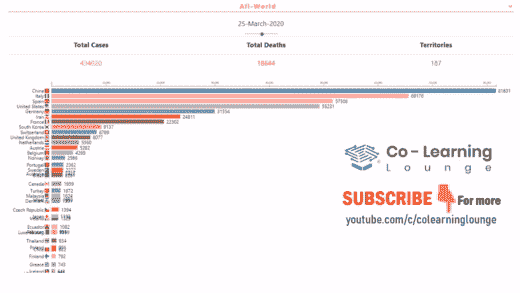
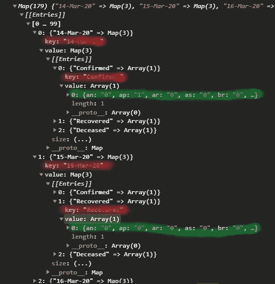
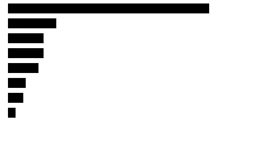
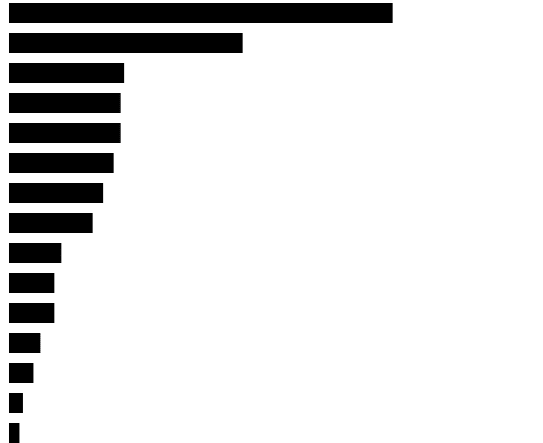
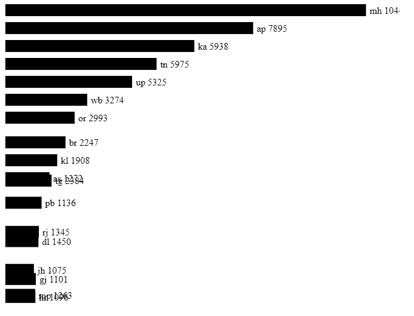
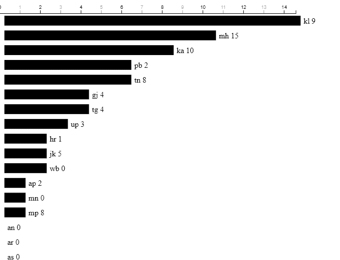

# D3js 中的赛车条形图

> 原文：<https://medium.com/analytics-vidhya/building-racing-bar-chart-in-d3js-d89b71cd3439?source=collection_archive---------1----------------------->



CLL SOAI 新冠肺炎赛车条形图

我们海德拉巴 AI 学校与 CLL 合作学习中心(Co-learning Lounge)合作制作了赛车条形图，这是一个发展最快的技术社区，旨在开源教育，从而使其变得负担得起。所有的社区成员将通过友好的链接免费获得这篇文章。在下面的视频中查看我们的工作。

**让我们开始构建赛车条形图**

首先，如果你不知道 D3js 的基础知识，我强烈推荐你阅读我的 [D3js 文章](/analytics-vidhya/d3js-basic-to-mastery-bf5459836970)，否则会非常困难，因为我不会在这里解释任何技术内容。

[](/analytics-vidhya/d3js-basic-to-mastery-bf5459836970) [## D3.js 基础到精通第 1 部分基础

### 如果你点击了这篇文章，我想你已经知道 d3js 是什么了，你可以在…

medium.com](/analytics-vidhya/d3js-basic-to-mastery-bf5459836970) [](/analytics-vidhya/d3js-basic-to-mastery-part-2-mastery-680db40f2ec5) [## D3js 基础到精通第 2 部分精通

### 在上一篇文章中，我们学习了 D3js 的基础知识，比如选择、DOM 操作、SVG、缩放和数据…

medium.com](/analytics-vidhya/d3js-basic-to-mastery-part-2-mastery-680db40f2ec5) 

# 数据源

我将使用的数据源来自[*https://api.covid19india.org*](https://api.covid19india.org/states_daily.json)，这是一个由志愿者驱动的众包数据库，用于新冠肺炎统计&印度患者追踪。”。我从
[https://api.covid19india.org/states_daily.json](https://api.covid19india.org/states_daily.json)那里拿到了《美国日报》的 json 数据。

让我们检查一下数据格式。

```
**{**"states_daily": **[
{**"an": "0"
"ap": "1",
"ar": "0",
"as": "0",
"date": "14-Mar-20",
"dd": "0",
"dl": "7",
...
"status": "Confirmed",
"tg": "1",
"tn": "1",
...**}]}**
```

您可以看到在`states_daily`对象下，有一个数组对象，其中包含所有状态代码以及日期和状态。我们可以用数据和状态对项目进行分组，然后用它来构建图表。

设置你的项目，添加 D3js，然后回来。

# 处理数据

使用`fetch`从 API 获取数据。

```
fetch('https://api.covid19india.org/states_daily.json')
     .then(res => res.json())
     .then((data: any) => {
       const processedData = processData(data);
       plotChart(processedData)
})
```

我们在`processData`函数中将数据处理成所需的格式，并将其传递给`plotChart`函数来绘制图表。

```
function processData(data) { 
   return d3.group(data.states_daily, d => d.date, e => e.status);
}
```

这是数据嵌套的两个阶段。我们将`date`作为第一阶段的嵌套，因为我们需要迭代日期。如你所知，我们需要通过动画显示每个日期，使它看起来像一个赛车图表。第二阶段嵌套我们采用`status`，因为我们只需要在任何给定日期比较一种状态。

输出是以`date`为关键字的映射关键字对值和以`status`为关键字的另一个映射。如果你不知道 Javascript 中的[地图，点击这里](https://developer.mozilla.org/en-US/docs/Web/JavaScript/Reference/Global_Objects/Map)了解一下。对于大型数据集，它还提高了对象的性能。



好了，现在我们已经处理了数据，为了绘制图表，首先我们需要制作比例尺。为了进行缩放，我们需要 SVG 的大小，以及现存的 *(min，max)* 数据。不制作动画时，我们一次只绘制一个日期的图表。因此，让我们为一个单一的日期。

# 构建图表

## **HTML**

```
<svg id="chart" style="width: 80vw;height: 80vh;"></svg>
```

我们将 SVG 高度设为视图高度(vh)的 80%,宽度设为视图宽度(vw)的 80%。如果我们想让图表反应灵敏，它就派上用场了。

## **JS**

在`fetch`中，我们将`processedData`传递给`plotChart`函数，让我们开始在其中构建图表。在`plotChart`功能中

1.  **设置 SVG 的高度和宽度。**

```
 const svg = d3.select("#chart");
    const width = svg.node().clientWidth;
    const height = svg.node().clientHeight;
```

**2。获取日期和第一次约会的列表。** `**data**` **中的所有键都是日期。**

```
 const dateList = Array.from(data.keys());
    const present-day = dateList[0];
```

**3。获取特定日期的数据，并根据我们的要求进行更改。**

```
const presentData = processEachDateData(
                               data.get(presentDate)
                                   .get("confirmed")[0])
```

`processEachDateData`功能。我们需要从数据中删除`data`和状态，因为我们只需要它们来识别数据而不是绘制。然后将所有数据转换成`{key, value}`对象。然后对它们进行分类。

```
function processEachDateData(data) { //remove status and date
    delete data.date
    delete data.status return Object.keys(data)
                 .map(key => ({key, value: data[key]}))
                 .sort((a,b) => b.value-a.value)}
```

**4。准备** `**Scale**` **。域的范围应该从 0 到最高的** `**value**` **。**

```
const xScale = d3.scaleLinear()
        .domain([0, d3.max(Object.values(presentData), d => parseInt(d.value))]
        ).range([0, width])
```

**5。添加** `**rect**` **并将数据和** `**enter**` **循环绑定到其中。** `x`是固定的，所以给了一些`10px`、`y`的填充，每个`rect`的位置应该在排名的基础上增加，所以`height * index`和`rect`之间要加一些空隙，我加了填充。`width`应该基于`value`动态。所以传递标尺的值。

```
const container = svg.append("g")
                          .classed("container", true)
const rectProperties = {height: 20, padding: 10}

container.selectAll("rect")
         .data(presentData)
         .enter()
         .append("rect")
         .attr("x", 10)
         .attr("y", (d,i) => {
           return i * (rectProperties.height + rectProperties.padding)
         })
         .attr("width", d => xScale(parseInt(d.value)))
         .attr("height", rectProperties.height)
```

整体代码将如下所示

**输出**



赛车条形图 d3js 教程

耶，我们得到了基本的图表，现在我们需要将图表的位置和宽度设置为下一个值。每当我们更新到新值时，我们也需要更新我们的标度。所以我们只需将所有需要更新的内容转移到一个函数中，并将`date`作为参数传递。对于动画，在将要更新的属性上添加带有`delay`的`transition`。

```
const update = (date) => { 
   // get the data  
   const presentData = processEachDateData(data.get(date).get("Confirmed")[0]) // make the scale 
   const widthScale = d3.scaleLinear()
                       .domain([0,d3.max(Object.values(presentData), d => parseInt(d.value))])
                       .range([0, width - fontSize - 50]) container
           .selectAll("rect")
           .data(presentData)
           .enter()
           .append("rect")

    container
          .selectAll("rect")
          .attr("x", 10)
          .transition()
          .delay(500)
          .attr("y", (d,i) => i * 30 )
          .attr("width", d => d.value <= 0? 0 : widthScale(d.value))
          .attr("height", 20)}
```

添加循环以每隔几毫秒更新一次。

```
for (const date of dateList) {
     update(date)
     await new Promise(done => setTimeout(() => done(), 500));
}
```

通常`setTimeout`是一个*异步*方法，但是我们通过添加`await new Promise`使其成为*同步*。

# **问题修正**

这段代码有问题。我们正在对数据进行排序，然后将其绑定到`rect`。当我们将新数据绑定到`rect`时，新数据与先前数据的顺序不同，即`[mh: 3, tt: 2, kr: 1]`绑定到第一个`rect`的数据，但新数据是`[kr: 5, mh: 3, tt: 2]`，如果我们绑定该数据，`mh` `rect`被替换为`kr` `rect`。这不是我们想要的，我们需要更新相同的各自`rect`的值。要做到这一点，我们不应该在追加`rect`并激活它们的`y`位置之前对数据进行排序。

移除 `processEachDateData`功能中的分类。顺便说一下，也让`parseInt`这个函数本身的值，这样我们就不需要在每次使用它的时候解析它。

```
function processEachDateData(data) {
    //remove status, date and tt(total)
    delete data.date
    delete data.status
    delete data.tt return Object.keys(data)
              .map(key => ({key, value: parseInt(data[key])})) 
}
```

在追加`rect`之前，在`update`函数中对数据进行排序

```
const sortedRange = [...presentData].sort((a,b) => b.value-a.value)
```

`*[…presentData].sort*` *此招是为了不影响原阵。*

现在对于`rect`的`y`位置，找到`sortedRange`上的索引并相乘。

```
.attr(“y”, (d,i) => sortedRange.findIndex(e => e.key === d.key) *(rectProperties.height + rectProperties.padding))
```

现在输出应该是这样的



赛车条形图 d3js 教程

现在工作正常。让我们添加一些文本。

```
container
    .selectAll("text")
    .data(presentData)
    .enter()
    .append("text")container
    .selectAll("text")
    .text(d => d.key + " "+ d.value)
    .transition()
    .delay(500)
    .attr("x", d => widthScale(d.value) + fontSize)
    .attr("y", (d,i) => {
      return sortedRange.findIndex(e => e.key === d.key) * (rectProperties.height + rectProperties.padding) + fontSize 
    })
```



赛车条形图 d3js 教程

到现在为止的代码

我们现在可以将轴添加到顶部。为了制作轴的动画，我们需要更新轴，但是现在我们每次更新都要创建新的比例，轴生成器依赖于这个比例。

所以现在需要将标尺移动到父函数中，并在更新函数中更新它们。让我们创建一个具有空域和范围的标度，然后在更新函数上方生成虚拟轴。

```
const widthScale = d3.scaleLinear()
const ticker = 500;
const axisTop = svg
                .append('g')
                .classed('axis', true)
                .style("transform", "translate(10px, 20px)")
                .call(d3.axisTop(widthScale))
```

在更新功能中，过渡到新的`axisTop`

```
const update = (date) =>  { 
   ....
   .... widthScale
     .domain([0, d3.max(Object.values(presentData), d => d.value)])
     .range([0, width - fontSize - 50]) axisTop                
        .transition()
        .duration(ticker / 1.2)
        .ease(d3.easeLinear)
        .call(d3.axisTop(widthScale)) ....
    ....
}
```

输出将会是



赛车条形图 d3js 教程

你可以去调整位置，动画速度和改变动画功能。添加更多细节，如标题和日期显示等。

## 最终代码

# 最后

当您拥有的数据在所有日期都一致时，这一切都很酷。不会一直这样的。对于我们在 CLL 的项目，在世界数据中，第一个月的数据只包括中国，以后的数据包括更多的国家。对于这类数据，我们要么填写该日期的所有国家。这意味着，你必须正确地映射所有的国家及其名称。另一种方法是按国家而不是日期对所有数据进行分组，并将所有日期数据绑定到各自的元素，但这将把大量数据绑定到每个元素。然后根据日期制作动画。如果你也想看这篇文章，请在回复中告诉我，我会写一篇新文章或者更新同一篇文章。

# 谢谢你

感谢所有阅读我的文章的人，也感谢[共同学习休息室](https://medium.com/u/1556949f4866?source=post_page-----d89b71cd3439--------------------------------)和 [Yogesh Kothiya](https://medium.com/u/d310856a9437?source=post_page-----d89b71cd3439--------------------------------) 、 [Dhruv Kumar Patwari](https://medium.com/u/613cc67b32af?source=post_page-----d89b71cd3439--------------------------------) 协调并帮助建立这个项目。