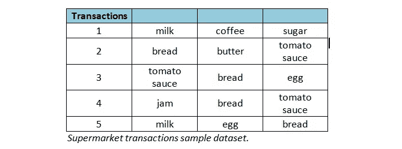
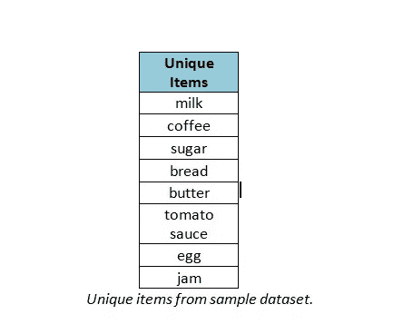
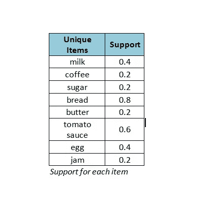
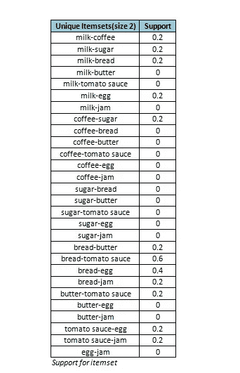
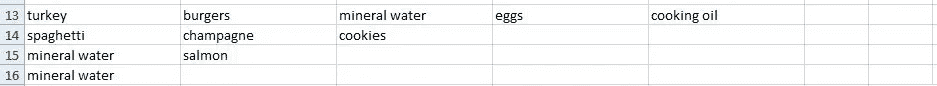

# 利用机器学习技术和 Python 构建推荐系统

> 原文：<https://medium.com/analytics-vidhya/building-recommender-system-using-machine-learning-techniques-and-python-45cfb8c88465?source=collection_archive---------10----------------------->


你要在亚马逊上买一部手机，亚马逊建议你买一个屏幕保护玻璃和一个保护套。如果你把这三样东西一起买，它还会给你打折。如果你去 Youtube 看你最喜欢的歌曲，Youtube 推荐你去看你可能喜欢的类似的其他歌曲。在谷歌搜索上，在搜索结果页面的底部，你会看到相关的搜索。你到处都能得到推荐；在网飞、脸书、推特上，所有的社交网站都建立了自己的推荐系统。不仅在网上网站上，而且在超市里你也能找到直接或间接的推荐。在超市里，一起买的东西放在一起，或者如果你一起买东西，他们会打折。他们怎么知道你的购买模式？他们怎么知道你的喜恶？我们将在这篇文章中了解这个秘密。


推荐系统是机器学习的一个重要而热门的领域。它帮助企业增加了销售额和利润。我们无法想象今天没有任何推荐系统的市场。这些公司分析我们的交易数据，试图推断我们的购买模式。他们从购买模式中创建关联规则。这些关联规则然后被用于形成推荐和交易。有各种各样的数据挖掘算法，如 k-means、Page Rank、EM 数据挖掘和 Apriori，用于构建推荐系统。在这篇文章中，我们将使用 Apriori 算法来构建我们的推荐系统。

Apriori 算法是数据挖掘中最流行、最经典的算法之一。它使用关联规则挖掘，这是一种识别数据集中不同项目之间潜在关系的技术。我们先用一个超市的例子来理解关联规则挖掘。在超市里，顾客可以买到各种各样的商品。通常，顾客买的东西都有一个模式。例如，如果有人想准备一个面包三明治，那么她很可能会买面包、黄油、果酱和番茄酱。番茄酱很有可能和面包、黄油一起被购买。从超市交易数据中我们可以发现，有很多交易中，以上四样东西都是一起买的。所以，现在我们可以说番茄酱与面包、黄油和果酱有着密切的联系。而且，超市可以在他们的系统中创建一个新的规则来将这四样东西放在一起，因为它们经常被一起购买。关联规则挖掘就是发现这种规则的技术。

Apriori 算法是由 Agrawal 和 Srikant 在 1994 年提出的。Apriori 被设计为对包含交易的数据库进行操作(例如，客户购买的商品集合，或者网站访问或 IP 地址的详细信息)。Apriori 使用“自下而上”的方法，其中频繁子集一次扩展一个项目(这一步称为候选生成)，并根据数据测试候选组。当没有找到进一步的成功扩展时，算法终止。

# Apriori 是如何工作的？

借助下面的简单例子，我们将探讨 Apriori 算法的内部步骤。下面是一个超级市场数据集样本。我们将对该数据集运行 Apriori，从中挖掘关联规则。



Apriori 使用三个重要的计算因素从输入数据集中挖掘关联规则。这三个计算因素是**支持度**、**信心度**和**升力**。下面让我们看看如何计算它们。

# 支持:先验的第一步

这是先验计算的第一步。在这一步中，首先，算法从输入数据集中识别所有唯一的项目。以下是我们的样本数据集中存在的唯一项目列表。除了唯一项目列表，它还找出输入数据集中的记录总数。在我们的例子中，记录总数= 5。



下一步是计算上面列表中每个项目的支持度。支持指的是项目的默认流行度，并且可以通过找到包含特定项目的交易数除以交易总数来计算。

假设我们想为项目“番茄酱”寻找支持。这可以计算为:

***支持("番茄酱")=包含("番茄酱")的交易/总交易；***

在我们的例子中，总共五个交易中有三个交易包含“番茄酱”项。因此，

Support("番茄酱")= 3/5 = 0.6；

同样，Apriori 计算所有项目的支持度。请查看下表中所有项目的计算支持。



下一步是计算对一组中有两个项目的项目组的支持。当一个组中有一个以上的项目时，它被称为一个项目集。例如 itemset(“面包，番茄酱”)。创建项目集时，项目的顺序无关紧要。Itemset(“面包，番茄酱”)与 itemset(“番茄酱，面包”)相同。

计算项目集支持度的公式与计算项目支持度的公式相同。例如，对项目集“面包，番茄酱”的支持计算如下:

***支持("面包，番茄酱")=包含("面包，番茄酱")的交易/总交易；***

在我们的例子中，总共五个交易中有三个既有面包又有番茄酱。因此，

Support("面包，番茄酱")= 3/5 = 0.6；

同样，Apriori 计算大小为 2 的所有项目集的支持度。请查看下表中所有项目集的计算支持。



类似地，Apriori 计算所有可能项目集的支持度。它继续生成大小为 1 到 N-1 的项目集，其中 N 是最大事务中的项目总数。在我们的示例中，所有事务都有相同数量的条目，该值为 3。因此，在我们的例子中，N 的值是 3，因此，该算法将只生成大小为 1 和 2 的项集。它会停在 2，就像我们的例子 N-1 =2。

# 自信:先验的第二步

一个规则的置信度(面包= >番茄酱)是指如果买了面包也买了番茄酱的可能性。置信度是规则被发现为正确的频率的指示。置信度的计算方法是，找出一起购买面包和番茄酱的交易次数，除以购买面包的总交易次数。数学上，它表示为

***置信度(A= > B) =(同时包含(A 和 B)的事务)/(包含 A 的事务)；***

上述等式也可以表示为:

***信心(A= > B) =支持(A 和 B))/支持(A)；***

因此，在前面的步骤中计算的支持值可以在这里用于计算置信度。

回到我们的例子；面包和番茄酱一起购买有三个交易，面包被带来有四个交易。因此，

***信心(面包= >番茄酱)= 3/4 = 0.75***

自信可以提供一些重要的见解，但它也有一个主要的缺点。它只考虑了项目集 A 的流行度(在我们的例子中，A 是“面包”)，而没有考虑 B 的流行度(在我们的例子中，B 是“番茄酱”)。如果 B(番茄酱)和 A(面包)一样受欢迎，那么包含 A(面包)的交易也包含 B(番茄酱)的概率更高，从而增加了可信度。在计算升力时克服了这个缺点。

# 提升:先验的第三步

升力或升力比是置信度与预期置信度的比值。预期置信度是置信度除以 b 的频率。提升告诉我们一个规则在预测结果方面比一开始就假设结果要好得多。提升值越大，关联越强。

在计算 lift(A=>B)时，我们考虑了物品 A 和 B 的受欢迎程度。这个 lift 比率显示了在购买 A 时购买 B 的可能性。数学上，升力表示为

***提(A= > B) =信心(A= > B) /支持(B)；***

或者，

**Lift(A =>B)= Support(A =>B)/(Support(A)* Support(B))；**

现在，让我们回到我们的例子，计算(面包= >番茄酱)的升力。

***举起(面包= >番茄酱)=信心(面包= >番茄酱)/支撑(番茄酱)；***

***掀(面包= >番茄酱)= 0.75 / 0.6 = 1.25***

lift 值大于 1 表示如果 A 被购买，B 很可能被购买，而小于 1 的值表示如果 A 被购买，B 不太可能被购买。

# Python 实现:

现在，让我们构建一个可以执行上述所有计算的 python 程序。它应该列出所有唯一的项目，创建唯一的项目集，计算项目和项目集的支持度，计算所有可能的项目-项目集组合的置信度和提升度。该程序应该返回给定项目/项目集用户建议。

任何机器学习/数据挖掘系统首先需要的是数据。我们正在使用一个超市数据来为超市建立一个推荐系统。我们的数据是 csv 格式的。csv 中的每一行都代表客户购买的商品列表。



输入 csv 文件没有标题。每行的项目总数可能不相等。在上图中，您可以看到第十三位顾客购买了五件商品，而第十六位顾客只购买了一件商品。你可以在这里找到样本数据文件和整个程序[https://github.com/srkhedkar/Recommender](https://github.com/srkhedkar/Recommender)

我们利用 apyori 软件包计算关联规则。如果您的系统上没有安装，那么使用命令*“pip install apy ori”*安装它

现在，让我们来编写 python 代码。这里，我们已经导入了所需的包，定义了类*推荐者*并定义了它的构造函数。在实例化一个*推荐者*对象时，我们需要向它提供数据文件。

```
from apyori import apriori
from apyori import load_transactions

class Recommender():

    def __init__(self, inputFile):
        self.AssociationRulesDictionary = {} # holds final output
        self.dataFile = inputFile # input datafile in csv form        
        self.association_rules = [] # holds output from Apriori algo
```

下一步是计算关联规则。为此，我们需要计算支持、信心和提升上面解释的所有这些东西。下面的函数被定义来计算所有这些东西。

```
def computeRules(self):
        """
        Copmputes all association rules.
        :return:
        """
        with open(self.dataFile ) as fileObj:
            transactions = list(load_transactions(fileObj, delimiter=","))
            # remove empty strings if any
            transactions_filtered = []
            for li in transactions:
                li = list(filter(None, li))
                transactions_filtered.append(li) # Following line does all computations
            # lift > 1 shows that there is a positive correlation within the itemset, i.e., items in the
            # itemset, are more likely to be bought together.
            # lift < 1 shows that there is a negative correlation within the itemset, i.e., items in the
            # itemset, are unlikely to be bought together.
            # hence we have set min_lift=1.0 to ignore all rules with lift < 1.0
            self.association_rules = apriori(transactions_filtered,       min_support=0.01, min_confidence=0.01, min_lift=1.0,max_length=None)
```

在上面的代码中，你可以看到所有重要的计算都是在函数调用 *apriori()* 中完成的，这个函数调用来自导入的包*apriori*。我们什么都不用做！！所有的事情都由 *apriori()* 负责！！这就是我爱上这门语言的原因。就是这么简单；它是如此强大！！这个生态系统是如此的丰富，以至于我们可以发现大部分的东西都已经实现了。这让我想起了一个著名的 python 笑话。一天，小琼尼飞上了天空！！小杰克在地上问他:“嘿，乔尼，你怎么会飞得这么高呢？”你做了什么？”。小 Jony 回答“没什么…我只是导入了一个 python 的反重力模块！!"。:D·:D

*apriori()* 以如下所示的形式向我们返回输出。我们的下一个任务是从这个输出中提取信息，并将其存储在一个字典中以便于访问。

**先验输出:**

ordered _ statistics =[ordered statistic(items _ base = frozenset()，items_add=frozenset({ '巧克力'，'牛奶'，'鸡蛋' })，confidence = 0.1666666666666666666，lift=1.0)，ordered statistic(items _ base = frozenset({ '巧克力' })，items_add=frozenset({ '牛奶'，'鸡蛋' })，confidence=0.5，lift=1.5)，ordered statistic(items _ base = frozenset({ '巧克力')

为了从 *apriori()* 的输出中提取规则，我们定义了 *extractRules()* 。该函数提取规则，并按照提升值的降序将它们存储在*AssociationRulesDictionary*中。

```
def extractRules(self): for item in self.association_rules:
            # first index of the inner list
            # Contains base item and add item
            if len(item[0]) < 2:
                continue for k in item[2]:
                baseItemList = list(k[0])
                # if base item set is empty then go to the next record.
                if not baseItemList:
                    continue
                # sort the baseItemList before adding it as a key to the AssociationRules dictionary
                baseItemList.sort()
                baseItemList_key = tuple(baseItemList)
                if baseItemList_key not in self.AssociationRulesDictionary.keys():                    self.AssociationRulesDictionary[baseItemList_key] = []                self.AssociationRulesDictionary[baseItemList_key].append((list(k[1]), k[3]))
                # if something goes wrong, then use the following print block to print values
                #print("Base item: ", baseItemList_key)
                #print("Target item: ", list(k[1]))
                #print("Confidence: " + str(k[2]))
                #print("Lift: " + str(k[3]))
        # sort the rules in descending order of lift values.
        for ruleList in self.AssociationRulesDictionary:            self.AssociationRulesDictionary[ruleList].sort(key=lambda x: x[1], reverse=True)
```

上面定义的两个方法不应该在类定义之外调用。作为一个老式的 C++开发人员，我必须遵守这个限制。我把它留给你们；如果你想在类外调用这两个函数，你可以。

我们定义了一个方法 *studyRules()* ，该方法调用上面两个函数*computer rules()*和 *extractRules()* 。这个函数 *studyRules()* 在这里起到了一个模板方法的作用。如果您想扩展*推荐器*类，并使用另一种算法而不是 Apriori 来计算关联规则，那么 *studyRules()* 将帮助您获得多态行为。推荐器类的一个对象应该调用 *studyRules()* 来计算并从输入数据文件中提取关联规则。

```
def studyRules(self):
    """
    This is a template method for computation and rule extraction.
    :return:
    """
    self.computeRules()
    self.extractRules()
```

现在，我们已经完成了所有的计算，并将所有的关联规则提取到一个字典中。让我们定义一些 API 来使用计算出的关联规则返回推荐和交易。

```
def recommend(self, itemList, Num=1):
    """
    itemList is a list of items selected by user
    Num is total recommendations required.
    :param item:
    :return:
    """
    # convert itemList to itemTuple as our dictionary key is a sorted tuple
    itemList.sort()
    itemTuple = tuple(itemList)
    if itemTuple not in self.AssociationRulesDictionary.keys():
        return []
    return self.AssociationRulesDictionary[itemTuple][:Num]
```

*recommend()* 返回所选项目/项目集的建议。例如，如果您想找出“红酒”和哪个是最受欢迎的商品，那么您可以通过调用 *recommend()* 来获得这个值，如下所示。

*objectName.recommend(['红酒']，1)*

在我们的例子中，对于我们正在使用的数据文件，它返回我们

[(['意大利面条']，2.09638976)]

这告诉我们“意大利面条”和“红酒”是最受欢迎的食物。

现在，让我们根据这些建议制定交易。API *showDeals()* 被定义为使用 *recommend()* 返回的推荐创建交易。在 *showDeals()* 中，我们使用推荐项目集的提升值来计算折扣百分比。API *recommend()* 返回有点抽象的输出；在 *showDeals()* 中，我们试图赋予它一些意义。

```
def showDeals(self, itemList, Num=1): """
    we are converting the recommendations into deals. The lift value    is used to calculate discount percentage
    discount percentage = 10 * lift
    itemList is a list of items selected by user
    Num is total deals required.
    :return:
    """
    recommendations = self.recommend(itemList, Num)
    for item in recommendations:
        print( "If you buy ", item[0], " along with ", itemList, " then you will get ", round((item[1] * 10), 2), \
               "% discount on total cost!!" )
```

现在，我们的整个推荐系统已经准备好了！！让我们玩玩它，看看它的表现如何。

```
# Create a recommender Alexa, give her the datafile containing transactions.
Alexa = Recommender("store_data.csv")# Request Alexa to study rules from the provided datafile
Alexa.studyRules()

# Ask Alexa for the deals
Alexa.showDeals(['red wine'], 2)
```

嘿！艾丽莎。给我看看‘红酒’最上面的两笔交易。Alexa 向您展示了以下交易。

1.如果您购买['意大利面']和['红酒']，那么您将获得 20.96 %的总费用折扣！！

2.如果您同时购买['矿泉水']和['红酒']，您将享受总费用 16.3 %的折扣！！

是不是很神奇。你可以使用相同的推荐系统来建立一个视频或歌曲推荐系统。您只需要提供相应的数据文件。例如，它可能是这样的。

```
Michael = Recommender("songs_data.csv)
Michael.studyRules()
Michael.recommend(['summer of 69', 'Billie Jean'], 5)
```

在这里，迈克尔将推荐五首最常与《69 年的夏天》和《比利·简》一起听的歌曲！！

整个程序和样本数据文件都上传到 GitHub 这里[https://github.com/srkhedkar/Recommender](https://github.com/srkhedkar/Recommender)

你也可以在下面找到完整的程序。如果您对实施有任何意见/担忧，请随时联系我，我在 srkhedkar@gmail.com

## 完整的 Python 推荐系统脚本:

```
from apyori import apriori
from apyori import load_transactions class Recommender():
    def __init__(self, inputFile):
        self.AssociationRulesDictionary = {} # holds final output
        self.dataFile = inputFile # input datafile in csv form
        self.association_rules = [] # holds output from Apriori algo def computeRules(self):
        """
        Computes all association rules.
        :return:
        """
        with open(self.dataFile ) as fileObj: transactions = list(load_transactions(fileObj, delimiter=",")) # remove empty strings if any
            transactions_filtered = []
            for li in transactions:
                li = list(filter(None, li))
                transactions_filtered.append(li) # Following line does all computations
            # lift > 1 shows that there is a positive correlation within the itemset, i.e., items in the
            # itemset, are more likely to be bought together.
            # lift < 1 shows that there is a negative correlation within the itemset, i.e., items in the
            # itemset, are unlikely to be bought together.
            # hence we have set min_lift=1.0 to ignore all rules with lift < 1.0
            self.association_rules = apriori(transactions_filtered, min_support=0.01, min_confidence=0.01, min_lift=1.0,
                                        max_length=None) def extractRules(self): for item in self.association_rules:
            # first index of the inner list
            # Contains base item and add item if len(item[0]) < 2:
                continue for k in item[2]: baseItemList = list(k[0])
                # if base item set is empty then go to the next record.
                if not baseItemList:
                    continue # sort the baseItemList before adding it as a key to the AssociationRules dictionary
                baseItemList.sort()
                baseItemList_key = tuple(baseItemList) if baseItemList_key not in self.AssociationRulesDictionary.keys():
                    self.AssociationRulesDictionary[baseItemList_key] = [] self.AssociationRulesDictionary[baseItemList_key].append((list(k[1]), k[3])) # if something goes wrong, then use the following print block to print values
                #print("Base item: ", baseItemList_key)
                #print("Target item: ", list(k[1]))
                #print("Confidence: " + str(k[2]))
                #print("Lift: " + str(k[3])) # sort the rules in descending order of lift values.
        for ruleList in self.AssociationRulesDictionary:
            self.AssociationRulesDictionary[ruleList].sort(key=lambda x: x[1], reverse=True) def recommend(self, itemList, Num=1):
        """
        itemList is a list of items selected by user
        Num is total recommendations required.
        :param item:
        :return:
        """ # convert itemList to itemTuple as our dictionary key is a sorted tuple
        itemList.sort()
        itemTuple = tuple(itemList) if itemTuple not in self.AssociationRulesDictionary.keys():
            return [] return self.AssociationRulesDictionary[itemTuple][:Num] def studyRules(self):
        """
        This is a template method for computation and rule extraction.
        :return:
        """
        self.computeRules()
        self.extractRules() def showDeals(self, itemList, Num=1):
        """
        we are converting the recommendations into deals. The lift value is used to calculate discount percentage
        discount percentage = 10 * lift
        itemList is a list of items selected by user
        Num is total deals required.
        :return:
        """
        recommendations = self.recommend(itemList, Num) for item in recommendations:
            print( "If you buy ", item[0], " along with ", itemList, " then you will get ", round((item[1] * 10), 2), \
                   "% discount on total cost!!" ) Alexa = Recommender("store_data.csv")Alexa.studyRules()print (Alexa.recommend(['red wine'], 1))Alexa.showDeals(['red wine'], 2)
```