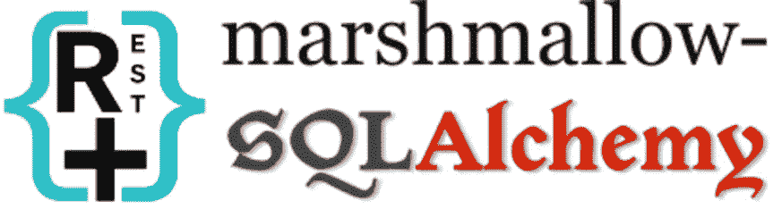
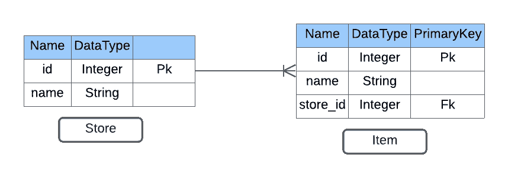
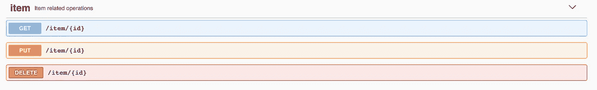
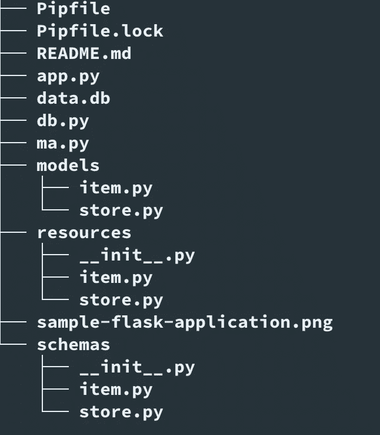
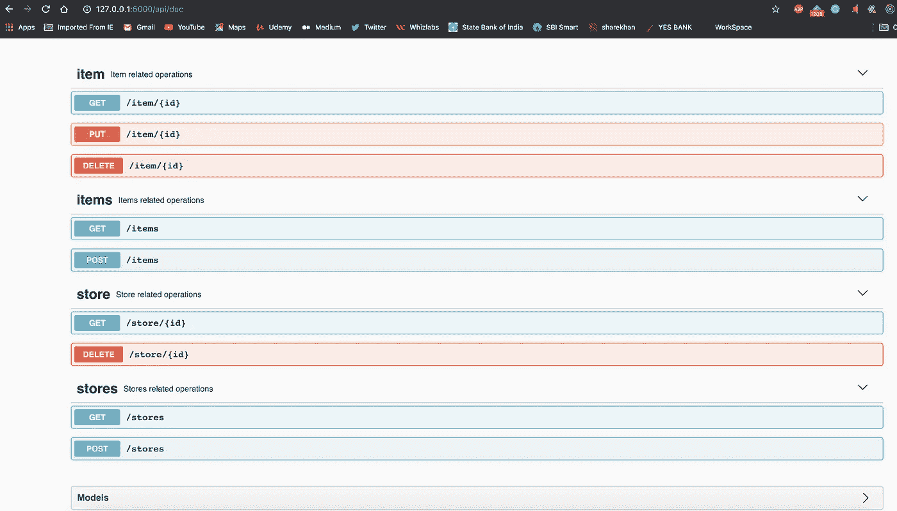
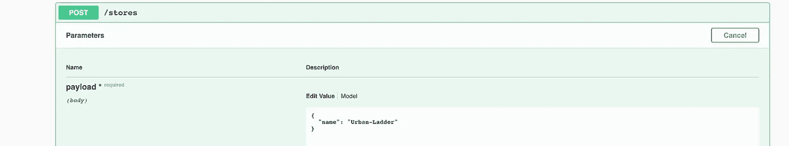
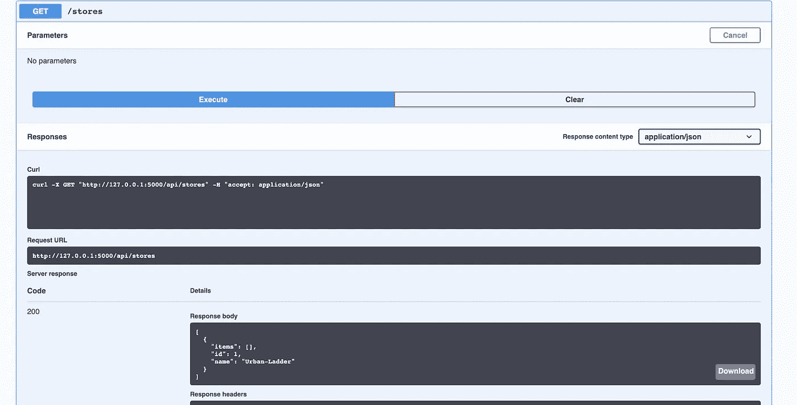
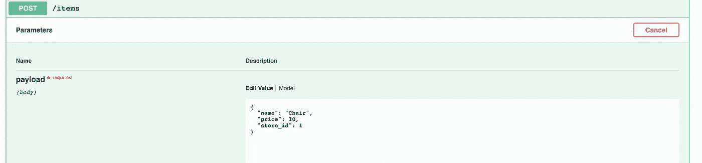
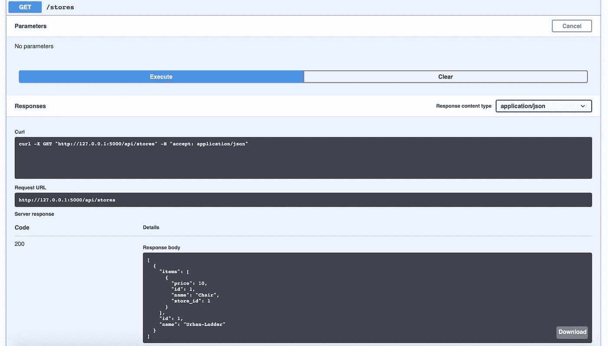

# 使用 Flask-RESTPlus、SQLAlchemy & Marshmallow 构建 REST APIs

> 原文：<https://medium.com/analytics-vidhya/building-rest-apis-using-flask-restplus-sqlalchemy-marshmallow-cff76b202bfb?source=collection_archive---------0----------------------->



带 SqlAlchemy 的 flask-Restplus

**Python** 是一种解释型的高级通用编程语言。它可以用来开发业务应用程序以及系统脚本，具有数据科学相关的功能，桌面图形用户界面，还为 web 和 internet 开发提供了许多选择。

**Flask** 是一个用 Python 编写的微型 web 框架，帮助你轻松构建 web 应用。它不需要工具或库，也没有数据库抽象层、表单验证、序列化程序、用户管理或内置国际化。但是，它支持可以添加应用程序特性的扩展，就好像它们是在 Flask 中实现的一样。一个有抱负的 Flask 开发者必须选择正确的扩展，并将它们组合在一起，以获得合适的功能集。

本教程的目的是使用 Flask 扩展，帮助我们创建一个生产环境就绪的 Python 应用程序，并顺利地与 Swagger UI 集成。我们将学习使用 Flask 扩展来构建 Rest API，例如[***Flask-RestPlus***](https://flask-restplus.readthedocs.io/en/stable/index.html)，[***Flask-Marshmallow***](https://flask-marshmallow.readthedocs.io/en/latest/)和[***Flask-SQLAlchemy***](https://flask-sqlalchemy.palletsprojects.com/en/2.x/)*并使用 [**Swagger 共享 ***API*****](https://swagger.io/tools/swagger-ui/)*

## ***烧瓶和烧瓶支架***

*Flask 是一个轻量级的 web 服务器和框架。尽管我们可以直接用`flask`创建 Web API，但是 [Flask-RESTPlus](https://flask-restplus.readthedocs.io/en/stable/index.html) 扩展使得构建 Rest APIs 更加简单。*

*   *它支持名称空间，名称空间是创建前缀和构建代码的方式。*
*   *它拥有解析和验证输入参数的完整解决方案。这意味着我们有一种简单的方法来处理需要几个参数的端点并验证它们。*
*   *它最好的特性是能够使用 [**Swagger UI**](https://swagger.io/tools/swagger-ui/) 为我们的 API 自动生成交互式文档。*

## *烧瓶棉花糖*

*Marshmallow 是一个 ORM/ODM/框架无关的库，旨在简化序列化和反序列化的过程。Flask-Marshmallow 扩展充当 Flask 和 Marshmallow 的一个薄集成层，为 Marshmallow 增加了额外的功能，包括 HATEOAS 就绪 API 的 URL 和超链接字段。它还集成了 **Flask-SQLAlchemy** 并减少了一些样板代码。*

## *烧瓶化学*

*[SQLAlchemy](https://www.sqlalchemy.org/) 是一个方便 Python 程序和数据库之间通信的库，它为应用程序开发人员提供了 SQL 的全部功能和灵活性。Flask-SQLAlchemy 扩展通过提供有用的缺省值和额外的帮助器简化了 Flask 应用程序中 [SQLAlchemy](https://www.sqlalchemy.org/) 的使用，使其更容易完成常见任务。它为我们提供了一个 ORM，通过简单地创建已定义的模型来修改应用程序数据。*

## ***Swagger UI***

*Swagger UI 有助于生成交互式文档，这使得测试 Rest API 以及与其他用户共享 API 文档变得更加容易。因此，没有 Swagger UI，Flask API 是不完整的。*

*以下是为商品和商店管理应用程序创建基于 Flask 的 API 示例所需的步骤:*

1.  *设置和安装*
2.  *一体式烧瓶-棉花糖*
3.  *一体化烧瓶-SQLAlchemy*
4.  *创建模型*
5.  *创建模式*
6.  *创建资源*
7.  *应用程序入口点*
8.  *测试 API*

## *先决条件*

*我们需要安装了 **Pipenv** 和 [Git](https://git-scm.com/) 的 Python 3。Pipenv 是一个包和一个虚拟环境管理器，它在幕后使用`PIP`。它提供了更高级的特性，比如版本锁定和项目间的依赖隔离。*

## *1.设置和安装*

*一旦先决条件就绪，我们就可以开始创建应用程序了。*

***a)创建一个示例项目& Store Management Flask 应用程序** 首先，我们的应用程序在磁盘上的任意目录下为我们的项目创建一个名为`python-sample-flask-application`的文件夹。*

```
*$ cd /path/to/my/workspace/
$ mkdir python-sample-flask-application
$ cd python-sample-flask-application*
```

*导航到项目文件夹。*

*b)激活虚拟环境*

*进入项目文件夹后，执行以下命令来激活 VirtualEnv。*

```
*pipenv shell*
```

*虚拟环境现在将被激活，这将提供所需的项目隔离和版本锁定。*

***c)安装依赖关系***

*接下来，使用 Pipenv 安装所有必需的依赖项，如图所示。*

```
*pipenv install flask-restplus
pipenv install flask-marshmallow
pipenv install flask-sqlalchemy
pipenv install marshmallow-sqlalchemy*
```

*在我们执行上述命令之后，将会安装所需的依赖项。*

*我们现在可以看到在我们的项目文件夹中创建的两个文件，即`Pipfile`和`Pipfile.lock`。*

*   *`Pipfile`包含了我们刚刚安装的所有依赖项的名称。*
*   *`Pipfile.lock`旨在根据`Pipfile`中出现的依赖关系，指定应该使用哪个特定版本的依赖关系，避免自动升级相互依赖的依赖关系和破坏项目依赖树的风险。*

*执行上述命令时安装的所有依赖版本如下所示。*

```
*flask-restplus = "==0.13.0"
flask-marshmallow = "==0.14.0"
flask-sqlalchemy = "==2.4.4"
marshmallow-sqlalchemy = "==0.24.1"*
```

*依赖版本将取决于当时可用的最新版本。如果需要，我们还可以使用语法`flask-restplus = "==0.13.0"`在`Pipfile`中更新或指定任何依赖项的版本号*

***d)更新‘Werkzeug’依赖版本***

*当我们安装`flask-restplus`时， **werkzeug** 是一个全面的 WSGI web 应用程序库，随版本`1.0.1`自动安装。我们可以在`Pipfile.lock`文件中找到该条目，如下所示:*

```
*"werkzeug": {
    "hashes": [
        "sha256:2de2a5db0baeae7b2d2664949077c2ac63fbd16d98da0ff71837f7d1dea3fd43",
        "sha256:6c80b1e5ad3665290ea39320b91e1be1e0d5f60652b964a3070216de83d2e47c"
    ],
    "version": "==1.0.1"
}*
```

*然而， **flask-restplus** 目前与扩展" **werkzeug=1.0.1** "不兼容。因此，我们需要按照 Github 中的建议将版本降级为`werkzeug==0.16.1`:[https://Github . com/noirbizarre/flask-restplus/issues/777 # issue comment-583235327](https://github.com/noirbizarre/flask-restplus/issues/777#issuecomment-583235327)。*

*因此，让我们将`Pipfile`中的`werkzeug`版本降级，并更新已安装的依赖项。*

```
*[[source]]
name = "pypi"
url = "https://pypi.org/simple"
verify_ssl = true

[dev-packages]

[packages]
flask-restplus = "==0.13.0"
flask-marshmallow = "==0.14.0"
werkzeug = "==0.16.1"
flask-sqlalchemy = "==2.4.4"
marshmallow-sqlalchemy = "==0.24.1"

[requires]
python_version = "3.7"*
```

*要更新已安装的依赖项，请执行以下命令。*

```
*pipenv update*
```

*现在，我们已经准备好为我们的应用程序编写一些代码了。*

## *2.一体式烧瓶-棉花糖*

*为了将 Flask-Marshmallow 与我们的应用程序集成，创建一个包含以下内容的文件`ma.py`。*

```
*from flask_marshmallow import Marshmallow
ma = Marshmallow()*
```

*在这里，我们从`flask_marshmallow`进口了棉花糖。稍后，我们将使用这个棉花糖实例`ma`通过命令`ma.init_app(app)`与 flask 应用程序集成。*

## *3.一体化烧瓶-SQLAlchemy*

*对于 Flask-SqlAlchemy 集成，创建一个名为`db.py`的文件，其内容如下。*

```
*from flask_sqlalchemy import SQLAlchemy
db = SQLAlchemy()*
```

*这里，我们从`flask_sqlalchemy`引入了 SQLAlchemy。我们还将使用这个 SQLAlchemy 实例`db`通过命令`db.init_app(app)`与 flask 应用程序集成。*

## *4.创建数据库模型*

*接下来，我们将为我们的数据存储和组织创建数据库模型。对于我们的应用程序，我们需要创建两个数据库模型 Item 和 Store。我们将使用`db`，来自 Flask-SQLAlchemy 的 SQLAlchemy 的实例，它是我们在前面(步骤 3)创建模型时创建的。*

*`db`实例包含来自`**sqlalchemy**`和`[**sqlalchemy.orm**](http://docs.sqlalchemy.org/en/latest/orm/scalar_mapping.html#module-sqlalchemy.orm)`的所有函数和助手。它提供了一个名为`Model`的类，这是一个声明性的基础，可以用来声明我们的模型。*

*创建`models`包并添加两个名为`Item.py`和`Store.py`的文件。*

***4.1 item . py
item . py 文件应该包含以下内容。***

*`item.py`中的上述代码执行以下操作:*

*   *我们从在`line 5`中创建 ItemModel 类开始。*
*   *在`line 6`中，我们声明了这个模型将被映射到的表名`items`。*
*   *从`line 8 to 10`开始，我们定义了表格列及其数据类型。*
*   *我们在`line 12 and 13.`中定义了与 StoreModel 的关系*
*   *从`line 26`到`36`，我们增加了一些帮助器方法来执行`items`表上的搜索操作。*
*   *从`line 38`到`40`，我们定义了`save_to_db`方法来保存数据库中的条目。*
*   *从`line 42`到`44`，我们定义了`delete_from_db`方法来从数据库中删除条目。*

***4.2 store . py
store . py 文件应该包含以下内容。***

*商店. py*

*`store.py`中的上述代码执行以下操作:*

*   *我们从在`line 5`创建 StoreModel 类开始。*
*   *在`line 6`中，我们声明了这个模型将被映射到的表名`stores`。*
*   *从`line 7 to 8`开始，我们定义了表格列及其数据类型。*
*   *我们在`line 10.`中定义了与 ItemModel 的关系*
*   *从`line 17`到`27`，我们添加了一些帮助器方法来对`stores`表执行搜索操作。*
*   *从`line 29`到`31`，我们定义了`save_to_db`方法来保存数据库中的商店。*
*   *从`line 33`到`35`，我们定义了从数据库中删除商店的`delete_from_db`方法。*

*`Item`和`Store`类继承自`db.Model`类，后者将该类声明为 SQLAlchemy 的模型。必需的列在模型类中定义。此外，我们定义了商品和商店之间的关系。商店与商品有一对多关系。*

**

*实体图*

## *5.创建模式*

*使用`[**SQLAlchemyAutoSchema**](https://flask-marshmallow.readthedocs.io/en/latest/#flask_marshmallow.sqla.SQLAlchemyAutoSchema)`从我们之前定义的模型中创建棉花糖`[**Schemas**](https://marshmallow.readthedocs.io/en/latest/api_reference.html#marshmallow.Schema)`。我们将使用`ma`，来自 Flask-Marshmallow 的 Marshmallow 的实例，它是我们在前面(步骤 2)创建的，用于创建我们的模式。*

*创建`schemas`包并添加两个名为`Item.py`和`Store.py`的文件。*

***5.1 item . py
item . py 文件应该包含以下内容。***

*ItemSchema.py*

***5.2 store . py
store . py 文件应该包含以下内容。***

*StoreSchema.py*

*我们需要为每个模型类创建一个模式，这是我们之前定义的(步骤 4)。一旦我们定义了模式，我们现在就可以使用这些模式来转储和加载 ORM 对象。*

## *6.创建资源*

*Flask-RESTPlus 提供了许多方法来组织我们的应用程序，并在粒度级别上维护它们，例如资源、名称空间和蓝图。我们会继续讨论这个问题。*

***资源**
Flask-RESTPlus 提供的主要构件是资源。资源构建在 [Flask pluggable views](https://flask.palletsprojects.com/en/1.1.x/views/#views) 之上，让我们只需在资源上定义方法就可以轻松访问多个 HTTP 方法。*

*`resource`是一个类，它的方法被映射到一个 API/URL 端点。它可以有多个方法，但是每个方法都必须以一个可接受的 HTTP 动词命名。如果我们的 API 需要不止一个`GET`或`POST`方法，那么我们需要创建多个资源类并将每个方法放入相应的资源类中。*

*现在，让我们开始为我们的应用程序创建资源。创建`resources`包，并添加两个名为`Item.py`和`Store.py`的文件。*

## *6.1 项目. py*

*Item.py 文件应包含以下内容。*

*项目资源. py*

*在`item.py`文件中，我们定义了两个资源，分别是`Item`和`ItemList`。*

*   *`Item`用于使用 id 字段在`Item`表上执行操作。*
*   *`ItemList`用于创建一个`Item`或返回`Item`表中的所有项目。*

***支持 Swagger-UI 的 API 模型***

*目前，Flask-RestPlus 不直接支持 ModelSchema 或 Model 作为要在 Swagger-UI 中显示的请求体，这有点开销。因此，作为一种变通方法，我们可以创建 API 模型与`expect`注释一起使用来实现我们的目标。Flask-RESTPlus 能够通过使用 API 模型自动记录和验证输入 JSON 对象的格式。只有在 Swagger-UI 中显示时才需要该模型。*

**

*请求体*

*为了发送或接收信息(JSON 对象)，我们可以创建 API 模型。RESTPlus API 模型通过列出所有预期字段来定义对象的格式。每个字段都有一个关联的类型，例如，`String`、`Integer`、`DateTime`，它确定哪些字段值将被视为有效。*

*在这种情况下，我们通过指定它预期的信息和每个预期值的属性来定义项目模型，如下所示:*

```
*item = items_ns.model('Item', {
    'name': fields.String('Name of the Item'),
    'price': fields.Float(0.00),
    'store_id': fields.Integer
})*
```

*该项目模型将作为`Item`资源的`Put`方法和`ItemList`资源的`Post`方法的一个整体使用。*

*通过使用`expect`注释，对于每个 HTTP 方法，我们可以指定要在 Swagger 中显示的有效负载主体的预期*模型*。*

```
*@item_ns.expect(item)*
```

***命名空间***

*名称空间是可选的，并且主要从文档的角度为 API 添加了一些额外的组织性。命名空间允许您将相关资源分组到一个公共根下。按照以下步骤创建命名空间:*

```
*item_ns = Namespace('item', description='Item related operations')
items_ns = Namespace('items', description='Items related operations')*
```

*在这里，我们为各个资源创建了一个单独的名称空间。函数的作用是:用一个 URL 前缀创建一个新的命名空间。在斯瓦格 UI 中将使用`description`字段来描述这套方法。*

## *6.2 Store.py*

*Store.py 文件应包含以下内容。*

*Store-Resource.py*

*在`store.py`文件中，我们定义了两个资源，即`Store`和`StoreList`。*

*   *`Store`使用 id 字段对`Store`表进行操作。*
*   *`StoreList`用于创建`Store`或返回`Store`表中的所有店铺。*

***大摇大摆 UI 支持的 API 模型***

*在这里，我们也通过指定它预期的信息和每个预期值的属性创建了一个存储模型，如下所示:*

```
*store = stores_ns.model('Store', {
    'name': fields.String('Name of the Store')
})*
```

*该门店模型将作为`StoreList`Resource`Post`方法中的一个体使用。*

*我们将使用`expect`注释如下:*

```
*@stores_ns.expect(store)*
```

***命名空间***

*与 Item Resources 类似，这里我们还创建了单独的名称空间。*

```
*store_ns = Namespace('store', description='Store related operations')
stores_ns = Namespace('stores', description='Stores related operations')*
```

## *7.应用程序入口点*

*现在，让我们创建应用程序入口点，这将我们带到蓝图。*

*蓝图
烧瓶[蓝图](https://exploreflask.com/en/latest/blueprints.html)通过将常见的功能分解成不同的组件来帮助我们组织应用程序。我们可以根据它们的功能或它们所迎合的应用程序的划分来组织我们的应用程序组件。*

*在项目的根目录下，创建一个名为`app.py`的文件，内容如下:*

*上面的代码在`app.py`中执行以下操作:*

***7.1 WSGI (Web 服务器网关接口):***

*   *我们首先在`line 10`创建了一个 Flask WSGI 应用程序。*

***7.2 烧瓶设计图:***

*   *在`line 11`中，我们通过传递`name`、`import_name`和`url_prefix`创建了一个蓝图实例。 [**烧瓶蓝图**](https://flask.palletsprojects.com/en/1.1.x/blueprints/#blueprints) **，**帮助我们托管`/api` URL 前缀下的 API。这使我们能够将应用程序的 API 部分与其他部分分开。这是设计模块化应用程序的一种流行方式。*
*   *`API`是 Flask-RESTPlus 应用程序资源的主要入口点。因此，我们用`line 12`中的`blueprint`对其进行了初始化。这里，我们通过向初始化器传递一个额外的参数`doc=/doc`覆盖了默认的 Swagger UI 文档位置。*
*   *下一步是在`line 13`中用我们的 Flask 应用程序注册蓝图。*

***7.3 SQLAlchemy***

*   *从`line 14`到`16`我们添加了一些与 SQLAlchemy 相关的配置。这里，我们使用的是 SQLite DB。这些配置是将 SQLite DB 与 SQLAlchemy 链接起来所必需的。`data.db`是数据库文件的名称。*

***7.4 名称空间***

*   *从`line 18`到`21`，我们将之前定义的所有名称空间添加到了`API`实例的名称空间列表中。如果您使用名称空间组合来构建 API，当您必须维护一个 API 的多个版本时，将它扩展到多个 API 会变得更简单。*

***7.5 数据库***

*   *从`line 24`到`26`,在用户访问服务器之前，我们已经使用 db 实例(来自文件`db.py`)创建了 DB 文件和表。*

***7.6 异常处理***

*   *`[**@api.errorhandler**](https://flask-restplus.readthedocs.io/en/stable/api.html#flask_restplus.Api.errorhandler)` decorator 允许我们为一个给定的异常(或者从它继承的任何异常)注册一个特定的处理程序，就像我们用 Flask/Blueprint `[**@errorhandler**](https://flask.palletsprojects.com/en/1.1.x/api/#flask.Flask.errorhandler)` decorator 做的一样。*

***7.7 向名称空间添加资源***

*   *从`line 34`到`37`,我们在名称空间上调用了`add_resource`方法，将所需的资源放在给定的名称空间下。我们还应该确保命名空间的名称替换资源的名称，这样端点就可以简单地引用作为参数指定的 URL。在这里，例如`item_ns.add_resource(Item,'/<int:id>')`项目资源在`item_ns`的端点`/item/{id}`名称处可用，端点`item_ns`是`item`后跟`/id`。我们可以注意到 Swagger UI 的如下变化:*

**

*项目-Swagger-UI*

***7.8 SQLAlchemy 和棉花糖***

*   *在`line 40`和`line 41`中整合 SQLAlchemy 和棉花糖。*

*7.9 **启动**程序*

*   *最后，在`line 42`中，我们通过执行以下命令在端口=5000 启动应用程序。*

```
*python app.py*
```

*我们完成了所有的编码部分，现在是测试时间。我们的项目结构现在看起来如下。*

**

*项目结构*

## *8.测试 API*

*我们现在可以测试我们的应用程序，以确保一切工作正常。我们可以在浏览器中打开 URL `[http://127.0.0.1:5000/api/doc](http://127.0.0.1:5000/api/doc)`。我们应该能够看到如下的 swagger 文档。*

**

*斯瓦格-UI*

*让我们使用 swagger 测试 create Store 端点。*

**

*存储-创建*

*让我们把所有的商店都拿来。*

**

*取货商店*

*正如我们在回复中看到的，商店中没有任何商品。因此，让我们从向商店添加一些商品开始。*

*将商品添加到商店。*

**

*添加项目*

*现在，如果我们再次获取商店，我们可以在商店中看到我们在前面的步骤中添加的商品。*

**

*取货商店*

*同样，我们可以使用 Swagger-UI 测试其他操作。*

*如果您想参考完整的代码，请检查:*

*[https://github . com/suman entc/python-sample-flask-application](https://github.com/sumanentc/python-sample-flask-application)*

# *参考资料和有用的读物*

*[](https://flask-restplus.readthedocs.io/en/stable/index.html) [## 烧瓶-RESTPlus

### Flask-RESTPlus 是 Flask 的扩展，增加了对快速构建 REST APIs 的支持。Flask-RESTPlus 鼓励…

flask-restplus.readthedocs.io](https://flask-restplus.readthedocs.io/en/stable/index.html) [](https://github.com/noirbizarre/flask-restplus/tree/master/examples) [## noirbizarre/flask-restplus

### 此时您不能执行该操作。您已使用另一个标签页或窗口登录。您已在另一个选项卡中注销，或者…

github.com](https://github.com/noirbizarre/flask-restplus/tree/master/examples)  [## SQLAlchemy 1.4 文档

### 关于本文档本教程涵盖了众所周知的 SQLAlchemy ORM API，它已经使用了很多年。截至…

docs.sqlalchemy.org](https://docs.sqlalchemy.org/en/13/orm/tutorial.html)  [## 快速启动烧瓶文档(1.1.x)

### 一个最小的 Flask 应用程序看起来像这样:那么代码做了什么？首先，我们导入了这个类。安…

flask.palletsprojects.com](https://flask.palletsprojects.com/en/1.1.x/quickstart/)  [## Flask-SQLAlchemy-Flask-SQLAlchemy 文档(2.x)

### 请参阅 SQLAlchemy 文档，深入了解如何使用 ORM。以下文档是一个简短的…

flask-sqlalchemy.palletsprojects.com](https://flask-sqlalchemy.palletsprojects.com/en/2.x/)  [## 烧瓶-棉花糖:美丽 API 的烧瓶+棉花糖

### Flask-Marshmallow 是 Flask(一个 Python web 框架)和 Marshmallow(一个对象…

flask-marshmallow . readthedocs . io](https://flask-marshmallow.readthedocs.io/en/latest/)*