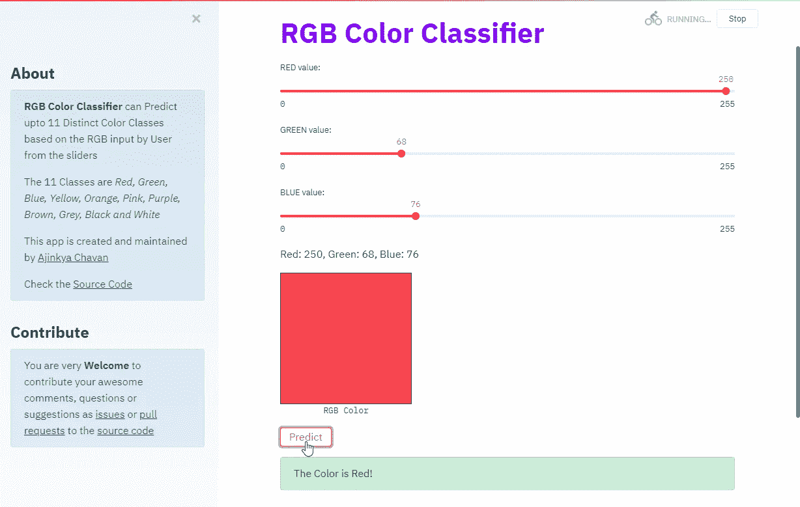
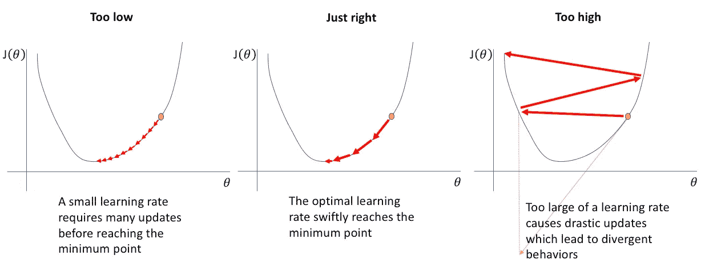
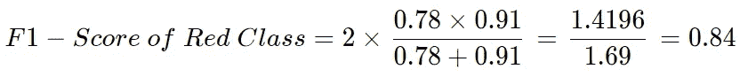

# 构建 RGB 颜色分类器:第 1 部分

> 原文：<https://medium.com/analytics-vidhya/building-rgb-color-classifier-part-1-af58e3bcfef7?source=collection_archive---------0----------------------->

## [数据集创建](#5e08)、[预处理](#4140)、&、[构建人工神经网络模型](#023b)及其[性能评估](#607f)

[**RGB 颜色分类器**](https://rgb-color-classifier.herokuapp.com/) (图片由作者提供)

在一级防范禁闭期间，我正在试验从 Youtube、Coursera、NPTEL 等各种渠道学到的*机器学习*和*深度学习*概念。将这些概念应用到项目中帮助我更深入地理解它们。因此，我们将建立一个非常有趣的项目，帮助我们深入了解数据科学的世界。此外，我希望如果你正在做一个类似的项目，这个博客将有助于减少你在构建项目时可能面临的时间和困难！

这里有 [Github 回购链接](https://github.com/AjinkyaChavan9/RGB-Color-Classifier-with-Deep-Learning-using-Keras-and-Tensorflow)和 [App 链接](https://rgb-color-classifier.herokuapp.com/)如果你着急的话！！别再浪费时间了，让我们开始吧。

# 项目描述

顾名思义，RGB 颜色分类器是一个基于三个输入预测不同颜色类别的应用程序- R:红色，G:绿色，B:蓝色；每个值基本上是一个从 0 到 255 的整数，这些组合的红色、绿色和蓝色值用于为计算机、手机或任何电子屏幕上的每个像素生成独特的纯色。因此，我们的分类器预测这种纯色的颜色类别。

# 资料组

获取数据集是我们必须解决的第一个问题。我找不到任何与我的项目完全匹配的相关数据集。所以，我决定创建一个符合我喜好的数据集。此外，我希望数据集是人工制作的，因为这样我们就能够让人工模型(分类器)尽可能人性化地对颜色进行分类。接下来，我们必须决定我们的分类器必须分类的颜色类别的数量。我找到一篇[研究论文](https://europepmc.org/backend/ptpmcrender.fcgi?accid=PMC1618485&blobtype=pdf)提到了 11 种基本的颜色分类。这些基本颜色是红色、绿色、蓝色、黄色、橙色、粉色、紫色、棕色、灰色、黑色和白色。因此，我使用同样的 11 个颜色类别作为我们的分类器。

刘易斯·格里芬的照片显示了 11 种基本颜色的心理结构。

# 数据集创建

这可能是我做过的项目中最乏味的部分😅。可能有更有效的方法来创建数据集，我会带你走一遍我的路:这里是数据集创建者的[谷歌实验室链接](https://colab.research.google.com/github/AjinkyaChavan9/RGB-Color-Classifier-with-Deep-Learning-using-Keras-and-Tensorflow/blob/master/Dataset%20Creator/Color_Dataset_Creator.ipynb)。

上面代码中的注释解释了重要的步骤。简而言之， **colorDataCreator()** 函数用于标记随机生成的 RGB 颜色，当该函数要求输入随机 RGB 颜色的标签时，如果用户输入 *done* ，它会生成标记的数据集—‘data . CSV 文件。下面是如何使用 *colorDataCreator()* 函数的演示:

**colorDataCreator()演示输出**(图片由作者提供)

不过，Colab 有一个警告，即由于任何网络问题或超过笔记本电脑的空闲时间而导致的断开连接问题。为了解决这个问题，我创建了另一个代码块，它使用了相同的 **colorDataCreator()** 函数。您所要做的就是将最后保存的“ *data.csv* ”文件上传到 Colab 并运行以下代码:

因此，我使用 colorDataCreator()为我们的数据集标记了大约 5000 种 RGB 颜色。是的，这是我之前提到的乏味的部分😅
现在，通过将用作颜色名称标签的首字母缩略词扩展到数据集，然后下载最终数据集，即“[*final _ data . CSV*](https://github.com/AjinkyaChavan9/RGB-Color-Classifier-with-Deep-Learning-using-Keras-and-Tensorflow/blob/master/Dataset/final_data.csv)”文件。

瞧啊。我们最终的数据集准备好了。让我们从有趣的部分开始，即建立和训练我们的神经网络模型。如果你着急的话，这里有同样的 [Google Colab 链接](https://colab.research.google.com/github/AjinkyaChavan9/RGB-Color-Classifier-with-Deep-Learning-using-Keras-and-Tensorflow/blob/master/RGB%20Color%20Classifier%20ML%20Model/Color_Classifier_ML_Model_Tuned.ipynb)！

# 模型的预处理数据集

让我们查看数据集“final_data.csv”文件，如下所示:

**查看数据集“final _ data . CSV”**(图片由作者提供)

正如我们所看到的，我们的数据集包含 3 个 RGB(红、绿、蓝)输入以及相应 RGB 颜色所属的颜色类的标签输出。现在，对于任何要工作的最大似然模型，我们都希望有数字数据，因为在任何最大似然算法的核心，大量的数学涉及线性代数、微积分、统计、概率等。被使用。
这里，我们已经有了数字格式的 3 个 RGB 输入。因此，我们已经完成了将任何数据转换成相应数值的一半工作。我们所要做的只是将文本的*标签*列数据转换成它的数字等价物。

## 将“标签”列的分类数据转换为数字数据

因此，我们的*标签*列在技术上被称为*分类*列，因为它包含 11 个颜色类别/类，我们希望在其中对 RGB 颜色进行分类。原来有一种很棒的技术叫做*分类编码*，用于将类别转换成数字。两种广泛使用的分类编码方法是*一键编码*和*标签编码*。

*   ***一键编码*** 为“n”个类别创建“n”个不同的列，如果数据点属于第 *i* 个类别，则第 *i* 列被赋予值*1，该行的所有其他列值被赋予值*0*。通过这种方式，人们可以以数字上有意义的方式跟踪类别。如果您不能完全理解这一点，请不要担心，当我们在本博客的后面部分实现它时，这个概念会更加清晰。*
*   在 ***标签编码*** 中，每个标签类别根据某种排序被赋予一个唯一的整数。这里，没有创建新的列，只是使用数字来表示同一“标签”列中的相应类别。

基于 DL 实践者的指导方针，当类别是序数*时，使用*标签编码*，这意味着类别之间具有某种相对重要性顺序。此外，当我们有大量的类别，并且使用一键编码在计算上变得昂贵，因为它创建了大量的列时，就使用它。*

在我们的例子中，我们没有那么多的颜色类别，而且每个颜色类别都同样重要，它们之间没有相对的顺序。因此，我们将使用*一键编码*将我们的 11 个颜色类别转换成数字形式。下面是实现:

**数据集中目标标签的一键编码**(图片由作者提供)

正如我们在这里看到的，One-Hot 编码为我们的 11 个类别创建了 11 个列。注意，第一种颜色被标记为蓝色，因为在 *label_Blue* 列中有值 1，第二种颜色被标记为棕色，因为相应的 *label_Brown* 列有条目 1。这样，我们就把分类数据转换成了数字数据。

## 将数据分为训练集和测试集

*train-test split* 程序用于评估机器学习算法的性能，当它们用于对未用于训练模型的数据进行预测时。

*   ***训练数据集*** :用于训练机器学习模型。
*   ***测试数据集*** :用于评估经过训练的机器学习模型，即它给出了模型性能的无偏估计，因为这些数据没有用于训练模型。

我们将数据集的 80%分割为训练集，剩下的 20%作为测试集。注意，这里我们用 pandas DataFrame 方法 *sample()随机分割数据集。*

**train _ test _ split:train _ dataset 的输出**(图片由作者提供)

**train _ test _ split:test _ dataset 的输出**(图片由作者提供)

## 分割输入要素和输出标注

输入特性，即*红色*、*绿色*、*蓝色*输入栏必须与输出*标签*栏分开。这是因为 ML 算法需要输入数据和目标/输出数据分别用于训练。

**train_dataset(输入要素)**(图片由作者提供)

**train_labels(输出)**(图片由作者提供)

类似地，我们为测试数据集拆分

# 构建和编译模型

正如副标题中提到的，我们将使用 Keras 和 Tensorflow 库构建一个人工神经网络(ANN)模型。

**一个神经元的正向传播**

简而言之，人工神经网络模型由一组顺序堆叠的层组成。每一层由一组神经元组成。第一层的每个神经元取 ***输入特征*** (在我们的例子中是红、绿、蓝值)， 然后**将**乘以它们各自初始化的 ***权重*** ，然后计算它们的 ***和*** 以及 ***偏差*** ，并将该结果通过 ***激活函数*** ，然后再次将其作为输入提供给下一层神经元，并且该过程在层中的每个神经元上继续，直到我们在最后一层获得输出。 这就是所谓的*正向传播*。

为了训练神经网络，从输出层返回到输入的*反向传播*被完成，其计算关于神经网络的*权重*和*偏差*的成本*函数*的*梯度*，并且这被用于更新 ***参数*** ，即 ***权重*** 和 ***偏差*** 使输出值尽可能接近目标值。

谢天谢地，我们不必实现这种复杂的数学运算，因为 ***TensorFlow*** 库会处理如何高效地实现这种数学运算！！我们将使用 [*tf.keras*](https://www.tensorflow.org/api_docs/python/tf/keras) ，这是一个运行在 TensorFlow 之上的高级 API，帮助我们通过简单的代码轻松使用 Tensorflow。

## 设置各层并编译人工神经网络模型

**车型概要**(图片由作者提供)

正如你所看到的，我们的人工神经网络模型有 5 层。所有层的层类型是*密集*，这意味着一层中的每个神经元接收来自前一层的每个神经元的输入，因此它是一个*密集连接的神经网络*。换句话说，*密集*层是完全连接的，这意味着一层中的所有神经元都与下一层中的神经元相连。

*   带有【T43 个神经元的*第一层*有*12 个参数*(*9 个权重+3 个偏差*)。
    这里我们有 9 个*权重*(3 个输入特征×3 个神经元【第一层】)& 3 个*偏差*(1 个偏差×3 个神经元)
*   具有*24 个神经元*的*第二*层有 96 个*参数*(*72 个权重+24 个偏差*)。
    即 72 个*权重*(3 个输入压力层×24 个神经元【2 个层】)& 24 个*偏差*(1 个偏差×24 个神经元)等等……

请注意，我使用了 **ReLU** (校正线性单位)作为我们 NN 模型中所有层的激活函数。 ***激活函数*** 用于添加非线性，以便帮助神经网络学习数据中的复杂模式。

此外，我已经使用了*正则化。l2* 执行 **L2 正则化**。应用正则化来减少 ***过拟合*** *。过度拟合*意味着我们的模型在训练集上做得太好，即它学习训练集中的微小细节和噪声，以至于它无法概括预测新数据所需的趋势，这将对性能产生负面影响。

[***分类交叉熵损失***](https://www.tensorflow.org/api_docs/python/tf/keras/losses/CategoricalCrossentropy) 函数用于计算实际和预测分类标签之间的损失。还因为我们的分类标签是如前面的[所解释的](#31d3)的独热格式。

我已经选择了 [***亚当*** *(自适应矩估计)* 算法](https://arxiv.org/pdf/1412.6980.pdf)作为我们的优化器/优化算法，其更新参数，即*权重*和*偏差*，使得*加速*达到*成本函数*(平均值)的*最小值*

***学习率*** 是优化算法中的一个超参数，它确定每次迭代的步长，同时向*成本函数的最小值移动。*我们模型的*学习率*为 0.001

**选择一个学习速率(** [**图像信用**](https://www.jeremyjordan.me/nn-learning-rate/) **)**

# 训练模型

在上面的代码中，我们将输入数据给了 ***x*** ，将目标数据即输出标签给了 ***y*** *。* ***历元*** 表示模型迭代整个 *x* 和 *y* 数据进行训练的次数。 ***批量*** 是训练时*参数*更新后的样本数。 *Verbose* 用于显示训练进度。我们将它设置为 0，因为我们不使用 tf.keras.Sequential.fit()方法来显示训练进度，而是使用 callbacks =[[TF docs . modeling . epochdots()](https://github.com/tensorflow/docs/blob/master/tools/tensorflow_docs/modeling/__init__.py)]来显示训练进度，这是每 100 个时期显示训练进度的一种更简洁的方式。

**过度拟合，因为验证损失增加，而训练损失减少** ( [来源](https://www.slideshare.net/xavigiro/training-deep-networks-d1l6-deep-learning-for-speech-and-language))

还有一个*关键点*需要注意的是***validation _ split = 0.2***的使用，这意味着 20%的训练数据集被用作*验证集*。 **A *验证集*是*从训练你的模型*中保留的训练集的样本，这意味着它不用于训练 *g*** *。*而是用于在训练自身时给出模型性能*的*无偏估计*。这仅仅意味着我们正在用*验证集*检查我们模型的*损失*和*精度*。简而言之，我们在训练的同时验证我们的模型性能，因此命名为“验证集”。这对于预测我们的模型对训练集是过拟合还是欠拟合非常重要。通过这样做，我们可以调整我们模型的*超参数，*不会与模型*参数*混淆*

模型*参数*是 ML 模型在训练期间学习的训练数据的属性。在我们的例子中，*权重*和*偏差*是学习到的参数，将被模型用于预测。所有其他的都是*超参数*，如学习速率、神经元数量、隐藏层数、批量大小等。简而言之，超参数用于控制参数，而不是相反。

**训练输出**(图片由作者提供)

**模型精度图**(图片由作者提供)

**模型损耗图**(图片由作者提供)

从模型精度图中，我们可以看到我们的模型运行良好，训练精度约为 90%，验证精度约为 87%。从模型损失图中，我们可以观察到我们的训练和验证损失都在减少，这意味着我们没有过度拟合我们的训练集。

# 根据训练好的模型对测试数据集进行预测

我们的 ANN 模型的预测为每个测试示例返回 11 个浮点数的 Numpy 数组。它们代表输入 RGB 颜色对应的 11 个不同颜色类别的模型的*置信度*。

**测试预测的输出**(图片由作者提供)

'*test _ predictions '*NumPy 数组的形状是(1010，11)，这意味着我们已经为所有 1010 个测试示例预测了 11 个置信浮点数。
让我们观察第一个输入的预测:

(图片由作者提供)

我们可以看到 11 个浮点值，代表 11 个类别中每个类别的置信度。浮动值越大，表示可信度越高。因此，*最高置信度值代表由我们的模型*预测的类别。出于模型评估的目的，我们将使用 sk learn . metrics . confusion _ matrix，它要求实际类和预测类采用标签编码格式。因此，我们将通过标签编码对它们进行编码:

**颜色分类标签的标签编码**(图片由作者提供)

**预测标签(测试集)**(图片由作者提供)

**实际标签(测试集)**(图片由作者提供)

# 评估模型性能

模型评估是模型开发过程不可或缺的一部分。它帮助我们找到代表我们的数据的最佳模型，以及所选模型在未来的工作情况。

所以，我们的*测试集准确率为 89%*

## 混淆矩阵

**混淆矩阵可视化**(图片由作者提供)

***混淆矩阵*** 是用于评价分类模型(分类器)性能的矩阵。*行*代表*实际*标签，而*列*代表我们的[滑雪套件学习混淆矩阵](https://scikit-learn.org/stable/modules/generated/sklearn.metrics.confusion_matrix.html)的*预测*标签。例如:在我们的例子中，第一个值 42 表示有 42 种*实际上是*红色，它们被我们的模型*预测为*红色。现在，看第 6 行的第一个值(粉色):值是 6，这意味着 6 个*实际上*粉色被*预测*为红色(列)。

请注意，所有 ***对角线元素*** 都具有*相同的*实际和预测标签，这意味着这些颜色被我们的模型正确分类为*，因为预测标签等于实际标签。因此，所有的 ***非对角线元素*** 都表示被我们的分类器误标的*颜色。**

****

****测试数据集**的精度计算(图片由作者提供)**

## **分类报告**

****

****分类报告**(图片由作者提供)**

**除了**精确度*精确度*精确度**之外，还有其他重要指标也与混淆矩阵相关联:**

*   *****精度*** :表示分类器将**正确分类*的*分数的多少。****

****

****精度公式**(图片作者提供)**

****

****红色等级的精度计算示例**(图片由作者提供)**

*   *****回忆*** :表示分类器将*中的*分数*正确分类*。****

****

****回忆公式**(图片作者提供)**

****

****回忆红色等级**的计算示例(图片由作者提供)**

**然而，在**精度**和**召回**之间有一个 ***权衡*** 即提高精度通常会降低召回，反之亦然。因此，有一个叫做 *F1 的指标——结合了精确度和召回率的分数*。**

*   *****-得分*** 是*精度*和*召回*的*调和平均值*，因此它给出了关于这两个指标的组合概念。**

****

****F1-得分公式**(图片由作者提供)**

****

****F1-红色等级分数计算示例**(图片由作者提供)**

**我们的数据集是*不平衡的*，也就是说，每个类的实例数量不一样(你可以从[分类报告](#d317)中的*支持*指标中看到这一点)。因此，我使用 f1 分数作为评估标准来决定我们的模型在各个颜色类别上的表现。
我还通过调整超参数训练了多个模型，并使用*加权平均 f1 得分*指标来决定哪个模型表现更好。**

**最后要做的一件事是保存我们训练好的模型，在部署它的时候会用到它(在第 2 部分中完成)。代码如下所示:**

**现在，您可以使用超参数和数据集来创建一个模型，其性能甚至可能超过模型的 89%😁😀**

**这就把我们带到了第 1 部分的结尾！我知道这个故事太长了，因为我想涵盖其中的大部分概念😅**

** [## 构建 RGB 颜色分类器:第 2 部分

### 使用 Streamlit 创建 Web 应用程序并使用 Heroku 进行部署

medium.com](/@ajinkyashailendrachavan/building-rgb-color-classifier-part-2-8c49a57f6b91)** 

# **感谢您的阅读。希望你喜欢这个故事！**

**我对写博客有点陌生。如果您发现任何错误或有任何建议，欢迎您这样做😃**

**在那之前保持微笑，快乐学习😊**

## **阿金基亚·查万**