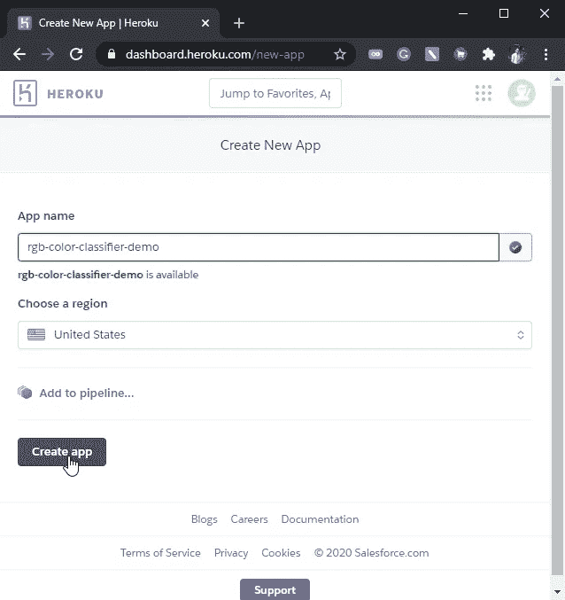

# 构建 RGB 颜色分类器:第 2 部分

> 原文：<https://medium.com/analytics-vidhya/building-rgb-color-classifier-part-2-8c49a57f6b91?source=collection_archive---------15----------------------->

## [使用 Streamlit](#171e) 创建 Web 应用[使用 Heroku](#7272) 部署

[**RGB 颜色分类器**](https://rgb-color-classifier.herokuapp.com/) (图片由作者提供)

在[第一部分](/@ajinkyashailendrachavan/building-rgb-color-classifier-part-1-af58e3bcfef7)中，我们学习了数据集创建、预处理、构建人工神经网络模型及其性能评估。
在这一部分，我们将学习使用 Streamlit 为我们的 ANN 模型创建一个 Web 应用程序，并使用 Heroku 部署它。

# 正在设置…

我们必须首先在 **Anaconda 提示符**中设置我们的**虚拟环境**，在这里我们将运行我们的 python 代码并安装所需的依赖项。你可以从这个[链接](https://docs.conda.io/projects/conda/en/latest/user-guide/install/index.html)安装 Anaconda，并使用这里给出的[指南创建一个虚拟环境。虚拟环境是维护 python 项目依赖性的一个非常重要的工具。您可以通过在您的虚拟环境的工作目录中复制给定的](https://docs.conda.io/projects/conda/en/latest/user-guide/tasks/manage-environments.html#creating-an-environment-with-commands)[*requirements . txt*](https://gist.github.com/AjinkyaChavan9/bf3a9f822b6d7492455b5675e03361ad)文件，并在 *Anaconda 提示符* : `pip install -r requirements.txt`
中运行以下命令来安装我们的项目所需的所有依赖项

**Anaconda 提示命令**(图片由作者提供)

# 分类功能

在开始使用 Web 应用程序之前，我们必须首先创建一个分类函数，用于预测从第 1 部分的训练模型([*Color model _ Trained _ 90 . H5*](https://github.com/AjinkyaChavan9/RGB-Color-Classifier-with-Deep-Learning-using-Keras-and-Tensorflow/blob/master/RGB_Color_Classifier_app/colormodel_trained_90.h5)’)输出的颜色标签。
预测颜色等级的代码如下⏬

注意:确保训练模型([*color model _ trained _ 90 . H5*](https://github.com/AjinkyaChavan9/RGB-Color-Classifier-with-Deep-Learning-using-Keras-and-Tensorflow/blob/master/RGB_Color_Classifier_app/colormodel_trained_90.h5))和 *color_classifier.py* 文件存在于您的虚拟环境的同一个工作目录中。

给定的 *predict_color* 函数返回表示 RGB 输入的预测颜色的字符串。它基本上从我们的模型为给定的 RGB 输入预测的所有颜色类置信度值中选择具有最高置信度值的颜色类。此处给出了更详细的解释[。](/analytics-vidhya/building-rgb-color-classifier-part-1-af58e3bcfef7#6656)

# 使用 Streamlit 创建 Web 应用程序

Streamlit 徽标([来源](https://www.streamlit.io/brand))

让我们通过使用令人惊叹的 [Streamlit](https://www.streamlit.io/) 框架，开始用纯 Python 创建一个 Web 应用程序。下面给出了我们的 web 应用程序的代码⏬

*   我们使用 [streamlit.sidebar](https://docs.streamlit.io/en/stable/api.html#add-widgets-to-sidebar) 创建了一个侧边栏，其中我们添加了关于的*和用于显示关于我们应用的*信息*的*贡献*部分。*
*   **RGB 颜色分类器**的*动画彩虹标题*是使用 HTML & CSS 创建的，并使用`st.markdown(Title_html, unsafe_allow_html=True)`渲染，其中`Title_html`是一个字符串，包含彩虹渐变文本动画的 HTML CSS 代码，我在这里找到了。你也可以给一个简单的[标题标题](https://docs.streamlit.io/en/stable/api.html#streamlit.title)由`st.title(“RGB Color Classifier”)`
*   我们通过 [st.slider](https://docs.streamlit.io/en/stable/api.html#streamlit.slider) 分别为红色、绿色和蓝色值创建了三个输入滑块。输入滑块的完整 RGB 值范围从 0 到 255 分别由*最小值* & *最大值*参数设置。
*   从滑块选择的 RGB 输入由 [st.write](https://docs.streamlit.io/en/stable/api.html#streamlit.write) 显示
*   *display_image( )* 函数用于显示用户从滑块输入的 RGB 颜色。该功能利用枕头库。
*   *预测* *按钮*是使用`st.button(“Predict”)`创建的，它返回一个布尔值，表示按钮是否被点击。
*   点击预测按钮调用 *predict_color( )* 函数，将红色、绿色和蓝色滑块值作为*参数*传递给它。该函数然后返回一个包含预测颜色标签的*字符串*，该预测颜色标签存储在*结果*变量中。
*   然后由`st.success(‘The Color is {}!’.format(result))`将预测的颜色结果打印为[成功](https://docs.streamlit.io/en/stable/api.html#streamlit.success)消息

因此，我们创建了 *RGB_web_app.py* 文件。为了在浏览器中运行 Web 应用程序，在 Anaconda 提示符下键入以下命令:`streamlit run *RGB_web_app*.py` 注意:确保 *RGB_web_app.py* 、 *color_classifier.py* 文件和训练模型([*color model _ trained _ 90 . H5*](https://github.com/AjinkyaChavan9/RGB-Color-Classifier-with-Deep-Learning-using-Keras-and-Tensorflow/blob/master/RGB_Color_Classifier_app/colormodel_trained_90.h5))位于虚拟环境的同一个工作目录中，并且还必须安装所需的依赖项以便无错误执行。

# 使用 Heroku 部署

Heroku 是一个很棒的平台，它负责在云上部署我们的应用程序。我们所要做的就是定义一个 *Procfile，setup.sh* 文件以及我们之前创建的 web app 文件和 *requirements.txt* 文件。您必须拥有 Heroku 帐户才能部署您的应用。下面给出的是 *setup.sh* 和 *Procfile。*

*setup.sh* 是一个 shell 脚本，它创建目录 streamlit 并设置 *config.toml* 文件
*Procfile* 是一个文本文件(没有任何文件扩展名)，包含启动我们的应用程序的命令。它执行 *setup.sh* 脚本并运行我们的应用程序。

我们现在已经准备好了部署所需的基本文件。现在，我们必须安装 *Heroku CLI* ，它使用 *git* 将我们的文件推送到 Heroku。这里有一个[链接](https://devcenter.heroku.com/articles/getting-started-with-python#set-up)，用于在您各自的操作系统上安装该链接。安装后，您可以从操作系统命令行界面(CLI)运行 Heroku 命令。

首先，我们从 [Heroku 仪表板](https://dashboard.heroku.com/new-app)创建一个名为*RGB-color-classifier-demo*的新应用。

创建应用程序后，还会显示部署所需的 Heroku Git 命令⏬

Heroku 命令

*   我们使用`heroku login`登录 Heroku
*   将目录更改为我们的工作目录，其中包含 Web App 文件: *Procfile* 、 *setup.sh* 、 *requirements.txt* 、 *RGB_web_app.py* 、 *color_classifier.py* 、*color model _ trained _ 90 . H5*
*   使用`git init`将当前目录初始化为 Git 存储库
*   为了给 Heroku 上的应用 repo 设置 Git remote，我们使用了`heroku git:remote -a rgb-color-classifier-demo`
*   然后我们使用`git add .`将所有文件添加到 git remote
*   我们用`git commit -am “first commit”`提交我们的变更
*   最后，为了部署我们的应用程序，我们使用`git push heroku master`

因此，我们的 RGB 颜色分类器 Web 应用程序最终部署在 Heroku 上！！

Web 应用预览(图片由作者提供)

> 我想引用亨利·福特的一句名言来结束我的演讲:“质量意味着在没人注意的时候把事情做好”

# 感谢您的阅读。希望你喜欢这个故事！

我对写博客有点陌生。如果您发现任何错误或有任何建议，欢迎您这样做😃

在那之前保持微笑，快乐学习😊

## 阿金基亚·查万