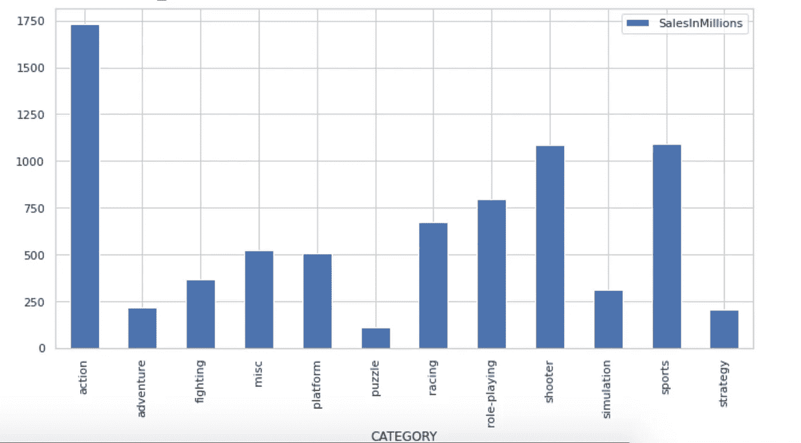

# 使用机器学习数据集构建销售预测 Web 应用

> 原文：<https://medium.com/analytics-vidhya/building-sales-prediction-web-application-using-machine-learning-dataset-9dd83c6c543?source=collection_archive---------12----------------------->


# 介绍

*   互联网上有很多关于在机器学习数据集上寻找见解和训练模型的资源，但很少有文章介绍如何使用这些模型来构建实际应用。
*   因此，今天我们将学习这个过程，首先使用来自黑客马拉松的数据集训练一个视频游戏销售预测模型，然后使用训练好的模型创建一个基本的应用程序，根据用户输入为我们提供销售预测。
*   这篇文章分成几个部分，你可以一个一个地读，而不是试图一口气读完。从我第一次拿起数据集开始，我花了整整一周的时间来完成这个应用程序。因此，花自己的时间，专注于学习构建应用程序的各个方面，而不是最终产品。
*   由于此类项目包含在一个多步骤的过程中，因此建议保留一个简单的工作流程文档，以规划项目的目标、总体执行步骤并跟踪其进度。你可以在这里找到我为这个项目创建的这样一个文档:[工作流文档](https://docs.google.com/document/d/1BX5u7MZHBioXL8O7p1yWmZpY0C_-GOLf4Eqz8UeNknk/edit?usp=sharing)。它大致基于本文中数据科学项目的 12 个基本步骤:[中级](/cracking-the-data-science-interview/how-to-think-like-a-data-scientist-in-12-steps-157ea8ad5da8)
*   如果你准备好了，那么在后台开始你最喜欢的音乐播放列表，让我们开始吧…

来源:男高音

# 第 1 部分:生成模型

*   我们将使用 Machine Hack 网站上运行的视频游戏销售预测黑客马拉松的数据集。首先，在 [MachineHack](https://www.machinehack.com/) 上创建一个账户，并在这个[链接](https://www.machinehack.com/hackathons/video_game_sales_prediction_weekend_hackathon_10)上注册黑客马拉松。
*   注册后，转到数据选项卡并下载 zip 文件，该文件将包含三个文件，即培训、测试和样本提交。
*   接下来的步骤将在 Google Colab notebook 中介绍，您可以通过此链接打开并复制: [Google Colab Notebook](https://colab.research.google.com/drive/1tc9I7bxLJWCAEnqyPVi1Y2nIRLz3hNxR?usp=sharing) 或者，如果您想在本地或其他平台上下载并运行该笔记本，请通过此 GitHub 链接下载该笔记本: [Jupyter Notebook 链接](https://github.com/saurabhnative/video-game-sales-prediction-jupyter-notebook/blob/master/Video_Game_Sales_prediction.ipynb)
*   笔记本的第一部分简要概述了问题陈述。可以运行下面显示的下一个代码单元，将我们在上一步中收到的文件上传到笔记本中。

文件上传

*   在下一个代码单元中，我们导入所需的 python 包。它们中的大多数都预装在 Google Colab 中，因此没有必要安装它们中的任何一个。
*   由于我们不能在 hackathon 结束后提交测试数据进行评估，所以在本文的剩余部分，我将只使用 Train.csv 的数据。请记住，Train.csv 的行数比我们通常用于正确训练模型的行数要少。然而，为了便于学习，我们可以使用行数较少的数据集。
*   现在让我们深入解决这个机器学习问题…

## **步骤 1:识别目标和独立特征**

*   首先，让我们将 Train.csv 导入到 pandas 数据框架中，并运行`df.head()`来查看数据集中的列。


列值

*   从数据帧中，我们可以看到目标列是`**SalesInMillions**`,其余的列是独立的特征

**第二步:清理数据集**

*   首先，我们通过运行`input.isnull().sum()`命令来检查`null`值。

*   我们可以看到数据集中没有空值。接下来，我们可以通过运行下面的命令来删除不必要的`ID`列，因为它在目标销售中不起作用:- `input = input.drop(columns=['ID'])`
*   接下来，我们可以使用`train_test_split`命令将数据帧分成训练和测试数据集

```
train, test = train_test_split(input, test_size=0.2, random_state=42, shuffle=True)
```

**第三步:探索性数据分析**

*   **描述性统计** 使用`df.shape`命令，我们可以找到数据集中的总行数，而`df.nunique()`命令可用于找到每一列中的唯一值。

*   在 EDA 部分，我们利用`pandas profiling`和`matplotlib`包来生成各个列的图形，并观察它们与目标列的关系。
*   从 EDA 中获得一些见解如下
*   PS3 平台的销量最高，其次是 Xbox360:


销售 1

*   动作类的销量最高，而益智类的销量最低:



销售 2

*   在 2007 年至 2011 年期间，销售额最高:


销售 3

通常，我们在 EDA 之后进行特征工程或特征选择步骤，但是我们的特征数量较少，并且侧重于实际使用模型。因此，我们正朝着下一步前进。但是，请记住，`USER_POINTS`和`CRITICS_POINTS`列可以用来派生额外的特性。

**第四步:建立模型**

*   我们将对数据集使用 catboost 回归模型，因为我们有许多分类特征，这跳过了对分类特征进行标签编码的步骤，因为 catboost 可以直接处理分类特征。
*   首先，我们使用`pip install`命令安装`catboost`包。
*   然后，我们创建一个分类特征列表，将其传递给模型，然后根据训练数据集拟合模型:

**第五步:检查模型精度**

*   首先，我们从测试数据集创建真实预测:

*   接下来，我们在测试数据集上运行经过训练的模型，以获得模型预测并检查模型准确性

*   我们的 RMSE 值是 1.5，相当不错。关于回归问题中准确性度量的更多信息，您可以参考这篇文章。如果你想进一步改进模型或尝试组合各种模型，你可以参考本文中本次黑客马拉松获胜者的方法: [Analytics Vidya](https://analyticsindiamag.com/meet-the-machinehack-champions-who-cracked-the-video-game-sales-prediction-hackathon/)

**第六步:将模型保存到 pickle 文件中**

*   我们现在可以将模型保存到 pickle 文件中，然后在本地保存它:

*   保存 pickle 文件后，可以从 Google colab 笔记本的文件部分的左侧边栏下载并保存到本地:


文件

**奖励提示**

*   **添加更多数据** 我们可以通过向模型添加更多数据来改进模型预测。我们可以使用的一些相关数据集在 [Kaggle](https://www.kaggle.com/gregorut/videogamesales) 上。
*   **提高模型效率**
    我们可以使用一堆组合模型来进一步提高模型效率。

如果你已经完成了这一步，那么给自己一个鼓励，因为我们刚刚完成了项目的第一个主要部分。休息一会儿，做做伸展运动，把这首歌换到你的播放列表中，然后开始这篇文章的下一部分。

# 步骤 2:从模型创建后端 API

*   我们将使用 [Python Flask](https://www.tutorialspoint.com/flask/index.htm) 来创建我们的后端 API。
*   所以首先在本地创建一个名为 server 的文件夹。另外，如果您还没有安装 [Python](https://www.python.org/downloads/) 和 pip 包管理器，请在您的机器上安装。
*   接下来，我们需要在我们的文件夹中创建一个虚拟环境。更多详情可以在这里找到: [Python venv](https://packaging.python.org/guides/installing-using-pip-and-virtual-environments/) 。我在 Linux 上本地使用 python3，所以为我创建一个虚拟环境的命令应该是:`python3 -m venv server`你可以在本文中查看与你的操作系统和 python 版本相关的命令: [Python venv](https://packaging.python.org/guides/installing-using-pip-and-virtual-environments/)
*   接下来，我们将通过运行命令来激活我们的虚拟环境:`source server/bin/activate`
*   一旦完成，我们需要安装烧瓶 pip 包:`pip install -U Flask`
*   接下来，用您喜欢的文本编辑器在服务器文件夹中创建一个名为“app.py”的文件，并添加以下代码来创建一个基本的 API:

*   现在打开一个终端，运行`python3 app.py`启动服务器。这将主要在`5000`端口上启动服务器。为了测试 API，在浏览器中打开这个链接:`[http://localhost:5000/](http://localhost:5000/)`。您应该会在浏览器中打印出`Hello World`。如果不是，则检查 API 是否在不同的端口上运行，或者在启动 API 时终端中是否出现错误。
*   我们将使用一个 [POST](https://assertible.com/blog/7-http-methods-every-web-developer-should-know-and-how-to-test-them) API 调用，所以在继续下一步之前最好安装 [Postman](https://www.postman.com/downloads/) 工具。该工具将用于向服务器发送 POST 请求。
*   接下来，我们需要使用这个命令安装 [catboost](https://catboost.ai/docs/installation/python-installation-method-pip-install.html) 、 [pandas](https://pypi.org/project/pandas/) 和 [Flask-Cors](https://pypi.org/project/Flask-Cors/) pip 包:-
    `pip install catboost pandas Flask-Cors`
*   接下来，将我们在**第 1 部分**末尾下载的训练模型 pickle 文件(finalized_model.sav)复制到服务器文件夹中。
*   现在用下面的代码更新 app.py

app.py 已更新

*   在第 6 行，我们将训练好的模型导入到 python 文件中。在第 10 行，我们初始化 CORS 模块以允许来自客户端 API 调用的请求。
*   在第 11 行，我们定义了一个错误处理器，如果从服务器访问任何未处理的异常或未定义的路径，它将发送错误响应。
*   我们最感兴趣的是第 19 行定义的`get_prediction` POST API。`get_prediction`方法是我们从客户端获取数据，并提供销售预测作为回应。
*   在第 24 行，我们将来自 API 请求的数据转换成 pandas 数据帧。现在，我们的模型希望各列按照特定的顺序排列，以提供适当的响应。因此，在第 25 行中，我们指定了列的顺序，并在接下来的步骤中按照要求的顺序重新排列列。
*   第 27 行的`model.predict`用于从模型获得预测，并作为响应传递给客户端。在这一步，我们在本地准备好了 API，可以通过发送 POST API 调用在 Postman 客户端测试 API，如屏幕截图所示:


邮递员 API 调用

*   您可以在上述请求的 body 部分添加一个 JSON 示例，可以在 code gist 中找到: [Github Gist](https://gist.github.com/saurabhnative/67ea0145b1626984af6619e8a301c067) 。确保在正文中选择`raw`选项，正文类型为 JSON，如屏幕截图所示，请求类型为 POST。
*   如果这一步之前一切正常，那么恭喜你，你现在有了一个后端 API，它可以根据输入参数从训练好的模型中给出预测。

**奖励提示**

*   **模块生成代码** 在单个文件中编写 API 不是后端设计的推荐方法，我们可以将路线和模型导入分离到不同的文件夹中，使代码更加模块化。如果我们将来引入额外的 API 路径，这也将允许我们以可管理的方式扩展代码。

在这一点上，我们可以再次休息一下，吃点点心，并确保将这篇文章加入书签，以便很容易回来开始项目的下一部分。

# 步骤 3:将后端 API 部署到 Heroku

*   到目前为止，我们的 API 在本地工作，但它需要部署在远程服务器上，以便从其他地方使用。为此，我们将使用 Heroku 作为我们的 API 托管平台。
*   我主要参考了 stackabuse 的[文章](https://stackabuse.com/deploying-a-flask-application-to-heroku/)将 app 部署到 Heroku。我们将简要介绍这些步骤，但是如果您在这些步骤中遇到困难，请参考这里的原始文章: [Stackabuse 文章](https://stackabuse.com/deploying-a-flask-application-to-heroku/)
*   首先，我们使用终端命令
    `pip install gunicorn`安装 [gunicorn](https://pypi.org/project/gunicorn/)
*   接下来运行下面的命令，将到目前为止已经安装好的所有 pip 包保存到 requirement.txt 文件:
    `pip freeze > requirements.txt`
    可以参考这里上传的 requirements.txt 文件进行参考:Github [链接](https://github.com/saurabhnative/video-game-sales-prediction-backend/blob/master/requirements.txt)。
*   接下来，在服务器文件夹中创建一个名为`Procfile`的文件，代码如下:`web: gunicorn app:app`
*   现在在 Heroku 网站上注册，在网站上创建一个应用程序，并安装 Heroku CLI，如最初的[文章](https://stackabuse.com/deploying-a-flask-application-to-heroku/)中所述。
*   接下来，通过运行以下命令从本地终端登录 Heroku:`heroku login -i`
*   使用下面的命令添加 Heroku 应用 git 参考:-
    `heroku git:remote -a {your-project-name}`
*   现在使用下面的命令将代码推送到 Heroku:-
    `git push heroku master`
*   在运行上述命令的最后，您将在终端输出中获得 API URL，现在我们可以使用它从客户端进行调用。此时，我们还可以从 PostMan app 发送 API 请求，以查看响应是否被正确接收，类似于第 2 步末尾描述的方式。
*   到目前为止的代码库可以在 Github repo 这里找到:[视频游戏销售后台](https://github.com/saurabhnative/video-game-sales-prediction-backend)

我们现在有了一个托管在服务器上的正常工作的 API。如果一切顺利，那么我们可以继续开发客户端应用程序。如果你遇到了任何问题，请在评论区提出你的问题，或者通过文章结尾提到的社交把手联系我。

# 步骤 4:使用 react 和 bootstrap 创建客户端应用程序

*   我们需要在我们的机器上正确安装和设置 [Node.js](https://nodejs.org/en/download/) 。因此，在继续下一步之前，请下载并安装适用于您的相关操作系统和系统的 Node.js。另外，建议安装纱线卷装管理器:[纱线安装](https://classic.yarnpkg.com/en/docs/install)
*   现在，在上一步创建的*服务器*文件夹外创建一个名为`frontend`的新文件夹，并从终端进入`frontend`文件夹。
*   接下来，我们将创建一个新的 react 应用程序，并通过在终端中运行以下命令来启动它:

*   您应该看到浏览器选项卡打开，react.js 默认模板应用程序在浏览器中可见。现在我们需要在我们最喜欢的编辑器中打开这个项目(我使用的是 [VSCode](https://code.visualstudio.com/) ),并开始修改以构建我们的前端应用程序。
*   首先，我们需要在我们的应用程序中的 *public* 文件夹中的*index.html*文件中导入相关的引导文件。


index.html

*   我们需要根据*index.html*文件中[引导文件](https://getbootstrap.com/docs/4.5/getting-started/introduction/)提供的说明添加文件，如下所示:-

*   我们最终的 UI 是一个下拉项目集合，其中的一个项目如下所示:


下拉项目

*   我们将在 src 文件夹中创建一个名为`optionsSources.json`的 JSON 文件。JSON 文件中的每个条目都包含以下对象:

*下拉菜单*中显示的选项在`options`数组中，下拉选择左侧显示的*图标*和*标签*在`icon`和`dropDownPlaceholder`按键项中。我们需要创建多个这样的下拉列表，所以要添加的完整 JSON 文件如下所示: [Github](https://github.com/codeclassifiers/video-salesprediction-frontend/blob/master/src/optionsSources.json)

*   接下来，我们需要在我们的应用程序中实现下拉组件。在 src 文件夹中创建一个名为 *components* 的文件夹，并在 components 文件夹中创建一个名为 *OptionSelection.js* 的文件。
*   我们将编写一个功能组件，它返回一个下拉项目，如下所示:

下拉呈现

*   在上面的组件中，我们从第 3 行的父组件获取`itemKey`作为 prop(param)值。让我们假设从父组件接收的`itemKey`是`CONSOLE`。在第 4 行和第 5 行，我们首先提取要显示在下拉列表左侧的标题和图标。然后我们在第 6 行的返回函数中使用了 HTML 标签，按照 Boostrap 文档创建[下拉菜单](https://getbootstrap.com/docs/4.0/components/dropdowns/)。
*   接下来，我们需要实现在 return 函数中定义的`renderOptionsDrop`函数，如下所示:

*   在第 5 行，我们从 optionSources JSON 对象中获取特定项目的`options`数组，并将其存储在`selectionOptions`变量中。
*   然后在第 6 行，我们使用 [map](https://www.w3schools.com/jsref/jsref_map.asp) 函数迭代数组，并显示下拉选择项。我们必须在第 10 行使用`onClick`函数更新下拉列表项的选定值。
*   onClick 处理程序 viz `handleDropDownSelection`中的函数实现如下:

*   我们在 1 号线上有进口的`useState`吊钩。它是 react.js 库中可用的内部函数，允许我们使用[状态变量](https://reactjs.org/docs/state-and-lifecycle.html)的概念动态更新值。关于这个函数的更多信息可以在这里找到: [React useState docs](https://reactjs.org/docs/hooks-state.html) 。
*   在第 7 行，我们更新了下拉菜单的 selected 选项，在第 8 行，我们将 selected 值传递回父函数进行进一步处理。
*   这个组件的完整代码可以在这里找到: [Github](https://github.com/saurabhnative/video-salesprediction-frontend/tree/master/src/components)
*   现在，我们在 src 文件夹中的 App.js 文件中进行更改，以导入上面的选项选择组件，并对服务器进行 API 调用。完整的代码可以在这里找到: [Github](https://github.com/saurabhnative/video-salesprediction-frontend/blob/master/src/App.js)
*   我们在`handleInputSubmission`函数中对后端进行 API 调用，如下所示:

向服务器发送请求

*   我们正在利用 Axios NPM 模块对后端 Heroku 服务器进行 POST API 调用。确保在第 8 行为*process . env . react _ APP _ Heroku _ SERVER _ URL*占位符添加您自己的 Heroku 服务器 URL，以便从您的服务器 API 接收响应。将 API URL 变量保存在`.env`文件中并稍后在部署环境中设置它们是一个很好的实践。更多细节可以在这里找到: [Env 变量](https://create-react-app.dev/docs/adding-custom-environment-variables/)。
*   前端应用的完整源代码可以在 Github 这里找到:
    [视频游戏销售预测前端](https://github.com/saurabhnative/video-salesprediction-frontend)

这就为我们留下了在线部署 web 应用程序的最后一步。所以，再忍耐和坚持一会儿，让我们开始我们项目的最后一步。

# 步骤 5:将客户端应用程序部署到 netlify

*   [Netlify](https://www.netlify.com/) 是一个轻松在线部署静态网站的平台。当部署使用`create-react-app`模块制作的应用程序时，它有一个相当简单的过程。我们将利用这项服务在线托管我们的 web 应用程序。
*   首先，我们需要在 Github 上创建一个账户。
*   然后我们需要上传前端文件夹到 Github repo。我们可以按照官方文档中显示的步骤将项目部署到 Github: [官方文档](https://docs.github.com/en/github/importing-your-projects-to-github/adding-an-existing-project-to-github-using-the-command-line)
*   一旦项目在 GitHub 上上线，netlify 的部署就变得简单明了，只需遵循他们的官方文档: [Netlify 部署](https://www.netlify.com/blog/2016/09/29/a-step-by-step-guide-deploying-on-netlify/)
*   如果您在上一步中使用了服务器 URL 的环境变量，请确保将它们添加到 netlify dashboard 中，如本[文档](https://docs.netlify.com/configure-builds/environment-variables/)所示。
*   最后，我们将有一个 web 应用程序，如下所示:


最终 web 应用程序

**奖励提示**

*   **改进 UI 和配色** 老实说上面的 UI 相当基础，没有很棒的配色方案(主要是因为像我这样的开发者不是好的设计师)。您可以改进设计并调整 CSS 以获得更好的网页整体外观。

*   这就完成了从机器学习黑客马拉松数据集创建 web 应用程序的过程。
*   如果你顺利完成了项目，那么你的分析和编码技能就值得称赞。但是如果在任何时候你确实遇到了困难，那么谷歌和 StackOverflow 仍然是我们最好的朋友。如果你仍然找不到问题的解决方案，那么请在评论中提出来，或者在 LinkedIn 或 Twitter 上联系我。

# 关于作者

**绍拉布·姆哈特雷**

在过去的 5 年里，我一直在这个行业做前端开发人员。我在 GreyAtom 获得了数据科学的非全日制硕士学位，并在过去的 2 年中一直在学习数据科学概念。在我的业余时间，我通常创建副业，教大学生，写技术文章。

推特:[https://twitter.com/saurabhnative](https://twitter.com/saurabhnative)
LinkedIn:[https://www.linkedin.com/in/saurabhn](https://www.linkedin.com/in/saurabh-mhatre)ative

*原载于 2020 年 8 月 10 日 https://www.analyticsvidhya.com**的* [*。*](https://www.analyticsvidhya.com/blog/2020/08/building-sales-prediction-web-application-using-machine-learning-dataset/)