# 名人识别:构建定制的可扩展管道

> 原文：<https://medium.com/analytics-vidhya/building-scalable-celebrity-recognition-pipeline-d4faf90f6536?source=collection_archive---------26----------------------->

由于互联网上视觉内容的消费日益增长，名人识别是计算机视觉领域中最具趋势的用例之一。检测感兴趣的人(政治家、演员、运动员、商人、记者、活动家等。)是一个有趣且具有挑战性的问题。注释内容有助于企业建立更好的推荐系统，并提供个性化的用户体验。

## 数据监管

为每个人创建多张照片的命名文件夹，最好是面部表情、姿势、年龄和化妆尺寸多样化的照片。丰富的多样性确保了对不同人脸编码的学习，这反过来又提高了各种设置下的预测信心。

## **训练数据生成**

对每个名人文件夹中所有检测到的人脸进行编码。有许多开放的基于 CV 和 DL 的算法来检测面部边界框、界标标记和编码面部。根据计算资源的可用性和期望的性能选择一个合适的。保存各自的名人姓名、面部边界框坐标、编码向量和在面部周围画有框的标记图像。

> 数据集中的每个图像都通过多任务级联卷积网络来检测和对齐里面的人脸。这些人脸然后通过深度 CNN 模型提取 128 D 的特征向量。

## 数据清理

通常，由于在单个图像中存在多个面孔(相同或不同的人)或者图像被放错了文件夹，相当大量的策划图像是错误的。

为了以自动方式过滤出每个名人的正确面部编码，图形算法听起来很有希望，因为它们能够发现组件之间的结构关系。

构建网络图，其中每个节点表示检测到的人脸(名人姓名、边界框坐标、编码、带有标记的边界框的图像)，边表示两个节点之间的关系。邻接矩阵用于构建无向图和无权重图。成对距离< 0.5 are considered similar and share a common edge whereas pairs with distance > = 0.5 的面没有关系。

***社区检测:*** *它*识别复杂网络中高度连接且紧密结合的节点子群，以揭示社区结构。

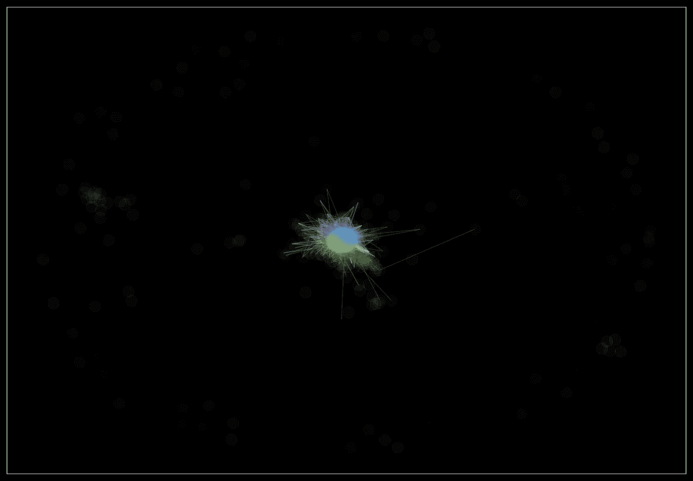

不同的颜色代表社区。异常面孔作为离群值从主要社区中分离出来。

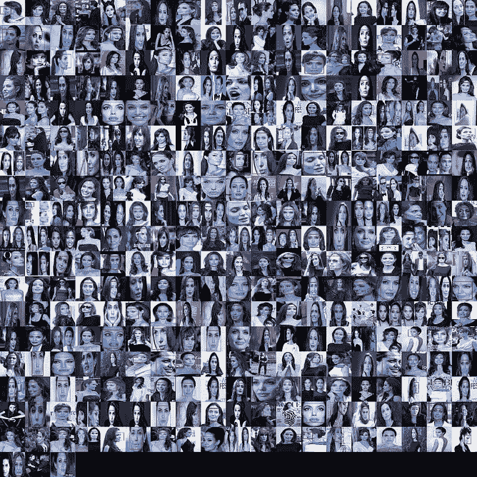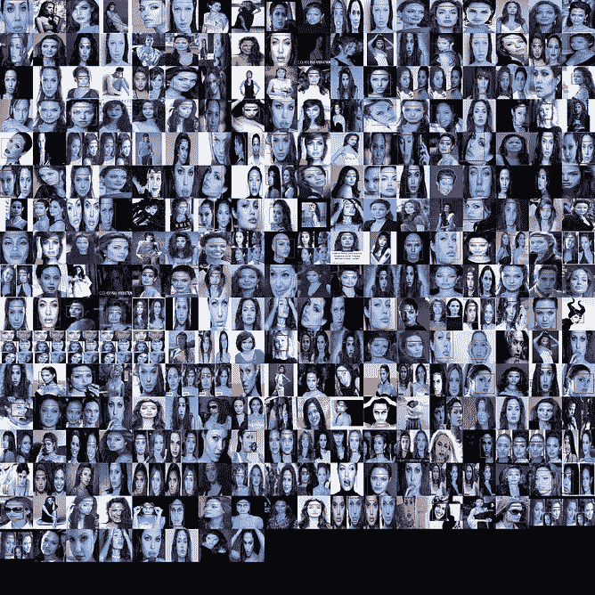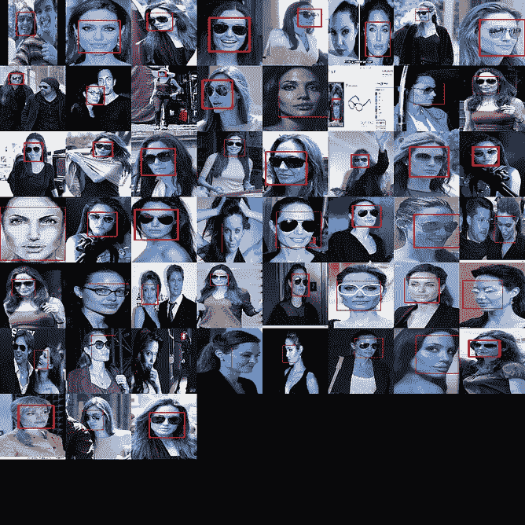

安吉丽娜·朱莉的顶级社区

如上图所示，顶级社区包含不重叠的面部组，这些面部组之间存在明显或不明显的差异。顶点少于总顶点数的某个百分比的社区可以被忽略。保留的社区被合并以生成相关人脸的详尽列表。

***人脸聚类:*** [***中国悄悄话***](https://en.wikipedia.org/wiki/Chinese_Whispers_(clustering_method)) 是一种图聚类算法，通过将文件夹中的所有人的图像分配到不同的聚类中来区分他们。

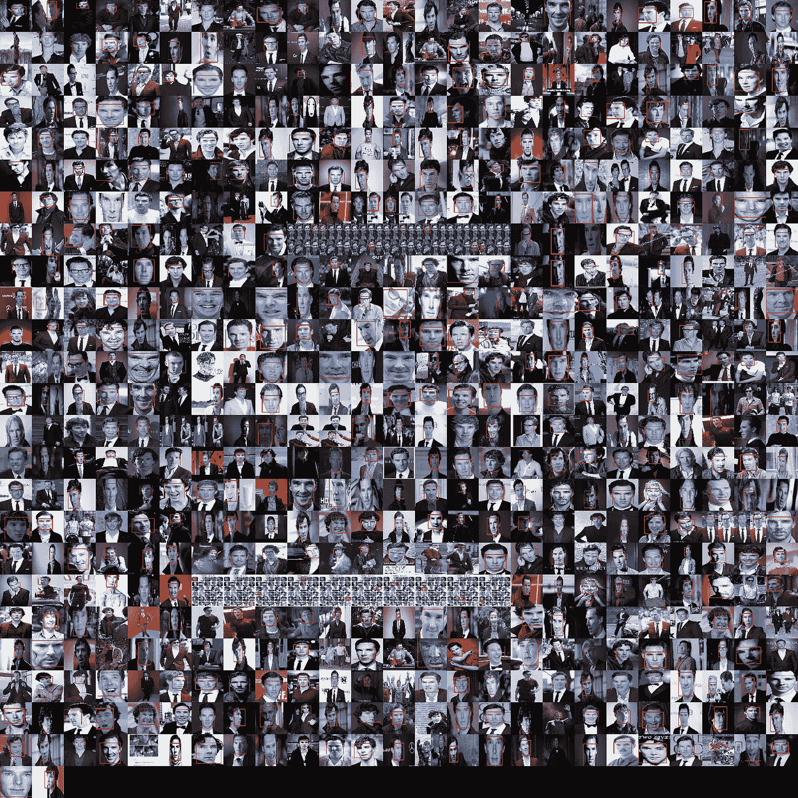

本尼迪克特·康伯巴奇集群:观察不同的面部表情和人物造型

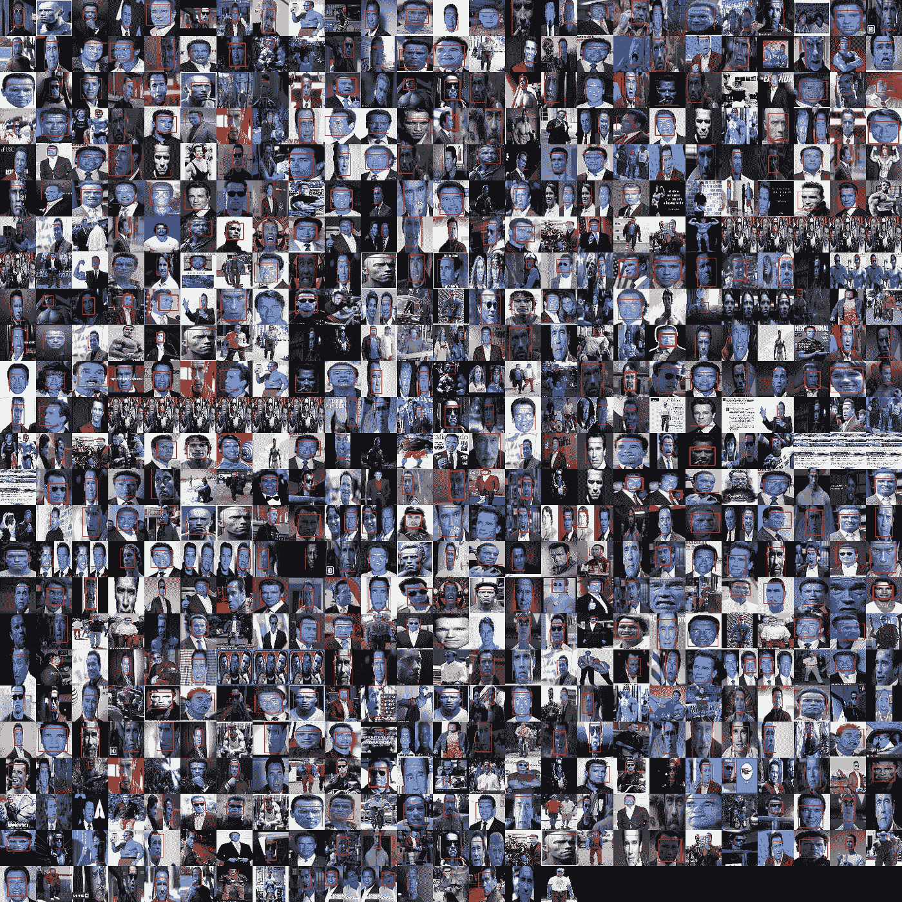

阿诺德·施瓦辛格集群:观察不同的面部改造、身体变化和衰老

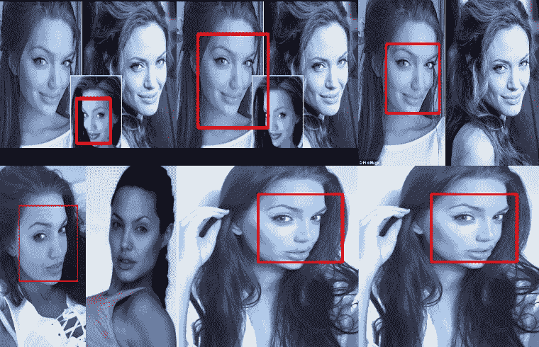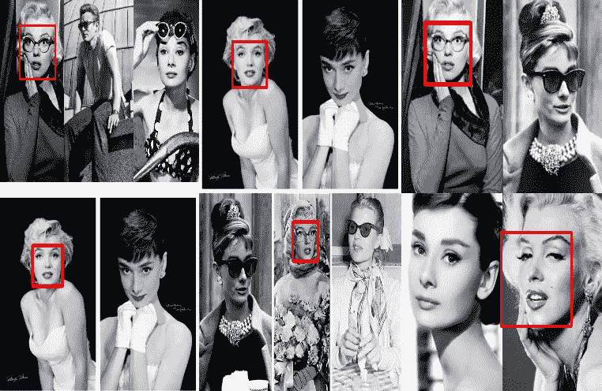

安吉丽娜朱莉文件夹中的安吉丽娜朱莉相似群集和奥黛丽赫本文件夹中的玛丽莲梦露群集

顶级聚类(除了名人)通常属于家庭成员、配偶、朋友、同时代人、二重身等。长尾星团大多嘈杂稀疏。

由于显而易见的原因，最大的聚类被假设为名人聚类。它适用于大多数情况，除了文件夹本身命名错误或大多数图像不正确的情况。或者，我们可以使用一些参考名人图像来确认聚类选择。我们可以平均顶部聚类的所有编码向量，并选择具有最接近参考编码的平均编码的聚类。

## **模型构建**

丢弃被拒绝聚类并仅保留来自所选聚类的编码，以用作名人识别模型的训练数据。

***分类模型:*** 使用 SVM 或 KNN 算法，使用带标签的人脸编码构建分类器模型。KNN 是一个基于实例的懒惰学习器，不需要划分类之间的界限，所以我们可以添加更多的名人，而不需要重新训练模型。懒惰的学习者查询速度很慢，从而损害了推理的运行时性能。另一方面，SVM 是一个渴望学习的人，但每当我们增加新的名人时，他都需要重新训练。

***近似最近邻搜索:*** 人工神经网络搜索算法以降低精度为代价，更快地扫描大搜索空间。与强力搜索相比，索引搜索要快得多，在强力搜索中，对每个观察值进行比较以找到最相似的匹配。通过调整树和节点参数的数量，可以在准确性和检索速度之间取得平衡。

> 我们可以将预测的标记图像从测试集循环回训练数据集，以半监督的方式增加训练数据。

## 模型推理

***图像* :** 检索最相似的面部 w.r.t .使用距离小于预设阈值的索引文件查询面部编码。返回模态值的相对频率作为置信度得分。

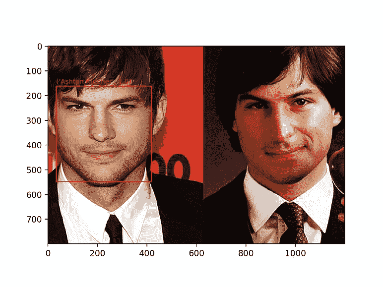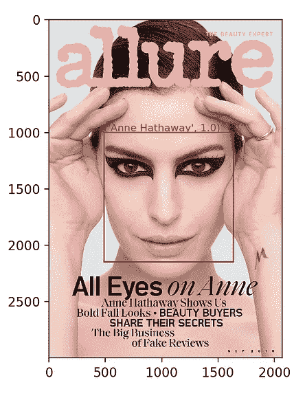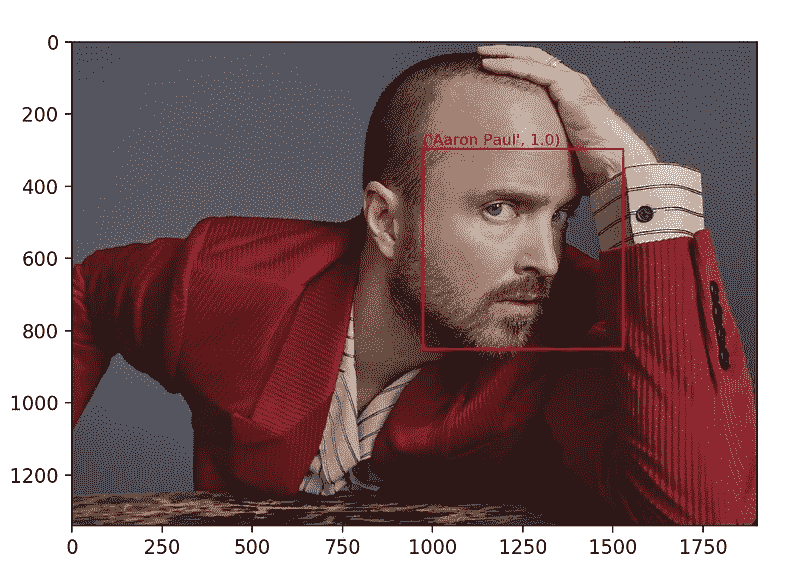

图像上的推理输出:人脸包围盒、名人姓名和置信度得分

**视频:**提取视频的关键帧，建立人脸聚类。假设视频通常包含几个人是公平的，对所有检测到的人脸进行推理在计算上将是昂贵的。添加预处理层以移除近似重复的人脸，并仅对每个聚类中距离最远的人脸对进行推断。理想情况下，即使在给定聚类中具有最大成对距离的人脸也应该产生相同的名人姓名。将所有来自不同分类的预测名称作为输出返回。

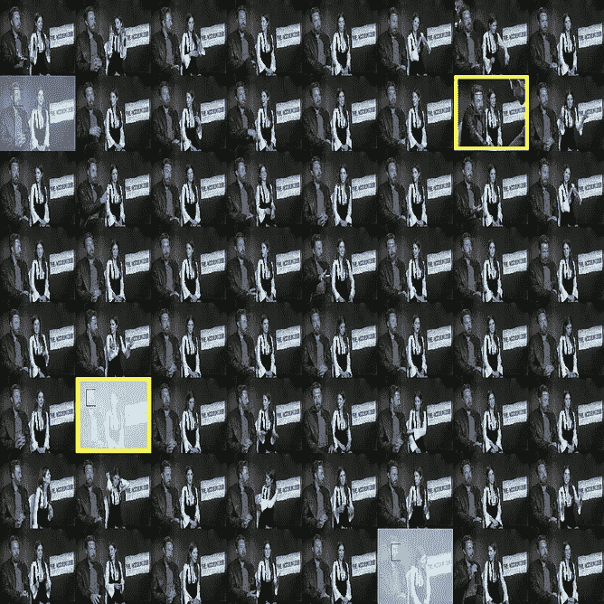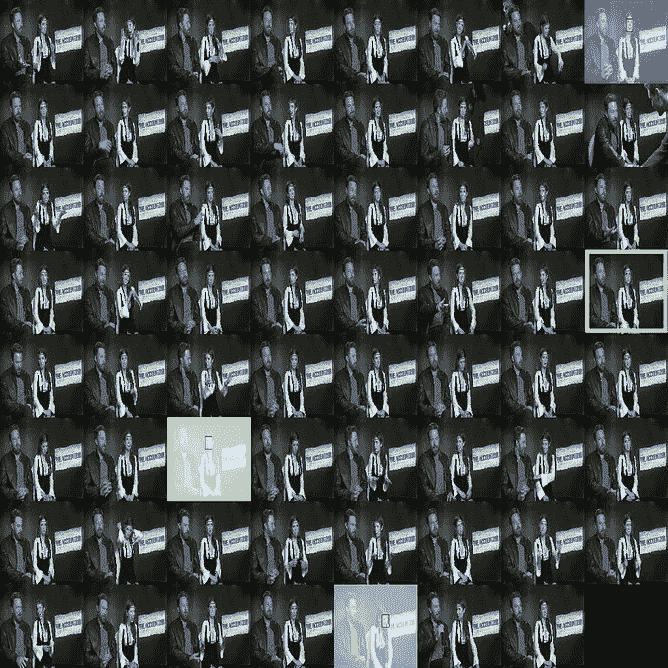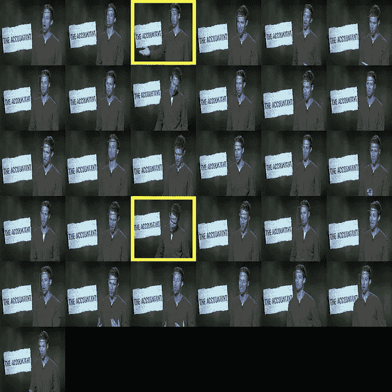

本·阿弗莱克、安娜·肯德里克和采访者集群。每个聚类中最远的人脸对用黄色标记。

## 参考

 [## 机器学习很好玩！第 4 部分:具有深度学习的现代人脸识别

### 更新:本文是系列文章的一部分。查看完整系列:第 1 部分、第 2 部分、第 3 部分、第 4 部分、第 5 部分、第 6 部分…

medium.com](/@ageitgey/machine-learning-is-fun-part-4-modern-face-recognition-with-deep-learning-c3cffc121d78)  [## 如何用深度学习-机器学习掌握进行人脸检测

### 人脸检测是一个计算机视觉问题，涉及到在照片中找到人脸。对人类来说是个微不足道的问题…

machinelearningmastery.com](https://machinelearningmastery.com/how-to-perform-face-detection-with-classical-and-deep-learning-methods-in-python-with-keras/)  [## 年龄/面部识别

### You can also read a translated version of this file in Chinese 简体中文版 or in Korean 한국어 or in Japanese 日本語. Recognise and…

github.com](https://github.com/ageitgey/face_recognition)  [## in mouse/MS-Cele b-1M _ wash list

### 这个库是一个稍微干净的 MS-Celeb-1M 的清洗列表。正如我们所知，有很多噪音在里面。对于…

github.com](https://github.com/inlmouse/MS-Celeb-1M_WashList)  [## 使用 NetworkX 进行社区检测

### 研究网络的最终目标是更好地理解它们所代表的系统的行为。对于…

orbifold.net](https://orbifold.net/default/community-detection-using-networkx/)  [## 基于 Python - PyImageSearch 的人脸聚类

### 今天这篇博文的灵感来自于 PyImageSearch 读者 Leonard Bogdonoff 的一个问题。在我发表了我以前的…

www.pyimagesearch.com](https://www.pyimagesearch.com/2018/07/09/face-clustering-with-python/)  [## Spotify/骚扰

### 是一个带有 Python 绑定的 C++库，用来搜索空间中的点…

github.com](https://github.com/spotify/annoy)