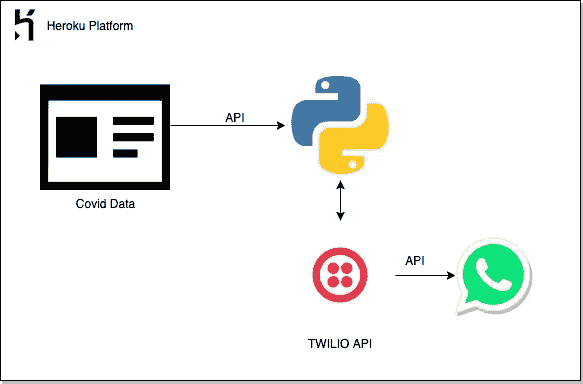
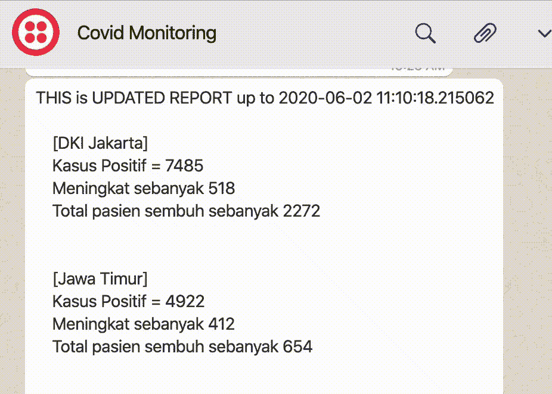
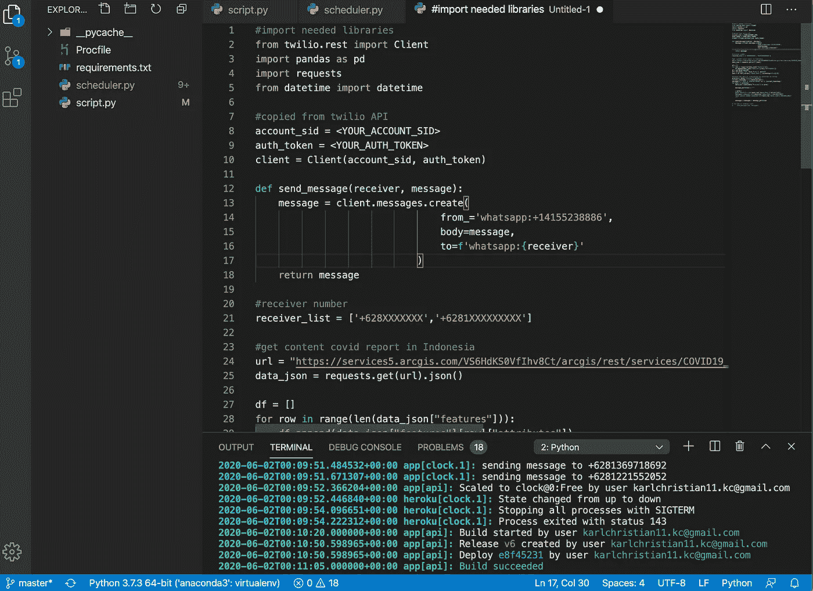
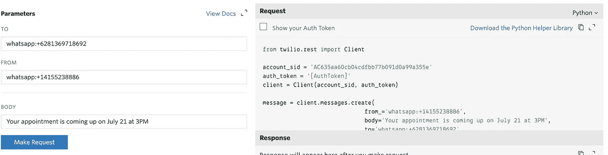
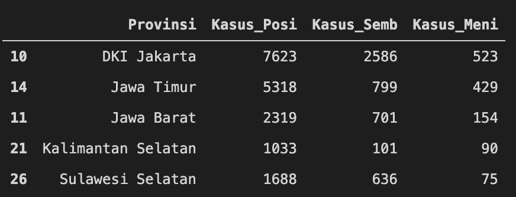
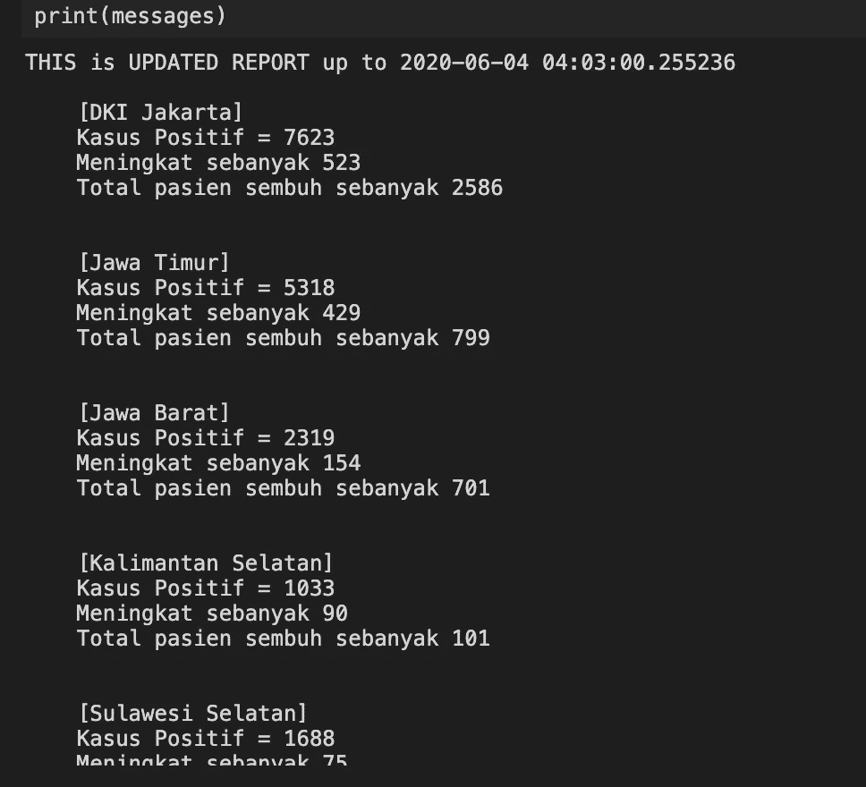
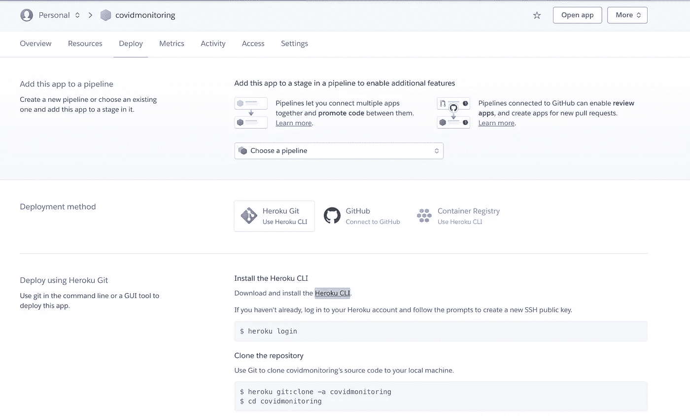
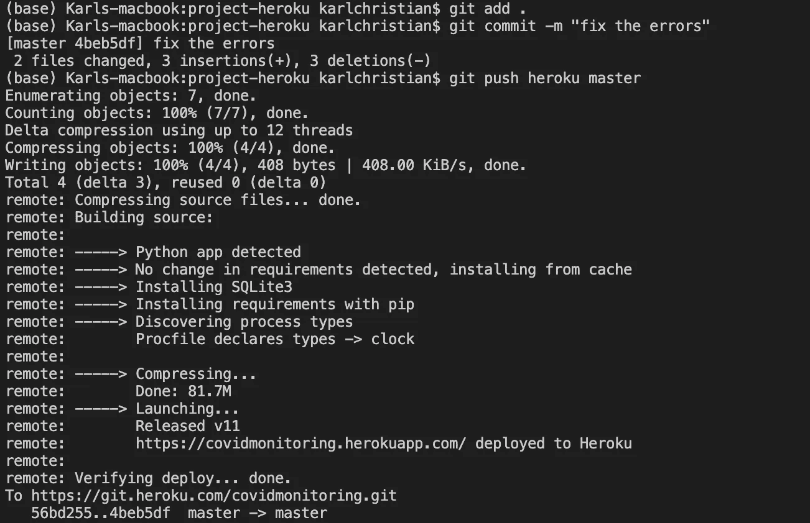

# 使用 Python 通过 WhatsApp 构建计划报告

> 原文：<https://medium.com/analytics-vidhya/building-scheduled-report-through-whatsapp-using-python-57ca704d0eb6?source=collection_archive---------5----------------------->

本着全球消灭冠状病毒疾病的努力，我想分享我们如何在几秒钟内了解在我们周围发生的事情，疫情的最新情况，以及它有多危险。



数据管道

# 剧透警报！！！

> 你们中的一些人可能已经理解了，或者你们以前做过，即使有更强大的功能，比如聊天机器人，双向信息服务，或者其他。



输出预览

☝️:这是我用 python 写了一些脚本后的感受。我觉得哇，这太神奇了，不是很难，但很有挑战性，当你理解了之后，你就可以理解很多事情了。

在这个环节中，我选择讲述一个非常温暖的新闻，这个病毒是如何改变数百万人的生活成为新常态的。

> 生活将会改变，要么接受它，要么放弃它

然而，我们应该继续下去，如果你能利用这个新常态，就像我现在做的那样，我有更多的空闲时间阅读或学习各种资料，并尝试用我的创造力来实现，那将是非常有意义的。也许以前我没有时间做这些，因为你太忙于办公室生活了(*阅读:把时间浪费在通勤上，闲聊*)。总之，感谢上帝赐予我们 WFH 的时光！

# 如何通过 WHATSAPP 创建和部署计划报告

1.  使用 [Twilio](http://twilio.com) API 访问 WhatsApp API 的后端，使您能够通过 WhatsApp 以编程方式发送消息
2.  创建一个 python 脚本来使用特定凭证访问 Twilio API，并创建对内容的 API 请求
3.  使用 cron scheduler ( [高级 Python Scheduler](https://apscheduler.readthedocs.io/en/stable/) )来安排通过 WhatsApp 发送消息
4.  在 [Heroku](https://dashboard.heroku.com/apps) (免费)云平台中构建和部署一个应用

# 什么是 TWILIO？？？

[Twilio](http://twilio.com) 是一个通信 API，建立在一些著名的聊天和信使 API 之上，如 WhatsApp、Telegram、text message 等等。

要使用(免费版)Twilio，你必须先注册并登录他们的网站:[https://www.twilio.com/try-twilio](https://www.twilio.com/try-twilio)

我已经有一个帐户，所以我会直接登录到该网站。


1.  您将看到您的仪表板，您可以转到右侧部分，单击 3 dots 按钮并转到`**Programmable** **SMS**`
2.  点击`**WhatsApp (Beta)**`
3.  你将看到如何连接特定的 WhatsApp 号码与服务器 WhatsApp 号码，除非这样做，你的 WhatsApp 号码无法在服务器端检测到

```
**THIS IS THE ONLY WAY !**in this case, the “server whatsapp” is **+1 415 523 8886** , you need to message **join spoken-dog** to that number from any whatsapp, then your number will be in the list which server can reach.
```

4.如果你已经发送了信息，等待几秒钟，它将显示`Message Received!`(这意味着你的 WhatsApp 号码已经被记录在服务器中)

5.然后您可以进入步骤`Send one way WhatsApp message`，测试您之前在服务器 WhatsApp 号码和您的号码之间建立的连接，这可以通过在那里选择 3 个选项中的 1 个来完成，然后点击`Make Request`，您的号码将收到那里所述的`BODY`的内容

6.好了，Twilio 部分已经完成了

# 编写 PYTHON 脚本…

这是这项工作的主要心脏，通过这个脚本，它应该能够自动访问和下载公共网站的内容，然后访问 Twilio API 发送消息给任何号码。

在我的例子中，你将需要一个 IDE 堆栈来跟踪你的更改和代码本身，我使用 [VScode](https://code.visualstudio.com/) ( *它是免费的、简单的、很好解释的，并且与 git 以及终端本身集成，如果你刚刚开始编码*，我向你推荐这个工具)



VS 代码预览

1.  创造`script.py`
2.  导入所有需要的库

```
from twilio.rest import Client
import pandas as pd
import requests
from datetime import datetime
```



2.连接到 Twilio API，你可以通过复制请求代码，选择 Python

```
account_sid = <your_ACCOUNT_SID> #replace this with yours
auth_token = <your_AUTH_TOKEN> #replace this with yours
client = Client(account_sid, auth_token) 

def send_message(receiver, message):
    message = client.messages.create( 
                                from_='whatsapp:+14155238886',  
                                body=message,      
                                to=f'whatsapp:{receiver}' 
                            )
    return message
```

3.我将介绍增长最快的前 5 个省份的 COVID 更新，从 [URL](https://bnpb-inacovid19.hub.arcgis.com/datasets/data-harian-kasus-per-provinsi-covid-19-indonesia) 获取数据(我需要的只是 JSON 格式的输出)

```
url = "[https://services5.arcgis.com/VS6HdKS0VfIhv8Ct/arcgis/rest/services/COVID19_Indonesia_per_Provinsi/FeatureServer/0/query?where=1%3D1&outFields=*&outSR=4326&f=json](https://services5.arcgis.com/VS6HdKS0VfIhv8Ct/arcgis/rest/services/COVID19_Indonesia_per_Provinsi/FeatureServer/0/query?where=1%3D1&outFields=*&outSR=4326&f=json)"
data_json = requests.get(url).json()df = []
for row in range(len(data_json["features"])):
    df.append(data_json["features"][row]["attributes"])
df = pd.DataFrame(df)
df = df.drop(['FID','Kode_Provi'], axis=1)
data = df.sort_values(['Kasus_Meni'], ascending=False)[:5]
```



数据帧输出

4.从干净的数据帧转换为整洁的消息

```
province = data["Provinsi"].tolist()
current_timestamp = str(datetime.now())
messages = f"THIS is UPDATED REPORT up to {current_timestamp}"
for prov in province:
    each_row = data[data["Provinsi"] == prov]message_partition = f"""[{prov}]
    Kasus Positif = {str(each_row['Kasus_Posi'].tolist()[0])}
    Meningkat sebanyak {str(each_row['Kasus_Meni'].tolist()[0])}
    Total pasien sembuh sebanyak {str(each_row['Kasus_Semb'].tolist()[0])}
    """messages = messages + message_partition
```



试映

# 构建调度程序

我将在本次会议上使用高级 python 调度程序，它只是 Python 包内的 cron 作业，您可以通过这个 [URL](https://apscheduler.readthedocs.io/en/stable/#:~:text=Advanced%20Python%20Scheduler%20(APScheduler)%20is,the%20fly%20as%20you%20please.) 来阅读和学习

1.  创建`scheduler.py`
2.  导入需要的库和`script.py`

```
from apscheduler.schedulers.blocking import BlockingScheduler
from script import *
```

3.创建您想要运行的调度程序和函数

```
scheduler = BlockingScheduler()def the_funct():
    for numb in receiver_list:
        print(f"sending message to {numb}")
        send_message(numb, messages)
```

4.添加调度程序作业并启动它(*注意，您希望在云平台中运行它，云平台的时间大部分是 UTC，因此请将您的 cron 时间作业设置为比您的预期时间早-7 小时*)

```
scheduler.add_job(the_funct, 'cron', hour=10)
scheduler.start()
```

# 通过部署实现自动化

毕竟，你以前做过，这项工作只能在你的本地机器上运行，这将需要你的笔记本电脑每次都打开，这是没有效率的。所以，这一次，我们将通过把它部署在一个在线服务器上来自动化调度程序及其功能，就像 [Heroku](https://dashboard.heroku.com/) 一样。

Heroku 是著名的云平台之一，你可以部署你内置的任何应用程序，也有免费和付费版本，但我目前只使用免费版本。

1.  你将需要创建一个帐户，并通过 Heroku 登录，只是直接谷歌它
2.  Create `requirements.txt`包含所有您使用过的包及其相关版本

```
twilio==6.41.0
pandas==0.25.3
requests==2.22.0
apscheduler==3.6.3
```

3.创建`Procfile` ( **无扩展名！！！)**、`scheduler.py`是我给调度器的脚本名，你可以改成你自己的

```
clock: python scheduler.py
```

4.只需通过步骤`Heroku CLI`使用 CLI 在 Heroku 中进行部署(*在您的终端*中复制并粘贴命令)



5.当你将 repo 推送到 Heroku git 后，Heroku 会自动编译你的代码并构建应用程序



6.瞧，完成了，你的应用程序已经内置了 Heroku，只需在你之前设定的特定时间等待你的 WhatsApp 消息

# 结论

我对这种快速而简单的解决方案很满意，虽然我知道其他一些解决方案可能可以做类似的事情(可能来自 GCP 环境中的 Airflow、composer、cloud function、cloud scheduler)，但所有这些东西都很复杂，我认为如果我们用于这个简单的任务(有时你只需要做一个简单的任务，而不是非常复杂的管道，对吗？).

仍然有很多改进的空间，我只是有一个想法如何创建一个聊天机器人，双向消息传递，所以如果用户想知道特定地区的 COVID 监控，它会自动回复该地区的更新报告，这肯定需要进一步的数据清理和升级技能。所以，每次用户发送消息，服务器都在计算并发回答案。

> 此外，你的一小部分知识是值得分享的，所以让我们分享给世界，创造影响

**完整代码，可以在本 Github 中查看(**[**https://github.com/karlchris/covidmonitoring**](https://github.com/karlchris/covidmonitoring)**)**

# 参考资料:

*   特维里奥([https://www.twilio.com/console](https://www.twilio.com/console))
*   政府 COVID 数据([https://BNP b-in acovid 19 . hub . ArcGIS . com/datasets/Data-harian-kasus-per-provinsi-新冠肺炎-印度尼西亚](https://bnpb-inacovid19.hub.arcgis.com/datasets/data-harian-kasus-per-provinsi-covid-19-indonesia))
*   Heroku 平台(【https://dashboard.heroku.com/】T2
*   AP 调度器([https://medium . com/better-programming/introduction-to-apscheduler-86337 F3 bb 4a 6](/better-programming/introduction-to-apscheduler-86337f3bb4a6))