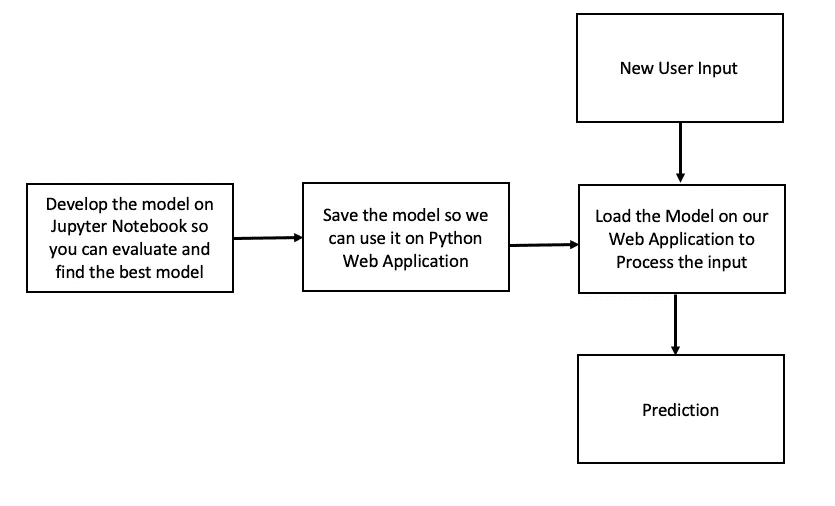
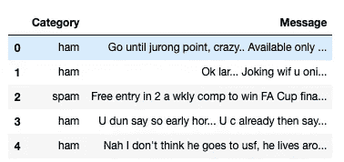
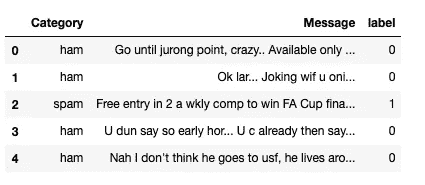
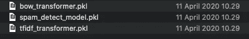
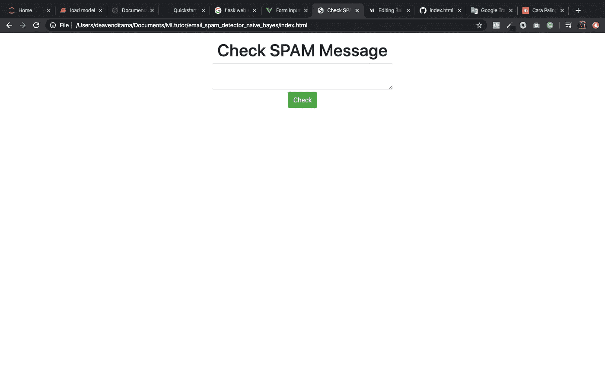
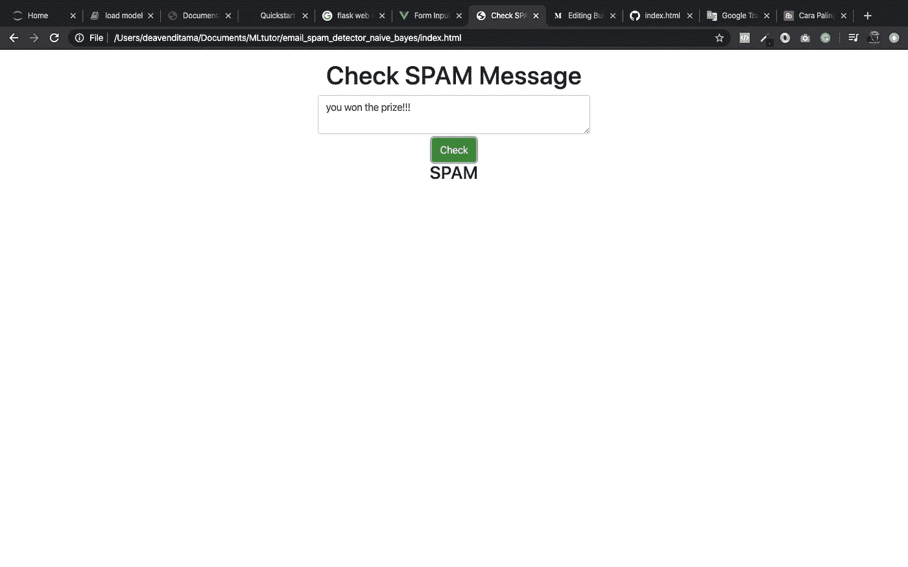
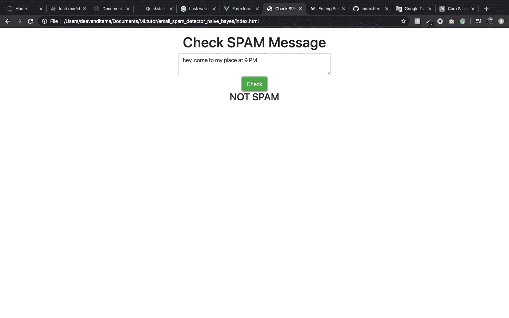

# 使用 Python 和 Vue JS 构建垃圾邮件检测器

> 原文：<https://medium.com/analytics-vidhya/building-spam-message-detector-using-python-and-vue-js-bfeabf044130?source=collection_archive---------23----------------------->


照片由[德拉诺尔 S](https://unsplash.com/@dlanor_s?utm_source=medium&utm_medium=referral) 在 [Unsplash](https://unsplash.com?utm_source=medium&utm_medium=referral)

在构建机器学习模型时，我很好奇如何在我们的 web 应用程序中实现该模型，以便用户可以与之交互。我感到有点困惑，因为我使用 Jupyter 笔记本来训练和建立模型。我当时就想，我们通过把我 Jupyter 笔记本里的所有代码复制到 Flask 或者 Django 应用上来实现机器学习模型。我必须在每个请求中将所有的数据训练成一个模型，这是非常无效的，并且使请求时间过长。

你在谷歌上搜一下怎么做，有很多教程。在做了一些试错游戏后，我明白了如何将我的机器学习模型部署到应用程序中。这是我如何做的一般基本步骤。



# 开发模型

我总是使用 Jupyter 笔记本来做一些机器学习的事情，因为我觉得用它很舒服。

首先，我们导入开发模型时需要的所有包。

我们进口什么样的包装？

1.  我正在用熊猫玩数据框。
2.  Re 用于删除所有特殊字符时的正则表达式任务。
3.  nltk 中的停用字词用于清除停用字词任务。
4.  nltk 的 PorterStemmer 用于词干分析。
5.  CountVectorizer 和 TfidfTransformer 用于将文本转换为向量，并获得单词的重要性。
6.  来自 sklearn.naive_bayes 的多项式 inb 用于使用 Naive Bayes 分类器来训练模型。
7.  评估模型时显示报告。
8.  泡菜保存模型和我们需要的其他东西。

导入上述所有包后。我们可以导入用于训练模型的数据，我使用了 Kaggle 上可用的垃圾邮件数据。

[](https://www.kaggle.com/team-ai/spam-text-message-classification) [## 垃圾短信分类

### 让我们用数据科学与恼人的垃圾邮件制造者战斗。

www.kaggle.com](https://www.kaggle.com/team-ai/spam-text-message-classification) 

确保您的 Jupyter 笔记本工作表与 CSV 文件在同一个文件夹中，如果不在同一个文件夹中，请给出正确的路径。

我们将 CSV 文件导入到 df 变量中。您可以使用 df.head()检查数据是否被导入



我做了一个名为 preprocess_text 的函数，用于删除所有特殊字符，删除所有停用词，并对文本消息数据执行词干提取任务。

我还在一个名为“标签”的新列中将类别映射为 1 和 0，1 表示垃圾邮件，0 表示非垃圾邮件。



接下来，我们将我们的消息转换为*词频-逆文档频率(tf-idf)，tf-idf* 用于对我们消息列中的每个词进行加权，重要与否基于 tf-idf 算法(阅读更多关于[http://www.tfidf.com/](http://www.tfidf.com/))。

要将消息转换为 tf-idf 形式，首先，我们将其转换为一个单词包模型(更多信息请访问[https://medium . com/grey atom/an-introduction-to-bag-of-words-in-NLP-AC 967d 43 b 428](/greyatom/an-introduction-to-bag-of-words-in-nlp-ac967d43b428))。

现在，让我们使用 tf-idf 形式的消息来构建模型。

最后一步，当我们构建模型时，我们使用 pickle 转储我们的单词包 transformer、tf-idf transformer 和我们的模型，我们转储/导出所有这些，因为我们希望在应用程序中使用它们，而无需重新训练所有数据来预测一个输入。



# 使用 Python Flask Web 框架开发后端

我用烧瓶是因为它很轻。我认为如果我用 Django 来为这个教程构建一个简单的后端，那就太过了。

这是我们的后端代码，你应该先安装 flask，并使用 pip 安装 flask_cors。

在第 11–13 行有加载或导入我们之前保存的 pickle 文件的语法。所以我们不需要重新训练模型来得到结果。

第 31–39 行有函数 preprocess_text，这是我们在构建模型时使用的相同代码。我们再次使用它，因为我们需要在预测结果之前清理用户输入的文本。

在第 22–29 行有一个函数定义了我们的服务，它从用户输入中获取请求，处理它，预测结果，并以 JSON 格式发送回前端。

# 使用 Vue Javascript 框架开发前端

现在我们将使用 Vue Js 为用户输入编写一个简单的 web 前端。这是代码，你可以复制粘贴并保存为 index.html。我是用 CDN 加载 Vue 包的，不用担心 Vue 的安装之类的事情。

下面是对上述代码的简单解释

1.  Textarea 是一个输入我们想要预测的信息的地方。
2.  按钮检查将触发 checkMessage 功能。
3.  名为 checkMessage 的函数将获取消息数据，构建 URL 并将数据传递到我们的后端。
4.  我们的后端将用包含预测结果的 JSON 文件来响应。是代表非垃圾邮件的[零](https://gist.github.com/DeaVenditama/16f3048e8c22a1522faa6c033f846952)，还是代表垃圾邮件的**一**。
5.  根据结果值更新/显示输出。

# **运行应用程序**

1.  运行我们的 flask 应用程序。

```
$ export FLASK_APP=app.py
$ flask run
```

输出

```
Serving Flask app "app.py"
 * Environment: production
   WARNING: Do not use the development server in a production environment.
   Use a production WSGI server instead.
 * Debug mode: off
 * Running on [http://127.0.0.1:5000/](http://127.0.0.1:5000/) (Press CTRL+C to quit)
```

2.**在浏览器上打开我们的 index.html 文件。**



用我们想要预测它是否是垃圾邮件的信息填充文本区域，然后点击检查。

邮件是垃圾邮件时的结果



当邮件不是垃圾邮件时的结果



这就是本教程的全部内容

我推荐你在这个链接上阅读更多关于 Flask 和 Vue 的内容。

1.  flask([https://flask . pallets projects . com/en/1.1 . x/quick start/# a-minimal-application](https://flask.palletsprojects.com/en/1.1.x/quickstart/#a-minimal-application))
2.  威([https://vuejs.org/](https://vuejs.org/))

如果你想要完整的源代码，你可以看看我的 Github

[](https://github.com/DeaVenditama/spam_detector_app) [## DeaVenditama/垃圾邮件检测器应用程序

### 在 GitHub 上创建一个帐户，为 DeaVenditama/spam_detector_app 开发做贡献。

github.com](https://github.com/DeaVenditama/spam_detector_app) 

谢谢你。