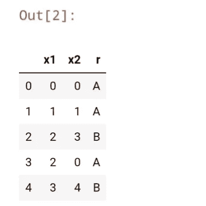
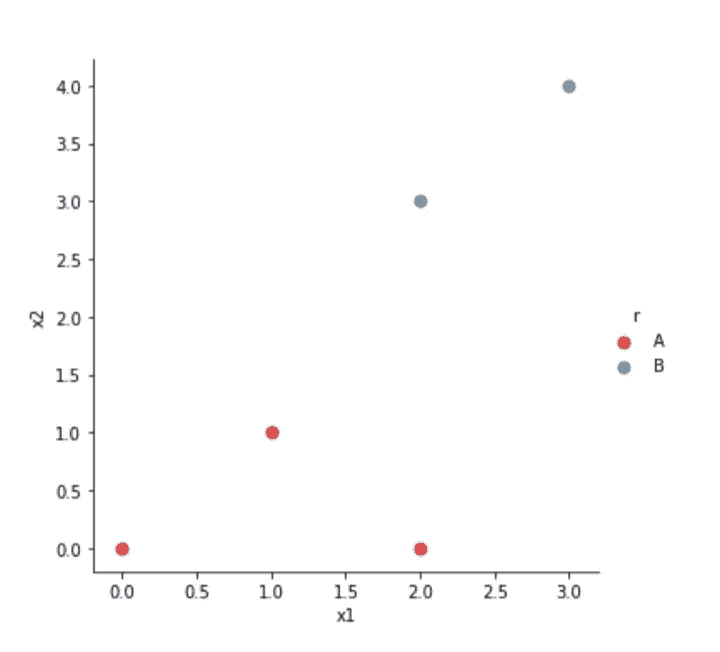
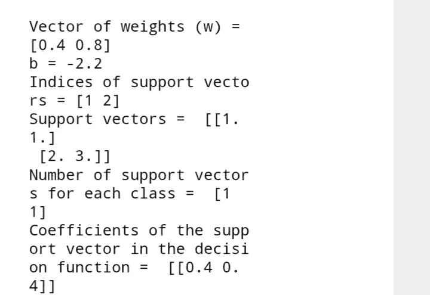
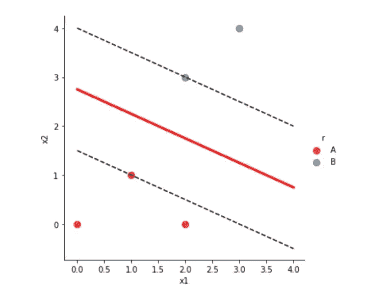

# 从头开始构建支持向量机算法

> 原文：<https://medium.com/analytics-vidhya/building-support-vector-machines-from-algorithm-scratch-a4b19368a64b?source=collection_archive---------8----------------------->

*支持向量机是一种监督学习模型，其算法用于分类和回归分析。它是非概率性的，这意味着数据中的点被分配到类别中。*


照片由[克里斯里德](https://unsplash.com/@cdr6934?utm_source=medium&utm_medium=referral)在 [Unsplash](https://unsplash.com?utm_source=medium&utm_medium=referral) 上拍摄

阿尔伯特·爱因斯坦曾经说过:

# “如果你不能简单地解释它，你就不够了解它。”

# **支持向量机算法是如何工作的？**

也许你想知道，当我可以简单地用 Scikit-learn 实现支持向量机时，知道它如何工作真的很重要吗？

答案是肯定的，是。了解其工作原理将有助于您诊断和调整模型，以获得准确和精确的结果。

在本文中，我们将一步一步地介绍 SVM 的算法。我们将使用一个名为“ **Data.csv** ”的数据集。

首先，您必须导入您的库(numpy、pandas、matplotlib 和 seaborn)。

```
import numpy as npimport pandas as pdimport matplotlib.pyplot as pltimport seaborn as sns 
```

另外，让我们使用以下代码片段加载数据集:

```
data = pd.read_csv(“Data.csv”)
data. head() #displays the first few rows and columns of the data
```



在这种情况下，有 3 列，点被分组为“A”或“B”

然后，可以使用 Seaborn 中的 lmplot 函数可视化这些数据。

```
sns.lmplot(’x1’, 'x2’, data = data, 
           hue = 'r’, palette = 'Set1’, fit_reg = False, scatter_kws = {"s" :50})
plt.show() 
```



然后，您可以使用 Scikit-learn svm 分类器来计算算法中所需的值。

超平面的公式是:

f(x) =W₀x + W₁y + b，其中 W₀和 W₁是向量的权重，b 是偏差。

超平面是一个子空间，它的维数比其周围空间的维数小一。如果空间是三维的，那么它的超平面就是二维平面，而如果空间是二维的，那么它的超平面就是一维直线。


本·穆林斯在 [Unsplash](https://unsplash.com?utm_source=medium&utm_medium=referral) 上的照片

我们使用的内核是线性的。当使用线性核时，假设数据是线性可分的。

SVC 分类器被实例化为 clf。

```
from sklearn import svm
points = data[[‘x1’, ‘x2’]].valuesresult = data[‘r’] 
clf = svm.SVC(kernel = ‘linear’) 
clf.fit(points,result)print(f“Vector of weights (w) =  {clf.coef_[0]})
print(f“b = {clf.intercept_[0]}”)
print(f“Indices of support vectors = {clf.support_}”)
print(f “Support vectors =  {clf.support_vectors_}”) 
print(f“Number of support vectors for each class = {clf.n_support_}”) 
print(f“Coefficients of the support vector in the decision function = {np.abs(clf.dual_coef_)}”) 
```

您将获得以下输出



要绘制超平面，您必须为向量的权重分配一个标识符，并找到超平面的斜率。超平面在(-b/W₀,0)处与 x 轴相交，在(0,-b/W₁).)处与 y 轴相交因此对于斜率，你将获得-(W₀/W₁).数学然后被翻译成代码，如下所示:

```
w = clf.coef_[0] #weight of vector
slope = -w[0] / w[1]
b = clf.intercept_[0] 
```

从 0 到 4 的值被用作 x 坐标，并找到相应的 y 值。

注意:y = mx + c，其中 m 是你的斜率，所以对于 x 的每一个值，你都找到一个对应的 y 值。

```
#coordinates of the hyperplane 
xx = np.linspace(0, 4)
yy = slope * xx - (b / w[1])
```

以下代码片段是第一个支持向量的等式:

```
#plotting the margins
s = clf.support_vectors_[0] 
yy_below = slope * xx + (s[1] - slope * s[0])
```

这也是第二个支持向量的等式:

```
# last support vector
s1 = clf.support_vectors_[-1]
yy_above = slope * xx + (s1[1] - slope * s1[0]) 
```

数据中的点也用以下代码绘制:

```
sns.lmplot(‘x1’,‘x2’, data = data, hue=‘r’, 
           palette = 'Set1’, 
           fit_reg = False, 
           scatter_kws={’s' : 70})
```

最后，我们画出超平面和两个边界或支持向量。

```
 #plotting the hyperlane 
plt.plot(xx, yy, linewidth = 3, color = 'red’) 
#plotting the two margins 
plt.plot(xx, yy_below, 'k--’) 
plt.plot(xx, yy_above, 'k--’)
```



也可以使用 clf.predict()进行预测。

因此，基本上我们可以得出结论，支持向量机算法通过将数据点分组来对其进行分类。

但是我们的数据并不总是可以线性分离的。这样你就必须添加一个内核技巧。内核技巧是通过添加一个第三维空间来实现的，这样类之间的划分界限就很明显了。

要添加第三维，请使用以下公式

z = x + y

整个代码片段:

```
import numpy as np 
import pandas as pd
import matplotlib.pyplot as plt 
import seaborn as sns
data = pd.read_csv (‘Data.csv’)
sns.lmplot(‘x1’, ‘x2’,
           data = data, 
           hue = ‘r’, 
          palette = ‘Set1’, 
           fit_reg = False, 
           scatter_kws = {"s" :50})
plt.show() 
#importing svm
from sklearn import svm
#converting columns as matrices
#formula for the hyperplane
#g(x) =W⃗₀x+ W⃗₁y + b
points = data[[’x1’,’x2’]].values
result = data[‘r’] 
clf = svm.SVC(kernel = ‘linear’) 
clf.fit(points,result)
print(f“Vector of weights (w) =  {clf.coef_[0]})
print(f“b = {clf.intercept_[0]}”)
print(f“Indices of support vectors = {clf.support_}”)
print(f “Support vectors =  {clf.support_vectors_}”) 
print(f“Number of support vectors for each class = {clf.n_support_}”) 
print(f“Coefficients of the support vector in the decision function = {np.abs(clf.dual_coef_)}”) 
#plotting the hyperplane 
w = clf.coef_[0] #weight of vector
slope = -w[0] / w[1]
b = clf.intercept_[0]
#coordinates of the hyperplane 
xx = np.linspace(0, 4)
yy = slope * xx - (b / w[1]) 
#plotting the margins
s = clf.support_vectors_[0] #first support vector 
yy_below = slope * xx + (s[1] - slope * s[0])
# last support vector
s1 = clf.support_vectors_[-1]
yy_above = slope * xx + (s1[1] - slope * s1[0])
#plotting the points 
sns.lmplot(‘x1’, ‘x2’, data = data, hue=’r’, 
           palette = 'Set1’, 
           fit_reg = False, 
           scatter_kws={‘s' : 70})
#plotting the hyperlane 
plt.plot(xx, yy, linewidth = 3, color = 'red’) 
#plotting the two margins 
plt.plot(xx, yy_below, ‘k--’) 
plt.plot(xx, yy_above, ‘k--’)
```

[1]https://en.m.wikipedia.org/wiki/Hyperplane

[2]李伟孟，Python 机器学习(2019)，威利在线图书

我非常感谢迈克·夸布斯和 T2·里士满·阿切姆庞帮助我改正了这篇文章中的错误。