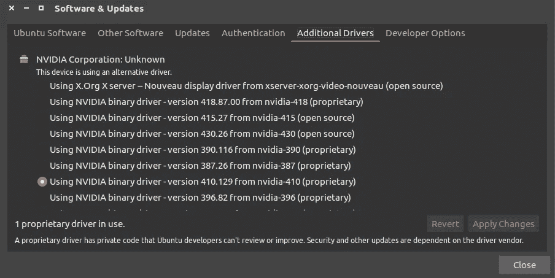

# 在 Ubuntu 16.04 LTS 版上使用 GPU 支持和 TensorRT 构建 Tensorflow 1.14

> 原文：<https://medium.com/analytics-vidhya/building-tensorflow-1-14-with-gpu-support-and-tensorrt-on-ubuntu-16-04-84bbd356e03?source=collection_archive---------2----------------------->


我和我的 Ubuntu 的关系有点奇怪。我很乐意告诉你一切，但事实是我甚至不知道那是什么。我只看到了后果…灾难性的后果。我们都说了一些我们不想说的话，但我想这是因为我和 TensorFlow 的事情。我猜他们还没准备好通奸。😐

这是我在过去两个月中第三次安装 TensorFlow，我是那些希望自己的机器最好的人之一，所以我不能接受更低的价格。我已经尝试过这个过程很多次了，所以我决定写一篇文章给那些正在努力维持他们的关系的人。).

*要在 Ubuntu 18.04 LTS 上构建有 GPU 支持和 TensorRT 的 Tensorflow 2.0，按照这个* [*链接*](/@shivam.iitmandi/building-tensorflow-2-0-with-gpu-support-and-tensorrt-on-ubuntu-18-04-lts-part-1-e04ce41f885c) *。*

好吧，那么我们需要什么？

*   CUDA 10.0(针对 Tensorflow ≥ 1.13.0)
*   NVIDIA GPU 驱动(CUDA 10.0 要求≥ 410.x)
*   cuDNN SDK (≥ 7.4.1)
*   CUPTI(附带 CUDA 工具包)
*   Bazel (0.24.1 ≤版本≤ 0.26.1)

我们可以开始了吗？

我会分段写下步骤，让过程更简洁，更切题。

# 更新和升级您的系统。

```
$ sudo apt-get update$ sudo apt-get upgrade
```

# 验证您是否拥有支持 CUDA 的 GPU。

```
$ lspci | grep -i nvidia
```

***lspci*** 命令返回系统上安装的所有硬件的列表。使用***grep |-I nvidia***只会返回你的 NVIDIA 硬件的名称。记下名称，并在[http://developer.nvidia.com/cuda-gpus](https://developer.nvidia.com/cuda-gpus)检查您的 GPU 是否支持 CUDA。

如果有，记下它的计算能力。

# 移除任何现有或先前安装的 CUDA

```
$ sudo apt-get purge nvidia*$ sudo apt-get autoremove$ sudo apt-get autoclean$ sudo rm -rf /usr/local/cuda*
```

第一个命令将卸载安装在您系统上的 nvidia 驱动程序。我们稍后会安装兼容的。第二个和第三个是删除无用和不必要的文件，这些文件是作为其他包的依赖项安装的，但不再需要。最后一个命令将删除包含 CUDA 的文件夹。

# 为 Ubuntu 16.04 安装 CUDA 10.0

不要安装 CUDA-10.1。Tensorflow 尚未与最新版本兼容。

```
$ sudo apt-get install gnupg-curl
```

这将有助于使用任何支持的协议在服务器之间传输数据。

```
$ wget https://developer.download.nvidia.com/compute/cuda/repos/ubuntu1604/x86_64/cuda-repo-ubuntu1604_10.0.130-1_amd64.deb
```

这将从服务器下载 CUDA 10.0。

```
$ sudo dpkg -i cuda-repo-ubuntu1604_10.0.130-1_amd64.deb$ sudo apt-key adv --fetch-keys https://developer.download.nvidia.com/compute/cuda/repos/ubuntu1604/x86_64/7fa2af80.pub
```

***dpkg*** 命令用于安装*。Ubuntu 上的 deb* 文件。第一个命令将为以后的安装添加 CUDA 10.0。第二个命令是添加存储库密钥。

```
$ sudo apt-get update
```

更新您的套餐列表。

```
$ wget [http://developer.download.nvidia.com/compute/machine-learning/repos/ubuntu1604/x86_64/nvidia-machine-learning-repo-ubuntu1604_1.0.0-1_amd64.deb](http://developer.download.nvidia.com/compute/machine-learning/repos/ubuntu1604/x86_64/nvidia-machine-learning-repo-ubuntu1604_1.0.0-1_amd64.deb)$ sudo apt install ./nvidia-machine-learning-repo-ubuntu1604_1.0.0-1_amd64.deb
```

下载并添加 tensorflow 所需的 NVIDIA 机器学习工具。

```
$ sudo apt-get update$ reboot
```

更新并重启系统。

## 安装所需的 NVIDIA 驱动程序。**

CUDA 不会安装，除非你的系统有你的 GPU 所需的 NVIDIA 驱动程序。通过 PPA 安装它。

```
$ sudo add-apt-repository ppa:graphics-drivers/ppa$ sudo apt-get update
```

进入 Ubuntu 中的**附加驱动**窗口，选择首选驱动，然后应用这些更改。重新启动系统以加载驱动程序。

*** **重要** ***

驱动的选择取决于你的系统和 Ubuntu 内核版本。**附加驱动程序**窗口会显示许多选项，如下所示:



现在，你可能会尝试安装最新的版本，但这可能会导致某些并发症，比如，屏幕变暗或重启后无法启动到 Ubuntu。为了避免这种情况，我推荐使用 NVIDIA-410.x 。我试过更高的版本，但它们不适合我的系统。还有，NVIDIA-410.x 工作起来像个魔咒！

# 最后安装 CUDA 10.0，cuDNN SDK，CUPTI，TensorRT

```
$ sudo apt-get install --no-install-recommends \
    cuda-10-0 \
    libcudnn7=7.6.2.24-1+cuda10.0  \
    libcudnn7-dev=7.6.2.24-1+cuda10.0 $ export LD_LIBRARY_PATH=$LD_LIBRARY_PATH:/usr/local/cuda/extras/CUPTI/lib64$ sudo apt-get install -y --no-install-recommends libnvinfer5=5.1.5-1+cuda10.0 \
    libnvinfer-dev=5.1.5-1+cuda10.0
```

这将最终在您的系统上安装 CUDA 10.0、cuDNN SDK 7.6.2、CUPTI 和 TensorRT。

# 将安装目录的路径添加到 PATH 变量中

将最近安装的文件的路径添加到 PATH 变量中，这样它就知道在需要时在哪里可以找到它们。

```
$ echo 'export PATH=/usr/local/cuda-10.0/bin${PATH:+:${PATH}}' >> ~/.bashrc$ echo 'export LD_LIBRARY_PATH=/usr/local/cuda-10.0/lib64${LD_LIBRARY_PATH:+:${LD_LIBRARY_PATH}}' >> ~/.bashrc
```

这些命令会将路径添加到 PATH 变量中。

```
$ source ~/.bashrc$ sudo ldconfig
```

重新加载并更新 *bashrc* 文件。重启系统。

# 验证 CUDA 10.0、cuDNN 和 TensorRT 的安装。

## CUDA 10.0 的验证:

```
$ cuda-install-samples-10.0.sh ~$ cd ~/NVIDIA_CUDA-10.0_Samples/5_Simulations/nbody$ make$ ./nbody
```

这些命令将安装 CUDA 10.0 示例并运行其中一个。如果你看到某种动画，那么你的 CUDA 10.0 工作得非常好。

## cuDNN 7.6.2 的验证:

```
$ whereis cudnn.h
```

这将返回 **cudnn.h** 文件的位置。记下来。姑且称之为 **${CUDNN_H_PATH}** 。

```
$ cat ${CUDNN_H_PATH} | grep CUDNN_MAJOR -A 2
```

它应该会返回如下内容:

```
#define CUDNN_MAJOR **7**
#define CUDNN_MINOR **6**
#define CUDNN_PATCHLEVEL **2**
--
#define CUDNN_VERSION (CUDNN_MAJOR * 1000 + CUDNN_MINOR * 100 + CUDNN_PATCHLEVEL)#include "driver_types.h"
```

## TensorRT 的验证:

```
$ dpkg -l | grep nvinfer
```

这应该会返回如下内容:

```
ii  libnvinfer-dev                                  5.1.5-1+cuda10.0                              amd64        TensorRT development libraries and headers
ii  libnvinfer5                                     5.1.5-1+cuda10.0                              amd64        TensorRT runtime libraries
```

# 安装依赖项

```
$ pip3 install -U --user pip six numpy wheel setuptools mock$ pip3 install -U --user keras_applications==1.0.6 --no-deps$ pip3 install -U --user keras_preprocessing==1.0.5 --no-deps
```

如果在虚拟环境中安装，则省略`--user` 。

# 使用 bazel build 从源代码构建 Tensorflow 1.14

## 下载并安装 Bazel:

从 https://github.com/bazelbuild/bazel/releases 下载巴泽尔。我用过 **0.25.0** 。

```
$ cd ~/ # My bazel file was in $HOME$ chmod +x bazel-0.25.0-installer-linux-x86_64.sh$ ./bazel-0.25.0-installer-linux-x86_64.sh --user
```

这将在您的系统上安装 bazel。现在将其路径添加到 path 变量中。

```
$ echo 'export PATH="$PATH:$HOME/bin"' >> ~/.bashrc^C$ source ~/.bashrc$ sudo ldconfig
```

## 克隆 Tensorflow 存储库:

```
$ git clone https://github.com/tensorflow/tensorflow.git
```

克隆完成后，将目录更改为 tensorflow，并签出到版本分支。

```
$ cd tensorflow$ git checkout r1.14
```

## 配置版本:

是时候配置构建并决定赋予 tensorflow 的特性了。

```
$ ./configure
```

这将在终端上加载一个参数解析器，询问路径和特性。像这样:

```
Please specify the location of python. [Default is /usr/bin/python]: /usr/bin/python3Do you wish to build TensorFlow with Apache Ignite support? [Y/n]: YDo you wish to build TensorFlow with XLA JIT support? [Y/n]: YDo you wish to build TensorFlow with OpenCL SYCL support? [y/N]: N

Do you wish to build TensorFlow with ROCm support? [y/N]: N

Do you wish to build TensorFlow with CUDA support? [y/N]: Y
```

它会自动检测到 CUDA、cuDNN 和 TensorRT 的路径。

```
Do you wish to build TensorFlow with TensorRT support? [y/N]: YEnter the compute capability to use. Please note that each additional compute capability significantly increases your build time and binary size. [Default is: 5.0] {**Enter the compute capability noted before**}Do you want to use clang as CUDA compiler? [y/N]: NPlease specify which gcc should be used by nvcc as the host compiler. [Default is /usr/bin/gcc]: /usr/bin/gccDo you wish to build TensorFlow with MPI support? [y/N]: N

Please specify optimization flags to use during compilation when bazel option "--config=opt" is specified [Default is -march=native]: -march=native

Would you like to interactively configure ./WORKSPACE for Android builds? [y/N]:N
```

这将配置构建。

## 开始构建过程:

Building 将创建一个稍后安装的 tensor flow pip 包。

```
$ bazel build --config=opt --config=cuda //tensorflow/tools/pip_package:build_pip_package
```

***旁注***

```
add "--config=mkl" if you want Intel MKL support for newer intel cpu for faster training on cpu

add "--config=monolithic" if you want static monolithic build (try this if build failed)

add "--local_resources 2048,.5,1.0" if your PC has low RAM causing Segmentation fault or other related errors
```

这个过程需要很长时间。大概 2-3 个小时。因此，等待和期待任何建设失败，他们应该来了。如果发生这种情况，请查看其背后的错误，并使用 Google 查找解决方案。如果你不明白或者在 Google 上找不到解决方案，那么使用以下命令关闭 bazel 本地服务器:

```
$ bazel clean --expunge
```

并再次运行构建过程。我成功了两次。

## 构建 tensorflow 的 whl 文件进行安装:

```
$ bazel-bin/tensorflow/tools/pip_package/build_pip_package tensorflow_pkg
```

## 用 pip 安装 Tensorflow:

如果不使用虚拟环境:

```
$ cd tensorflow_pkg$ pip3 install tensorflow*.whl
```

对于虚拟环境:

```
$ sudo apt-get install virtualenv$ virtualenv tf_1.14_cuda10.0 -p /usr/bin/python3$ source tf_1.14_cuda10.0/bin/activate$ pip3 install tensorflow*.whl
```

## 验证 Tensorflow 安装:

```
$ python3

>>> import tensorflow as tf>>> hello = tf.constant('Hello, TensorFlow!')>>> sess = tf.Session()>>> print(sess.run(hello))
```

如果系统输出结果，那么万岁！您已经准备好使用 Tensorflow 了。

# 我们完事了。！！

****** 我之所以在 CUDA 之后安装 NVIDIA 驱动，是因为出于某种原因反其道而行之安装了 CUDA 10.1 而不是 CUDA 10.0，并且默认情况下我的系统开始使用 NVIDIA-418.x 驱动。如果你发现了问题，告诉我！

就这样吧！非常感谢你一路向下滚动。希望这篇文章对你有用。这是我的第一篇文章，希望继续写下去。谢谢大家！爱你 Tensorflow！

一路平安！

【https://www.tensorflow.org/install/gpu】Ref:T4

[https://www.tensorflow.org/install/source](https://www.tensorflow.org/install/source)

[https://www.pytorials.com](https://www.pytorials.com/)