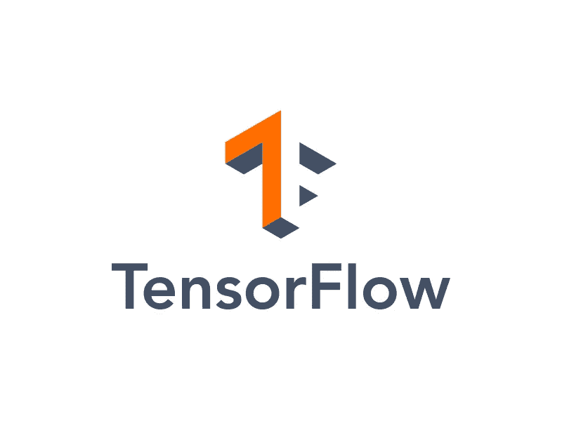

# 在 Ubuntu 18.04 LTS 上使用 GPU 支持和 TensorRT 构建 Tensorflow 2.0 第 1 部分]

> 原文：<https://medium.com/analytics-vidhya/building-tensorflow-2-0-with-gpu-support-and-tensorrt-on-ubuntu-18-04-lts-part-1-e04ce41f885c?source=collection_archive---------6----------------------->



有一次，我发现自己站在一条分成两条路的路上:Tensorflow 还是 Pytorch？和几乎任何其他生活选择一样，这也有它自己的不确定性、确定性和满足感。我选择了我内心呼唤的那条路…它让一切都变得不同。

我不否认安装 Tensorflow 可能是一件痛苦且极其麻烦的事情，尤其是如果我们不知道我们的目标是什么，而我们几乎从来不知道。然而由于某些原因(灵活性和控制是两个最突出的原因)，我总是喜欢从源代码构建张量流。这正是本文所要讨论的。由于这是一个漫长的过程，我决定将其分为两部分，内容分配如下:

**Part 1:** [安装 NVIDIA 驱动、CUDA、cuDNN](/@shivam.iitmandi/building-tensorflow-2-0-with-gpu-support-and-tensorrt-on-ubuntu-18-04-lts-part-1-e04ce41f885c) 。

**第二部分:** [安装 TensorRT 和 Tensorflow](/@shivam.iitmandi/building-tensorflow-2-0-with-gpu-support-and-tensorrt-on-ubuntu-18-04-lts-part-2-ff2b1482c0a3) 。

*在 Ubuntu 16.04 上构建有 GPU 支持的 Tensorflow 1.14 和 TensorRT，请参考此* [*链接*](/analytics-vidhya/building-tensorflow-1-14-with-gpu-support-and-tensorrt-on-ubuntu-16-04-84bbd356e03) *。*

**要求:**

*   CUDA = 10.0
*   NVIDIA GPU 驱动(= 410.x)
*   cuDNN SDK (= 7.3.1)
*   CUPTI(附带 CUDA 工具包)
*   坦索特(= 5.0)
*   巴泽尔
*   Python (2.7，3.5 — 3.7) [Tensorflow 2.1 是支持 Python 2 的最后一个版本]
*   pip(版本≥ 19.0)

# 第一步:更新和升级你的系统。

```
$ sudo apt-get update$ sudo apt-get upgrade
```

# 步骤 2:确认你有支持 CUDA 的 GPU。

```
$ lspci | grep -i nvidia
```

***lspci*** 命令返回系统上安装的所有硬件的列表。使用 ***grep -i nvidia*** 只返回 nvidia 驱动的名称。记下名称，并在[http://developer.nvidia.com/cuda-gpus.](http://developer.nvidia.com/cuda-gpus.)检查您的 GPU 是否支持 CUDA

如果有，记下它的计算能力。以后会需要的。

# 第 3 步:删除任何现有的或以前安装的 CUDA 以及 NVIDIA 显卡驱动程序。

```
$ sudo apt-get --purge remove "*cublas*" "cuda*" "nvidia-cuda*"$ sudo rm -rf /usr/local/cuda*$ sudo apt-get --purge remove "*nvidia*"$ sudo apt-get autoremove$ sudo apt-get autoclean
```

前两个命令将分别删除所有 cuda 文件和文件夹。第三个命令是卸载安装在您系统上的 nvidia 驱动程序，稍后将替换为兼容的驱动程序。最后两个命令用于删除不合适的和不必要的文件，这些文件是作为这个包的依赖项安装的，但不再需要。

# 步骤 4:安装所需的 NVIDIA 驱动程序。**

在安装 CUDA 之前，您需要在您的机器上安装兼容版本的 NVIDIA 驱动程序。有两种安装驱动程序的方法:

## 通过图形用户界面安装:

点击键盘上的 **Windows** 键，搜索**软件和更新**。打开后，进入选项卡**下的附加驱动**，如下图所示:


让它获取与您的系统兼容的可用 NVIDIA 驱动程序的信息。完成后，从列表中选择所需的驱动程序，并点击**应用更改**。

现在重启。

## 通过命令行安装:

```
$ sudo add-apt-repository ppa:graphics-drivers/ppa$ sudo apt-get update
```

第一个命令是添加 Ubuntu 图形驱动程序的规范包。第二个是用最近添加的驱动程序包重新加载包管理器。

现在，您必须在安装最新驱动程序或特定版本之间做出选择。选择取决于您的系统、Ubuntu 内核版本和项目的目标(CUDA 10.0 不支持≤ 410.x 的版本)。

不建议安装最新的驱动程序，因为这个 PPA 还在测试中。有时你可能会遇到依赖问题。我个人面临一些复杂的问题，比如没有显示，重启后无法进入 Ubuntu，等等。

> 要安装最新的驱动程序:

```
$ sudo ubuntu-drivers devices$ sudo ubuntu-drivers autoinstall
```

第一个命令列出了两种图形硬件的可用驱动程序，即 Intel 和 NVIDIA(或 AMD？但从未尝试过 AMD)。


第二个命令为所有图形设备安装最新的驱动程序(或推荐的驱动程序)。

> 要安装特定版本:

```
$ sudo apt install nvidia-${version_number}
```

用所需版本替换**$ {版本号}** 。

重启。

****** 如果您选择使用 *runfile* 安装方法安装 CUDA，可以跳过这一步。详见**步骤 5** 下**选择安装方法**。

## 验证 NVIDIA 图形驱动程序的安装:

> 方法 1:

```
$ nvidia-smi | grep "Driver Version" | awk '{print $6}' | cut -c1-
```

如果该过程成功，将会打印安装的驱动程序版本。

> 方法二:

转到**设置>细节**，然后检查**图形**查询的条目。如果它显示某个 NVIDIA 驱动程序，则该驱动程序安装成功。


> 方法三:

```
$ prime-select query
```

**prime** 是一个 NVIDIA 命令，用于在英特尔和 NVIDIA 图形驱动程序之间切换。上面的命令显示了正在使用的驱动程序的名称。如果输出是 ***nvidia*** ，那么驱动安装成功。

# 步骤 5:安装所需的 CUDA 版本。

## 安装前步骤:

*   **验证您的系统已经安装了*gcc*:**

```
$ gcc --version
```

该命令返回安装在您系统中的 **gcc** 的版本。虽然 Tensorflow 文档要求 gcc 版本为 7.3.1，但它在使用 bazel 构建 pip 包时给了我一个编译错误。我做了任何程序员都会做的事，我谷歌了一下。我发现这个问题在更高版本的 gcc 中依然存在。我不确定它与哪个版本不兼容，但我发现了版本 7 和 8 的问题。我宁愿选择 6.5 版本，它对我来说非常有用。

【更新】:GCC 7 . 5 . 0 版也管用。以前，我在 bazel build 命令中有一些标志错误。如果 7 不适合您，请使用版本 6。

> 安装 gcc 版本 6.5(可选):

```
$ sudo apt-get install gcc-6 g++-6$ sudo update-alternatives --install /usr/bin/g++ g++ /usr/bin/g++-6 600 --slave /usr/bin/g++ g++ /usr/bin/g++-$ sudo update-alternatives --config gcc
```

第一个命令是安装 gcc 和 g++版本 6。安装后，您需要告诉系统使用当前安装的版本，而不是正在使用的版本。这是通过为 gcc 设置可选选项(或者通过创建符号链接，无论您喜欢哪种方式)来完成的，因此是第二个命令。然后使用第三个命令从备选选项中选择所需的版本，其输出如下所示:


*   **验证系统具有正确的内核头文件和开发包:**

```
$ uname -r$ sudo apt-get install linux-headers-**${uname -r}**
```

第一个命令显示系统上运行的内核版本。第二个命令安装相应的内核头文件和开发包。用第一个命令的输出替换第二个命令中的 **${uname -r}** 。

CUDA 驱动程序的安装要求内核头文件和开发包的版本与系统上运行的内核版本相同。*运行文件*不执行包验证，但*执行包验证。转速*和*。deb* 安装会尝试安装内核头文件和开发包，如果找不到的话。然而，它将安装最新版本，这可能与您的内核不匹配。强烈建议手动安装软件包。

*   **选择安装方式:**

> 方法 1: RPM 或 DEB 安装

*。转速*和*。deb 包是特定于发行版的包，它会干扰发行版的本地包管理系统。这使得 it 部门可以随时更新/升级软件包。*

> 方法 2:运行文件安装

runfile 包是一个独立于发行版的包，它允许您在更广泛的 Linux 发行版上工作，但不更新发行版的本地包管理系统。它还安装了 NVIDIA 图形驱动程序以及 CUDA 工具包。

我个人更喜欢 *runfile* 包，因为更新会导致依赖性的不兼容，而且一个稳定的系统是一个有效的系统！

*   **下载 NVIDIA CUDA 工具包 10.0:**

下载想要的包(*)。转速* / *。从这个[链接](https://developer.nvidia.com/cuda-10.0-download-archive)运行 CUDA 10.0 的 deb* 或 *runfile* 。如果去找*。deb* 包，选择 *deb(local)* 选项，否则选择 *runfile* 包，如下图所示:


## 安装 CUDA 10.0:

> 。rpm 或。deb 安装:

```
$ cd ~ *#Or the directory containing the downloaded .deb package*$ sudo dpkg -i cuda-repo-ubuntu1804-10-0-local-10.0.130-410.48_1.0-1_amd64.deb$ sudo dpkg -i cuda-repo-ubuntu1804-10-0-local-nvjpeg-update-1_1.0-1_amd64.deb$ sudo apt-key add /var/cuda-repo-10-0-local-10.0.130-410.48/7fa2af80.pub$ sudo apt-get update$ sudo apt-get install cuda
```

第一个命令是将目录更改为包含下载包的目录。第二个和第三个命令分别安装存储库和补丁的元数据。第四个命令是安装 CUDA 的公共 GPG 密钥。第五个和最后一个命令分别是更新 APT 存储库缓存和安装 CUDA。

> 运行文件安装:

由于 *runfile* 安装也会安装 NVIDIA 显卡驱动，我们首先需要禁用 Ubuntu 中默认使用的 *nouveau* 驱动(假设没有安装或运行 NVIDIA 驱动)。

```
$ sudo gedit /etc/modprobe.d/blacklist-nouveau.conf*#Add these lines to it:*
**blacklist nouveau
options nouveau modeset=0**$ sudo update-initramfs -u
```

第一个命令是创建一个*配置*文件。在打开的文件中记下粗线，保存后关闭。然后使用最后一个命令更新内核的 initramfs(在普通根文件系统中找到的完整目录集)。

重启以完全禁用*新*驱动 ****** 。当系统重启时，使用 **Ctrl + Alt + F3** 进入文本模式(运行级别 3)。

在继续安装之前，请确保您没有任何应用程序和/或进程使用 NVIDIA 驱动程序(如果以前安装过的话)。***

现在，运行以下命令启动安装过程，并按照说明进行操作。安装完成后，采取类似的步骤安装修补程序。

```
$ sudo sh cuda_10.0.130_410.48_linux.run*#CUDA Version: 10.0.130
#NVIDIA Driver Version: 410.48*
```

****** 如果重启后文本模式无法加载或显示有问题(通常发生在游戏笔记本电脑上)，请尝试执行以下操作:

重启系统，当 grub 启动时，在启动前按“e”编辑它。在编辑模式下，在单词“splash”后输入以下内核引导参数**:**

```
 nouveau.modeset=0 tpm_tis.interrupts=0 acpi_osi=Linux i915.preliminary_hw_support=1 idle=nomwait
```

并按下 F10 启动。现在应该可以了。

***如果安装出现错误，表示无法卸载 *nvidia-drm* ，请在进入文本模式后立即键入以下命令:

```
$ systemctl ignore multi-user.target$ modprobe -r nvidia-drm
```

第一个命令禁用图形目标，这是保持显示管理器运行的原因。第二个命令然后卸载 *nvidia-drm* 。

安装完成后，确保使用以下命令再次加载它:

```
$ systemctl start graphical.target
```

## 安装后步骤:

将最近安装的软件包的路径添加到 PATH 变量中，这样它就知道在需要时在哪里可以找到它。

> 如果使用*安装。deb* 包:

```
$ export PATH=/usr/local/cuda-10.0/bin:/usr/local/cuda-10.0/NsightCompute-2019.1${PATH:+:${PATH}}
```

> 如果使用运行文件包安装:

```
$ export PATH=/usr/local/cuda-10.0/bin:/usr/local/cuda-10.0/NsightCompute-2019.1${PATH:+:${PATH}}For 64-bit operating system:
$ export LD_LIBRARY_PATH=/usr/local/cuda-10.0/lib64\
                         ${LD_LIBRARY_PATH:+:${LD_LIBRARY_PATH}}For 32-bit operating system:
$ export LD_LIBRARY_PATH=/usr/local/cuda-10.0/lib\
                         ${LD_LIBRARY_PATH:+:${LD_LIBRARY_PATH}}
```

## 验证 CUDA 工具包 10.0 的安装:

要验证 CUDA 10.0 是否已成功安装，请尝试运行一些示例程序。这可以通过安装 CUDA 样例来完成，它随软件包一起提供。

如果你使用 *runfile* 包安装了 CUDA，那么你不必安装 CUDA 示例，但是如果你使用了*。deb* 包，然后使用以下命令安装示例:

```
$ cuda-install-samples-10.0.sh <directory>*#Replace* ***<directory>*** *with the location where you want to install the samples.*
```

安装后，使用以下命令集运行示例程序:

```
$ cd NVIDIA_CUDA-10.0_Samples/$ make$ cd 1_Utilities/deviceQuery$ ./deviceQuery
```

如果输出如下所示，那么这意味着 CUDA 已经成功安装。


**边注:**以上过程不编译图形样本，只编译那些使用命令行界面的。如果您想要构建所有的示例，请使用以下命令安装依赖项[OpenGL(例如，Mesa)、GLU、GLUT 和 X11(包括 Xi、Xmu 和 GLX)]:

```
$ sudo apt-get install freeglut3-dev build-essential libx11-dev libxmu-dev  libxi-dev libgl1-mesa-glx libglu1-mesa libglu1-mesa-dev
```

通过运行 CUDA 10.0 的图形示例来验证安装:

```
$ cd NVIDIA_CUDA-10.0_Samples/$ make$ cd 5_Simulations/nbody$ ./nbody
```

**附言:**安装 *Mesa* 可能会覆盖之前由 NVIDIA 驱动程序安装的 */usr/lib/libGL.so* ，因此在安装这些库之后可能需要重新安装 NVIDIA 驱动程序。

# 步骤 6:安装所需的 cuDNN 库。

为 CUDA 10.0 和 Ubuntu 18.04 下载 cuDNN [**运行时库**](https://developer.nvidia.com/compute/machine-learning/cudnn/secure/v7.3.1/prod/10.0_2018927/Ubuntu18_04-x64/libcudnn7_7.3.1.20-1-cuda10.0_amd64)[**开发者库**](https://developer.nvidia.com/compute/machine-learning/cudnn/secure/v7.3.1/prod/10.0_2018927/Ubuntu18_04-x64/libcudnn7-dev_7.3.1.20-1-cuda10.0_amd64)[**代码示例和用户指南**](https://developer.nvidia.com/compute/machine-learning/cudnn/secure/v7.3.1/prod/10.0_2018927/Ubuntu18_04-x64/libcudnn7-doc_7.3.1.20-1-cuda10.0_amd64) 。

现在，运行以下命令来安装它们:

```
$ cd ~ *#Or the directory containing the downloaded .deb package*$ sudo dpkg -i libcudnn7_7.3.1.20-1+cuda10.0_amd64.deb$ sudo dpkg -i libcudnn7-dev_7.3.1.20-1+cuda10.0_amd64.deb$ sudo dpkg -i libcudnn7-doc_7.3.1.20-1+cuda10.0_amd64.deb
```

## 验证 cuDNN 库的安装:

```
$ cp -r /usr/src/cudnn_samples_v7/ ~$ cd cudnn_samples_v7/mnistCUDNN/$ make clean && make$ ./mnistCUDNN
```

如果 cuDNN 已正确安装并在您的系统上运行，您将看到类似以下内容的消息:

```
Test passed!
```

这标志着第 1 部分的结束。请按照下一部分继续这一过程。链接可以在这里找到[。](/@shivam.iitmandi/building-tensorflow-2-0-with-gpu-support-and-tensorrt-on-ubuntu-18-04-lts-part-2-ff2b1482c0a3)

谢谢！