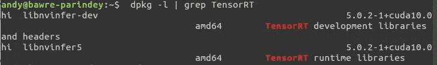
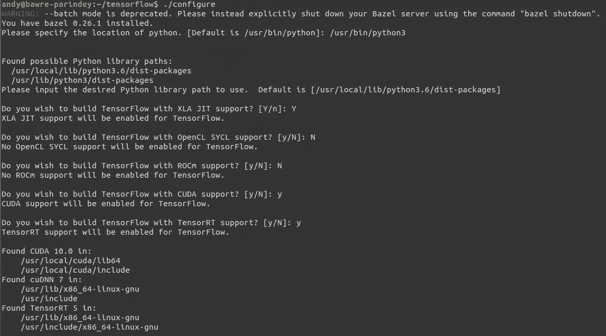

# 在 Ubuntu 18.04 LTS 上使用 GPU 支持和 TensorRT 构建 Tensorflow 2.0 第二部分]

> 原文：<https://medium.com/analytics-vidhya/building-tensorflow-2-0-with-gpu-support-and-tensorrt-on-ubuntu-18-04-lts-part-2-ff2b1482c0a3?source=collection_archive---------5----------------------->


欢迎回来！

最后一部分我们安装了 NVIDIA 驱动，CUDA 和 cuDNN 库。本部分是它的延续，提供了安装 TensorRT 和 Tensorflow 的必要步骤。

**第一部分:** [安装 NVIDIA 驱动、CUDA、cuDNN](/@shivam.iitmandi/building-tensorflow-2-0-with-gpu-support-and-tensorrt-on-ubuntu-18-04-lts-part-1-e04ce41f885c) 。

**第二部分:** [安装 TensorRT 和 Tensorflow](/@shivam.iitmandi/building-tensorflow-2-0-with-gpu-support-and-tensorrt-on-ubuntu-18-04-lts-part-2-ff2b1482c0a3) 。

*在 Ubuntu 16.04 上构建有 GPU 支持的 Tensorflow 1.14 和 TensorRT，请参考此* [*链接*](/analytics-vidhya/building-tensorflow-1-14-with-gpu-support-and-tensorrt-on-ubuntu-16-04-84bbd356e03) *。*

# 步骤 7:安装所需的 TensorRT 版本。

下载*。TensorRT — 5 的 deb* 包文件从[到这里](https://developer.nvidia.com/nvidia-tensorrt-5x-download)。

```
$ cd ~ *#Or the directory containing the downloaded .deb package*$ sudo dpkg -i nv-tensorrt-repo-ubuntu1804-cuda10.0-trt5.0.2.6-ga-20181009_1-1_amd64.deb$ sudo apt-key add /var/nv-tensorrt-repo-cuda10.0-trt5.0.2.6-ga-20181009/7fa2af80.pub$ sudo apt-get update$ sudo apt-get install libnvinfer5=5.0.2-1+cuda10.0$ sudo apt-get install libnvinfer-dev=5.0.2-1+cuda10.0$ sudo apt-mark hold libnvinfer5 libnvinfer-dev
```

第一个命令是将目录更改为包含*的目录。deb* 包的 TensorRT。第二个和第三个命令分别安装存储库的元数据和它的公共 GPG 密钥。第四个命令是更新 APT 存储库缓存。第五和第六个命令安装 TensorRT 版本的 5.0.2.6，而第六个命令是阻止他们升级(这是最令人沮丧的问题*)。deb* 包)。

如果您想升级软件包，请使用以下命令:

```
$ sudo apt-mark unhold libnvinfer5 libnvinfer-dev
```

## 验证 TensorRT 的安装:

```
$ dpkg -l | grep TensorRT
```

运行上面的命令，如果输出与下面给出的类似，TensorRT 就启动并运行了。



# 步骤 8:构建 Tensorflow 2.0

## 构建前的步骤:

*   **安装 bazel 版本 0.26.1:**

从[这里](https://github.com/bazelbuild/bazel/releases/download/0.26.1/bazel-0.26.1-installer-linux-x86_64.sh)下载 bazel 脚本文件*bazel-0 . 26 . 1-installer-Linux-x86 _ 64 . sh、*。

```
$ cd ~ *#Or the directory containing the downloaded .sh package*$ sudo chmod +x bazel-0.26.1-installer-linux-x86_64.sh$ ./bazel-0.26.1-installer-linux-x86_64.sh --user
```

将目录更改为包含脚本文件的目录的第一个命令。第二个命令让系统知道文件是可执行的。在一个文件上(你的脚本)仅仅意味着，你将使它可执行。右键单击您的脚本并执行**属性** - > **权限** - > **允许将文件作为程序**执行，给您留下与终端中的命令完全相同的结果。最后一个命令只是运行脚本，`--user`标志将 Bazel 安装到系统上的`$HOME/bin`目录，并将`.bazelrc`路径设置为`$HOME/.bazelrc`。

这将在您的系统上安装 bazel。现在将其路径添加到 path 变量中。

```
$ echo 'export PATH="$PATH:$HOME/bin"' >> ~/.bashrc^C$ source ~/.bashrc$ sudo ldconfig
```

*   **安装必要的依赖项:**

```
$ pip3 install -U --user pip six numpy wheel setuptools mock$ pip3 install -U --user keras_applications==1.0.8 --no-deps$ pip3 install -U --user keras_preprocessing==1.0.8 --no-deps
```

如果在虚拟环境中安装，则省略`--user` 。

*   **克隆 tensorflow 存储库并配置构建:**

```
$ cd ~ *#Or the path to the directory you want to clone in*$ git clone [https://github.com/tensorflow/tensorflow.git](https://github.com/tensorflow/tensorflow.git)
```

克隆完成后，将目录更改为 tensorflow，并签出到版本分支。

```
$ cd tensorflow$ git checkout r2.0
```

*   **配置构建:**

我们需要在开始构建过程之前配置参数。

```
$ cd tensorflow *#If not already in the directory*$ ./configure
```

这将在终端上加载一个参数解析器，询问路径和特性。像这样:

```
Please specify the location of python. [Default is /usr/bin/python]: /usr/bin/python3Do you wish to build TensorFlow with XLA JIT support? [Y/n]: YDo you wish to build TensorFlow with OpenCL SYCL support? [y/N]: N

Do you wish to build TensorFlow with ROCm support? [y/N]: N

Do you wish to build TensorFlow with CUDA support? [y/N]: YDo you wish to build TensorFlow with TensorRT support? [y/N]: Y
```

它将自动检测到 CUDA、cuDNN 和 TensorRT 的路径，如下所示:



```
Enter the compute capability to use. Please note that each additional compute capability significantly increases your build time and binary size. [Default is: 6.1] {**Enter the compute capability noted before**}Do you want to use clang as CUDA compiler? [y/N]: NPlease specify which gcc should be used by nvcc as the host compiler. [Default is /usr/bin/gcc]: /usr/bin/gccDo you wish to build TensorFlow with MPI support? [y/N]: N

Please specify optimization flags to use during compilation when bazel option "--config=opt" is specified [Default is -march=native]: -march=native

Would you like to interactively configure ./WORKSPACE for Android builds? [y/N]:N
```

这将配置构建。

## 开始构建过程:

```
$ cd tensorflow *#If not already in the directory*$ bazel build --config=opt --config=cuda //tensorflow/tools/pip_package:build_pip_package
```

***旁注***

```
add "--config=mkl" if you want Intel MKL support for newer intel cpu for faster training on cpuadd "--config=monolithic" if you want static monolithic build (try this if build failed)add "--local_resources 2048,.5,1.0" if your PC has low RAM causing Segmentation fault or other related errorsadd "--config=v1" to build TensorFlow 1.x instead of 2.x, but that would defy the whole purpose of this article :p
```

这个过程需要很长时间。根据您的系统规格，可能需要 2-3 个小时。因此，等待和期待任何建设失败，他们应该来了。如果发生这种情况，请查看其背后的错误，并使用 Google 查找解决方案。如果你不明白或者找不到解决方案，请在下面评论或者尝试关闭 bazel 本地服务器:

```
$ bazel clean --expunge
```

并再次运行构建过程。

## 构建后步骤:

*   **创造出 **。要安装的张量流的文件:***

```
$ cd tensorflow *#If not already in the directory*$ bazel-bin/tensorflow/tools/pip_package/build_pip_package tensorflow_pkg
```

该命令将创建 **。tensorflow 的 whl* 文件，可以使用 pip 安装并将其存储在文件夹*即* **tensorflow_pkg** 在 tensorflow 本地存储库中，

*   **用 pip 安装 tensor flow:**

现在我们有了 **。whl* 文件我们终于可以安装 tensorflow 了。

如果不使用虚拟环境:

```
$ cd tensorflow *#If not already in the directory*$ cd tensorflow_pkg$ pip3 install tensorflow*.whl
```

对于虚拟环境:

```
$ sudo apt-get install virtualenv$ cd **{path/to/desired/directory/for/virtualenv}**$ virtualenv TF_2.0 -p /usr/bin/python3$ source TF_2.0/bin/activate(TF_2.0)$ cd tensorflow/tensorflow_pkg(TF_2.0)$ pip3 install tensorflow*.whl
```

## 验证 Tensorflow 安装:**

```
(TF_2.0)$ python3>>> import tensorflow as tf>>> hello = tf.constant('Hello, TensorFlow!')>>> print(hello)
```

如果系统输出结果，那么万岁！您已经准备好使用 Tensorflow 了。

**运行 tensorflow 2.0 代码时可能出现的错误是:

```
Could not create cudnn handle: CUDNN_STATUS_INTERNAL_ERROR
Failed to get convolution algorithm. This is probably because cuDNN failed to initialize
```

现在，出现此错误是因为以下两个问题之一:

*   **分配 GPU 内存的问题**

由于某种原因，Tensorflow 2.0 将所有可用的 GPU 内存分配给该进程，这导致了如上所述的复杂性，而不像 1.x 版本。

```
tf.config.experimental.set_memory_growth
```

它试图只分配运行时分配所需的 GPU 内存:它开始时分配很少的内存，随着程序的运行，需要更多的 GPU 内存，它会扩展分配给 TensorFlow 进程的 GPU 内存区域。注意，我们不释放内存，因为这会导致内存碎片。

在代码中导入 tensorflow 后，使用以下代码片段:

```
gpus = tf.config.experimental.list_physical_devices('GPU')
if gpus:
  try:
    # Currently, memory growth needs to be the same across GPUs
    for gpu in gpus:
      tf.config.experimental.set_memory_growth(gpu, True)
    logical_gpus = tf.config.experimental.list_logical_devices('GPU')
    print(len(gpus), "Physical GPUs,", len(logical_gpus), "Logical GPUs")
  except RuntimeError as e:
    # Memory growth must be set before GPUs have been initialized
    print(e)
```

*   **版本不兼容:**

这是最可怕的噩梦。你永远不会希望这成为理由。唯一可能的解决方案是使用兼容版本的 NVIDIA 驱动程序、CUDA、cuDNN Librarry 和 TensorRT 重新开始这个过程。

要检查安装的这些软件包的版本，请使用以下命令:

```
**# NVIDIA Display Driver Version**
$ nvidia-smi | grep "Driver Version" | awk '{print $6}' | cut -c1-**# CUDA Toolkit Version**
$ nvcc --version | grep "release" | awk '{print $6}'**# cuDNN Library Version**
$ locate cudnn | grep "libcudnn.so." | tail -n1 | sed -r 's/^.*\.so\.//'# **NCCL Version**
$ locate nccl| grep "libnccl.so" | tail -n1 | sed -r 's/^.*\.so\.//'# **TensorRT Version**
$ dpkg -l | grep TensorRT
```

# 我们完了。！

这都是我的想法。我希望这篇文章对你有所帮助。如果你做到了，别忘了鼓掌…这会鼓励我写更多。在下面的评论区留下你的想法和建议。如果你对这个过程有任何疑问，或者在构建过程中出现了错误，也可以在评论区留下。

谢谢大家！爱你 Tensorflow！

一路平安！

**参考号:**

[](https://www.tensorflow.org/install/gpu) [## GPU 支持| TensorFlow

### 注意:GPU 支持适用于带有 CUDA 卡的 Ubuntu 和 Windows。TensorFlow GPU 支持需要…

www.tensorflow.org](https://www.tensorflow.org/install/gpu) [](https://docs.nvidia.com/cuda/cuda-installation-guide-linux/) [## 安装指南 Linux :: CUDA 工具包文档

### Linux 上 CUDA 工具包的安装说明。

docs.nvidia.com](https://docs.nvidia.com/cuda/cuda-installation-guide-linux/)  [## cuDNN 安装指南::NVIDIA 深度学习 SDK 文档

### 本 cuDNN 7.6.5 安装指南提供了如何安装和检查是否正确的分步说明…

docs.nvidia.com](https://docs.nvidia.com/deeplearning/sdk/cudnn-install/)  [## TensorRT 安装指南::NVIDIA 深度学习 SDK 文档

### 本 TensorRT 7.0.0 安装指南提供了安装要求，以及包含在…

docs.nvidia.com](https://docs.nvidia.com/deeplearning/sdk/tensorrt-archived/tensorrt-502/tensorrt-install-guide/)