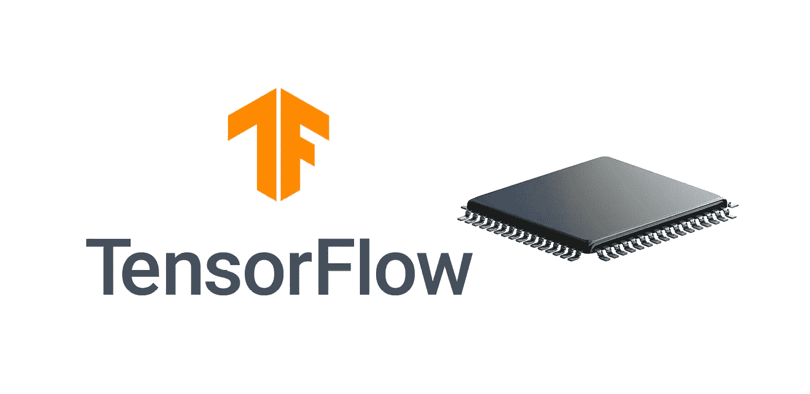

# 从源构建张量流。逐步指南。

> 原文：<https://medium.com/analytics-vidhya/building-tensorflow-from-source-step-by-step-guide-1075ef2d9356?source=collection_archive---------5----------------------->

# 如何从源代码构建 Tensorflow，快捷方式/为旧 CPU 构建 tensor flow/tensor flow 构建故障排除



目标是编译 Tensorflow 二进制文件并构建 [Python wheel 安装文件](https://packaging.python.org/tutorials/packaging-projects/#generating-distribution-archives)。如果您需要为旧的 CPU 重新编译框架，这可能会很方便。旧的 CPU 可能没有像 AVX、AVX2、SSE4.2 这样的最新 CPU 指令，但官方 Tensorflow 社区提供的二进制文件专注于更新的硬件。

本指南给出了构建 Tensorflow 的最简单方法，无需安装所有构建工具，也无需深入细节。

# 1.设置构建环境。

我们将使用 tensorflow 社区提供的 [docker 图片。](https://hub.docker.com/r/tensorflow/tensorflow/tags/)

*   下载 tensorflow docker 开发图像

```
docker pull tensorflow/tensorflow:devel-py3
```

*   运行 tensorflow image 并挂载共享卷以在最后复制结果轮文件

```
docker run -it -w /tensorflow -v <host_directory>:/share tensorflow/tensorflow:devel-py3 bash
```

# 2.获取最新的 tensorflow 版本并完成环境设置

*   在容器或本地文件夹中(如果改为步骤 1，环境是手动设置的)

```
cd /tensorflow_src/
git pull
git checkout r2.1
```

*   为构建安装 python 依赖项

```
pip3 install six numpy wheel
pip3 install keras_applications==1.0.6 --no-deps
pip3 install keras_preprocessing==1.0.5 --no-deps
```

# 3.为目标 CPU 配置 bazel / understand 标志

每个 CPU 都有自己的指令列表。特定的指令支持对实现的机器学习算法的执行速度有影响。重要的是，如果目标 CPU 不支持该指令，但 Tensorflow 二进制文件在大多数情况下都支持它们，您将会遇到一些致命的错误— Tensorflow 将无法运行。正确选择构建标志以适应您的目标 CPU 非常重要。

*   启动 bazel 配置:

```
python configure.py
```

*   回答问题，并将正确的编译标志放在末尾:

```
Found possible Python library paths:
 /usr/local/lib/python3.6/dist-packages
 /usr/lib/python3/dist-packages
Please input the desired Python library path to use. Default is [/usr/local/lib/python3.6/dist-packages]
Do you wish to build TensorFlow with XLA JIT support? [Y/n]: n
No XLA JIT support will be enabled for TensorFlow.
Do you wish to build TensorFlow with OpenCL SYCL support? [y/N]:
No OpenCL SYCL support will be enabled for TensorFlow.
Do you wish to build TensorFlow with ROCm support? [y/N]:
No ROCm support will be enabled for TensorFlow.
Do you wish to build TensorFlow with CUDA support? [y/N]:
No CUDA support will be enabled for TensorFlow.
Do you wish to download a fresh release of clang? (Experimental) [y/N]:
Clang will not be downloaded.
Please specify optimization flags to use during compilation when bazel option " - config=opt" is specified [Default is -march=native -Wno-sign-compare]: -march=skylake
Would you like to interactively configure ./WORKSPACE for Android builds? [y/N]:
Not configuring the WORKSPACE for Android builds.
```

配置 CPU 标志最简单的方法是选择目标 CPU 的微体系结构。在本例中，“-march=skylake”适用于赛扬 3855U Skylake-U CPU 优化和限制。

*   *为 gcc 获取 CPU 微架构代码。* 在目标 PC 上执行此行:

```
cat /sys/devices/cpu/caps/pmu_name
```

另一方面，如果你知道你在做什么，手动获取正确的 CPU 指令是可能的。

*   *获取标志列表。仅当 CPU 架构代码不知何故不匹配或不按预期工作时。*
    在目标 PC 上执行此行:

```
grep flags -m1 /proc/cpuinfo | cut -d “:” -f 2 | tr ‘[:upper:]’ ‘[:lower:]’ | { read FLAGS; OPT=”-march=native”; for flag in $FLAGS; do case “$flag” in “sse4_1” | “sse4_2” | “ssse3” | “fma” | “cx16” | “popcnt” | “avx” | “avx2”) OPT+=” -m$flag”;; esac; done; MODOPT=${OPT//_/\.}; echo “$MODOPT”; }
```

输出格式为"-March = native-mssse 3-mcx 16-msse 4.1-msse 4.2-mpopcnt "。
CPU 指令也可能被禁用。
**全标志列表是** [**这里是**](https://gcc.gnu.org/onlinedocs/gcc-4.5.3/gcc/i386-and-x86_002d64-Options.html)

# 4.用 bazel 为目标 CPU 构建..

对于 Windows 10 docker、8GB RAM、4 个 i7 CPU，大约需要 3.5 小时。

*   使用步骤 3 中的标志组装构建行，并从“/tensorflow_src/”文件夹运行

覆盖行军标志的示例:

```
bazel build --copt=-march=skylake //tensorflow/tools/pip_package:build_pip_package
```

强制和受限标志的示例:

```
bazel build --config=opt --copt=-mssse3 --copt=-mcx16 --copt=-msse4.1 --copt=-msse4.2 --copt=-mpopcnt --copt=-mno-fma4 --copt=-mno-avx --copt=-mno-avx2 //tensorflow/tools/pip_package:build_pip_package
```

# 5.用 python 安装轮文件包装二进制文件

*   将车轮文件生成到共享目录:

```
./bazel-bin/tensorflow/tools/pip_package/build_pip_package /share
```

*   现在，安装文件 ex:" tensor flow-2 . 1 . 0-cp36-cp36m-Linux _ x86 _ 64 . whl "已经准备好安装/部署到目标环境中。

# 6.安装 Tensorflow 并用 hello-world 示例进行验证

在目标环境中安装 Tensorflow:

```
python3.6 -m pip install /tensorflow-2.1.0-cp36-cp36m-linux_x86_64.whl
```

*   验证张量流正在工作(v2。XX)

```
python3.6 -c "import tensorflow as tf; msg = tf.constant('TensorFlow 2.0 Hello World'); tf.print(msg)"
```

*   验证 Tensorflow 正在工作(v1。XX)

```
python3.6 -c "from __future__ import print_function; import tensorflow as tf; hello = tf.constant('Hello, TensorFlow!'); sess = tf.Session(); print(sess.run(hello))"
```

# **故障排除**

***巴泽尔不对版/更新巴泽尔***

下载所需版本和平台的二进制[安装程序](https://github.com/bazelbuild/bazel/releases)或

docker 容器内部:

```
./bazel-1.2.1-installer-linux-x86_64.sh
```

***未发现类似“CXXABI_1.3.11”的错误***

Tensorflow 成功安装但无法运行时出现。检查目标是否具有所需的 API 版本，例如:` CXXABI_1.3.11 `:

```
strings /usr/lib/x86_64-linux-gnu/libstdc++.so.6 | grep CXXABI
```

如果“1.3.11”缺失，请执行以下步骤之一:

*   将参数(步骤 4)添加到构建行，以支持与旧 GCC 的兼容性

```
bazel build --cxxopt="-D_GLIBCXX_USE_CXX11_ABI=0" <your other params>
```

*   *(备选脏解决方案)*如果已经构建了安装文件并且平台匹配，您只需要快速修复:
    根据目标系统，将/usr/lib/x86_64-linux-gnu/libstdc++ . so . 6 "文件从 tensorflow 开发 docker 容器(来自步骤 1)复制到目标环境的相同路径/usr/lib/x86 _ 64-Linux-GNU/"或/usr/lib64 "或类似路径。

***运行*** 后非法指令 Tensorflow 错误

意味着没有正确选择构建标志，因为编译的二进制文件和目标 CPU 配置不匹配。
试炼` --三月'旗；禁用步骤 4 中使用的、在步骤 3 中选择的不支持的指令，例如:`-mno-avx`。

乡亲们，这就是全部！

## 链接:

1.  张量流源代码[https://github.com/tensorflow/tensorflow](https://github.com/tensorflow/tensorflow)
2.  议题讨论 1[https://github.com/tensorflow/tensorflow/issues/15777](https://github.com/tensorflow/tensorflow/issues/15777)
3.  议题讨论 2[https://github.com/tensorflow/serving/issues/819](https://github.com/tensorflow/serving/issues/819)
4.  问题讨论 3[https://github . com/yaroslavvb/tensor flow-community-wheels/issues/103](https://github.com/yaroslavvb/tensorflow-community-wheels/issues/103)
5.  [https://medium . com/@ sometimes Casey/building-tensor flow-from-source-for-SSE-avx-fma-instructions-worth-the-effort-fbda 4 e 30 EEC 3](/@sometimescasey/building-tensorflow-from-source-for-sse-avx-fma-instructions-worth-the-effort-fbda4e30eec3)