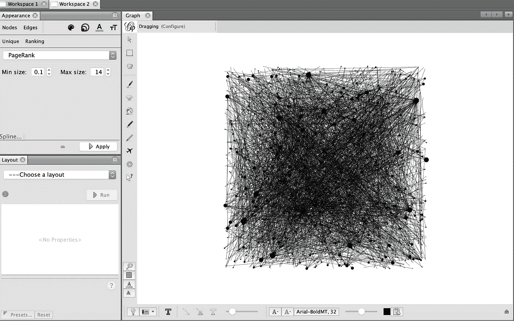

# 构建 Twitter 对话图

> 原文：<https://medium.com/analytics-vidhya/building-twitter-conversation-graph-5830bee5a7eb?source=collection_archive---------11----------------------->

## 编写一个 Java 应用程序来检索包含当前地点趋势词的 tweets。然后，提取对话并构建网络图。

2020 年 10 月 14 日推特对话图。地点是泰国

在[之前的文章](https://towardsdatascience.com/building-a-network-graph-from-twitter-data-a5e7b8672e3)中，我们讨论了从 Twitter 数据构建网络图。我们对推文进行采样，检索用户，查询用户的朋友，并构建图表。在本文中，我们将根据 Twitter 对话创建另一个网络图。我们将不再使用样本推文。我们需要更多的数据来构建图表。

如果不支付一些费用，我们无法获得所有的推文。然而，我们可以发送我们正在听的单词列表。Twitter 会发送包含这些词的推文。所以，我们用 Twitter 趋势作为一个单词列表。

下面是我们在这篇文章中要做的事情:

*   了解我们所在地附近的趋势。
*   创建并处理 Twitter 流。
*   从推文和用户构建边和节点。然后，导出到文件。
*   将边和节点 CSV 文件导入图形工具 Gephi。
*   运行图形和布局算法并格式化图形。

# 了解我们附近的趋势

以下是获取某个位置的 twitter 趋势的方法。它接受一个参数，即位置名称，并返回一个趋势列表。

该方法确实:

*   它无处不在。然后，它获取与我们指定的位置名称相匹配的那个。
*   通过指定位置 WOEID 获取趋势。然后，它将结果从数组转换为列表并返回。

# 创建和处理 twitter 流

下面是创建和处理 Twitter 流的 StreamProcessor 类的部分代码。

run 方法将创建并处理一个 Twitter 流。以下是它所做工作的更多细节:

*   创建一个 Twitter 流
*   配置 Twitter 流，以便在 tweet 到达时调用消费者(函数接口)。消费者提交一个新的可调用任务( **SaveTweetTask** )来将推文保存到数据库中。
*   它为我们的位置获取趋势。如果有提升的趋势，则将其删除。
*   它使用趋势词和指定的语言过滤流。
*   由于趋势经常变化，我们的代码在预先定义的时间内使用趋势作为 Twitter 流过滤词。然后，它得到新的趋势。如果它们发生了变化，它会清理 Twitter 流，并用更新的趋势对其进行过滤。
*   它永远运行，直到被杀死。然后,“close”方法运行以很好地进行清理。

下面是我们程序中的主类。

该方法确实:

*   它从命令行参数中获取参数。
*   初始化数据库连接。
*   它为流处理器构建了一个执行器服务。我们使用单线程执行器，因为我们的数据库是 **SQLite** 。我们已经在前一篇文章中解释过了。
*   实例化流处理器对象
*   它添加了一个 shutdown 钩子，这样当它被杀死时，它会优雅地关闭流处理器和数据库。
*   最后，它运行流处理器。

# 构建边和节点

对于 Twitter 会话网络，我们将每个用户建模为一个节点。作为对另一条推文的回复的每条推文都是连接写推文的用户和写回复推文的用户的边。实现这个很简单。看看下面的 tweet 表模式:

当这条推文是对另一条推文的回复时，最后两列( **in_reply_to_status_id** 和 **in_reply_to_user_id** )是相关的。如果这条推文不是回复，则两列值为-1。为了构建一个边，使用**用户 id** 列作为源节点 id，使用 **in_reply_to_user_id** 作为目标节点 id。因此，我们可以使用下面的简单 SQL 查询来获取所有 tweets 的所有边。

以下 SQL 语句是获取与会话相关联的节点的查询。这只是一个简单的与用户表的 SQL 连接。

运行两个查询并将结果导出到 CSV 文件。

我们在 2020 年 10 月 14 日运行了 Twitter 收集器程序，同时将地点设置为泰国。我们收到了 290 万条推文。当我们运行上面的 SQL 语句时，我们得到了 4，653 条边和 3，157 个节点。

# 将边和节点 CSV 文件导入 Gephi

导入边和节点后，图形如下图所示。Gephi 将合并具有相同源和目标的边。因为我们有几千个边和节点，所以这个图看起来很混乱。

导入数据后的对话图

# 图形算法和布局算法

我们需要运行一些图形和布局算法，使图形看起来不那么凌乱，看起来更有意义。

首先，我们运行了 **PageRank** 算法。这是一种测量节点的方向和传递影响的图中心算法。具有更高的 **PageRank** 值的节点具有更大的功率。下面显示了结果。请注意，一些追随者计数不太高的节点可能具有较高的 **PageRank** 值。

运行 PageRank 算法后的节点数据

我们将节点大小配置为与 **PageRank** 值成比例。结果如下所示。节点停留在相同的位置。具有较高 **PageRank** 的节点看起来比较低 **PageRank** 的节点大。

节点大小配置为与 PageRank 值成比例后的图形

接下来，我们运行了一个布局算法，使带有边的节点保持在一起。中间没有边的节点被放在更远的地方。我们选择了 **ForceAtlas2** 布局，因为它速度很快，可以处理大量节点和一些要配置的参数。结果如下。我们可以看到有几个大节点和一些边。一些大节点聚集在一起。此外，还有大量远离中心的不连通子图。

运行 ForceAtlas2 布局后的图形

接下来，我们运行了一个社区检测算法。然后，我们根据算法检测到的类别配置节点颜色。

ran 模块算法后的图

在最后一步中，我们打开了显示节点标签。将标签设置为与节点大小成比例。可选地，改变背景颜色，因为我们认为这是更好的标签。这是图表。

带节点标签的对话图

在最终的对话图中，我们可以清楚地看到哪些节点对其他节点有更大的影响。此外，我们可以注意到哪些节点属于同一个组。

# 结论

我们构建了一个 Java 应用程序来根据位置趋势收集 tweet 数据。我们已经从对话推文中生成了图的边和节点。将那些图形数据导入到 **Gephi** 中。然后，我们运行了**页面排名**，社区检测和布局算法。对话图将提供一些关于用户和他们之间交互的有见地的信息。

# 改进建议

仅使用地点趋势可能会有问题，因为:

*   我们经常注意到 Twitter 应用中的趋势与 place trends API 结果不同。
*   我们经历了几天的地方趋势停滞，虽然它很少发生。

不管怎样，我们应该能处理好这件事。我们在实现中已经有了一个变通方法，但是为了简单起见，没有在本文中展示。另外，我们想为我们的读者做一个练习。