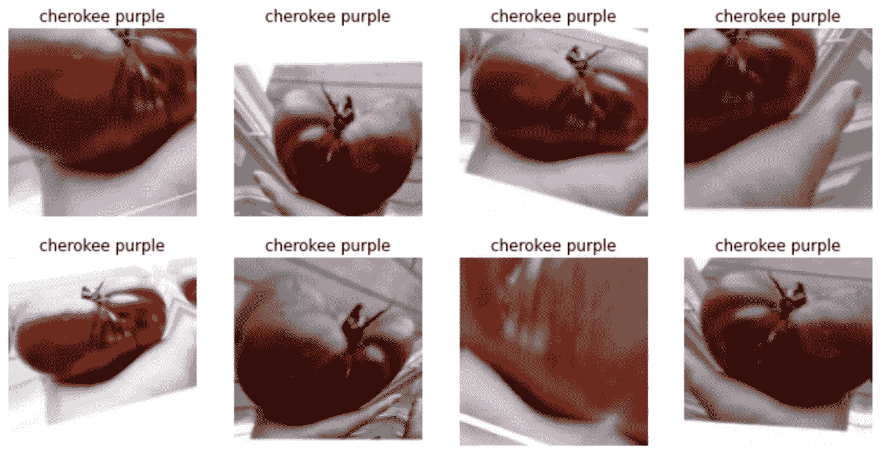
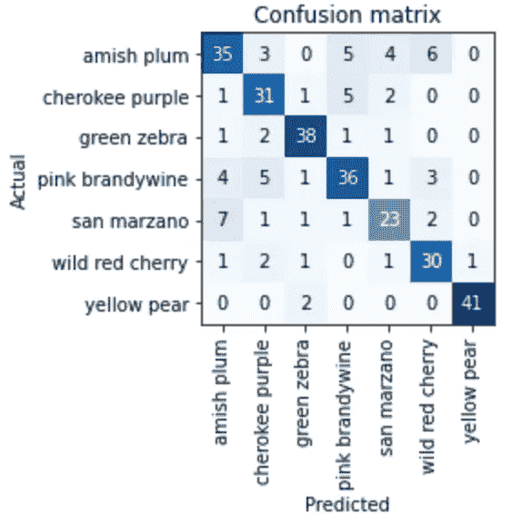

# 用 FastAI 2(本地 Ubuntu)构建你的第一个深度学习 Web 应用

> 原文：<https://medium.com/analytics-vidhya/building-your-first-deep-learning-web-application-with-fastai-2-local-ubuntu-4d0330cdf2ab?source=collection_archive---------17----------------------->

我最近刚刚完成了杰瑞米·霍华德的新 fastai 课程([https://course.fast.ai/](https://course.fast.ai/))的前两节课，在那里，他展示了如何使用流行的软件包开发一个强大的图像分类深度学习神经网络 web 应用程序。虽然他很好地完成了这些步骤，但总会有一些方面不像宣传的那样工作，要么是因为自最初出版以来已经过时，要么只是因为在不同的环境中工作。这里提供了一个完整过程的一步一步走，以及在构建自己的应用程序时可能遇到的潜在陷阱。

# 设置您的环境

我想指出的第一个细节是，fast.ai 包在 Windows 环境下确实不能很好地工作。我可以告诉你，我已经尝试在我的 Windows 机器上完成初始设置，以便我可以在本地开发，并发现它令人困惑和乏味。课程中建议您使用笔记本服务器，如 Colab 或 Gradient，这是有根据的，无论选择哪一种都是尽快上手 fast.ai 的非常简单的解决方案。但是，在我看来，如果你真的打算充分利用 fast.ai，我建议你设置一个本地的 Linux 系统。对我来说，我在我的台式机上设置了一个双引导环境，这样我就可以切换到 Ubuntu 18.04。设置这本身就是一个过程，所以如果这是你的首选方法，我建议在回到这里之前，遵循[现有的教程](https://itsfoss.com/install-ubuntu-1404-dual-boot-mode-windows-8-81-uefi/)。本课程建议不要这样做，理由很充分；这是一个漫长的过程，如果你不知道自己在做什么，可能会很有压力，毫无疑问，这将占用你更多的时间来设置，而不是实际构建你的深度学习 web 应用程序。然而，我认为这是值得的——尤其是如果你有自己的 GPU。

从 Ubuntu 环境中，获取 fast.ai 的所有软件依赖关系非常简单。请注意，这里的步骤用最简单的术语描述了该过程。

## 1.安装 NVIDIA 驱动程序

这可以通过打开 Ubuntu 终端，使用下面列出的命令，然后重启你的机器来完成。

```
sudo ubuntu-drivers autoinstall
```

## 2.安装 Anaconda

Anaconda 'sh '文件可以在这里下载:【https://www.anaconda.com/products/individual，然后在终端中导航到下载的文件(使用' cd '命令)并运行 bash 命令(下面的例子—版本号/日期可能会改变)进行安装。

```
cd /Downloads/
bash Anaconda3-2020.07-Linux-x86_64.sh
```

## 3.安装 fastai

这可以通过运行下面这个来自 [fastai](https://github.com/fastai/fastai) GitHub 的命令来完成。

```
conda install -c fastai -c pytorch -c anaconda fastai gh anaconda
```

就是这样！现在，您已经有了一个使用 fastai 进行开发的工作环境。在您的环境中，您现在应该能够在终端中将`jupyter notebook`作为命令运行，并运行 fastai 课程的所有介绍性代码(在/clean/文件夹中的[https://github.com/fastai/fastbook](https://github.com/fastai/fastbook)处找到)。

# 注册 Azure 认知服务

如果您不打算遵循本课程中阐述的数据检索模型，可以跳过这一部分。但是，Bing 图像搜索 API 确实让获取数据变得非常方便。

注册 Azure 认知服务可以在这里进行:([https://Azure . Microsoft . com/en-us/Services/Cognitive-Services/](https://azure.microsoft.com/en-us/services/cognitive-services/))。您应该会看到一个“免费开始”的选项。那你可以

1.  注册 Azure 认知服务。在我的注册中，我遇到了一个支付步骤，尽管只使用他们的免费服务，我还是被要求输入我的卡信息。请放心，只要您选择了“免费”选项，您将不会被收费。
2.  登录 Azure 门户，选择“认知服务”。
3.  然后，您将能够选择“创建资源”。
4.  在他们的库中搜索“Bing 图片搜索”并创建它。
5.  你将通过几个形式，选择免费支付层选项，以确保你不会被收费的这一特定资源。
6.  在填写完所有的表单后，它将被部署，您可以选择“Go to Resource ”,在那里它将显示一个(或两个)API 键。在代码中使用 Bing 图像搜索功能只需要这个键。

# 收集数据

对于我的应用程序，我决定尝试对不同的番茄品种进行分类，因为当时我的花园里生长着几种类型的番茄，我认为用它们来测试我的应用程序会很有趣。训练模型的代码和我在 mybinder.org 部署的 web 应用程序代码可以在这里找到:[https://github.com/QuantumAbyss/TomatoApp](https://github.com/QuantumAbyss/TomatoApp)。使用的所有代码都直接来自 fastai 课程材料，只是将番茄而不是熊分类。

我的代码以一个 pip install 命令开始，以确保我有 azure-cognitiveservices 可用，然后是四个 import 语句，使 fastai 函数在笔记本中可用。

```
pip install azure-cognitiveservices-search-imagesearch
from fastai.vision.all import *
from fastai.vision.widgets import ImageClassifierCleaner
from azure.cognitiveservices.search.imagesearch import ImageSearchClient as api
from msrest.authentication import CognitiveServicesCredentials as auth
```

课程材料包括一个 utils.ipynb 笔记本，其中包含 search_images_bing 函数，我将它直接包含在我的工作簿中。请注意,“count”参数对应于您希望为每个搜索查询下载多少张图片。

```
def search_images_bing(key, term, min_sz=128):
    client = api('https://api.cognitive.microsoft.com', auth(key))
    return L(client.images.search(query=term, count=150, min_height=min_sz, min_width=min_sz).value)
```

这样你就可以输入你自己的 API 键，并使用该功能来搜索你选择的图片。下面的代码定义了我希望我的应用程序区分的不同类型的番茄(只是我花园里的品种——番茄类型)。然后，它将创建一个目录“tomatos”以及几个标有 tomato 类型的子目录。这些子目录将根据您的搜索查询填充图像。

```
key = 'XXX'tomato_types = 'wild red cherry','pink brandywine','san marzano','cherokee purple','green zebra','amish plum','yellow pear'
path = Path('tomatoes')

if not path.exists():
    path.mkdir()
    for o in tomato_types:
        dest = (path/o)
        dest.mkdir(exist_ok=True)
        results = search_images_bing(key, f'{o} tomato')
        download_images(dest, urls=results.attrgot('content_url'))
```

fastai 库有一个非常有用的函数 verify_images()，它检查以确保您获取的数据实际上是图像数据，然后您可以“取消链接”任何无效的数据。

```
failed = verify_images(fns)
failed.map(Path.unlink);
```

# 构建和训练模型

用 fastai 构建神经网络的主要元素是数据块对象。数据块描述了数据的不同元素以及您希望如何处理数据。

*   在下面的代码中，第二行定义了两个**块**类型，一个 ImageBlock(它启动库来加载图像数据)和一个 CategoryBlock(它告诉代码期待分配给每个图像的分类标签)。
*   **get_items** 参数由 fastai get_image_files 函数填充，该函数将启动库从特定目录(由代码中的 path 变量提供)加载图像。这里，我们的 tomato 文件夹和 varietal 子目录的创建方式非常关键，因为 get_image_files 函数知道如何处理以这种方式保存的数据。
*   **splitter** 参数将简单地指定您希望如何将数据分成训练集和验证集。在这种情况下，我们希望它是随机的，验证数据占总数据集的 30%。
*   **get_y** 需要提供一个 getter 函数来获取类别块标签。
*   **item_tfms** 是可选参数，随不同类型的数据转换函数一起提供。在这种情况下，我们为它提供了 RandomResizedCrop 函数，该函数将复制图像，但随机选择这些图像的裁剪子集。这有助于增加我们的数据，这样我们的模型将更好地处理不同比例的图像。
*   **batch_tfms** 对批量图像应用变换。这里，我们使用 aug_transforms 函数通过扭曲/阴影/拉伸图像来提供更广泛的数据扩充。

```
tomatoes = DataBlock(
    blocks=(ImageBlock, CategoryBlock),
    get_items=get_image_files,
    splitter=RandomSplitter(valid_pct=0.3, seed=25),
    get_y=parent_label,
    item_tfms=RandomResizedCrop(128, min_scale=0.2),
    batch_tfms=aug_transforms(mult=2))
```



batch_tfms = aug_transforms 对单个图像的效果

创建数据块后，您可以创建一个数据加载器，该数据加载器将输入卷积神经网络(cnn_learner)。下面的 fastai 代码具有非常有用的利用迁移学习的功能，它采用已经训练好的图像分类架构(resnet34)及其所有权重，并根据新引入的番茄数据对其进行“微调”(七个时期)。

```
dls = tomatoes.dataloaders(path)
learn = cnn_learner(dls, resnet34, metrics=error_rate)
learn.fine_tune(7)
```

然后，您将能够查看每个时期的错误率指标，或者利用混淆矩阵来确定您的模型可能失败的情况。收集这些信息并理解其原因对于优化模型的预测能力至关重要

```
interp = ClassificationInterpretation.from_learner(learn)
interp.plot_confusion_matrix()
```



我们的番茄分类器的混淆矩阵

除了清理/移除坏数据的过程之外，Fastai 还有其他几个功能可用于了解您的模型出现故障的区域。关于这些的细节可以在代码库中找到。

一旦您觉得您的模型达到了一个好的点—误差指标较低，您就可以使用导出功能保存一个. pkl 文件，该文件包含了将在生产环境中使用的所有模型结构和重量信息。

```
learn.export()
```

# 用 Binder 和 Voila 构建 Web 应用程序

现在我们到了一个部分，您可以使用

*   **瞧**——构建 python 笔记本，但忽略所有代码单元，只显示 markdown 和 widget 对象。
*   **Binder** —一项网络服务，允许你从 GitHub 页面启动一个 python 笔记本，然后从浏览器访问那个活动的笔记本。请注意，它们实际上只能让这些 web 应用程序运行几个小时，所以如果您正在寻找一个更持久的解决方案，您可能需要寻找另一个部署选项。

番茄应用程序的代码是[这里](https://github.com/QuantumAbyss/TomatoApp/blob/master/TomatoApp.ipynb)再次作为参考，但它开始安装 voila 和导入 fastai 库。

```
!pip install voila
from fastai.vision.all import *
from fastai.vision.widgets import*
```

然后，我们进入应用程序功能，包括应用程序的功能描述，上传按钮，描述上传按钮功能的点击功能，图像显示部分，以及输出标签，这将是我们的模型预测的结果。

```
path = Path()
learn_inf = load_learner(path/"export.pkl", cpu=True)
btn_upload = widgets.FileUpload()
out_pl = widgets.Output()
lbl_pred = widgets.Label()def on_click(change):
    img = PILImage.create(btn_upload.data[-1])
    out_pl.clear_output()
    with out_pl: display(img.to_thumb(128,128))
    pred, pred_idx, probs = learn_inf.predict(img)
    lbl_pred.value = f'Prediction: {pred}; Probability: {probs[pred_idx]:.04f}'btn_upload.observe(on_click, names=['data'])
display(VBox([widgets.Label('Select your tomato!'), btn_upload, out_pl, lbl_pred]))
```

一旦你测试了你的应用程序，你就可以把你的修改提交到 GitHub。请注意，binder 可能会有问题，当我在 GitHub 存储库中包含“requirements.txt”时，它的响应似乎会更好。还要注意，如果您将您的存储库公开，那么您应该删除公开版本中的 API 密钥。

用 Binder 启动非常简单。仅仅

1.  转到[https://mybinder.org/](https://mybinder.org/)
2.  输入您的 GitHub 存储库 URL。对我来说，这看起来就像“https://github.com/QuantumAbyss/TomatoApp”
3.  输入笔记本 URL 的路径(在下拉列表中选择 URL)。对我来说，那就是“/voila/render/TomatoApp.ipynb”
4.  选择“启动”。这将需要几分钟的时间来构建。
5.  启动时，复制给定的链接并粘贴到某个地方供以后使用。

一旦应用程序启动，您将能够导航到您在手机上复制的链接，直接从您的相机上传照片或将其发送给朋友以供测试。就是这样！你现在已经完成了 FastAI 课程的介绍性项目。