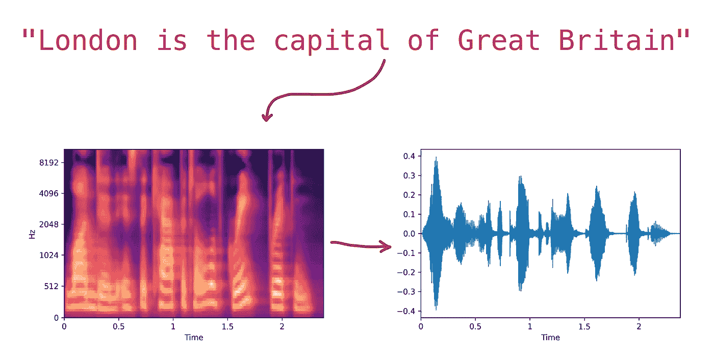

# 构建您自己的文本到语音系统

> 原文：<https://medium.com/analytics-vidhya/building-your-own-voice-assistaint-part-1-text-to-speech-fe76491f9925?source=collection_archive---------10----------------------->

**免责声明:**在这个例子中，我们不会训练神经网络，而是使用预先训练好的模型。

**TLDR** :用`--recurse-submodule`克隆[我的仓库](https://github.com/shigabeev/FastSpeech)，下载[权重](https://drive.google.com/file/d/1vMrKtbjPj9u_o3Y-8prE6hHCc6Yj4Nqk)。或者跳过第一部分。

# 介绍

我决定打造一个小型、高效、开源版本的语音助手。只是为了好玩。语音的基本设置…