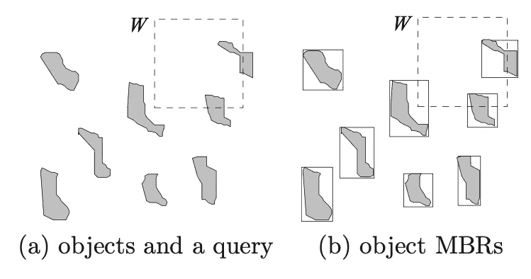
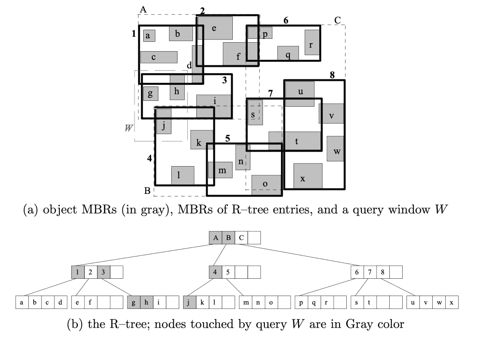
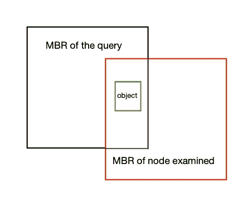

# 批量加载 R 树以及如何存储高维数据

> 原文：<https://medium.com/analytics-vidhya/bulk-loading-r-trees-and-how-to-store-higher-dimension-data-c7da26e4f853?source=collection_archive---------5----------------------->

劳拉·斯坦利拍摄

# r 树？更像是服用了类固醇的 B 树

r 树是用于空间访问方法的树数据结构，即用于索引多维信息，例如地理坐标、矩形或多边形。

## 空间坐标数据

如果一个对象具有至少一个捕捉其在 2D 或 3D 空间中的位置的属性，则该对象被表征为空间的。此外，空间对象可能在空间中具有几何范围。例如，我们可以说建筑物是一个空间对象，因为它在 2D 或 3D 地图中具有位置和几何范围。

多维空间中没有保持空间邻近性的总排序。因此，空间中的对象不能以一种理论上为空间查询提供最佳性能界限的方式物理地聚集到磁盘页面。

假设我们尝试使用某个一维排序键对一组二维点进行排序。无论我们使用哪一个键，按列排序皮亚诺曲线或希尔伯特排序，我们都不能保证任何一对在空间上接近的物体在总顺序上也是接近的。

r 树正在绘制我们的世界，这是一个真实世界的应用。它们存储空间数据对象，如商店位置和创建地图的所有其他形状。例如，从城市街区或您最喜欢的餐馆创建多边形的地理坐标。

## 为什么这是有用的？

> 嘿 Siri！找到离我最近的麦当劳

没错。根据对象的实际位置进行查询。

# R 树中的“R”代表矩形

数据结构的关键思想是将附近的对象分组，并用矩形表示它们。 ***最小外接矩形*** 或 ***MBR*** 简称。这是递归发生的。

因为所有对象都位于该边框内，所以不与边框相交的查询也不能与任何包含的对象相交。在叶级别，每个矩形描述一个空间对象。所有其他级别都是简单的节点指针。

该树的一个约束是每个节点(除了根节点)应该至少有 40%是满的，以便正确地利用磁盘空间。下面我们可以看到一个 R 树的例子。

为了保持 R 树的利用率，我们必须做四件事。

1.  目录节点条目的 MBR 所覆盖的区域应该最小化。
2.  同一级别的目录条目的 MBR 之间的重叠应该最小化。
3.  应该最小化目录节点条目的 MBR 的边界。
4.  R 树节点中的平均条目数应该最大化。

# 毛载

批量加载是一种以“大块”方式加载数据的方式，通常加载到数据库中。我们将使用一种叫做 ***的方法排序平铺递归******(STR)***。

每个 MBR 包含由制表符(' \t ')分隔的以下内容:对象 id、x-低、x-高、y-低、y-高。下面我们可以用阿瑟函数来计算一列矩形的 MBR。每个矩形都存储在一个字符串中。

***STR*** 技术最初根据矩形的 x-low 对 n 个矩形进行排序。排序后，我们知道树中会有 **L = ⌈n/C⌉** 叶节点。属性 **C** 是指每个节点的容量。特别是它可以存储多少个矩形。

(排序后的)矩形然后被分成 **⌈SquareRoot( L)⌉** 组(垂直条纹),每个组使用矩形的 y-low 作为关键字进行排序。这种排序的输出被打包到叶节点中，并且树是通过递归调用以自底向上的方式构建的。

当切片数为 1 时，递归结束。这意味着我们到达了根级别。

# 让我们查询树

以深度优先的方式遍历该树，跟随与查询范围相交的条目的指针。查询算法有三个参数；查询范围 q、被检索对象应该满足的谓词θ和 R-树节点 n。

如果我们在一个叶节点上，我们搜索这个节点的每个 MBR 来检查它们是否满足我们的查询。如果有，我们将矩形添加到答案集中。

如果我们不在叶节点上，我们搜索该节点的每个 MBR 以检查它们是否满足我们的查询。如果有，我们递归调用这个函数。我们使用相同的参数。唯一改变的参数是节点。我们现在正在传递当前节点所指向的节点。

简单地说，我们想要检查我们是否与查询的 MBR 有交集。

我们希望能够做 3 种查询类型。 ***交集，*** 用于至少有一个公共点的 MBR， ***内部，*** 用于查询内部的 MBR， ***包含，*** 用于包含查询的 MBR 的 MBR。

每个非叶节点必须只检查交集。通过下面的例子我们可以看到，如果我们严格过滤非叶节点上的所有 MBR，我们将会错过很多结果。

考虑一个内部查询和一个非叶节点上的步骤。黑色矩形是查询的 MBR。红色是被过滤的中间节点，绿色是实际对象。如果在递归中，我们有一个严格的规则，MBR 必须完全在要检查的内部，红色的不会通过过滤器，所以我们会丢失绿色的，这是一个符合标准的实际对象。

接受对象的标准取决于其几何形状，如下所示。

# 结论

在空间数据库系统中处理空间选择的方式取决于被查询的关系 R 是否被索引。如果 R 没有被索引，我们线性扫描它并将每个对象与查询范围进行比较。如前所述，DBMS 应用两步处理技术，在对象的精确几何结构之前，根据查询测试对象的 MBR。如果关系被索引(例如，通过 R 树),那么我们可以使用它来快速找到符合过滤步骤的对象。

**参考资料:** *高级数据库技术* *香港大学 Nikos Mamoulis 讲座笔记*