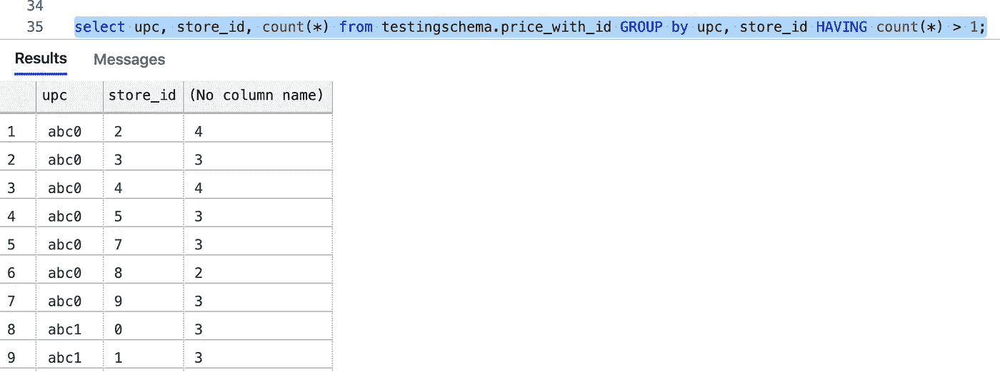
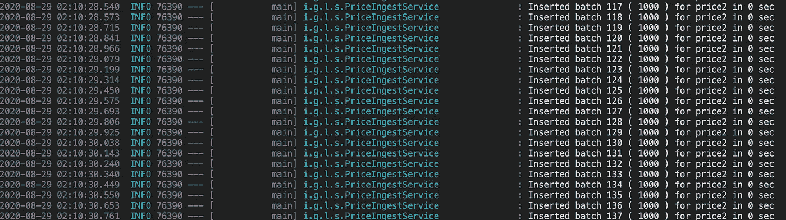
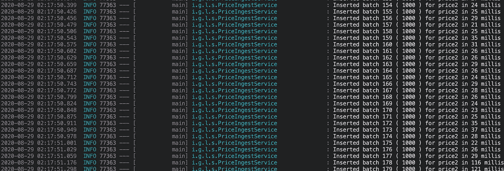

# 大容量 RDBMS 通过 Spring 进行升级

> 原文：<https://medium.com/analytics-vidhya/bulk-rdbms-upserts-with-spring-506edc9cea19?source=collection_archive---------2----------------------->


Upsert 在数据库中是一个相当常见的术语，意思是如果记录存在，则 ***Up*** date，或者在 ***中插入*** 新记录。在带有新信息的简单对象保存请求的情况下，Upserts 更有意义。

# 为什么散装？

如果我们谈论任何 ***数据同步*** 、 ***数据迁移*** 或 ***批量数据更新作业*** ，我们必然会有一个批量更新场景来更新我们在数据库中的所有内容并插入所有新行。

# 解决方法

我们将讨论 Spring Boot 环境中的解决方案以及我们从中得出的结论。

对于测试，我将使用 MS SQL Server 作为数据库，并且仅限于它的功能，但是概念是相当通用的。

## 使用 Spring JPA 的#1 标准“saveAll()”解决方案

假设我们有一个带有复合唯一键/约束的`price`表，具有 like with 结构:


然后，我们实体的复合主键和实体类看起来像这样:


假设我们正在消耗一个记录批次流来进行追加插入。为了模拟这一点，我们有一个供应商来生成大小为 1000 的随机`Price1`对象批次。摄入代码:


让我们看看结果:


现在，仔细观察一下，随着表被填满，保存每一批所花费的时间都在增加！这是什么？

罪魁祸首是`SimpleJPARepository`类的`.save()`方法:


因为存储执行插入和更新操作，所以它必须检查实体是否是“新的”。为此，它必须检查持久性上下文或查询数据库，随着表的填满，这将变得很复杂。

## #2 批量保存优化

在以前的方法中，我们的瓶颈是从数据库中连续读取主键组合，以检查是否执行`.persist()` / insert 或`.merge()` / update。

为了避免对表`.isNew()`的额外查询，我们可以有另一个独立于业务逻辑的自动生成的唯一字段(行)。因此，每个新对象都将有一个唯一的 id，并且总是为它们执行`.persist()`。

让我们在一个全新的表上进行修改(保持业务列不变)，增加一个自动递增的“标识”列:


这是我们的实体:


测试类似的摄取代码将产生如下结果:


万岁，恒定的时间和更快的插入！但是等等，



现在有带有`upc, store_id`组合的重复行


这是可以理解的，因为我们没有更新。

## #3 普通插页然后合并

以上两个实验鼓励我们保持插入模型，以便更快地插入，并在以后以某种方式合并(进行更新)。

为了实现这一点，我们可以有一个“stage”表，它有一个惟一的自动生成的插入 id，与我们的目标主表分开。和一个 pos-摄取作业，用于在消除重复后合并记录。


普通插入可以像上面那样进行，我们现在将尝试编写一个“合并”步骤。由于以下原因，该步骤很可能是数据库存储过程:

1.  以避免移动数据，并在数据驻留的地方处理批量数据。
2.  数据库特定的优化是内置的。

下面是一个简单的 MS SQL 合并存储过程实现的例子，类似的合并查询特性出现在大多数主流数据库中。


执行这个不到一秒钟！


**重要提示:**上面的存储过程实现是一种非常幼稚的方法，仅仅是为了演示并忽略了生产环境中需要注意的许多方面，比如:

*   由于 merge 语句中的数据量巨大，导致事务日志大小被过度利用，这里可以实现 id 范围为 的 ***批量合并。***
*   监控和记录程序故障，可以使用基于 TRY-CATCH 的程序，在 ***程序-审计记录表*** 中记录故障。
*   成功合并的批处理范围删除，而不是截断阶段表。

## #Extra:进一步改进批量插入

如果我们尝试记录 hibernate 为我们的`.saveAll()`操作生成的 SQL 语句，我们将得到类似这样的结果:


这里，我们使用单个 insert 语句来插入值，每个语句都通过网络传输。

这里可以做一些改进:

1.  批处理查询并通过网络调用数据库。
2.  将单个查询重写为单个多行查询的形式。

首先，我们可以利用 hibernate 的属性:

```
spring.jpa.properties.hibernate.jdbc.batch_size=1000spring.jpa.properties.hibernate.order_inserts=true
```

其次，在大多数主流数据库解决方案(Postgres、MySQL、Oracle)中都有批量(多行)插入查询选项。语法如下:

```
insert into myschema.my_table (col1, col2, col3) 
values
(val11, val12, val13),
(val21, val22, val23),
....
(valn1, valn2, valn3);
```

而 Postgres 和 MySQL 确实借助 JDBC 标志支持这个特性:***reWriteBatchedInserts = true***

但遗憾的是，根据[这个资源](https://docs.microsoft.com/en-us/sql/connect/jdbc/use-bulk-copy-api-batch-insert-operation?view=sql-server-ver15)，ms-sql JDBC 驱动不支持查询的多行重写。因此，如果我们想要这样做，我们必须手动编写插入查询。

手动创建插入查询可能如下所示:


摄取代码将使用`entityManager.createNativeQuery()`方法:


让我们来测试一下:



哇！！那些 1000 条记录的批次用时不到一秒，现在让我们看看毫秒:



# 结论

我们可以从上面的实验中有把握地推断出:

1.  在关系数据库中实现批量插入非常复杂。
2.  Spring JPA 和 Hibernate 提供的开箱即用的保存方法不能适应巨大的负载。
3.  (从业务列/字段)分离的独立主键将有助于提高插入的插入性能，但最终会插入重复的记录。
4.  将仅插入表和读取(实际)表分开可以提高接收性能。
5.  可以使用后插入、合并策略来消除插入记录的重复。存储过程在这种情况下工作得很好。
6.  原生 SQL 查询将提供最高性能的结果，在性能至关重要的情况下，使用尽可能接近数据库的解决方案。

## 测试环境:

*   Macbook Pro 2016 型号 15 英寸，16 GB 内存。
*   应用程序使用 Java 1.8 和 Spring Boot 2.3.3。
*   Docker 容器中的 MS SQL server 2017 数据库。

感谢阅读:)