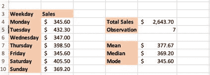
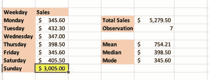
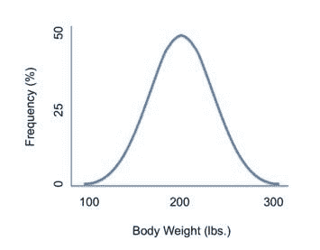
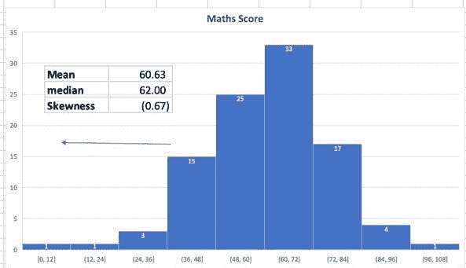
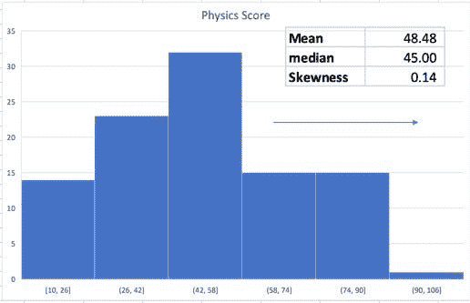

# 商业统计——简介

> 原文：<https://medium.com/analytics-vidhya/business-statistics-1-b9b09730069b?source=collection_archive---------19----------------------->

*这是商业统计系列的第一篇文章*

作为一名数据科学家，您收到数据集后的第一件事是什么？应用机器学习算法？答案将是否定的。阅读和理解数据的第一步总是来自于你在高中学习过的概念。应用非常基本的统计方法可以为你提供许多关于数据的答案，帮助你做出进一步的商业决策。让我们再次刷新这些概念:

一个数据集可能有许多观察值，描述这些观察值的一组汇总数字称为描述性统计。例如，我们都知道的一个描述性统计是平均值。我们不断听到这样的事情，比如每年这个时候的平均降雨量是 10 厘米，或者我所在组织的平均工资增长了 4%。在本课中，我们将介绍数据描述性统计的概念。我们将讨论两类描述性统计:

1.集中趋势的测量:数据的集中方面

2.离散度的度量:数据的离散方面

在本文中，我们将深入讨论集中趋势的细节，并在后续学习文章中进一步讨论分散度的度量。

# 集中趋势测量

当我们讨论集中趋势时，下面的属性对于解释数据的属性非常有用:

1.**平均值(Average):** 数据集的平均值就是数据观察值的总和除以观察值的总数。

Excel 命令: **"=AVERAGE(数字 1，数字 2，…)。)"**

2.**中位数:**数据集的中位数是一个按升序或降序排列的中间数，它将数据分为两部分。

Excel 命令: **"=MEDIAN(number1，number2，…)。)"**

3. **Mode:** Mode 是数据集中出现频率最高的值。

Excel 命令: **"=MODE(number1，number2，…)。)"**

让我们举一个例子来报告一家商店的每周销售数据。平均值、中值和众数按照上面的定义计算。

现在我们有三个特征来总结数据。哪个更好？什么时候中位数比平均数好？风尚呢？让我们举一个同样的例子，将 Sunday 的销售额改为 3005 美元:

在这种情况下，一周的平均销售额为 754.21 美元，中位数为 398.50 美元。如果我们观察数据，我们可以说，对于两个观察值，众数和中位数是相似的/非常接近的，并且与实际数据更加一致，而平均值在更大程度上受极端观察值的影响。*因此，如果您注意到数据中的极端观察值，那么中位数可能比平均值更能概括数据。*

在我们继续之前，让我们也定义一下正态分布。在完美的正态分布中，图表从左侧和右侧看起来都是对称的钟形曲线。在统计语言中，对于正态分布，均值、中值和众数都是相等的。让我们再次用一个例子来形象化地说明这一点:

我们在这里为 100 个人收集体重数据。我们可以看到，图表的左右两边完全对称。当我们计算平均值、中值和众数等集中趋势参数时，它们都与 200 磅一致。

在现实生活中，几乎不可能观察到符合完美正态分布特征的数据模式。因此，为了理解这些数据模式，我们需要更深入地研究统计属性。

# 歪斜

均值和中值之间有趣的关系与计算均值和中值的数据的偏斜度有关。偏斜指的是钟形曲线的扭曲或不对称。这也可以量化为任何分布偏离正态分布的程度。根据我们到目前为止所研究的性质，偏斜度可以定义为两种类型:

Excel 命令: **"=SKEW(数字 1，数字 2，…。)"**

1.  **左偏:**当分布向左偏时，即曲线左侧的尾部比右侧的尾部长，均值小于中值。这也叫负偏度。如果使用 excel 计算出的值为负，则分布向左倾斜。又迷茫了？我们再举一个例子。在这个例子中，我们将讨论学生在数学和物理考试中的分数。

在这个例子中，我们可以说均值小于中值。此外，偏斜度为(0.67)。通过查看图表，我们可以得出结论，分布是左偏或负偏的。大多数学生在数学考试中表现一般。

2.**右偏:**当一个分布向右偏时，曲线右侧的尾部比左侧的尾部长，均值大于众数。这也叫正偏度。如果使用 excel 计算的值为正，则分布向右倾斜。

学生收到的物理考试成绩的平均值大于中位数。偏斜度为 0.14。根据定义和对称性，我们可以肯定地说，分布是正确偏斜的。

经验研究已经证明，在适度偏斜的分布中，均值、中值和众数之间存在非常重要的关系。均值和中值之间的距离大约是均值和众数之间距离的三分之一。卡尔·皮尔逊用以下公式表达了这种关系:

# Mode = 3Median — 2Mean

在本文的下一部分，我们将讨论离差的度量，其中我将讨论四分位数范围、箱线图、标准差、方差和切比雪夫定理。我希望你喜欢在这篇文章中更新你的统计概念。

快乐学习！

#数据分析#统计#统计分析#业务分析#回归#数据科学# excel #数据驱动业务#数据驱动决策#分析#分析#隔离时间#数据#数据科学家#优秀培训#数据分析#学习#产品管理