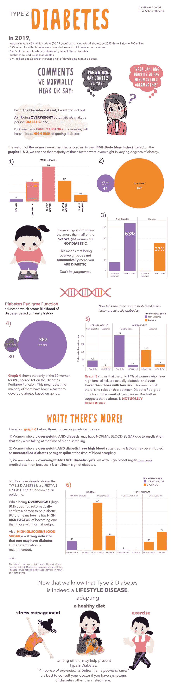

# 通过数据可视化打破基因、身体质量指数和糖尿病的常见误区

> 原文：<https://medium.com/analytics-vidhya/busting-common-myths-surrounding-genes-bmi-and-diabetes-with-data-visualization-b5ff1c725fcd?source=collection_archive---------23----------------------->

如今，人们越来越快地以貌取人，可悲的是，这影响了一个人的自尊，可能导致抑郁。这就是为什么，我受到启发，由 [FTW Foundation](https://www.ftwfoundation.org/) 为我的数据科学项目创建了我的第一个数据可视化。我使用了美国皮马印第安人的糖尿病数据集。

我记不清听过多少次人们说的关于基因或超重导致糖尿病的“常见误区”。用英语翻译:“如果他*胖*，他*肯定*有糖尿病。”以及“糖尿病是*遗传的*。我奶奶有。当然我也会有。”

我使用的数据集并不完全干净，也就是说，有一些行缺少数据。我不得不放弃它们，因为在写这篇文章的时候，我仍然不知道如何做*插补*。然而，通过可视化这些数据，我能够打破围绕基因、超重和糖尿病的常见神话。同时，我意识到二型糖尿病是一种生活方式疾病，是可以预防的。

你可以在 Tableau Public 上查看[这个](https://public.tableau.com/profile/airees.rondain#!/vizhome/DiabetesCaseStudy-AireesRondain/Dashboard1)。