# 《但是我妈妈说我很漂亮》:由《超适合》编剧和导演的电影

> 原文：<https://medium.com/analytics-vidhya/but-my-mom-says-im-beautiful-a-film-written-and-directed-by-overfitting-4eaaf1137795?source=collection_archive---------20----------------------->

## 对什么是过拟合以及如何避免过拟合的定量描述，用 Python 实现。


当你还是个孩子的时候，有时你过度保护的母亲会让你觉得美丽、聪明和善良。当然，如果你是那些孩子中的一员，你相信每个人对你的看法都和你妈妈对你的看法一样，但是当你长大了，你去上学了，有时你的老师会告诉你，你的行为是错误的，你不是那么善良、聪明或美丽！在那一刻，你需要意识到，也许你的母亲太爱你了，给了你一个错误的自我印象:**你的模特太合身了:**

如果我们从机器学习的角度来考虑，**当我们的计算能力高于特定任务所需的能力时，我们会发现自己处于“过度适应”的情况下**。换句话说，**我们的算法能够在我们特定的数据集上有很好的性能，但是它不能将任务推广到它从未见过的数据集**。

如果你仔细想想，我们的大脑能够以一种非常有效的方式概括事物。如果你看到一只猫走过街道，或者一个代表猫的玩具，或者哆啦 a 梦，你会认出这三个不同的实体指的是另一个:猫。

但如果你试图建立一个人工智能，这并不是理所当然的。

从这个意义上说，谷歌在 2015 年犯了一个巨大的错误。[这种能力的缺失，事实上让谷歌把两个黑人贴上了大猩猩的标签](https://www.theverge.com/2015/7/1/8880363/google-apologizes-photos-app-tags-two-black-people-gorillas)。[另一个巨大的偏见出现在 2018 年，亚马逊招聘人员算法不想招聘任何女性。](https://www.reuters.com/article/us-amazon-com-jobs-automation-insight/amazon-scraps-secret-ai-recruiting-tool-that-showed-bias-against-women-idUSKCN1MK08G) **当然，艾既不是种族主义者，也不是性别歧视者。**问题在于，谷歌算法可能已经被许多大猩猩训练过，但肯定没有几个黑人。同样的事情也发生在亚马逊身上。

正如我们所知，人工智能越来越深入地融入我们的生活，我们需要小心过度适应现象，因为它可能真的很重要。

我们再深入一点。

## 1.问题是

假设我们想要预测实数集合中的一些值(**回归**)。当然，如果我们有了想要预测的值的解析表达式，我们就不是在严格地“预测”任何东西，因为我们有了以解析方式获得实数所需的一切。例如，如果我们有这个函数𝑒𝑔(𝑥)=


那么如果我们现在想知道哪个实数对应于 x=4，在 eg(x)中替换 x=4 就足够了:

```
print ('The real number we want to "predict", for x=4, is %.4f' %(eg(4)))
The real number we want to "predict", for x=4, is 2996.2575
```

但是生活没那么容易:(。**如果你发现自己处于需要使用机器学习的情况，那是因为你自信这个功能是存在的，但是你找不到它的显式形式**。对于我们具体的(简单的)例子，让我们假设这个函数是已知的，让我们假设它实际上非常简单:

```
def f(x):
    y=np.sin(x)*(np.cos(x))**2-2
    return y
```

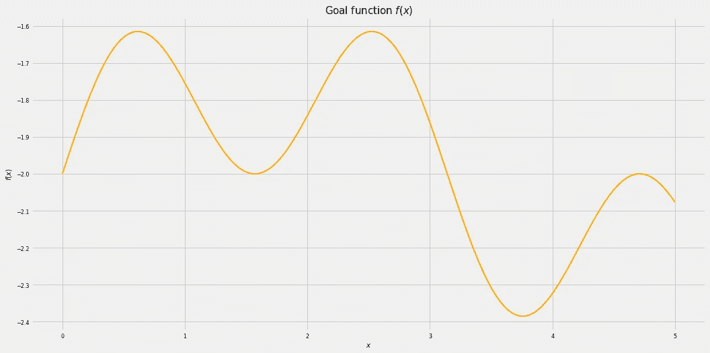

**目标函数 f(x)**

我们希望重现处理真实数据时发生的情况，所以让我们假设我们的数据更杂乱一些。**例如，** **假设我们的数据受到高斯噪声的干扰:**

```
def t(r): 
    return [stats.norm.rvs(loc=f(x), scale=0.1, size=1).tolist()[0] for x in r]
```

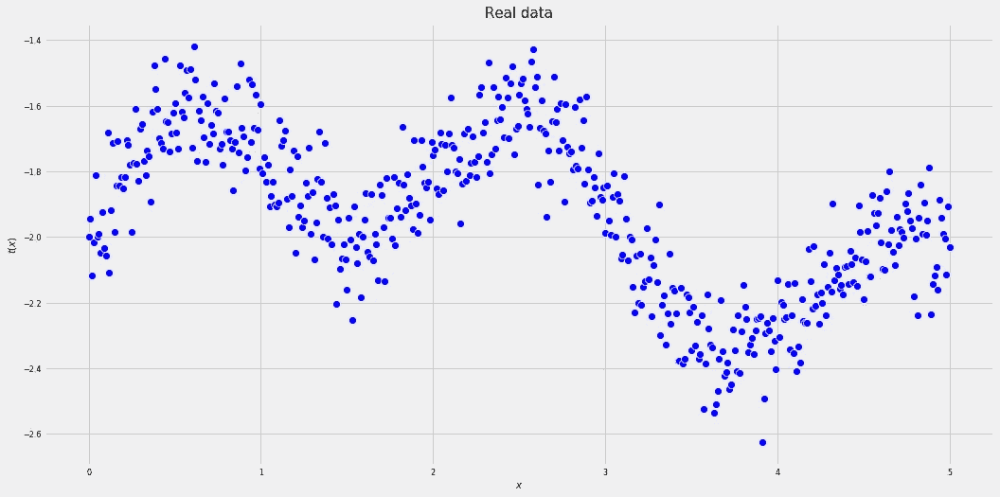

**真实数据 t(x)**

我们希望有一种算法能够重现下面的行:

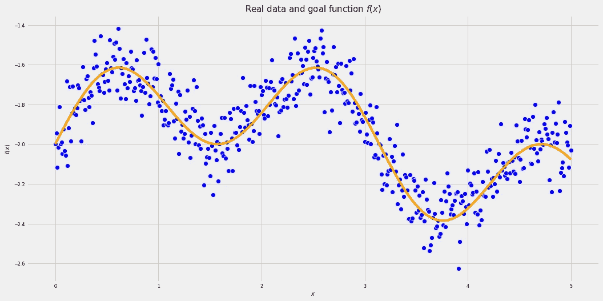

**真实数据 t(x)和目标函数 f(x)**

假设我们想用**多项式回归**来解决这个问题。这种回归可以被看作是修改的特征空间中的线性回归。

线性回归是一种回归形式(这意味着在给定一组其他数字(**数据**)的情况下预测一个实数(**目标**))，它使用输入(𝑥)和一组参数(𝑤_0 和𝑤_1):)之间的线性组合

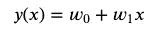

**一维输入 x 的线性回归**

现在，让我们考虑另一个(多项式)特征空间。例如，假设我们正在考虑一个 3 度特征空间:

```
def pol(degree):
    deg_list=[]
    for r in x:
        deg_list.append(r**degree)
    return deg_list
```

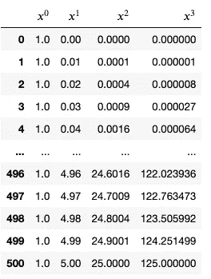

所以我们把一维输入转换成三维输入。

然后，多项式回归可以由下面的一组参数表示:

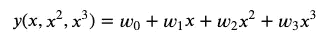

**多项式回归(次数=3)**

现在，假设我们随机选择这组参数，让我们选择这组参数来得到我们的预测:

```
A=[]
W=['w0','w1','w2','w3']
for i in range(4):
    w=np.random.randint(-10,10)
    A.append(w)
def pred(q):
    y=A[0]+A[1]*q+A[2]*q**2+A[3]*q**3
    return(y)
```

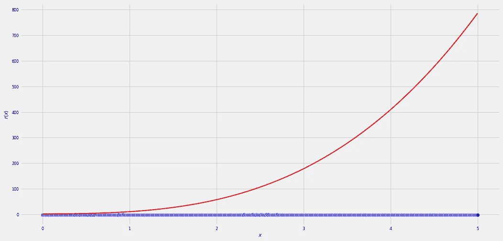

**预测和目标使用一组随机参数**

不太满意，对吧？！别担心，我们可以做得更好。线性回归(或多项式，无论什么)的系数有一个封闭的最佳公式，例如，可以用最大似然准则([https://tvml.github.io/ml1920/note/linregr-notes.pdf](https://tvml.github.io/ml1920/note/linregr-notes.pdf))获得:

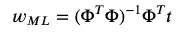

**w 的封闭最优公式**

其中:

*   Phi 代表修改后的数据输入
*   t 代表目标向量:我们想要预测的值的列表

还有别忘了偷懒！您不需要以显式的方式实现该公式:其他人已经为您实现了这一点！让我们针对具体情况使用最佳公式:

```
X=pd.DataFrame()
X['$x^0$']=pol(0)
X['$x^1$']=pol(1)
X['$x^2$']=pol(2)
X['$x^3$']=pol(3)
reg=LinearRegression().fit(X,t(x))
pred_four=reg.predict(X)
pred_four_data=pd.DataFrame()
pred_four_data['$x$']=x
pred_four_data['$y(x)$']=pred_four
```

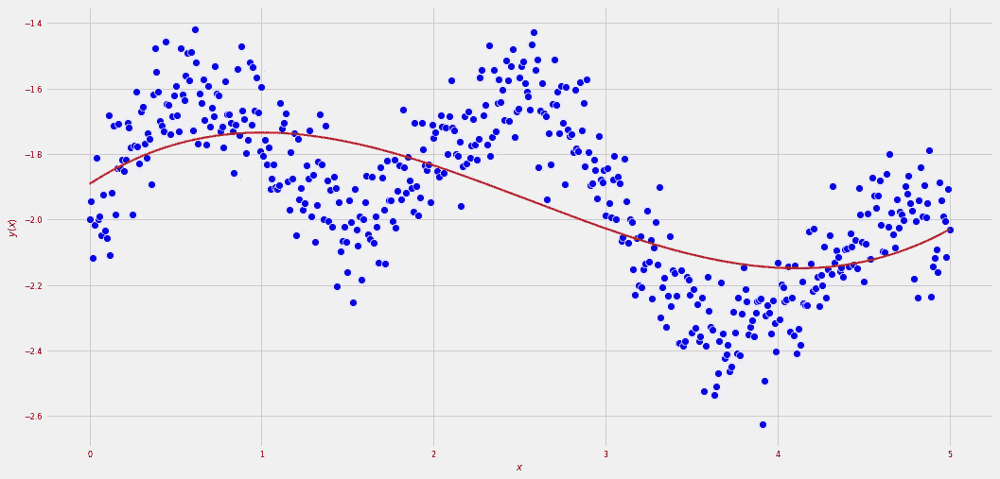

**使用次数=3 的多项式回归进行预测**

Mh，看起来稍微好一点。如果我们想知道我们的预测器做得好还是不好，我们可以使用下面的误差估计器:**均方误差(MSE)** :

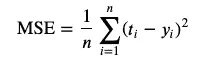

其中:

*   𝑛是我们数据集的延伸
*   𝑡_ 𝑖是我们数据集的目标(目标的 I 元素)
*   𝑦_𝑖是我们数据集的预测(对数据集的 I 元素的预测)

从几何学上讲，它是目标和预测之间平均距离的度量。在我们的具体案例中:

```
error_four=0
for i in range(len(pred_four)):
    error_four=error_four+(pred_four[i]-T[i])**2
error_four=error_four/len(pred_four)
print('The MSE using polynomial of degree=3 is the following: %.3f'%(error_four))
```

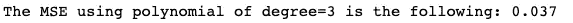

我们能做得更好吗？让我们尝试增加我们的多项式特征空间的次数，看看会发生什么！

```
DEG=np.arange(4,20,1)
MSE=[]
for d in DEG:
 x=np.arange(0.0,5.01,0.01)
 P=PolynomialFeatures(d)
 P=P.fit_transform(np.array(x).reshape(-1,1))
 T=np.array(T).reshape(-1,1)
 reg=LinearRegression().fit(P,T)
 pred=reg.predict(P)
 error=0
 for i in range(len(pred)):
 error=error+(pred[i]-T[i])**2
 MSE.append(error/len(pred))
print ('For degree=19, MSE=%.4f'%(MSE[len(MSE)-1]))
```

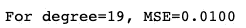

看起来好多了！实际上，随着多项式特征次数的增加，误差似乎会减小:

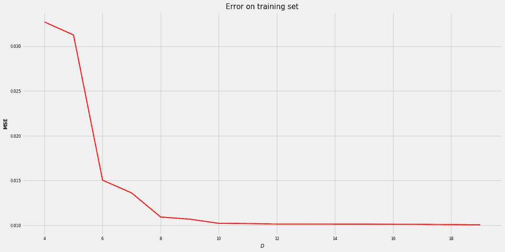

但是俗话说，**发光的不一定是金子**。我们使用相同的数据集来训练我们的模型，并测试最佳模型。**事实上，我们在整个数据集上使用了之前提到的闭合形式表达式，我们也在整个数据集上检查了模型的性能:我们在玩脏的。**

让我们使用最佳算法的相同参数，并让我们看看它如何在它从未见过的数据集的一部分上执行:

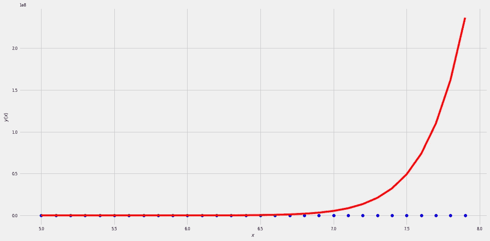

```
overfitting_error=0
for i in range(len(pred)):
 overfitting_error=overfitting_error+(pred[i]-T_test[i])**2
print(‘MSE on test set, for degree=19 is the following: MSE=%.2f’%(overfitting_error[0]/len(pred)))
```

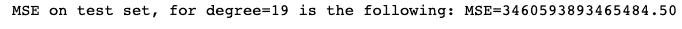

正如我们所看到的，我们使用这个模型所犯的错误实际上是巨大的。正如我们所料，这种现象被称为过度拟合。如果我们用一组特定数据来训练我们的模型，它可能在那组特定的数据上表现得非常好，但在一组它从未见过的数据上表现得非常糟糕。

## 2.战略

正如我们所看到的，陷入过度拟合陷阱极其简单，我们需要小心。让我们在这里展示一些策略:

## **2.1 保持简单:比较 MSE**

一个非常简单的策略是比较训练集和测试集的 MSE，并在测试集而不是训练集上取较小的 MSE:

```
DEG=np.arange(1,21,1)
MSE=[]
MSE_test=[]
PRED_TEST=[]
for d in DEG:
 x_train=np.arange(0.0,5.01,0.01)
 P_train=PolynomialFeatures(d)
 P_train=P_train.fit_transform(np.array(x_train).reshape(-1,1))
 T_train=np.array(T).reshape(-1,1)
 reg=LinearRegression().fit(P_train,T_train)
 pred=reg.predict(P_train)
 error=0
 for i in range(len(pred)):
 error=error+(pred[i]-T[i])**2
 MSE.append(error/len(pred))
 x_test=np.arange(5.0,8.0,0.1)
 P_test=PolynomialFeatures(d)
 P_test=P_test.fit_transform(np.array(x_test).reshape(-1,1))
 T_test=t(x_test)
 T_test=np.array(T_test).reshape(-1,1)
 pred_test=reg.predict(P_test)
 error_test=0
 for i in range(len(pred_test)):
 error_test=error_test+(pred_test[i]-T_test[i])**2
 MSE_test.append(error_test/len(pred_test))
 PRED_TEST.append(pred_test)
```

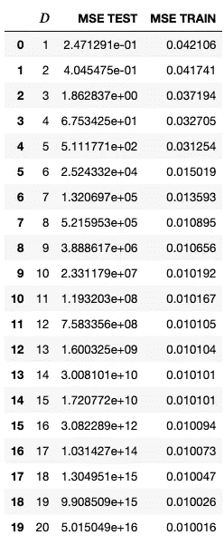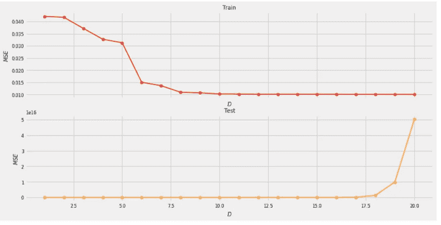

正如我们所看到的，MSE 在测试集中的某一点非常高，即使它在训练集中不断下降。当 MSE 开始增加时，我们可以停止增加多项式的阶数。例如，在我们的例子中，我们可以考虑使用𝐷=1 **(不要被愚弄，MSE 在测试集上很快就开始增加！)**:

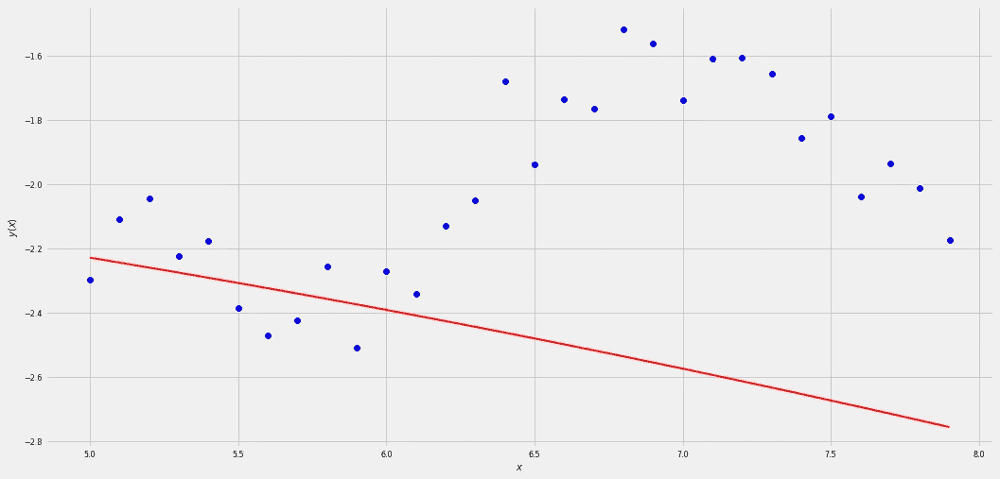

不太满意，对吧？让我们寻找一些其他的选择！

## 2.2 正规化

**更稳健的方法在于改变损失函数，增加限制参数值的惩罚**。通过这种方法，我们可以使用更高的多项式，但某些 w_i 可能非常接近(或等于)零。存在大量的正则化，但是现在我们提到两种重要的类型:

*   岭正则化
*   套索正则化

## 2.2.1 山脊正规化

它将损失函数(由 MSE 表达式给出)与𝛼‖𝑤‖相加。我们需要一个函数来最小化我们的预测和目标之间的距离，但是，同时，我们需要‖𝑤‖的最小值。**我们这样做是为了降低我们正在考虑的算法的能力，从而避免它们受到训练数据的过多影响:**

```
DEG=np.arange(1,21,1)
MSE=[]
MSE_test=[]
PRED_TEST=[]
ALPHA=[0.1,1.,10,100,1000]
for a in ALPHA:
 mse_alpha_test=[]
 pred_alpha_test=[]
 for d in DEG:
 x_train=np.arange(0.0,5.01,0.01)
 P_train=PolynomialFeatures(d)
 P_train=P_train.fit_transform(np.array(x_train).reshape(-1,1))
 T_train=np.array(T).reshape(-1,1)
 reg=linear_model.Ridge(alpha=a).fit(P_train,T_train)
 x_test=np.arange(5.0,8.0,0.1)
 P_test=PolynomialFeatures(d)
 P_test=P_test.fit_transform(np.array(x_test).reshape(-1,1))
 T_test=t(x_test)
 T_test=np.array(T_test).reshape(-1,1)
 pred_test=reg.predict(P_test)
 pred_alpha_test.append(pred_test)
 error_test=0
 for i in range(len(pred_test)):
 error_test=error_test+(pred_test[i]-T_test[i])**2
 mse_alpha_test.append(error_test/len(pred_test))
 MSE_test.append(mse_alpha_test)
 PRED_TEST.append(pred_alpha_test)import itertools
lst =ALPHA
NEW_ALPHA=list(itertools.chain.from_iterable(itertools.repeat(x, 20) for x in lst))
NEW_MSE=[]
for i in range(len(ALPHA)):
    NEW_MSE.append(np.array(MSE_test[i]).flatten().tolist())
NEW_MSE=np.array(NEW_MSE).flatten().tolist()
ridge_results=pd.DataFrame()
ridge_results["Alpha"]=NEW_ALPHA
ridge_results['D']=DEG.tolist()*5
ridge_results['MSE']=NEW_MSE
ridge_results.sort_values(by='MSE').head(1)
```

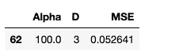

**岭正则化的最小均方误差**

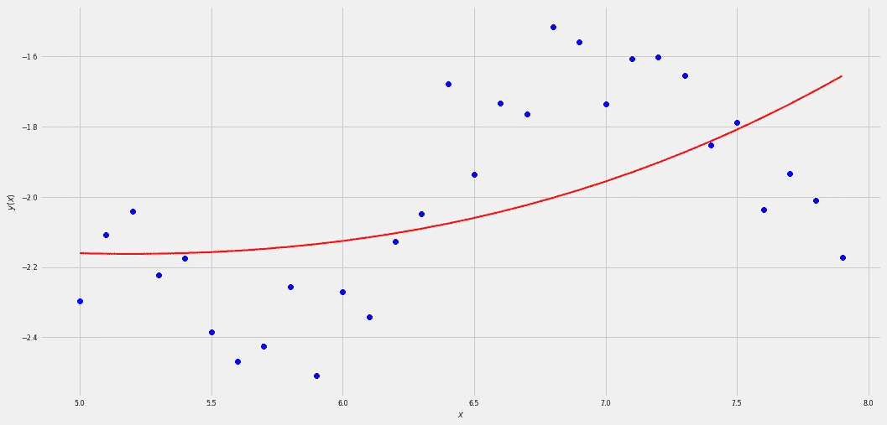

确实效果更好！MSE 明显较低(0.0526 比 0.2479)，并且该曲线实际上设法得到了我们想要再现的上升曲线，即使它没有设法得到下降部分。

## 套索:

它将损失函数(由 MSE 表达式给出)与𝛼‖𝑤‖.相加我们需要一个函数来最小化我们的预测和目标之间的距离，但是，同时，我们需要‖𝑤‖.的最小值我们这样做是为了降低我们正在考虑的算法的能力，从而避免它们受到训练数据的太大影响。查看岭的区别:这种正则化更加严格，它给我们的模型带来稀疏性。使用了几乎相同的代码行(将“Ridge”替换为“Lasso”效果很好)，获得了以下结果:

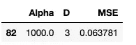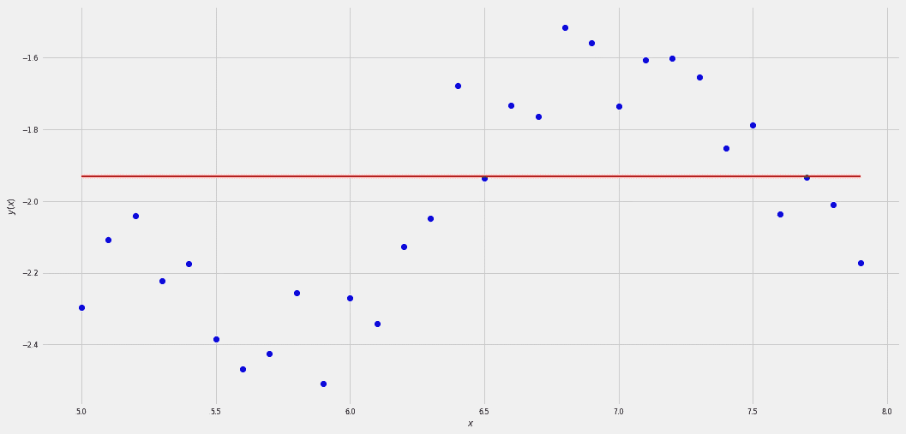

**在这种情况下，我们看到我们的模型太弱，没有得到我们想要预测的真实形式。**事实上，即使它将是一个三次多项式，其他每个参数都被强制为零，最终结果是一条直线。这是我们迄今为止使用的方法的黑暗面，它被称为**欠拟合**。

**2.3 交叉验证和其他策略:**

当然，调整只是防止过度拟合的一种方法。已经开发和研究了许多不同的策略，并且将会有许多新的策略出现。在这几行中，将介绍一些防止过度配合的杰作，但不会详细分析。
在这种方法中，我们轮换训练集和测试集，并比较每个模型的平均性能。
数据集因此被分为三个部分:

*   外部测试集，用于最终性能评估
*   一个训练集(**迭代改变**)，用于训练算法
*   一个验证集(迭代更改)，用于测试算法的中间性能。

假设我们的数据集如下:

```
x=np.arange(0.0,10.01,0.01)
```

然后我们按以下方式分割它:

```
data=np.arange(0.0,8.00,0.01)
x_test=np.arange(8.0,10.01,0.01)
```

**交叉验证是基于对“数据”输入反复改变(k 次)训练集和测试集。将计算平均 MSE(使用所有测试集),并将使用最佳模型(最小平均 MSE)并在外部测试集上进行测试。**

## 3.摘要

**过度拟合**已经通过一个非常简单的例子进行了直观的数学描述:对一维输入进行多项式回归。

由于过度拟合可能对我们的生活极其重要(如果人工智能工具过度拟合)，因此检查我们的模型是否稳健以及即使在应用从未见过的数据时，它的表现是否如我们所预期的那样非常重要。**换句话说，我们需要确保我们的模型能够将其任务推广到一组新的输入数据。**

一些防止过拟合的策略，如**正则化**和**交叉验证**已经被展示和解释。

**当然，另一个好策略是使用越来越多的数据来训练我们的模型。事实上，如果我们的数据足够具有代表性，我们就不会有任何过度拟合，因为我们的特定数据将是算法尚未看到的每一个其他数据的良好样本。**