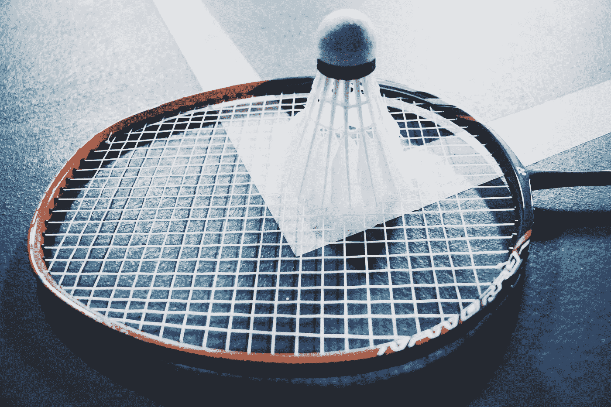
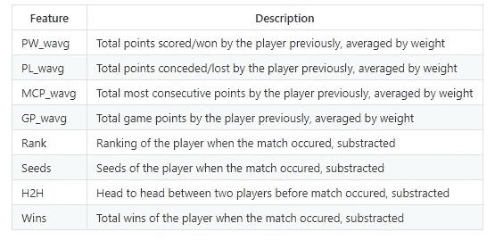
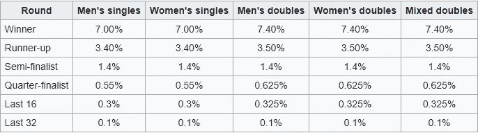
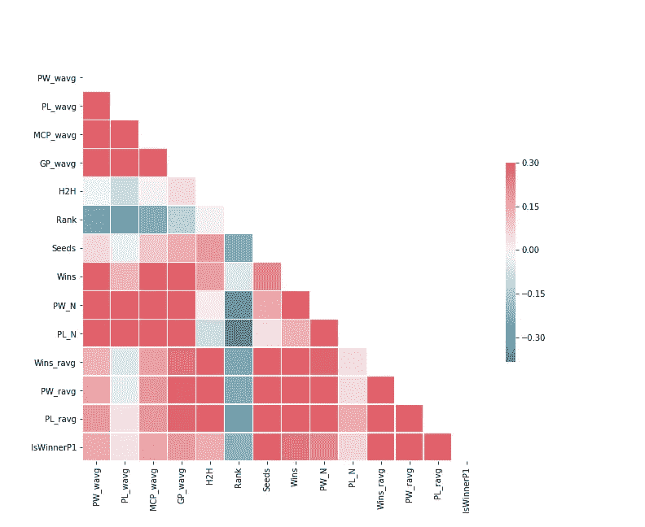
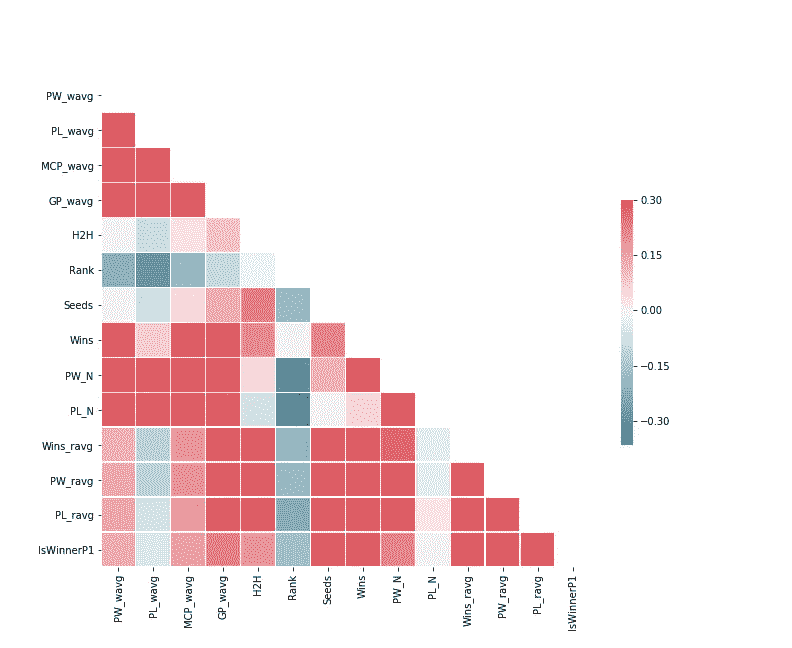
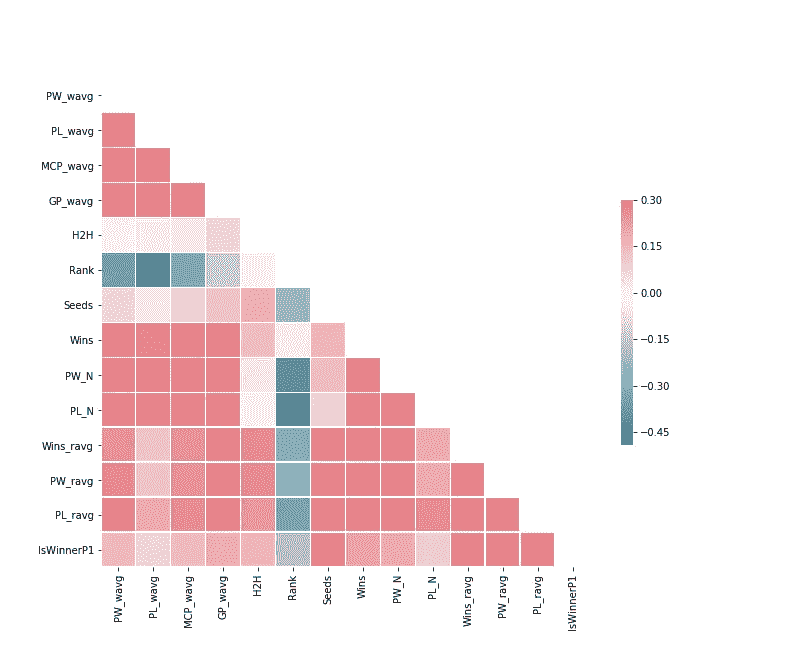
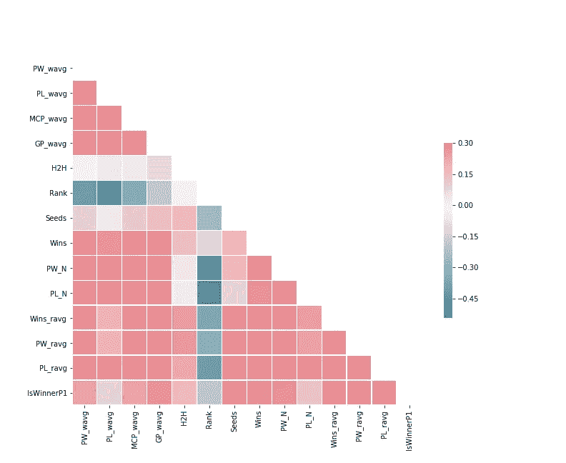
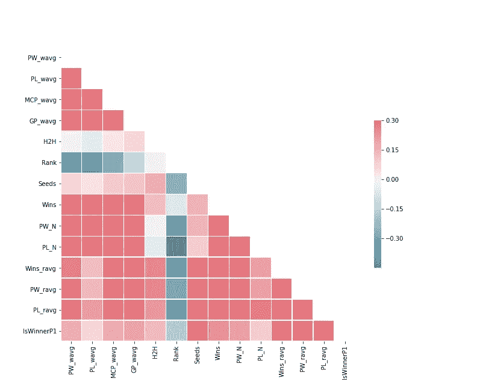
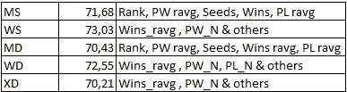
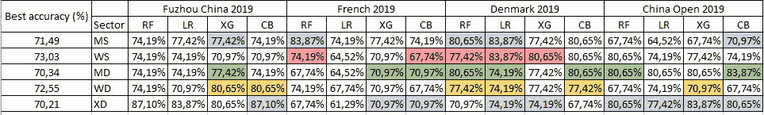

# BWF 世界巡回赛冠军预测

> 原文：<https://medium.com/analytics-vidhya/bwf-world-tour-match-winner-predictions-514bfe260a67?source=collection_archive---------11----------------------->

谁将统治这场羽毛球比赛？



资料来源:联合国人类住区规划署

这个项目的想法来自于我对观看羽毛球比赛的新兴趣。不是特别关注，而是关注比赛中谁赢了。2018 年亚运会之后，我仍然惊讶地记得整个 unity 办公室的人都在着迷地观看羽毛球男单决赛，我突然对观看羽毛球比赛产生了新的兴趣。我也开始在 Instagram 和 Twitter 上关注羽毛球账户。

临近 2018 年底，我看到我关注的一个账户发布了一个小测验，预测 BWF 世界巡回赛决赛每个组别的冠军。BWF 世界巡回赛决赛是 BWF 每年举行的最后一次比赛，每个部门有 8 名球员参加，排名不同于通常的世界排名。在那次测验中，我什么也没赢。不过，我注意到我的答案都获得了亚军。从这次经历中，我有了一个制作羽毛球比赛预测器的想法，这样以后我可以在下一次测验中使用它。

## 关于数据

首先，本项目使用的历史火柴取自 [BWF 遗址](https://bwfbadminton.com/)。我一直在往数据里添加最近的比赛。包含的比赛从 2010 年开始。

从 2010 年到 2017 年，BWF 锦标赛系列数据包括:

*   超级系列高级(SSP)
*   超系列(不锈钢)
*   GPG 大奖赛金牌

从 2018 年开始，BWF 使用一种新的系列，然后将每场比赛及其总奖金分类。这种新型的系列赛被称为 BWF 世界巡回赛。在本项目中，只有来自该新类型的这些系列包括在数据中:

*   1000
*   S750
*   S500
*   S300
*   BWF 世界巡回赛决赛

不包括世界/地区锦标赛和团体锦标赛，如夏季奥运会、汤姆斯杯和苏迪曼杯。头对头的功能会有所不同的网站。

## 取自网络的特征

基本上，我把网站能提供给我的所有东西都拿走了。让我把它分成几块。

**第一部分——匹配身份**

这种类型中的变量更容易理解，比如

*   锦标赛年份
*   系列类型(S1000、S750 等。)
*   锦标赛名称
*   类别/部门(男子单打、混合双打等)
*   比赛日期
*   比赛的回合
*   持续时间
*   玩家姓名
*   球员代表的国家
*   玩家等级
*   玩家的种子

**第二部分——比赛统计**

在这一部分，特征是这场比赛中每个球员的统计数据。简单地说，我收集了每个玩家的这些特征。

*   每盘得分
*   从比赛中赢得的总分数(也称为玩家获得的总分数)
*   这场比赛的总失分(也称为对方球员的总得分)
*   最多的连续得分(也称为一名球员可以连续得分的最高分)
*   最长游戏点数(又名玩家在同一点停留多长时间[一局结束前的 1 或 2 点])
*   赢家
*   IsWinnerP1

## 特征抽出

[这篇文章](https://www.doc.ic.ac.uk/teaching/distinguished-projects/2015/m.sipko.pdf)给了我很多关于如何提取特征进行羽毛球预测的启发和线索。我发现那篇论文被[的这篇](http://cs229.stanford.edu/proj2017/final-reports/5242116.pdf)报道引用了。他们两个也启发了我去选择算法。之所以选择网球预测论文作为基准，是因为网球与羽毛球有一些相似之处，例如:每盘的固定最高得分，一场比赛的固定盘数，相关特征，等等。

这些论文的重点是减去这两个球员之间的特征差异，这样就不会偏向某一个球员。另外，由于 BWF 网站中的玩家 1 必须是比赛的获胜者，作为预处理阶段，我交换了玩家 1 和 2 的数据，多达收集的比赛的 50%。

这些是(初始)提取的特征。



该预测的输出将是一个名为 IsWinnerP1 的二进制变量。如果预测参与人 1 会赢，那就是 1，但如果参与人 2 会赢，那就是 0。

**加权平均特征**

一些要素的名称中包含“wavg”或“ravg ”,这意味着它们是加权平均值。这些特征是通过平均每个玩家的历史比赛提取的。但是这些特征提取是如何工作的呢？

1.  **时间加权平均特征**

为了强调更近的匹配与观察到的匹配更相关，每个匹配被赋予一个时间权重。时间权重为:

```
def timeWeight(f, t) {
  ### f is the discount factor
  ### t is the year differences between the observed match and the specific previous match

  return min(f ** t, t)
}
```

这里使用的贴现因子是 0.8，取自 M. Sipko 的论文。然后，计算加权平均特征，方法如下。

```
def calculate_wavg_feature(features, weights) {
  ### features and weights are arrays with the same length
  ### Each index is respective to the same previous match
  return np.dot(features * weights)/len(features)
}
```

**2。舍入加权平均特性**

有一天，我注意到 BWF 是如何分配每届锦标赛的总奖金的，于是有了这个想法。这取决于系列的级别、部门和玩家达到的回合。以下是 BWF 如何分裂为超级 750 和超级 1000，或多或少:



来源:维基百科

受该表的启发，我有了一个想法，根据回合给出特征的权重(在被平均之前)。我的上一个版本是，我不区分单双部门的比例。不仅仅是对获胜的玩家，我也会对在比赛中失败的玩家进行加权。

我将锦标赛冠军的权重设为 6，亚军的权重设为 3。然后，在半决赛中获胜的，我给他们 2 分，输了的给 1.5 分。然后，在其他回合中，以相同的方式模拟其他赢/输的可能性，当然权重不同。我用这种方法计算赢、赢、输、赢和输的分数。

**3。规则平均特征**

这种类型的平均只是常规的一种。只需总结历史特点，用涉及的过往比赛次数来划分即可。

**种子和等级**

对于这个项目，我反转种子。如果锦标赛有 8 个种子，那么第一个种子将有 8 个种子，第二个种子将有 7 个，依此类推。非种子选手将获得 0 分。

在某些情况下，会有包括非排名玩家的比赛，该非排名玩家通常是比赛中的新玩家。给予他们的排名被设置为同一类别中所有匹配的最低排名，加上一些数字。比如混双中排名最低的是 1500，那么非排名选手的排名就是 1600 或者 1601。为什么是手术室？这是为了区分两个没有排名的玩家在比赛中的排名。

**疲劳**

我相信(我的朋友也建议)一个球员的表现会受到他/她的能量的影响。前一天漫长而疲惫的比赛可能会影响球员今天的表现。我想验证这个假设。为了做到这一点，我得到了每个球员在过去三天中发生的所有比赛。每场比赛的持续时间将被赋予指数权重，取决于与今天比赛的时差。比如一个球员三天前比赛，那么我给权重 0，75。给出指数权重是受了上面那篇论文的启发，但我认为你可以只对过去三天的比赛时间求和。我还创建了一个布尔特征，描述参与人 1 是否比参与人 2 更疲劳。

## 简短的探索性数据分析

所以我很好奇什么特征与输出 IsWinnerP1 的相关性最高。



男子单打(左)和女子单打(右)的相关矩阵



男子双打(左)和女子双打(右)的相关矩阵



混合双精度相关矩阵

从这些相关矩阵可以看出，对于单个扇区，种子是与输出相关度最高的特征，而在双扇区中，种子的相关度不如单个扇区高。除此之外，无论是单打还是双打，取整平均的特征似乎比其他特征具有更高的相关性。我的想法是，即使等级特征似乎也没有很高的相关性，不知何故它会影响预测的准确性，所以我决定保留它。

# 特征选择

我做的第一个版本是，我没有做任何功能选择。甚至，我在初始特征之间使用了三次多项式组合。我的想法是，它做得不好。事实上，当我尝试特性选择的组合时，它比多项式的表现更好。因此，我决定放弃多项式组合，转而使用这些特性。如上所述，有一些特征是平均不同的，但来自相同的原始特征，所以我做了每个部门的特征选择。

特征选择在三种 ML 算法中完成:随机森林(RF)、CatBoost (CB)和 XGBoost (XG)。数据集被分成 5 份。计算每个折叠的每个测试子集的准确度，然后对每个算法进行平均。

起初，我根据自己的猜测尝试了一些功能。但后来，我再次尝试考虑四种机器学习算法的相关矩阵和特征重要性，也严格限制特征最多四到五个。在进行第二次特征选择后，男性部分的准确度得到了提高。以下是我做过的试验的最高结果:



最新最高精度结果

上表中的“其他”是指包括其他非平均特性，并对未明确指定的特性使用时间-重量平均值。从结果来看，round averaged 特性在所有领域都有影响，主要是 Wins ravg 特性。

# 执行和评估

为了预测匹配，使用了四种机器学习算法。分别是随机森林(RF)、逻辑回归(LR)、CatBoost (CB)和 XGBoost (XG)。之前我也是用一个隐层的神经网络，但是特征越复杂(多项式次数越高)，预测越不准确。所以，我决定抛弃它。

数据分割基于 80%的训练集:20%的交叉验证集。使用的数据集取决于类别。也就是说，预测一场男单比赛，只用男单数据来训练。

## 估价

为了评估性能，我在 2019 年的最后四场 S750+锦标赛中测试了我的第一个功能选择。每个部门的特征不同，但仍包括所有非平均特征，如 H2H。



2019 年最后 4 场 S750+锦标赛的准确性结果

**对结果的看法**

*   女单板块依然是所有板块中准确率最高的。
*   彩色单元格是高于相应部门基准的单元格。
*   就方法而言，CatBoost 拥有最多大于相应扇区基准的像元(10 个像元)。但是随机森林和 XG Boost 的平均值最高(75.81%)。
*   就行业而言，Mixed Double 比其基准更大的单元格最多，并且其平均值(76.21%)也比其他行业最高。
*   我的猜测和想法是，目前的混合双打比赛变化不大。赢家更容易预测(我之所以这么认为，是因为真实的结果是这么说的)。男子双打也是如此。
*   对于男单来说，目前一些顶级球员从伤病中复出，其中一些人仍然没有发挥出最佳水平。最重要的是，11-20 岁的球员经常更换。所以，简而言之，这就是男单中的波动时刻。这就是为什么我认为我的成绩还没有那么高。
*   对于女单来说，前 10 名的竞争水平是非常高的。女单前 10 名变化相当频繁。我认为这是为什么对锦标赛的预测不是很高的原因之一。

## 关于改进的思考

我有几个想法或反馈来提高准确性。这些想法如下:

*   不要用年差来表示时间加权平均值，我想用周差怎么样？
*   可能包括团体/世界锦标赛，或任何比 S1000 级别更高的锦标赛。
*   找到一种能很好地反映球员表现趋势的方法/算法。
*   定期重新调整每个算法的超参数。
*   量化玩家的波动性。
*   包括圆形/系列变量作为分类特征。
*   使用 WO/retireing 匹配项，并将其应用于特征中(或创建一个新的匹配项)