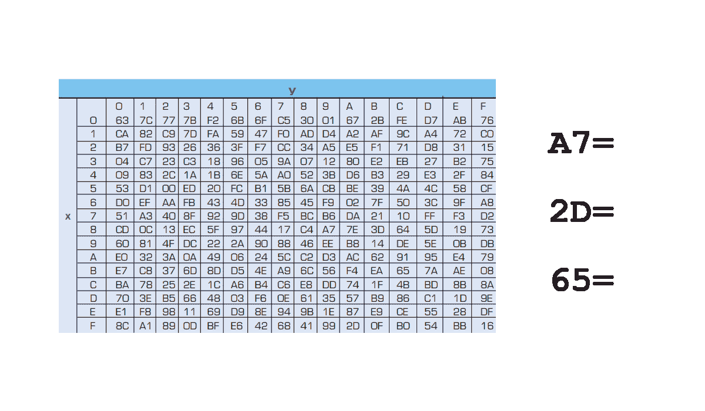
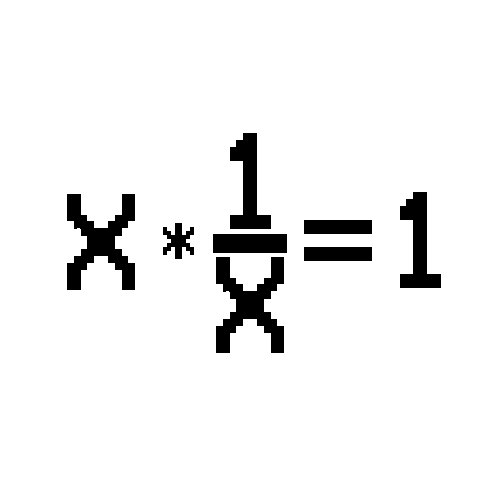
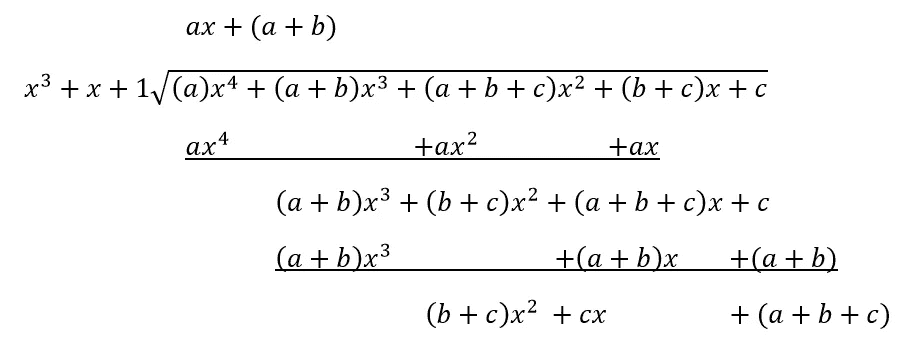
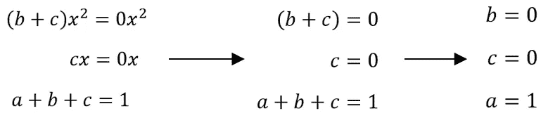
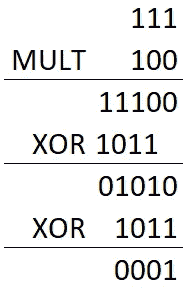
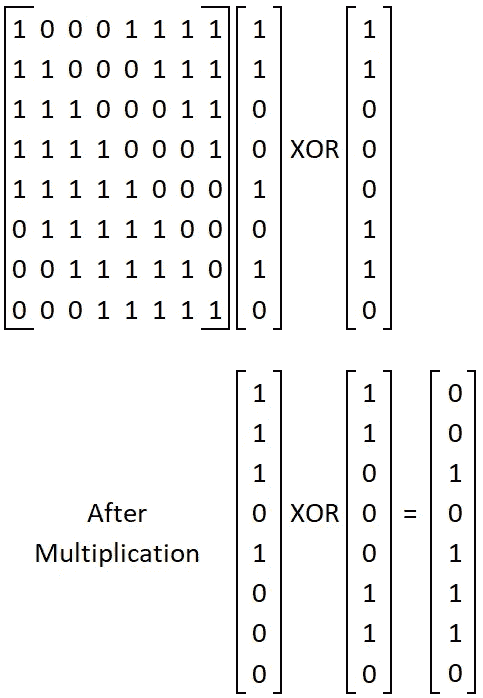

# 替代——后续行动

> 原文：<https://medium.com/analytics-vidhya/bytesubstitution-a-follow-up-1806affdadd8?source=collection_archive---------8----------------------->

最近我发表了一篇关于静态加密 的文章，其中我讨论了“ **Rijndael 密码**的工作原理。一种特殊的加密算法，通常称为高级加密标准(AES)。

本文旨在提供一种替代方法来执行 ByteSubstitution，但不需要阅读上一篇文章。它可以通过两种方式之一实现:

*   通过使用查找表来执行替换
*   通过数学计算替代



使用表进行 ByteSubstitution

在我以前的文章中，我无法证明增加数学方法的长度是合理的。这就是我打算在这里做的。我不会假设你已经读过我以前的文章(尽管如果你读过，我会很感激)。如果你有的话，你会注意到这里有些重复，因为我提到了一些必要的话题。

首先，我需要介绍一个我感兴趣的新领域:*伽罗瓦域。*

# 伽罗瓦域

我发现这是一个非常有趣的数学分支。伽罗瓦域创建了一个在其中工作的有限域。这极大地限制了可用于计算的数字范围。这是一个我曾以为自己很熟悉的概念(来自[模运算](http://bit.ly/ModuloMethod))，但我没想到它能给你必须进行的计算带来多大的改变。


传统上，数学涉及无限的领域。我们可以看到非常大的负数，也可以看到非常大的正数。但是有限域对此有很大的限制。为了理解什么是有限域，考虑一个模拟时钟。手在脸部周围移动；1，2，3，…，11，12，然后回到 1。

除非你的钟坏了，否则你会看到指针在数字的循环排列中来回移动。这就是有限域所做的，它有一个数字范围，当它变得太高时，它会循环回到最小值(再次，想想模运算)。

不幸的是，伽罗瓦域并不那么简单。在伽罗瓦域中，你看到的数字是用多项式表示的(例如，x +x +1)。因此，要循环你的伽罗瓦域，你需要用一个“不可约多项式”来执行模运算。不可约多项式的实际结构是由你使用的特定伽罗瓦域定义的。例如，在 AES 中它是:x⁸+x⁴+x +x+1。

我还需要提到伽罗瓦域的两个边界:基数和有效数字的个数。

有效数字很简单，这只是一个数字中出现了多少个字符。“1234”有 4 个有效数字，“111”有 3 个。只是数字有多长而已！


十六进制中的字母怎么会是数字

基数是它使用的符号范围。我们最习惯于十进制基数，它有十个数字；0, 1, 2, 3, 4, 5, 6, 7, 8, 9.这给了我们一个 10 的基数。二进制是另一种在计算机中经常提到的基数，它有两个数字；0, 1.这给了我们一个 2 的基数。最后，十六进制是计算中使用的另一种常用基数，它有十六个“数”；0，1，2，3，4，5，6，7，8，9，A，B，C，D，E，f，这就给了我们一个基数‘16’。所以基数就是我们能接触到的符号的数量。

这些边界可以用速记的方式放在一起，告诉你伽罗瓦域的大小和范围。例如在 AES 中我们有: *GF(2⁸).“GF”告诉我们这是一个伽罗瓦域。“2”告诉我们基数(二进制)。最后，'⁸'告诉我们有效数字的数目。因此，我们有一个二进制的伽罗瓦域，有 8 个有效数字。*

# 求乘法逆运算

从小数的角度来看，这是一项极其容易完成的任务。乘法逆运算只是问了一个问题:

> "如果我有 x，我可以把它乘以什么得到‘1’？"



使用十进制系统，你会得到`x * 1/x = 1`。但那也是在无限域上。ByteSubstitution 的情况并非如此。

首先，我们使用二进制，这实际上使一些算法更容易。然而，与有限域相结合，它导致一个数看起来与其倒数不太相关。例如，这两个数是二进制的，互为倒数的乘积；`111`和`100`。这具体就是在 *GF(2 )* 中用一个不可约多项式 x +x+1 (1x +0x +1x+1 二进制去`1011`)。我将使用这些数字，和这个域，作为一个例子来说明如何求逆，并证明这些是彼此的逆。

我们将从把`111`变成多项式开始。这就变成了 x +x+1。接下来我们需要一个未知变量的多项式。我们取在不可约多项式(x)中找到的最高阶，将其减一，并将其用作未知多项式中的最高阶。然后将每个订单乘以一个未知变量(' a '，' b '，' c '等)。这就产生了:ax +bx+c。

接下来，我们将已知数乘以未知多项式，并简化为:

```
(x^2 + x + 1) * (ax^2 + bx + c)
= ax^4 + bx^3 + cx^2 + ax^3 + bx^2 + cx + ax^2 + bx + c
= (a)x^4 + (a+b)x^3 + (a+b+c)x^2 + (b+c)x + c
```

有了这个长多项式之后，我们需要用不可约多项式来约它。这是通过长除法完成的，取余数作为答案(类似于模运算)。



简单地说，你可能会想，当这是长除法时，为什么没有负值。这是对二进制数执行这些计算的主要好处之一。因为二进制是模 2 '+1 '等价于'-1 '，所以我们可以把任何负数当作正数。

第二个好处(这个例子没有强调)是可以忽略 2 的倍数。也就是说，如果我们有了‘2ax’，例如，那就相当于‘0’。这又回到了模运算:`2 mod 2 = 0`。

现在我们已经完成了除法，我们只需让结果等于“1”(或者说，0x +0x+1)，将每个多项式项配对，并计算每个未知数的值:



用我们上面的计算来填充我们的未知多项式，我们得到 1x +0x+0。将它从多项式转换成二进制，我们得到`100`。这是意料之中的。


使用 XOR 的模运算示例

为了证明这两者是互逆的，我们将`111`乘以`100`，然后对`1011`取模得到结果。计算这一点的一个简单方法是在不可约多项式(1011)和乘法乘积(111*100)之间重复执行 XOR 运算，每个运算的最高有效“1”排成一行。左边可以看到这种排列的例子。一旦 XOR 运算的结果(忽略前导 0)比不可约多项式短，我们就有了答案。



从左边的例子中可以看出，两个数相乘并相除后，结果都是“1”。这证明了这两个数是互逆的。(尽管这是一个伽罗瓦域，但逆运算仍然相乘得到‘1’)

我们用同样的方法找到了 GF(2⁸场中的反演，但是需要做更多的工作。这个因素促使我编写一个 python 脚本来执行这样的操作。

你可以在这里 找到我的 GitHub 求乘法逆[*的要诀。这不是最有效的脚本，它使用二进制数的字符串表示，而不是二进制数。它不是为在任何主要程序中实现而设计的，而是作为在 AES 伽罗瓦域上计算逆的辅助。因此，它期望理想化的(8 位长)输入。由于这个声明的、预期的输入，没有实现太多的错误检测。*](https://gist.github.com/HughGDA/bbd29ebef73d7a0d9f8bd337864d075c)

# by 替代

现在，我们可以找到一个二进制数的乘法逆，我们可以执行 ByteSubstitution 的最后一步。首先，我们从 1F 的移位二进制表示(十六进制)生成一个 8*8 矩阵。用二进制表示它`00011111`。第一行移动 1，第二行移动 2，第三行移动 3，依此类推。其结果如下面的第一个矩阵所示。



然后将该矩阵乘以计算出的逆矩阵，逆矩阵的最低有效位(数字中最右边的字符)排列在 1*8 矩阵的顶行，最高有效位排列在底行。作为一个例子，我们以`01010011`为例，它是`11001010`的倒数。

最后，乘积矩阵与包含数字`01100011`的列矩阵进行异或运算。最低有效位在顶行，就像倒数一样。

现在我们有了答案，让我们从一个矩阵重新排列成一个行号:`01110100`。然后，我们希望将 this 和`11001010`从二进制转换为十六进制，这样我们就可以将我们的输入和输出与本文开头的查找表进行比较。如果它们匹配，则表明这是使用查找表的数学替代方法。

```
11001010:
(1100 = 'C', 1010 = 'A')01110100:
(0111 = '7', 0100 = '4')
```

回头看我们的表，取‘C’为 X，取‘A’为 Y，我们发现我们的 ByteSubstitution 是‘74’。正如我们上面计算的一样！

这一切都变成了一个漫长的过程，需要反复进行。这是我编写的执行 ByteSubstitution 步骤的 python 脚本。这需要与我的乘法逆脚本格式相同的值，并使用逆步骤的输出。

我希望你发现这是有益的。如果你有任何问题或评论(或批评)，你可以在 LinkedIn 上通过[https://www.linkedin.com/in/hugh-gallagher/](https://www.linkedin.com/in/hugh-gallagher/)找到我

> **所有观点均为我个人观点，不代表甲骨文**