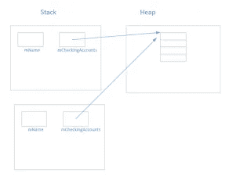

# C++高级类和对象

> 原文：<https://medium.com/analytics-vidhya/c-advanced-classes-and-objects-4455a84898db?source=collection_archive---------18----------------------->


由[麦克斯韦·纳尔逊](https://unsplash.com/@maxcodes?utm_source=unsplash&utm_medium=referral&utm_content=creditCopyText)在 [Unsplash](https://unsplash.com/s/photos/c%2B%2B?utm_source=unsplash&utm_medium=referral&utm_content=creditCopyText) 上拍摄的照片

# 老友记

类可以将其他类、其他类的成员函数等声明为*友元*，并且可以访问`protected`和`private`数据成员和方法。例如，给定两个类`A`和`B`，
，你可以说`B`是`A`的朋友，如下所示:

```
class A
{
    friend class B;
}
```

现在`B`的所有方法都可以访问`private`和`protected`的数据成员和`A`的方法。

# 对象中的动态内存分配

如果事先不知道需要多少内存，对象可以动态分配内存。假设上一篇文章中的`CheckingAccount`类更新如下，以包含帐号:
`checkingaccount.h`:

```
#ifndef CHECKING_H
#define CHECKING_H
#include <string>
using std::string;
class CheckingAccount
{
    public:
        CheckingAccount(std::string accountNumber, double balance);
        ~CheckingAccount();
        void deposit(double amount);
        bool withdraw(double amount);
        double getBalance() const;
        string getAccountNumber();
    private:
        std::string mAccountNumber;
        double mBalance;
} 
#endif
```

`checkingaccount.cpp`:注意`::`操作符是*范围解析操作符*。

```
string CheckingAccount::getAccountNumber()
{
    return mAccountNumber;
}
CheckingAccount::CheckingAccount(string accountNumber, double balance) //constructor
{
    mBalance = balance;
    mAccountNumber = accountNumber;
}void CheckingAccount::deposit(double amount)
{
    mBalance += amount;
}bool CheckingAccount::withdraw(double amount)
{
    if((mBalance - amount) > 0)
    {
        mBalance -= amount;
        return true;
    }
    return false;
}double getBalance() const
{
    return mBalance;
}
//Destructor not implemented yet as there is no dynamic memory allocated.
```

那么一个简单的`Bank`类就可以被看作是一个`CheckingAccount`的集合。

`bank.h`:

```
#ifndef BANK_H
#define BANK_H
#include <string>
#include "checkingaccount.h"
using std::string;
class Bank
{
    public:
        Bank(string name, int numAccounts);
        void depositIntoCheckingAccount(string accountNumber, double depositAmount);
        void withdrawFromCheckingAccount(string accountNumber, double withdrawAmount);
        CheckingAccount& getCheckingAccount(string accountNumber);
        string getName();
        int getNumAccounts();
    private:
        string mName;
        int mNumAccounts;
        CheckingAccount* mCheckingAccounts = nullptr; //in modern C++ will use vector<CheckingAccount>
}
#endif
```

`bank.cpp`:

```
Bank::Bank(string name, int numAccounts) : mName(name), mNumAccounts(numAccounts)
{ 
    mCheckingAccounts = new CheckingAccount[numAccounts];
}
```

该记忆可以如下可视化:


`getCheckingAccount`、`depositIntoCheckingAccount`、`withdrawFromCheckingAccount`的实现如下:

`bank.cpp`:

```
CheckingAccount& Bank::getCheckingAccount(string accountNumber)
{
    CheckingAccount* checkingAccount = new CheckingAccount("",0.0);
    for(int i = 0; i < numAccounts; i++)
    {
        if(mCheckingAccounts[i].getAccountNumber == accountNumber)
        {
            return mCheckingAccounts[i];
        }
    }
    return *checkingAccount;
}void Bank::depositIntoCheckingAccount(string accountNumber, double depositAmount)
{
    CheckingAccount& account = getCheckingAccount(accountNumber);
    if(account.accountNumber != "")
    { 
        account.deposit(depositAmount);
    }
    else
    {
        cout << "Couldn't retrieve account with number "<< accountNumber;
        //handle error condition here.
    }
}void Bank::withdrawFromCheckingAccount(string accountNumber, double depositAmount)
{
    CheckingAccount& account = getCheckingAccount(accountNumber);
    if(account.accountNumber != "")
    { 
        account.withdraw(depositAmount);
    }
    else
    {
        cout << "Couldn't retrieve account with number "<< accountNumber;
        //handle error condition here.
    }
}
```

# 使用析构函数释放内存

释放对象动态分配的内存的地方是*析构函数*。下面是`Bank`类的析构函数:

`bank.cpp`:

```
Bank::~Bank()
{
    delete[] mCheckingAccounts;
}
```

# 复制构造函数和赋值运算符

编译器生成的复制构造函数和赋值运算符只提供浅层副本。使用默认复制构造函数时，浅复制的问题如下:

```
Bank b1("123",5);
printBankInfo(b1);void printBankInfo(Bank b)
{
    //code to print bank information
}
```

当`b1`被传递给`printBankInfo`时，对象的一个浅层副本就产生了，所以内存看起来如下:



当`printBankInfo`存在时，`b1`的副本被销毁，所以`b1`现在指向被释放的内存。这就是所谓的悬空指针问题。使用赋值操作符，还有一个额外的问题，即被覆盖对象持有的原始内存被孤立，并导致*内存泄漏*。

因此，最好提供自己的复制构造函数和重载赋值运算符，如下所示:

```
Bank::Bank(const Bank& src) : Bank(src.mName, src.mNumAccounts)
{ 
    for(int k = 0 ; k < mNumAccounts; k++;)
    { 
        mCheckingAccounts[k] = src.mCheckingAccounts[k];
    }
}
```

*复制交换*习语用于以异常安全的方式实现赋值操作符。一个非成员`swap()`函数被实现为`Bank`类的朋友:

```
class Bank
{
    public:
        Bank& operator=(const Bank& rhs);
        friend void swap(Bank& first, Bank& second) noexcept;
}
```

`swap`使用`<utility>`头文件中的`std::swap`函数交换每个数据成员:

```
void swap(Bank& first, Bank& second) noexcept
{
    using std::swap;
    swap(first.mAccountNumber, second.mAcccountNumber);
    swap(first.mNumAccounts, second.mNumAccounts);
    swap(first.mCheckingAccounts, second.mCheckingAccounts);
}
```

那么赋值运算符如下:

```
Bank& Bank::operator=(const Bank& rhs)
{
    if(this == &rhs)
    {
        return *this;
    }
    Bank temp(rhs);
    swap(*this,temp);
    return *this;}
```

# 不允许赋值和按值传递

通过使用`delete`标记复制构造函数和赋值操作符，可以禁止使用赋值和按值传递，如下所示:

```
class Bank
{
    public: 
        //...
        Bank(const Bank& src) = delete;
        Bank& operator=(const Bank& rhs) = delete;
}
```

# 移动语义介绍

通过*移动语义*，程序员提供了*移动构造函数*和*移动赋值操作符*。当源对象是可以在操作完成后销毁的临时对象时，可以使用这些方法。move 构造函数和赋值运算符将数据成员从源对象“移动”到目标对象，使源对象处于不确定状态。该过程将所有权转移到目标对象。本质上，浅拷贝完成了，分配的内存和其他资源的所有权被切换到目标，以防止悬空指针和内存泄漏。

# 右值和右值引用

左值是你可以获取地址的东西，例如一个命名的变量。左值出现在赋值的左边。一个*右值*是任何不是左值的东西，比如一个文字或者一个临时对象或者值。通常右值在赋值的右边。

右值引用是对右值的引用，特别是当右值是临时对象时。右值引用允许在涉及临时对象时调用特定的函数。结果是，不是复制大值，而是复制指向这些值的指针，然后销毁临时对象。

通过使用`&&`作为参数列表的一部分，函数可以指定一个右值引用参数。通常，一个临时对象是一个`const type&`，但是当函数被一个右值引用重载时，一个临时对象可以被解析为那个重载。示例:

```
void foo(string& message)
{
    cout << "Message with lvalue reference" << endl;
}void foo(string&& message)
{
    cout << "Message with rvalue reference" << endl;
}
```

在这个例子中，`foo()`接受左值被称为:

```
string a = "hello";
string t = "world";
foo(a);
```

如果表达式作为参数给出，则调用右值版本

```
foo(a + t);
```

文字也会触发右值版本的调用。如果左值版本被删除，执行类似于`foo(a)`的操作将会导致错误，因为右值引用不能绑定到左值。要将左值转换为右值，请使用`std::move`:

```
foo(std::move(a))
```

注意，一旦一个右值在一个函数中，它就变成了左值，因为它被命名为。要将它传递给需要右值的函数，需要使用`std::move()`。

# 实现移动语义

移动语义是通过使用右值引用来实现的。需要实现一个*移动构造函数*和*移动赋值操作符*。应该用`noexcept`限定符来标记它们，以表明它们不会抛出异常。使用`Bank`类的例子:

```
class Bank
{
    public: 
        Bank(Bank&& src) noexcept; //move constructor
        Bank& operator=(Bank&& rhs) noexcept; //move assignment operator private:
        void cleanup() noexcept;
        void moveFrom(Bank &src) noexcept;
}
```

*未完待续*

# 参考资料:

m .格雷瓜尔(2018)。*专业 C++* 。印第安纳州，约翰·威利的儿子们。

[](https://codingadventures1.blogspot.com/2020/02/advanced-classes-and-objects-part-i.html) [## 高级类和对象第一部分

### 类可以将其他类、其他类的成员函数等声明为朋友，并且可以访问受保护的和私有的…

codingadventures1.blogspot.com](https://codingadventures1.blogspot.com/2020/02/advanced-classes-and-objects-part-i.html)