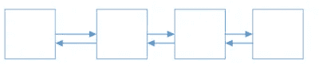

# C++标准模板库介绍

> 原文：<https://medium.com/analytics-vidhya/c-intro-to-standard-template-library-f9b9aded007d?source=collection_archive---------33----------------------->


弗兰克·麦肯纳在 [Unsplash](https://unsplash.com/s/photos/container?utm_source=unsplash&utm_medium=referral&utm_content=creditCopyText) 上拍摄的照片

# STL 简介

容器公开了*迭代器*接口，算法在*迭代器*上工作。

# `std::vector`

遍历向量的例子如下。迭代器的行为类似于增强指针。

```
#include <iostream>
using namespace std;int main()
{
    vector<int> nums;
    nums.push_back(3);
    nums.push_back(1);
    nums.push_back(2); vector<int>::iterator first = nums.begin();
    vector<int>::iterator onePastLast = nums.end(); for(vector<int>::iterator i = first; i != onePastLast; i++)
    {
        cout << "Next Element is " << *i << endl;
    } //sorting a vector
    sort(first,onePastLast); //after sorting 1,2,3
}
```

# 容器的类型

*   序列容器(数组和链表):vector、deque、list、forward list 和 array
*   关联容器(二叉树) :集合、多重集合、映射和多重映射
*   无序容器(哈希表) :无序集/多重集，无序映射/多重映射

## 序列容器

向量是一个单向增长的动态数组。它有一个返回大小的`size()`成员函数。可以使用索引操作符`[]`访问向量。然而，使用该操作符
不提供范围检查。使用`vec.at(2)`，它会抛出指数超出范围异常。C++11 遍历向量的方式是:

```
for(auto& v : vec)
{
    cout << "Element is "<< v << endl;
}
```

`empty()`可以检查容器是否是空的。`size`提供容器的大小。`clear()`移除容器中的所有项目。`swap`交换两个容器的内容。

## 矢量的性能特征

*   O(1)在末尾插入/移除
*   O(N)在开头或中间插入/删除
*   搜索

## 双端队列

deque 可以在结尾或开头增长。示例:

```
deque<int> q = {1,2,3};
deq.push_front(5); 
deq.push_back(10);cout << deq[2] << endl;
```

## 德克的性能特点

*   O(1)在开头或结尾插入/删除
*   O(N)在中间插入/移除
*   搜索

## 目录

列表是一个双向链表，可以按如下方式可视化:



列表在列表中的任何地方提供快速插入/移除。

## 列表的性能特征

*   O(1)在任何地方插入/移除
*   搜索
*   随机存取

代码示例:

```
list<int> lst = {5,2,9};
lst.push_back(6);
lst.push_front(10);list<int>::iterator foundLoc = find(lst.begin(), lst.end(), 2);
lst.insert(foundLoc,8); //{5,8,2,9}foundLoc++; //iterator points to 9
lst.erase(foundLoc); //removes 9
```

因为 vector 将数据存储在连续的内存块中。因此，当它被放入缓存时，很多数据都可以被缓存。但是，对于链表，可能会有许多缓存未命中。

列表可用于快速拼接:

```
lst.splice(itr,mylist2,itr_one, itr_two);
```

前向链表就像链表一样，只是它是单向链接的。

STL 为原生数组提供了一个薄薄的包装。但是它们不能动态调整大小。

```
array<int 3>a = {3,4,5};
```

## 关联容器

关联容器由二叉树实现，并且总是被排序。按照“push_back()或`push_front()`。

集合不提供重复的项目。插入需要 O(N log N)。成员函数`find`花费 O(log N)时间。`insert`函数返回一对值(`pair<set<int>::iterator, bool>ret`)。

```
set<int> st;
st.insert(3);
st.insert(1);
st.insert(2); {1,2,3}
```

`multiset`允许重复项目。插入总是成功的。对于 set 和 multiset，元素的值不能修改。

## 集合/多重集合的属性

*   o(对数)搜索
*   与向量和队列相比，遍历速度较慢
*   没有随机访问

## 地图/多功能地图

Map 和 multimap 处理键和值。

```
map<char,int> mymap;
mymap.insert(make_pair('a',100));map<char,int>::iterator it = mymap.begin();it = mymap.find('a'); //O(log(n))//printing out:
for(it = mymap.begin() ; it != mymap.end(); it++)
{
    cout << (*it).first << "=>" << (*it).second << endl;
}
```

多重映射允许重复键。地图是根据关键字排序的。Set 和 multimap 是 map/multimap 的特例，其中键与值相同。

## 无序关联容器(C++11)

无序容器是由哈希表实现的。在哈希表中查找元素是 O(1)。

```
unordered_set<string> myset = {"Red", "Green", "Blue"};
unordered_set<string>::const_iterator it = myset.find("Green"); //Amortized O(1)
if(it != myset.end()) //need to check!
{
    cout << "Found " << *it << endl;
}vector<string> myvec = {"Teal","Purple"};
myset.insert(myvec.begin(), myvec.end());
```

分摊的 O(1)可能会因为哈希冲突而降级。无序映射示例:

```
unordered_map<char, string> day = {{'S',"Sunday"}, {'M',"Monday"}};cout << day['S'] << endl; //has no range check
cout <<day.at['S'] << endl; //has range checkday['W'] = "Wednesday"; //same as inserting. Can modify existing member
day.insert(make_pair('T',"Thursday"));
```

multimap 和 unordered_multimap 不能用于关联数组，因为它们没有唯一键，也没有实现`[]`操作符。

STL 提供了容器适配器堆栈(LIFO)、队列(FIFO)和优先级队列-第一项具有最高优先级。基于数组的容器，如 vector 和 deque，可能会在添加/删除元素时使指针(原始指针、迭代器和引用)失效。

# 参考

https://www.youtube.com/watch?v=gxZJ5JNuWMY 伯虔 STL 视频:

[](https://codingadventures1.blogspot.com/2020/02/stl-part-i.html) [## STL 第一部分

### 容器暴露接口，算法在迭代器上工作。遍历一个向量的例子是…

codingadventures1.blogspot.com](https://codingadventures1.blogspot.com/2020/02/stl-part-i.html)