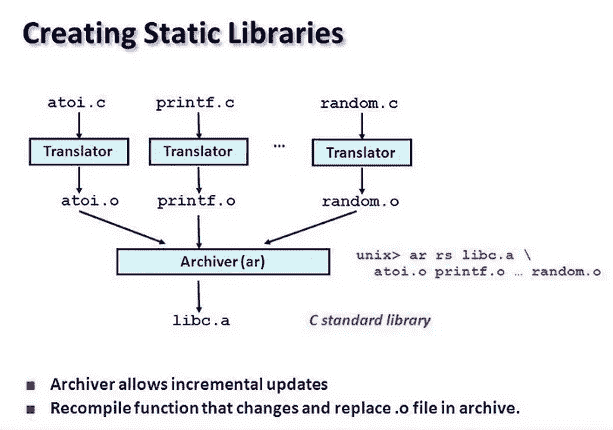
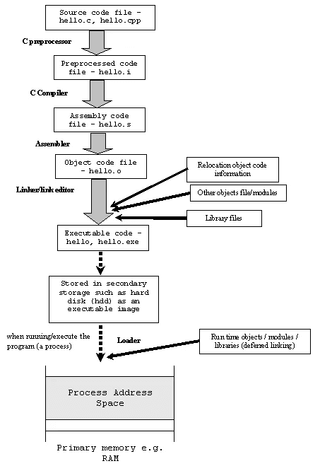
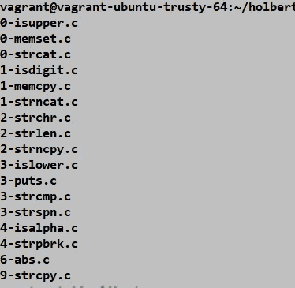
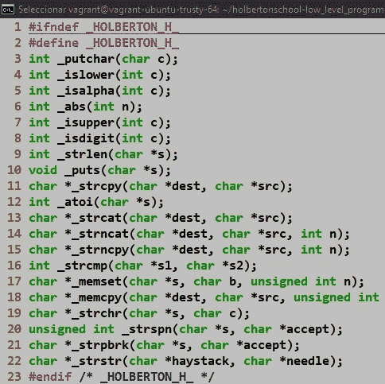
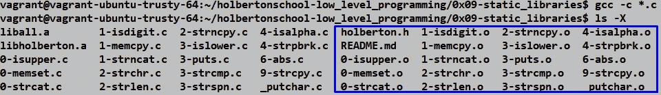
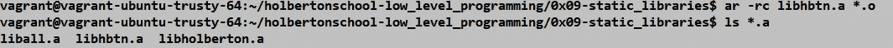
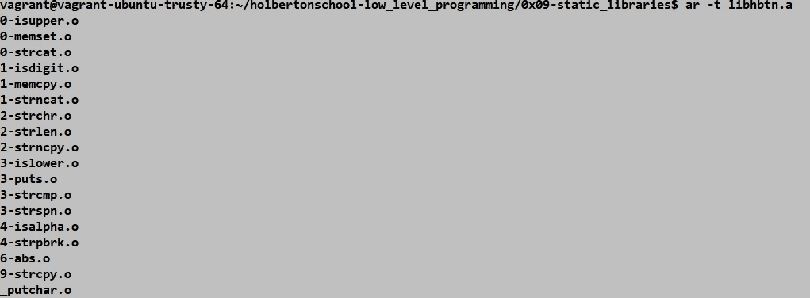
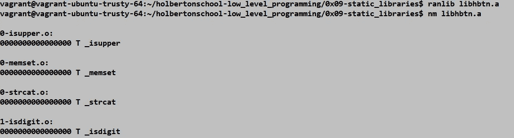
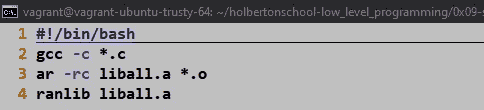

# c 库，简单总结！—第 1 部分(静态库)

> 原文：<https://medium.com/analytics-vidhya/c-libraries-a-brief-summary-8ad7aa735046?source=collection_archive---------23----------------------->


库是一组功能实现，通常按照它们的效用进行分组，用编程语言进行编码，并提供一个定义良好的具有被调用功能的接口。这意味着我们可以找到一组预定义的功能(标准库 C 和标准库 ANSI C)或由另一个人编译，在本出版物中，我们将关注我们每个人都可以创建的库，这些自定义库称为静态库

## 静态库—定义。

> 在计算机科学中，**静态库**或**静态链接库**是一组例程、外部函数和变量，它们在编译时在调用程序中被解析，并由编译器、链接器或绑定器复制到目标应用程序中，产生目标文件和独立的可执行文件。来源:[http://tldp . org/how to/Program-Library-how to/static-libraries . html](http://tldp.org/HOWTO/Program-Library-HOWTO/static-libraries.html)

## 为什么使用库:

如前所述，一个库集合了一组函数、变量和其他函数，提供了一组可能有或没有共同用途的实用程序，例如数学库是一个标准的 C 语言库，设计用于基本的数学运算。

与数学库不同，静态库是我们可以根据正在开发的项目创建一组函数的库。理解库的目的是保存代码也是很重要的，要理解这一点，你必须记住函数是可以在程序的另一部分重用的代码块，当你把一个函数放在库中时，你就给了程序调用它的能力，只要你需要，不需要重写它，在不同的程序中。



## 它们是如何工作的

要理解一个库是如何工作的，你必须记住编译 C 程序时会发生什么，步骤如下

1-预处理:解释所有已经使用过的预处理指令，比如#define、#include、#ifdef 等…此外，它还会删除文件中写的所有注释。

2-编译:编译将 C 代码转换成我们机器的处理器的汇编语言。

3-汇编:汇编将汇编语言编写的程序转换成目标代码，目标代码是处理器可执行的机器语言二进制文件。

4-链接:目标文件链接在一起形成可执行文件。C 函数包含在代码中。此时，目标代码中的一个或多个模块会遇到库中的现有代码。

静态库是扩展文件(。a)通过 *ar* 命令生成(在以下段落中解释)，从目标文件中获取所有信息，并在链接阶段连接包含在库文件中的所有信息，以便可执行文件可以正确地与自定义库一起工作。



## 如何创建它们

1.您必须将包含所有要添加到库中的函数的所有文件放入库中。确保用每个函数的原型创建头文件，记住在文件的顶部写*# ifndef _ HOLBERTON _ H _ # define _ HOLBERTON _ H _*指令，在文件的结尾写 *#endif* 。



c 文件



头文件。

2.在这一步中，您必须编译所有文件(。c)直到装配阶段(。o)，这意味着生成目标文件。要对文件夹中的所有文件自动执行此步骤，您必须执行以下命令

```
*$ gcc -c *.c*
```

c 标志用于编译，直到汇编阶段。



目标文件。

3.创建静态库(。a)对于所有的目标文件，如果已经创建了库，则使用 ar 命令和-r 标志来更新库，如果库不存在，则使用|-c 标志来创建库。

```
*$ ar -rc libhbtn.a *.o*
```



在这种情况下，通配符(*)被用来生成带有所有目标文件的库文件夹，如果需要，可以逐个指定每个文件。

如果您想查看该库包含哪些函数，可以使用带有-t 标志的 ar 命令



4.为了使库具有更好的性能，有必要通过符号链接对其进行索引，这使得链接阶段执行得更快。这个过程是通过 ranlib 命令完成的。可以使用命令 nm 查看库中的符号，该命令列出了目标文件中每个符号的符号值、符号类型和符号名称。

```
$ ranlib libhbtn.a$ nm libhbtn.a
```



最后，如果您想自动执行这个过程，您可以创建一个脚本来执行前面的步骤。记得给这个脚本分配执行权限。

```
#!/bin/bash
gcc -c *.c
ar -rc liball.a *.o
ranlib liball.a
```



## 如何使用静态库？

要使用这个库，必须在编译文件时调用它。c)这需要它。在这种情况下，main.c 文件、gcc 编译器(GNU 编译器集合)将与以下标志一起使用。

-l <library_name without="" lib="" prefix="" and="" .a="" extension="">，这个标志添加了前缀和扩展名，这就是为什么你不能写它们。
-L .，指定库的路径。我们可以用它来指向当前目录，用-L / home / tmp 来指向/ home / tmp 目录。
-o，允许你给编译的输出指定一个特定的名字</library_name>

```
$ gcc main.c -L. -lhbtn -o maincompile
```

# 参考

*   gcc 官方编译器页面:[https://gcc.gnu.org/](https://gcc.gnu.org/)
*   构建和使用静态和共享的“C”库:[https://docencia . AC . UPC . edu/FIB/USO/Bibliografia/UNIX-C-Libraries . html # what _ is _ a _ library](https://docencia.ac.upc.edu/FIB/USO/Bibliografia/unix-c-libraries.html#what_is_a_library)
*   ar Linux 手册页:【http://man7.org/linux/man-pages/man1/ar.1.html 
*   ranlib Linux 手册页:【http://man7.org/linux/man-pages/man1/ranlib.1.html 