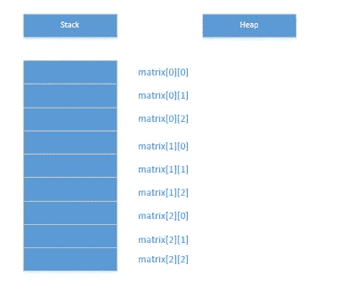

# C++内存管理

> 原文：<https://medium.com/analytics-vidhya/c-memory-management-a3c1651329bc?source=collection_archive---------13----------------------->

# 可视化记忆

下面是内存如何查找堆栈/自动变量的示例:

```
int foo()
{
    double d = 3.0;
    return 0;
}
```


注意当`foo`的作用域结束时`d`被释放。在堆上分配内存时，图片如下所示。指针在堆栈上，分配的内存在堆上。

```
int foo()
{
    double * dptr = new double;
}
```


下一个示例显示了位于堆上的指针:

```
float **ptrToPtr = new float*;
*ptrToPtr = new float;
```


# 使用`new`和`delete`

不要使用 C 中的`malloc`和`free`，因为它们没有对象初始化和销毁的概念。使用`new`和`delete`代替。使用`new`分配内存，使用`delete`释放内存。当使用原始指针时，每个对`new`的调用必须与对`delete`的调用成对出现。如果系统内存不足，对`new`的调用可能会失败，所以必须有某种方法来处理这种情况。

# 数组

人们可以将阵列视为保存相同类型数据的连续内存位置，类似于邮箱的排列方式。在堆栈上创建数组时，大小必须在编译时已知。基于堆栈的阵列示例:

```
int ary[5] = {0};
```


在堆上使用数组是类似的，只是大小可以在运行时确定。示例:

```
#include <iostream>
using namespace std;
int main()
{
    int numElems = 0;
    cout << "Enter the number of elements for the array" <<endl;
    cin >> numElems; int* aryPtr = new int[numElems];
}
```

如果用户输入 3，可视化如下:


对数组版本 new ( `new[]`)的每次调用都应与数组版本 delete ( `delete[]`)成对出现，如下所示:

```
delete[] aryPtr;
aryPtr = nullptr;
```

# 对象数组

对象数组类似于基本类型的数组。示例:

```
class Basic
{
    public: 
        Basic() {cout << "Basic constructor called" << endl;}
        ~Basic() {cout << "Basic destructor called" << endl;}
};
```

如果分配 3 个`Basic`对象的数组，则`Basic`构造函数被调用 3 次:

```
Basic* basicAryPtr = new Basic[3]; 
/*Use basicAryPtr here */delete[] basicAryPtr;
basicAryPtr = nullptr;
```

照常使用 delete 的数组版本来释放内存，并让析构函数调用相同的次数。

如果在堆上存储指向对象的指针，必须在如下所示的循环中调用`new`和`delete`:

```
int numElems = 3;
Basic **ptrToBasicPtrs = new Basic* [numElems];for(int k = 0; k < numElems; k++)
{
    ptrToBasicPtrs[k] = new Basic();
}//Use the objectsfor(int k = 0; k < numElems; k++)
{
    delete ptrToBasicPtrs[k];
}//delete the stack pointer
delete[] ptrToBasicPtrs;
ptrToBasicPtrs = nullptr;
```

使用 STL 容器存储智能指针比使用数组存储原始指针更好。

# 多维数组

多维数组可以被认为是一个由行和列组成的表格。示例:

```
double matrix[3][3];
```


然而，在内存中，多维数组以*行主*顺序线性存储:



# 多维堆数组

多维数组更棘手，因为需要更多的手动内存分配。下图显示了多维数组在堆上的样子:


要为类似于上图中的二维数组分配内存，必须执行以下操作

```
double** allocateMatrix(int numRows, int numCols)
{
    double** myMat = new double*[numRows];
    for(int i = 0; i < numRows; i++)
    {
        myMat[i] = new double[numCols];
    }
    return myMat;
}
```

要取消分配内存，必须执行以下操作:

```
void deallocateMatrix(double** myMat, int numRows)
{
    for(int i = 0; i < numRows ; i++)
    {
        delete[] myMat[i]; //Delete columns
    }
    delete[] myMat; //delete rows
}
```

在现代 C++代码中，更喜欢使用`vector<T>`而不是普通数组。对于二维数组，例如使用`vector<vector<double>>`。

# 指针转换

指针的大小总是一样的，不管它们是指向`int`还是`double`的指针。可以通过以下方式对指针执行强制转换:

第一种是 C 样式的强制转换(不推荐使用，并且不提供类型安全):

```
XMLDocument* docPtr = getXMLDocument();
char* charPtr = (char*)docPtr;
```

使用`static_cast`，编译器强制执行类型应该相关的规则:

```
XMLDocument *docPtr = getXMLDocument();
char *charPtr = static_cast<char*>(docPtr);
```

# 数组指针关系

数组名是指向数组第一个元素的指针。数组元素也可以按如下方式访问:

```
int myAry[3] = {0};
*(myArray) = 1;
*(myArray+1) = 2;
*(myArray+2) = 3;
```

如下所示:

```
myArray[0] = 1;
myArray[1] = 2;
myArray[2] = 3;
```

当数组被传递给函数时，编译器将数组视为指针。因此，对数组的更改会更改原始数组，而不是副本。

# 智能指针

最简单的智能指针`std::unique_ptr`获得资源的单一所有权，并在它超出范围或被重置时释放底层内存。当所有权被共享时，使用`std::shared_ptr`，它使用*引用计数*来跟踪对象的所有引用，并且只在最后一个引用被移除时释放内存。

## 智能指针的基本原理

即使是最简单的`new`和`delete`配对也会出问题。例如，考虑以下情况:

```
Basic* basicPtr = new Basic();
basicPtr->doWork();
delete basicPtr;
```

如果`doWork()`抛出异常，则`delete`语句不执行，导致内存泄漏。这种情况下应使用`std::unique_ptr`。当指针超出范围或抛出异常时，底层内存将被释放。使用`make_unique`定义一个`unique_ptr`:

```
auto myPtr = make_unique<Basic>();
auto myPtr2 = make_unique<Basic>(p1,p2); //constructor parameter variant.
```

因为`uniwue_ptr`代表单一所有权，所以不能复制。但是，可以使用`std::move`移动责任，如本[文章链接](https://docs.microsoft.com/en-us/cpp/cpp/how-to-create-and-use-unique-ptr-instances?view=vs-2019)所示。

为了表示共享所有权，使用`std::shared_ptr`。

```
auto owner1 = make_shared<Basic>();
std::shared_ptr<Basic> owner2(owner1);
```

# 参考资料:

m .格雷瓜尔(2018)。*专业 C++* 。印第安纳州，约翰·威利的儿子们。

[](https://codingadventures1.blogspot.com/2020/02/memory-management.html) [## 内存管理

### 下面是一个内存如何寻找堆栈/自动变量的例子:注意，当 foo 的作用域…

codingadventures1.blogspot.com](https://codingadventures1.blogspot.com/2020/02/memory-management.html)