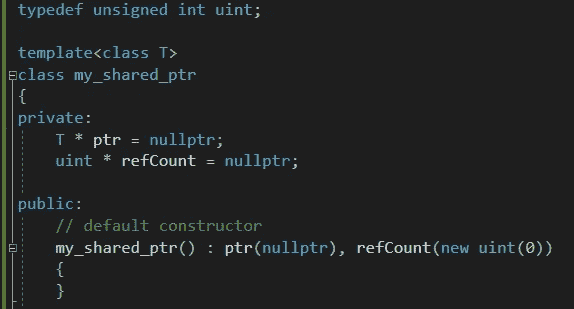

# C++: shared_ptr 以及如何编写自己的

> 原文：<https://medium.com/analytics-vidhya/c-shared-ptr-and-how-to-write-your-own-d0d385c118ad?source=collection_archive---------0----------------------->



在之前的[帖子](/@karankakwani/c-smart-pointers-and-how-to-write-your-own-c0adcbdce04f)中，我们讨论了**智能指针**——它们是什么，以及它们如何优于管理动态分配内存的普通指针。我们还学习了 STL 中的智能指针类，即`unique_ptr`，以及如何实现我们自己的智能指针类。

接下来，我们将讨论`shared_ptr`以及如何编写一个像标准 shared_ptr 类一样工作的类。`shared_ptr`是一个引用计数的智能指针，即它可以与其他`shared_ptr`实例共享动态分配对象的所有权。换句话说，几个`shared_ptr`对象可以在堆上拥有(指向)同一个内存(对象)。这与`unique_ptr`相反，其中只有一个底层原始指针的所有者。那么，`shared_ptr`是如何工作的，它是如何知道何时释放底层指针所指向的内存的呢？

`shared_ptr`维护关于多少 shared_ptr 对象拥有相同底层指针的引用计数。并且由底层指针指向的存储器在以下情况下被删除:-

1.  参考计数变为零，即最后剩下的`shared_ptr`对象被销毁。
2.  拥有该指针的最后一个剩余的`shared_ptr`对象被分配了其他指针。

`[shared_ptr](https://en.cppreference.com/w/cpp/memory/shared_ptr)`存在于标准 C++的 [<内存>](https://docs.microsoft.com/en-us/cpp/standard-library/memory?view=vs-2019) 头文件的`std`命名空间中。在这篇文章中，我们将学习如何编写自己的`shared_ptr`类。让我们称这个类为 my_shared_ptr。我们将使它成为一个模板类，以保持它独立于数据类型。就像`unique_ptr`一样，我们的类需要有一个指针。此外，我们需要一个计数变量来保存引用计数。方法如下:-

```
typedef unsigned int uint;template<class T>
class my_shared_ptr
{
private:
    T * ptr = nullptr;
    uint * refCount = nullptr;public:
    // default constructor
    my_shared_ptr() : ptr(nullptr), refCount(new uint(0))
    {
    }
};
```

请注意，refCount 变量被声明为指针。我们不能让它成为一个整数变量，因为它不可能在不同的`my_shared_ptr`对象之间保持相同的值。当然，我们也不能把它公开，因为那样会暴露这个类的一个非常重要的特性，而且它可能会被外部修改。通过使它成为一个指针，我们可以在不同的`my_shared_ptr`间共享它，所有的人都可以访问和修改同一个计数器。

然后，可以添加复制构造函数和复制赋值，如下所示

```
/*** Copy Semantics ***/// copy constructor
my_shared_ptr(const my_shared_ptr & obj)
{
    this->ptr = obj.ptr; // share the underlying pointer
    this->refCount = obj.refCount; // share refCount
    if (nullptr != obj.ptr)
    {
        // if the pointer is not null, increment the refCount
        (*this->refCount)++; 
    }
}// copy assignment
my_shared_ptr& operator=(const my_shared_ptr & obj)
{
    // cleanup any existing data // Assign incoming object's data to this object
    this->ptr = obj.ptr; // share the underlying pointer
    this->refCount = obj.refCount; // share refCount
    if (nullptr != obj.ptr)
    {
        // if the pointer is not null, increment the refCount
        (*this->refCount)++; 
    }
}
```

我们的类也将支持移动语义。我在另一篇关于如何编写自己的 STL 字符串类的[文章](/swlh/write-your-own-c-stl-string-class-e20113a8de79)中提到并简要讨论了移动语义。因此，我们可以在我们的类中有如下的移动构造函数和移动赋值

```
/*** Move Semantics ***/// move constructor
my_shared_ptr(my_shared_ptr && dyingObj)
{
    this->ptr = dyingObj.ptr; // share the underlying pointer
    this->refCount = dyingObj.refCount; // share refCount
    dyingObj.ptr = dyingObj.refCount = nullptr; // clean up dyingObj
}// move assignment
my_shared_ptr& operator=(my_shared_ptr && dyingObj)
{
    // cleanup any existing data

    this->ptr = dyingObj.ptr; // share the underlying pointer
    this->refCount = dyingObj.refCount; // share refCount
    dyingObj.ptr = dyingObj.refCount = nullptr; // clean up dyingObj
}
```

接下来，我们需要`->`和`*`操作符的操作符重载来取消对底层指针的引用。我们可以重载这些操作符，如下所示

```
T* operator->() const
{
    return this->ptr;
}T& operator*() const
{
    return this->ptr;
}
```

`const`在一个函数中签名使它成为一个常量成员函数，这保证了这个函数不会对对象做任何改变。将类的 getter 函数作为 const 成员函数是一个很好的实践。

我们可以添加其他函数——一个函数获取管理同一底层指针的不同`my_shared_ptr`实例的数量，另一个函数访问被管理的原始指针本身。

```
uint get_count() const
{
    return *refCount; // *this->refCount
}T* get() const
{
    return this->ptr;
}
```

好了，`my_shared_ptr`类已经完成，可以使用了。下面是`my_shared_ptr`类的完整实现。可以编写另一个带有`<T[]>`的模板版本来支持数组的创建。

下面是一个如何使用这个类的例子

```
#include <iostream>
using namespace std;class Box
{
public:
    int length, width, height;
    Box() : length(0), width(0), height(0)
    {
    }
};int main()
{
    my_shared_ptr<Box> obj;
    cout << obj.get_count() << endl; // prints 0 my_shared_ptr<Box> box1(new Box());
    cout << box1.get_count() << endl; // prints 1
    my_shared_ptr<Box> box2(box1); // calls copy constructor
    cout << box1.get_count() << endl; // prints 2
    cout << box2.get_count() << endl; // also prints 2

    return 0;
}
```

P/S:这可能不是 shared_ptr 类的彻底实现。这只是为了让读者了解 shared_ptr 类是如何工作的，以及如何编写自己的类。读者可以根据需要添加其他功能。