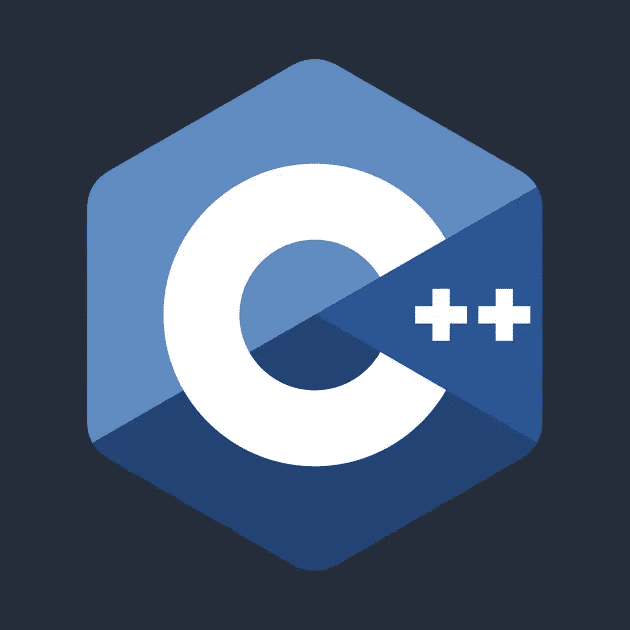

# C++:转换构造函数和转换运算符之争

> 原文：<https://medium.com/analytics-vidhya/c-the-fight-between-converting-constructor-and-conversion-operator-abef3bf4baeb?source=collection_archive---------21----------------------->



让我们考虑下面的场景，

```
Bar obj;
Foo x = obj;
```

你认为 x 的初始化会如何工作？

可能想到的一件事是，如果 Foo 有一个接受 Bar 对象的构造函数，那么我们就可以开始了。的确是这样，但是如果 Bar 也有一个转换操作符(也称为转换函数)，允许自己转换成 Foo 对象，如下所示:

```
// Snippet 1struct Foo
{
  Foo() {}
  Foo(const Bar& x)
  { 
    std::cout << "Foo Converting Constructor.\n"; 
  }
};struct Bar
{
  operator Foo()
  { 
    std::cout << "Bar conversion operator.\n";
    return Foo();
  }
};int main()
{
  // Using a temporary Bar object to create a foo object
  Foo x = Bar();              // Copy Initialization
  Foo y {Bar()};              // Direct Initialization
}
```

谁会接到电话？是否有预定义的优先顺序？我将复制和直接初始化分开的事实可能会给你一个提示，事情没有这么简单，在 C++中没有什么是简单的。

下面是打印出来的内容:

```
Bar Conversion operator.
Foo Converting Constructor.
```

让我们试着从 Foo 类中移除转换构造函数，看看会发生什么。

```
// Snippet 2struct Foo
{
  Foo() {}
  //Foo(const Bar& x)
  //{ 
  //  std::cout << "Foo Converting Constructor.\n"; 
  //}
};struct Bar
{
  operator Foo()
  { 
    std::cout << "Bar conversion operator.\n";
    return Foo();
  }
};int main()
{
  // Using a temporary Bar object to create a foo object
  Foo x = Bar();              // Copy Initialization
  Foo y {Bar()};              // Direct Initialization
}
```

输出:

```
Bar Conversion operator.
Bar Conversion operator.
```

如果没有有效的转换构造函数，似乎直接初始化将依赖于转换操作符。

无论 Foo 对象是由右值还是左值构造的，上面两个结果都是一样的。

现在，让我们停止猜测输出，理解真正发生了什么。

直接初始化的行为类似于调用一组重载的函数。这种情况下的函数是一个类的构造函数。它将执行任何隐式转换，并尝试调用构造函数，即使转换运算符提供了更好的匹配。只有当没有办法调用任何构造函数时，直接初始化才会尝试调用转换运算符。

所以在代码片段 1 中，在直接初始化期间，一个临时 Bar 对象被传递给构造函数。由于临时可以绑定到常量引用，因此调用转换构造函数。在代码片段 2 中，转换构造函数不存在，因此转换操作符被执行。

不用说，如果转换构造函数接受非常数引用，也会调用转换运算符，因为右值不会绑定到非常数引用:

```
// Snippet 3struct Foo
{
  Foo() {}
  Foo(Bar& x)
  { 
    std::cout << "Foo Converting Constructor.\n"; 
  }
};struct Bar
{
  operator Foo()
  { 
    std::cout << "Bar conversion operator.\n";
    return Foo();
  }
};int main()
{
  // Using a temporary Bar object to create a foo object
  Foo x = Bar();              // Copy Initialization
  Foo y {Bar()};              // Direct Initialization
}
```

输出:

```
Bar Conversion operator.
Bar Conversion operator.
```

对于拷贝初始化，情况就不同了。这里发生正常的过载解决。但是怎么做呢？

```
// When we say
Foo x = Bar();// The candidate functions are
Foo::Foo(T)       // Where T is parameter signature of 
                  // converting constructorBar::operator Foo()
```

对于过载解决方案，这被转换为:

```
Foo::Foo(T)       // As before// Implicit parameter is added to the conversion operator
Foo(U)        // Where U is either Bar& or Bar&&
              // Depending on whether the object being converted
              // is a lvalue or rvalue...Foo x = Bar();      // Rvalue. Hence U is Bar&&Bar z;
Foo x = z;          // Lvalue. Hence U is Bar&
```

现在，根据正常的重载决策规则，将调用最佳匹配。

记住这一点，让我们分析上面 3 个关于复制初始化的片段。

在代码片段 1 中，

```
Foo x = Bar();// Candidate functionsFoo(const Bar& x);
operator Foo(Bar&& x);           // Better match for an rvalue
```

在代码片段 3 中，

```
Foo x = Bar();// Candidate functionsFoo(Bar& x);                     // Temporary does not bind to     
                                 // lvalue reference
operator Foo(Bar&& x);           // Only match for an rvalue
```

假设我们现在已经有了坚实的理解，让我们进一步扭曲例子。

```
// Snippet 4struct Foo
{
  Foo() {}
  Foo(Bar& x)
  { 
    std::cout << "Foo Converting Constructor.\n"; 
  }
};struct Bar
{
  operator Foo()
  { 
    std::cout << "Bar conversion operator.\n";
    return Foo();
  }
};int main()
{
  Bar z;
  Foo x = z;              // Copy Initialization
  Foo y {z};              // Direct Initialization
}
```

你说现在会发生什么？

让我们先看看直接初始化。它将首先尝试调用`Foo(Bar& x)`,这将成功，因为它需要一个左值引用，我们传递给它一个左值。

现在对于拷贝初始化，

```
Foo x = z;// Candidate functionsFoo(Bar& x);                     
operator Foo(Bar& x); 
```

很明显，两个候选函数具有完全相同的签名，因此调用是不明确的。对于拷贝初始化，下面展示了相同类型的不明确行为。

```
// Snippet 5struct Foo
{
  Foo() {}
  Foo(Bar&& x)
  { 
    std::cout << "Foo Converting Constructor.\n"; 
  }
};struct Bar
{
  operator Foo()
  { 
    std::cout << "Bar conversion operator.\n";
    return Foo();
  }
};int main()
{
  Foo x = Bar();              // Copy Initialization
  Foo y {Bar()};              // Direct Initialization
}
```

如果被转换的对象是 const 怎么办？

```
// Snippet 6struct Foo
{
  Foo() {}
  Foo(const Bar& x)
  { 
    std::cout << "Foo Converting Constructor.\n"; 
  }
};struct Bar
{
  operator Foo()
  { 
    std::cout << "Bar conversion operator.\n";
    return Foo();
  }
};int main()
{
  const Bar z;
  Foo x = z;              // Copy Initialization
  Foo y {z};              // Direct Initialization
}
```

const 对象只能调用 const 成员函数，所以`operator Foo()`没有资格被调用，在这两种情况下，转换构造函数都将被调用。

# 如果转换运算符被标记为 const 会怎样？

这就是你遇到具体实现行为的地方(你没想到一篇 C++文章会以这样的东西结束？).前面我说过隐式参数不是 const 限定的。不是巴&就是巴&&。也就是说，转换运算符不是 const。

当转换操作符被标记为 const 时，它将反映在隐式参数中，该参数现在要么是 const Bar&要么是 const Bar&&。
这个规则被发现适用于**铿锵**。

将转换操作符标记为 const 似乎会使 MSVC 出错，因为在我尝试的例子中，它会转储大约 4000 行汇编代码，但不会打印任何内容。对于所有不明确的调用，GCC 似乎更喜欢转换构造函数而不是转换操作符。

```
// Snippet 7struct Foo
{
  Foo() {}
  Foo(Bar& x)
  { 
    std::cout << "Foo Converting Constructor.\n"; 
  }
};struct Bar
{
  operator Foo() const
  { 
    std::cout << "Bar conversion operator.\n";
    return Foo();
  }
};int main()
{
  const Bar z;
  Foo x = z;              // Copy Initialization
  Foo y {z};              // Direct Initialization
}
```

输出:

```
Bar Conversion operator.
Bar Conversion operator.
```

对于复制初始化，

```
const Bar z;
Foo x = z;// Candidate functionsFoo(Bar& x);                  // Not a match since it takes a 
                              // non-const ref
operator Foo(const Bar& x);   // Match
```

如果我们让 Foo 的转换构造函数接受一个常量引用，

```
const Bar z;
Foo x = z;// Candidate functionsFoo(const Bar& x);                  
operator Foo(const Bar& x);// Ambiguous
```

让我们尝试扭曲代码片段 7 来处理右值。

```
// Snippet 8struct Foo
{
  Foo() {}
  Foo(Bar&& x)
  { 
    std::cout << "Foo Converting Constructor.\n"; 
  }
};struct Bar
{
  operator Foo() const
  { 
    std::cout << "Bar conversion operator.\n";
    return Foo();
  }
};int main()
{
  Foo x = Bar();              // Copy Initialization
  Foo y {Bar()};              // Direct Initialization
}
```

输出:

```
Foo Converting Constructor.
Foo Converting Constructor.
```

对于复制初始化，

```
Foo x = Bar();     // Do note that this is a non-const rvalue. // Candidate functionsFoo(Bar&& x);                  
operator Foo(const Bar&& x);    // const rvalue references although
                                // syntactically valid, 
                                // don't make much sense.
```

重载决策总是倾向于较小的常量版本，因此 Foo 的转换构造函数被调用。

不用说，如果我们将 Foo 的转换构造函数改为`Foo(const Bar&& x);`，调用将变得不明确。

因此，我似乎已经涵盖了关于这场战斗的所有可能的场景，我希望你能从这篇文章中学到一些东西。请随时分享你对这个话题的了解，我可能会编辑这篇文章，并在其中加入你的想法。最后，如果你走到这一步，谢谢你。