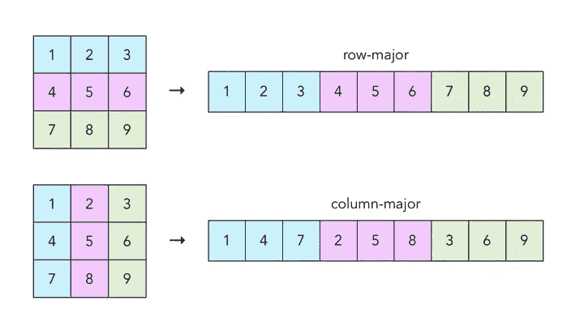
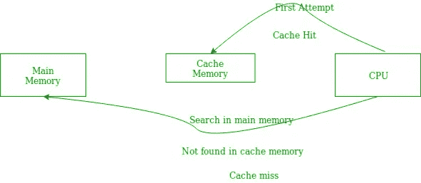
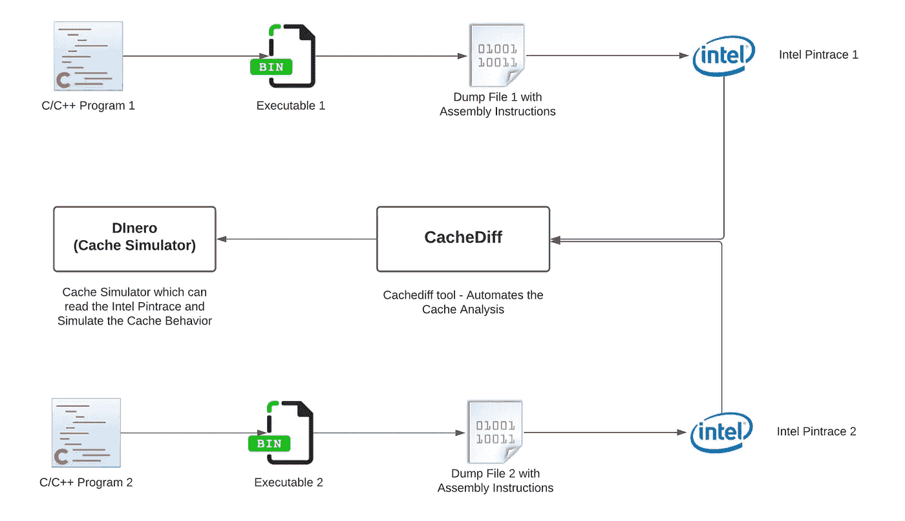
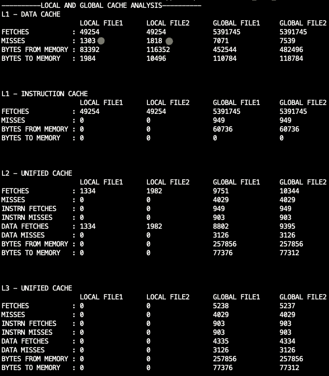
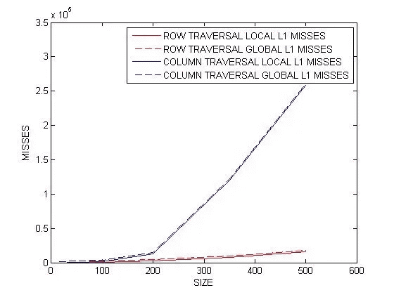

# Cachediff:执行本地化缓存分析的工具

> 原文：<https://medium.com/analytics-vidhya/cachediff-a-tool-to-perform-localized-cache-analysis-bfd7ea0406a0?source=collection_archive---------14----------------------->


泰勒·达维在 [Unsplash](https://unsplash.com?utm_source=medium&utm_medium=referral) 上拍摄的照片

Cachediff 是一个用来执行本地化缓存分析的工具。本地化高速缓存分析处理回答关于本地代码如何在同一 C/C++程序的两个或多个版本之间变化影响高速缓存性能的问题。

# 为什么我们需要 Cachediff？

计算机组织和体系结构是任何计算机科学课程的核心课程。教授这门课程的一般方法是使用幻灯片和图表等被动工具。为了让学生感兴趣，教师必须拿出像动画和模拟这样的主动学习工具。这确实需要讲师花费大量的时间和精力。可以理解的是，这种情况并不总是发生，经常会导致学生失去兴趣。

内存管理是计算机组织和体系结构的一个重要方面。像本课程中的大多数其他主题一样，用常规的方法学习是很困难的。研究人员已经提出了缓存模拟器。缓存模拟器是真实世界的模型。虽然复杂，但它们是理解和验证的极好工具。然而，这些缓存模拟器只能帮助分析整个程序。它们不提供本地化分析。

Cachediff 是一个免费的开源工具，我们开发该工具是为了让学生、教师和专业人士能够执行本地化的缓存分析。这里的本地化缓存分析是指改变一个较大程序的一小部分如何影响较大程序的缓存性能。

学生可以使用它来更好地理解他们在整个计算机科学课程中学到的概念。他们可能用它来验证一些问题的答案，比如为什么按行遍历比按列遍历快。他们可以使用它来验证他们的编译器确实执行了优化以提高缓存性能。

教师可以用它作为教学辅助。他们可以演示编写非缓存友好代码的效果。教师也可能会布置作业，并根据哪个学生编写的代码最适合缓存来给作业打分。

# 高速缓存性能和程序执行

让我们举一个在 C/C++代码中迭代二维数组的简单例子。遍历整个数组有两种方法，要么是行主遍历，要么是列主遍历，也就是说，选择一行，遍历该行中的所有元素，然后转到下一行，或者选择一列，遍历该列中的所有元素，然后继续下一列。相同的图示可以在下面看到



图片取自[卡夫丁峡谷](https://craftofcoding.files.wordpress.com/2017/02/rowcolumnarrays.jpg)

下面是两个遍历的代码片段。

**行主遍历**

```
#include <stdio.h>
#define SIZE 10000int main() {
    int x[SIZE][SIZE];
    int i, j;
    for(i=0; i<SIZE; ++i) {
        for(j=0; j<SIZE; ++j) {
            x[i][j];
        }
    }
}
```

**列主遍历**

```
#include <stdio.h>
#define SIZE 10000int main() {
    int x[SIZE][SIZE];
    int i, j;
    for(i=0; i<SIZE; ++i) {
        for(j=0; j<SIZE; ++j) {
            x[j][i]; // See it is x[j][i], not x[i][j]
        }
    }
}
```

**以上代码片段会有相似/可比的性能吗？当** `**SIZE**` **趋向于** `**INFINITY**` **时会发生什么？**

首先，我们需要理解在`C/C++`语言中内存分配是如何发生的。在许多高级语言中，内存分配是以行为主的，这意味着以行为主的方式比以列为主的方式更容易读写。为了简单地找出性能差异，我们可以使用下面的代码(摘自 [GeeksforGeeks](https://www.geeksforgeeks.org/performance-analysis-of-row-major-and-column-major-order-of-storing-arrays-in-c/) )来检查遍历 row-major 和 column-major 所需的时间。

```
#include <stdio.h> 
#include <time.h> 
int m[9999][999];void main() {
    int i, j; 
    clock_t start, stop; 
    double d = 0.0;start = clock(); 
    for (i = 0; i < 9999; i++) 
        for (j = 0; j < 999; j++) 
            m[i][j] = m[i][j] + (m[i][j] * m[i][j]);stop = clock(); 
    d = (double)(stop - start) / CLOCKS_PER_SEC; 
    printf("The run-time of row major order is %lf\n", d);start = clock(); 
    for (j = 0; j < 999; j++) 
        for (i = 0; i < 9999; i++) 
            m[i][j] = m[i][j] + (m[i][j] * m[i][j]);stop = clock(); 
    d = (double)(stop - start) / CLOCKS_PER_SEC; 
    printf("The run-time of column major order is %lf", d); 
}
```

输出是

```
The run-time of row major order is 0.067300
The run-time of column major order is 0.136622
```

我们可以清楚地看到，列主遍历所花费的时间是行主遍历的 2 倍。罪魁祸首是，每当您试图获取 2D 数组中的下一个元素时，都会出现缓存未命中。下图解释了缓存命中/未命中流。



图片取自 [GeeksForGeeks](https://www.geeksforgeeks.org/locality-of-reference-and-cache-operation-in-cache-memory/)

所以下一个明显的问题是，为什么我们在列主遍历中比在行主遍历中看到更多的未命中？这是因为高速缓存试图根据“引用局部性”原则获取下一条指令和数据。每当处理第 I 个位置的数据时，高速缓存会尝试预取第 i+1 个位置的数据，以期待下一个处理该数据。在行主遍历的情况下，处理的是 i+1 位置，而在列主遍历的情况下，是 i+ROW_SIZE 位置，如果 ROW_SIZE 足够大的话，很可能不会在缓存中。

我们可以使用 Cachediff 工具来理解程序 wrt 缓存(尤其是 L1 缓存)的行为。

# Cachediff

Cachediff:是一个用来执行本地化缓存分析的工具。本地化高速缓存分析处理回答关于本地代码如何在同一 C/C++程序的两个或多个版本之间变化影响高速缓存性能的问题。以前关于这个主题的工作仅仅涵盖了对一个程序的整体分析。我们以他们的工作为基础，同时利用某些操作系统和编译器特性来隔离本地代码更改，并跟踪它们对整个缓存系统的影响。Cachediff 对于教师、学生和专业人员分析程序的缓存性能非常有用。

Cachediff 内部是如何工作的？



Cachediff 的高层设计

这里是同样的一步一步的指令/算法。

1.  为 C/C++程序编译并生成一个可执行的二进制文件。
2.  然后用流水线指令转储可执行文件，得到抽象文件表示。
3.  从上一步构建的抽象表示中找出差异/增量。
4.  可执行文件以及相应的输入文件在英特尔 pin 下运行，以获得 Pin 跟踪。
5.  确保我们得到“全局跟踪”——整个程序的跟踪，“非局部跟踪”——全局跟踪减去局部跟踪，“局部跟踪”——我们感兴趣的程序的跟踪。
6.  “全局跟踪”和“局部跟踪”文件被提供给像 DineroIV 这样的跟踪驱动的缓存模拟器。
7.  禁用地址空间布局随机化(ASLR) —这可能是必需的，以便我们从两个程序的比较中获得的可执行文件来自相似的地址空间布局。

## 试用 Cachediff

要快速开始，您可以运行下面的命令

```
# Clone this Repo
git clone [https://github.com/ksameersrk/cachediff](https://github.com/ksameersrk/cachediff) /tmp/cachediff# Run the Simulation using the image: ksameersrk/cachediff
docker run -v /tmp/cachediff/examples:/app/examples ksameersrk/cachediff examples/matrix/row_wise_traversal.c examples/matrix/column_wise_traversal.c examples/matrix/input100.txt examples/matrix/input100.txt
```

您应该会看到这样的输出



Cachediff 的输出

根据输出，本地文件 1 是行优先遍历，本地文件 2 是列优先遍历。我们清楚地看到，与列主遍历[红点]相比，行主遍历[绿点]中的未命中更少。下图显示了列主的 L1 缓存未命中是如何随着数组大小的增加而呈指数增长的。



缓存未命中随着输入大小的增加而增加

你可以尝试更多有趣的例子，比如冒泡排序和快速排序，以及来自 [GitHub 库](https://github.com/ksameersrk/cachediff)的不同散列算法。

这项工作是由[赛马达夫](http://saimadhav.com/)和[梅](https://sameer.page)在本科期间完成的。你可以在 GitHub 资源库—【https://github.com/ksameersrk/cachediff】T4 中找到项目论文和代码。这篇文章最初发表在我的博客上——这篇文章摘自[我的页面](https://sameer.page/Cachediff-localized-cache-analysis)。