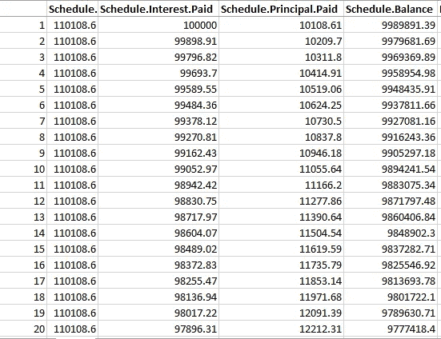
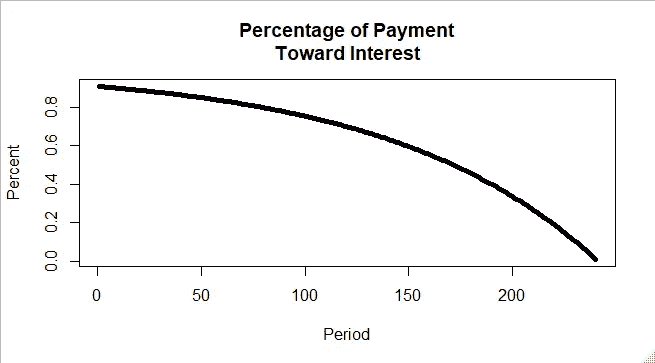
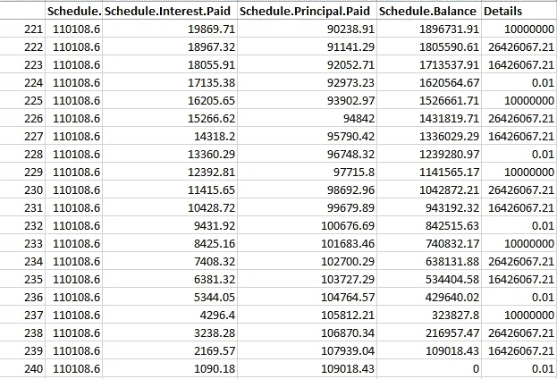
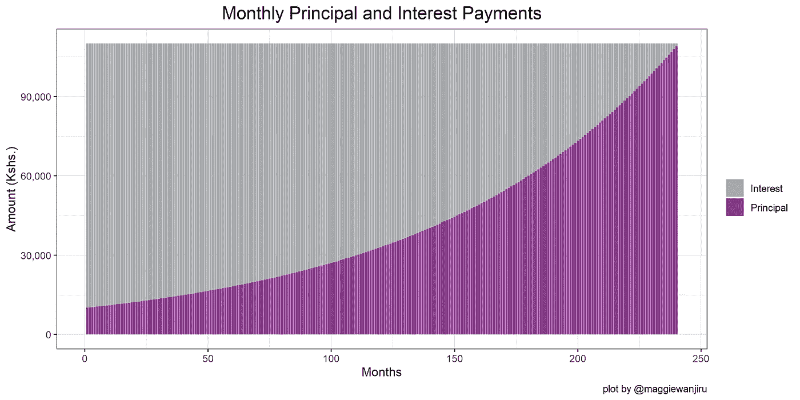

# 在 R 中计算固定利率抵押贷款付款

> 原文：<https://medium.com/analytics-vidhya/calculating-a-fixed-rate-mortgage-payment-in-r-2ce58b2d929e?source=collection_archive---------4----------------------->

## 媒体博客

## 如何计算 R 中抵押贷款的利息和本金


来源:https://unsplash.com

Mor gage——这是一个我们不时在新闻、社交媒体和报纸上听到的词，可能会思考它所包含的严格的数学和计算。

接受抵押贷款是迈向未来住房所有权的一大步。对一些人来说，这是他们生活中如此重要的优先事项，以至于他们开始为贷款定期存钱(每月，每季度等)，每年都存，存了很多年。

Investopedia.com 州最受欢迎的抵押贷款是 30 年期和 15 年期的。有些抵押贷款可以短至五年；有些可以是 40 年或更长。

此外，将支付期延长到更多年，会减少每月的支付额，但会增加要支付的利息。

## **抵押定义**

根据维基百科，抵押贷款或简单的抵押贷款是一种贷款，要么由不动产的购买者用来筹集资金购买不动产，要么由现有的财产所有者用来筹集资金用于任何目的，同时对被抵押的财产设置留置权。

换句话说，这是一种从银行或金融机构获得的贷款，你可以用它来购买房屋或为房屋再融资。

像其他贷款一样，抵押贷款需要支付本金和利息。有 2 种主要的利率类型；固定利率抵押贷款和可调利率抵押贷款。

出于本文的目的，我们将只关注固定利率抵押贷款。

要了解更多关于可调利率抵押贷款的信息，可以考虑查看下面的链接；

[](https://www.investopedia.com/terms/m/mortgage.asp) [## 抵押贷款

### 抵押贷款是一种债务工具，由特定的房地产抵押担保，借款人是…

www.investopedia.com](https://www.investopedia.com/terms/m/mortgage.asp) 

## 什么是固定利率抵押贷款付款？

根据 investopedia.com 的说法，“对于固定利率抵押贷款，借款人在贷款期限内支付相同的利率……如果市场利率上升，借款人的支付额不会改变。如果利率大幅下降，借款人可以通过抵押贷款再融资来获得更低的利率。固定利率抵押贷款也被称为“传统”抵押贷款。

当个人或企业修改利率、付款时间表和先前信贷协议的条款时，就会发生再融资。当利率环境发生重大变化时，债务人通常会选择为贷款协议再融资，从而从新协议中节省潜在的债务支付”，investopedia.com 说。

## 例子

假设，假设，你想考虑为 Kshs 贷款。1000 万英镑，固定年利率为 12%，期限为 20 年。(20 年后，你会希望还清全部抵押贷款)。两个主要问题出现了。

你会如何计算每月的还款额？

**b)** 你每月还款中有多少会用于每月的利息和本金？(这导致了所谓的**摊销时间表**)

如果你对这两个问题的答案都是否定的，那么让我们一起来看看我们如何在 r 中做到这一点。如果你的答案是肯定的，那么我打赌你想学习如何在 r 中做到这一点。

如果你是 R 的初学者，可以考虑看看这个资源，等等等等；

[](https://r4ds.had.co.nz/) [## r 代表数据科学

### 这本书将教你如何用 R 做数据科学:你将学习如何把你的数据放入 R，把它放入最…

r4ds.had.co.nz](https://r4ds.had.co.nz/) 

开始编码吧！

## 必备包

由 Kameron Penn [aut，cre]和 Jack Schmidt [aut]合著的《精算师金融数学》让上述计算变得非常简单。

包描述如下:包含精算师协会和意外保险精算协会“金融数学”考试中的金融数学函数和介绍性衍生函数，以及“金融经济学模型”考试中的一些主题。

如需了解有关该套餐的更多信息，请参见下文；

## r 码；

```
**# Mortgage payment schedule calculator**library(FinancialMath)#loading the required packagetab1 <- amort.table(Loan=10000000,n=240,pmt=NA,i=0.12/12,ic=1,pf=1,plot=FALSE)  #produces an amortization table for paying off a loan while also solving for either the number of payments, loan amount, or the payment amountwrite.csv(tab1, file  = "tab1.csv")#produce a .csv exceloutput
```

上面的代码产生了我们的摊销表；其中包括每月支付额、支付的利息、支付的本金和余额。

## **规范中部分术语的定义；**

*   **贷款—** 贷款金额，在本例中为 1000 万肯尼亚先令
*   **n —** 付款/期数，假设每月付款，则为 20*12(20 乘以一年中的 12 个月)
*   **pmt —** 级别支付的值。它在我们的代码中是 NA，因为它是我们正在寻找的。未知。**注意:**对于要运行的代码，n、pmt 或 Loan 之一必须为 NA(未知)。
*   **i —** 名义利率每年可兑换 ic 次(除以我方利率；12%或 0.12 乘 12 意味着我们的固定利率适合每月计算。因此，月利率= 0.01 或 1%)
*   **ic —** 每年的利息转换频率(它等于 1，因为我们已经在使用转换后的月利率)
*   **pf —** 支付频率—每年支付的次数(每月支付一次，因此为 1)

以下是上述代码在. csv 模板中生成时的前 20 行输出；



这意味着在第一个月，您将每月支付**110，108.6** 肯尼亚先令。在这笔付款中，**100，000** 肯尼亚先令将用于支付利息，而**10，108.61** 肯尼亚先令将用于支付本金。理想情况下，每行(每月)的本金和利息付款必须等于每月付款。

在贷款的早期，还款包括偿还更多的利息和偿还更少的本金。随着时间的推移，随着支付利息的比例减少，本金的比例增加。

应用相同的代码，但改变 *plot = TRUE* ，下图确认了我们的数字；

```
**# Data Visualization**amort.table(Loan=10000000,n=240,pmt=NA,i=0.12/12,ic=1,pf=1,plot=TRUE) #producing the graph with plot = TRUE
```



支付利息

这个过程一直持续到未偿还的本金(余额)达到零，贷款全部付清。

到第 240 个月末，您将支付 1090.18 肯尼亚先令的利息和 109018.43 肯尼亚先令的本金。

要确认这一点，请参见付款计划的最后 20 行。



显示上述本金和利息支付变动的另一个图表如下所示；



这种付款时间表的美妙之处在于，它能让你有效地做预算，并相应地为实现梦想中的房子做计划。如您所见，这在 r 中也很容易做到

值得注意的是，这是一个假设的计算。还有其他因素可能会改变这一计算，如**提前还款风险。**这是固定收益证券过早返还本金的风险。如果在任何情况下，有较低的利率，它是有利可图的借款人提前还款，因为这使借款人省钱。有几个因素会影响这一点，如利率水平、借款人情况的变化、房价等。

感谢阅读！

如有任何疑问、意见或反馈，请随时在 Twitter 上联系我；[https://twitter.com/magwanjiru](https://twitter.com/magwanjiru)

*免责声明:这是个人博客。本博客中表达的观点和意见是作者的观点和意见，不一定反映官方政策或任何其他方。本文仅供参考；请咨询您的顾问，以确定这种策略是否适合您。*

# **参考文献**

1.  包‘金融数学’:作者卡梅龙·佩恩[aut，cre]，杰克·施密特[aut]
    维护者卡梅龙·佩恩<[kameron.penn.financialmath@gmail.com](mailto:kameron.penn.financialmath@gmail.com)>。链接->[https://cran . r-project . org/web/packages/financial math/financial math . pdf](https://cran.r-project.org/web/packages/FinancialMath/FinancialMath.pdf)
2.  [https://www.investopedia.com/terms/m/mortgage.asp](https://www.investopedia.com/terms/m/mortgage.asp)
3.  [https://www.investopedia.com/terms/r/refinance.asp](https://www.investopedia.com/terms/r/refinance.asp)
4.  [https://en.wikipedia.org/wiki/Mortgage_loan](https://en.wikipedia.org/wiki/Mortgage_loan)