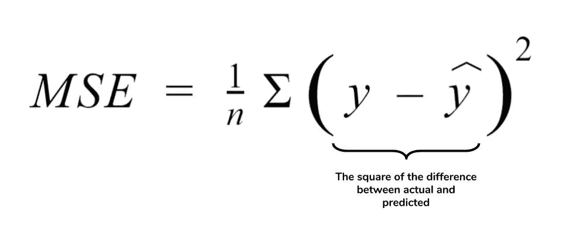

# 最大似然模型的计算精度。

> 原文：<https://medium.com/analytics-vidhya/calculating-accuracy-of-an-ml-model-8ae7894802e?source=collection_archive---------0----------------------->

在继续讨论准确性度量之前，让我们了解一下 ML 中涉及的学习类型。

**监督学习—** 这是一种学习技术，其中提到了因变量，我们必须根据它进行预测。监督学习有两种类型:

1.  ***回归*** :该类型以因变量为连续特征。例子:房价数据。(其中我们要预测房价)。
2.  ***分类*** :该类型在二元或多类特征中有其因变量。例如:泰坦尼克号数据。[我们必须预测一个人是否幸存(1)或(0)]

**无监督学习—** 这是一种不提及因变量的学习技术。这种学习技巧通常用于现实生活中的电子商务或金融等问题，公司的目标是最有价值的客户。

**半监督学习—** 顾名思义，这种技术包括有监督和无监督两种技术。该数据包含一些标记的数据，但大部分是未标记的。要了解更多关于半监督学习的信息，请查看这个[链接](https://www.digitalvidya.com/blog/semi-supervised-learning/)。

安迪·凯利在 [Unsplash](https://unsplash.com?utm_source=medium&utm_medium=referral) 上拍摄的照片

现在我们知道了 ML，让我们深入到用于计算监督学习准确性的度量标准中。

# **监督学习中如何计算准确率？**

照片由 [Tim Gouw](https://unsplash.com/@punttim?utm_source=medium&utm_medium=referral) 在 [Unsplash](https://unsplash.com?utm_source=medium&utm_medium=referral) 上拍摄

用不同的方法计算回归和分类的准确度。

## 对于回归模型:

1.  ***平方误差(SE)。***

> 其中，Ei =实际值-预测值

2. ***均方误差。***

3.***(RMSE 均方根误差)。***

4. ***相对均方差。***

5. ***表示绝对百分误差(MAPE)。***

6.****。****

**

*7. ***绝对误差(AE)。****

**

*8. ***平均绝对误差。****

**

# *对于分类模型:*

## *1.混乱矩阵。*

**

*混淆矩阵是帮助可视化分类模型性能的表格。它可以用来计算精度，灵敏度(又名召回)，特异性和准确性。*

***术语定义:***

*   **真阳性(TP)* :观察阳性，预测阳性。*
*   **假阴性(FN)* :观察为阳性，但预测为阴性。*
*   **真阴性(TN* ):观察为阴性，预测为阴性。*
*   **假阳性(FP)* :观察为阴性，但预测为阳性。*

> ***精度= TP/(TP+FP)***
> 
> ***灵敏度(召回)=TP/(TP+FN)***
> 
> ***特异性=TN/(TN+FP)***
> 
> ***准确度=(TP+TN)/(TP+TN+FP+FN)***

## *2.ROC AUC。*

*AUC 表示曲线下面积，这是针对 ROC 曲线计算的。*

**

*ROC 曲线是绘制在灵敏度和假阳性率之间的图。AUC 值越接近 1，模型越发达。它可以使用 R 和 Python 中的函数来计算。*

> ****但是对于那些想要一个清晰的初步认识的人来说，看下面否则跳过部分。****

**

> *T = (1*SE)/2 = SE/2 = TP/2*(TP+FN)*
> 
> *U = (SP*1)/2 = SP/2 = TN/2*(TN+FP)*
> 
> *获得 AUC，*
> 
> *AUC= T+U = (SE+SP)/2*

## *3.f1-得分。*

***F 测量值** ( **F1 得分**或 **F 得分**)是测试准确度的测量值，定义为测试精确度和召回率的加权调和平均值。*

> *F 分数用于衡量测试的准确性，它平衡了准确性和召回率的使用。通过使用精确度和召回率，F 分数可以提供对测试性能的更现实的测量。F 分数经常在信息检索中用于测量搜索、文档分类和查询分类性能。*

**

## *4.基尼系数。*

*基尼系数最常用于不平衡的数据集，在这种情况下，单凭概率就很难预测结果。*

*基尼系数是用 0 到 1 之间的值来衡量的，其中 1 *的分数意味着该模型在预测结果时是 100%准确的。* 分数 1 只存在于理论上。实际上，基尼系数越接近 1 越好。然而，基尼系数等于 0 意味着这个模型完全不准确。要获得 0 分，模型必须为每个预测赋予随机值。*

> ***GINI = AUC * 2–1***

*喜欢我的文章？请为我鼓掌并分享它，因为这将增强我的信心。此外，我每周日都会发布新文章，所以请保持联系，以了解数据科学和机器学习基础系列的未来文章。*

*另外，如果你想的话，可以在 linkedIn 上联系我。*

**

*照片由 [Morvanic Lee](https://unsplash.com/@morvanic?utm_source=medium&utm_medium=referral) 在 [Unsplash](https://unsplash.com?utm_source=medium&utm_medium=referral) 上拍摄*