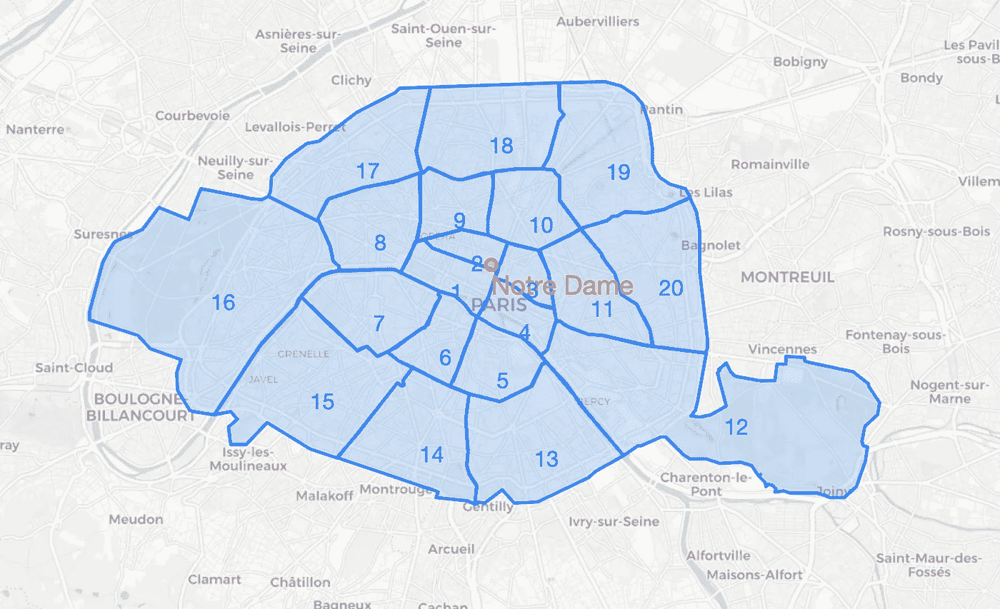
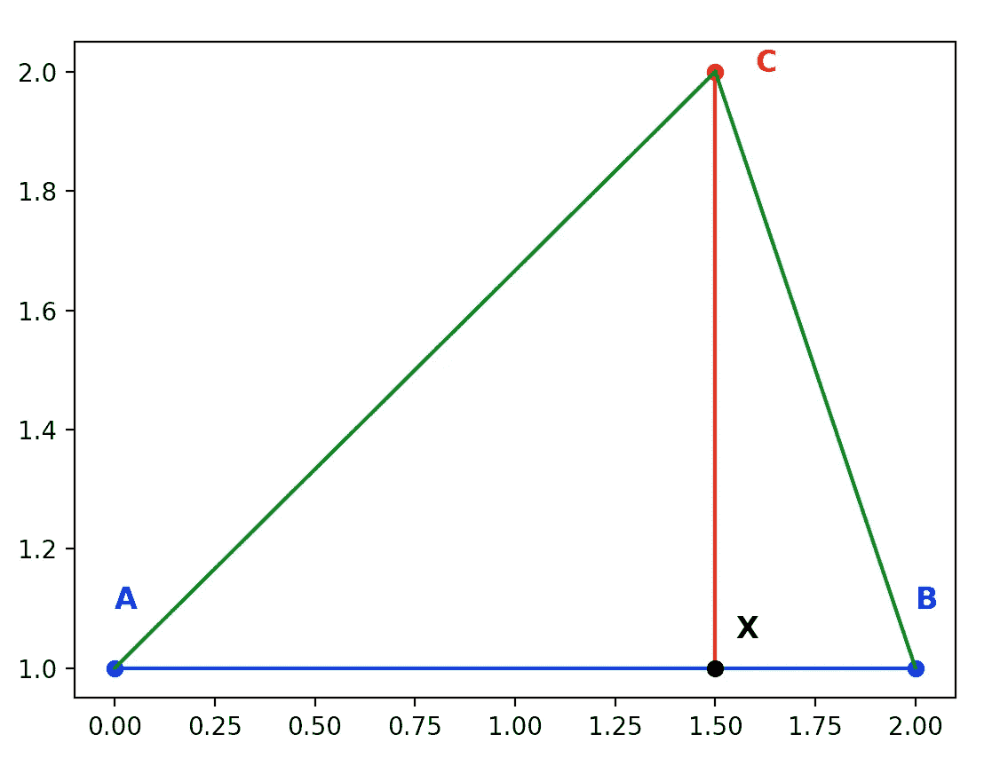
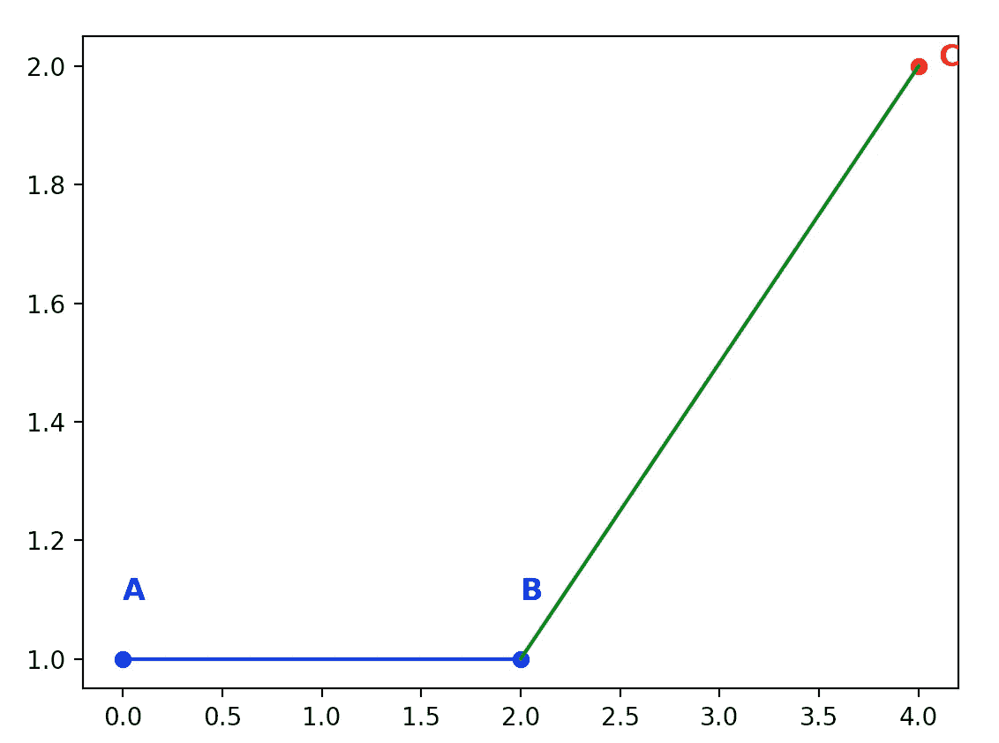
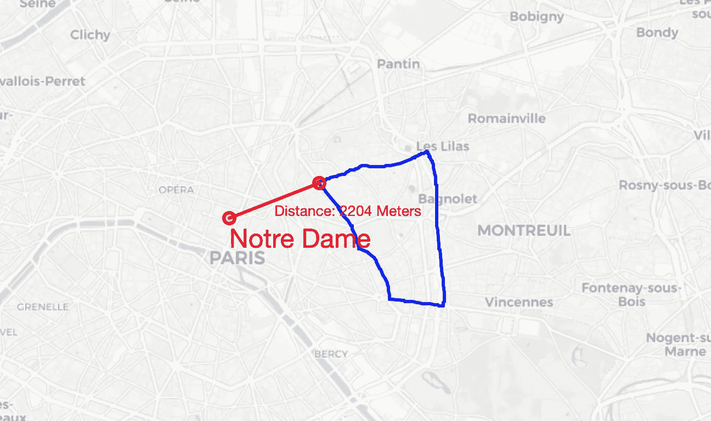
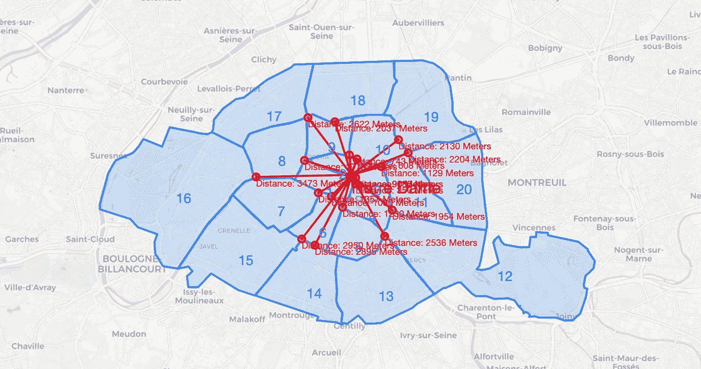

# 在 Python 中计算点到面边界的距离-以巴黎为例

> 原文：<https://medium.com/analytics-vidhya/calculating-distances-from-points-to-polygon-borders-in-python-a-paris-example-3b597e1ea291?source=collection_archive---------0----------------------->

有许多很棒的包可以帮助你在 Python 中处理地理空间数据。然而，如果你需要定制，这可能会变得棘手。

我想展示如何计算纬度、经度对和多边形之间的米距离。考虑到我不想计算到多边形中点的距离，而是到最近的边界的距离。

我将用下面的例子来说明这一点:圣母院离每个区有多远？

所有代码都在我的 [Git](https://github.com/tmationmax/medium_polygon_distance/tree/master) 里。我将包括相关函数的链接，而不是在这篇文章中写出语法。

# **设置您的环境并获取数据**

为了可视化，我们将使用 python 中的`folium`库。对于几何图形，我们将使用`geopy`。使用以下内容安装软件包:

`pip install folium geopy`

我想用巴黎各区的数据来展示这个方法。请从[https://www.data.gouv.fr/en/datasets/arrondissements-1/#_](https://www.data.gouv.fr/en/datasets/arrondissements-1/#_)下载 GeoJSON 文件，并将文件保存在您的项目根目录下。

现在让我们来看看这个区以及巴黎圣母院的位置。



巴黎行政区和圣母院的位置

这就是生成这张地图的代码。

```
import folium
from folium.features import DivIcon
import geojson

with open('arrondissements.geojson') as f:
    data = geojson.loads(f.read())

# Set your point of interest. In our case that is Notre Dame.
poi_name = 'Notre Dam'
poi = [48.864716, 2.349014]# Map it!
m = folium.Map(location=poi, zoom_start=12, tiles='cartodbpositron')# Display Arrondissements
folium.GeoJson(data).add_to(m)# Display Arrondissements Numbers
for arrond in data['features']:
    loc = arrond['properties']['geom_x_y']
    nr = arrond['properties']['c_ar']
    folium.map.Marker(location=loc, icon=DivIcon(
        icon_size=(150, 36),
        icon_anchor=(0, 0),
        html='<div style="font-size: 15pt; color:rgb(41,111,255)">{}</div>'.format(str(nr))
    )).add_to(m)

# Display POI
folium.CircleMarker(location=poi, color='red', radius=5, fill='red').add_to(m)# Display POI Name
folium.map.Marker(location=poi, icon=DivIcon(
    icon_size=(150, 36),
    icon_anchor=(0, 0),
    html='<div style="font-size: 18pt; color: red">{}</div>'.format(poi_name)
)).add_to(m)

m.save('map_1.html')
```

# **计算到一个区的距离**

尽管 Python 非常适合计算笛卡尔坐标系中的距离，但是如果您正在处理地理空间数据，则需要一些变通方法。

1.  库的输出需要转换成可用的度量。见@jbndir 回复[此处](https://stackoverflow.com/questions/39211879/how-can-calculate-the-real-distance-between-two-points-with-geodjango)。
2.  距离计算需要考虑地球的球形。我们可以使用[哈弗辛](https://en.wikipedia.org/wiki/Haversine_formula)公式来计算大圆距离，如这里所概述的[。(注意，这对于长距离变得越来越重要)](http://www.movable-type.co.uk/scripts/latlong.html)

## 另一个挑战——测量到什么的距离？

我们想测量点到多边形的距离。但是多边形可以被分割成各种线段和点。我们应该测量到线、点到点的距离还是两者都测量？

让我们看一个简单的例子:



我们在 A 和 B 之间有一条线，想计算到 c 的最小距离，众所周知，最短距离是到 AB 线上的正交投影，线上最近的点是 x。

然而，在下面这个简单的例子中，我们不能投影一条正交线，这就是为什么最小距离是到最近点的距离。



## 中间地带—测量到中点的距离！

为了保持我们的算法精简，让我们不要考虑这些具体情况，总是计算到我们的线的中点的距离。尤其是在精确定义的多边形中(在小空间上)，差异可以忽略不计。

让我们按照这里[概述的中点计算](http://www.movable-type.co.uk/scripts/latlong.html)和这里 Python 中的实现[(谢谢，@nelfin)。](https://stackoverflow.com/questions/27461634/calculate-distance-between-a-point-and-a-line-segment-in-latitude-and-longitude?rq=1)

```
def midpoint(a, b):
... Please find the function [here](https://github.com/tmationmax/medium_polygon_distance/blob/master/func_util.py#L6).
```

有了中点，我们现在可以计算到点的距离:

```
def calculate_dist_to_line(line_a_lat, line_a_lng, line_b_lat, line_b_lng, point_object):
...Please find the function [here](https://github.com/tmationmax/medium_polygon_distance/blob/master/func_util.py#L29).
```

现在，一个多边形由许多不同的线组成，这就是为什么我们需要遍历所有的线并找到距离最小的一条线:

```
def get_min_distance_to_arr(arr_coords, point_object, unit='m'):
...Please find the function [here](https://github.com/tmationmax/medium_polygon_distance/blob/master/func_util.py#L36).
```

## 不错！现在让我们来看一个区

使用我们的函数，我们可以很容易地获得任何行政区的最小距离和折线:

```
# Example with Arrondissement 20
coords = [x['geometry']['coordinates'][0] for x in data['features'] if x['properties']['c_ar'] == 20][0]p = Point(latitude=poi[0],longitude=poi[1])distance, line = fu.get_min_distance_to_arr(arr_coords=coords,point_object=p)
line_midpoint = fu.get_line_midpoint(line)
```

剧情看起来也不错——而且准确！



从圣母院到 20 区边界的最短距离。

代码:

```
# Map it!
m = folium.Map(location=poi, zoom_start=12, tiles='cartodbpositron')

# Display POI
folium.CircleMarker(location=poi, color='red', radius=5, fill='red').add_to(m)
# Display POI Name
folium.map.Marker(location=poi, icon=DivIcon(
    icon_size=(150, 36),
    icon_anchor=(0, 0),
    html='<div style="font-size: 18pt; color: red">{}</div>'.format(poi_name)
)).add_to(m)

for i, _ in enumerate(coords):
    if i+1 < len(coords):
        folium.PolyLine(locations=[(coords[i][1],coords[i][0]),(coords[i+1][1],coords[i+1][0])], color='blue').add_to(m)
    else:
        folium.PolyLine(locations=[(coords[i][1], coords[i][0]), (coords[0][1], coords[0][0])],
                        color='blue').add_to(m)

folium.PolyLine(locations=line, color='red').add_to(m)
folium.PolyLine(locations=[poi,[line_midpoint.latitude,line_midpoint.longitude]], color='red').add_to(m)
folium.CircleMarker(location=[line_midpoint.latitude,line_midpoint.longitude], color='red', radius=5, fill='red').add_to(m)

new_line_mp = fu.get_line_midpoint([poi,[line_midpoint.latitude,line_midpoint.longitude]])
folium.map.Marker(location=[new_line_mp.latitude,new_line_mp.longitude], icon=DivIcon(
    icon_size=(150, 36),
    icon_anchor=(0, 0),
    html='<div style="font-size: 10pt; color: red">Distance: {} Meters</div>'.format(round(dist))
)).add_to(m)

m.save('map_2.html')
```

## 让我们对所有其他区都这样做吧！

因为我们已经准备好了基本的逻辑，所以很容易遍历它并将所有数据点绘制在一起。

如果您想知道哪个区最近，请使用函数 get_min_distance_to_arr 的输出！

地图看起来不好看，但是是正确的:)



这就是代码:

```
# Map all!
m = folium.Map(location=poi, zoom_start=12, tiles='cartodbpositron')

# Display POI
folium.CircleMarker(location=poi, color='red', radius=5, fill='red').add_to(m)
# Display POI Name
folium.map.Marker(location=poi, icon=DivIcon(
    icon_size=(150, 36),
    icon_anchor=(0, 0),
    html='<div style="font-size: 18pt; color: red">{}</div>'.format(poi_name)
)).add_to(m)

# Display Arrondissements
folium.GeoJson(data).add_to(m)
# Display Arrondissements Numbers
for arrond in data['features']:
    loc = arrond['properties']['geom_x_y']
    nr = arrond['properties']['c_ar']
    folium.map.Marker(location=loc, icon=DivIcon(
        icon_size=(150, 36),
        icon_anchor=(0, 0),
        html='<div style="font-size: 15pt; color:rgb(41,111,255)">{}</div>'.format(str(nr))
    )).add_to(m)

for arrond in data['features']:

    coords = arrond['geometry']['coordinates'][0]
    p = Point(latitude=poi[0],longitude=poi[1])
    dist, line = fu.get_min_distance_to_arr(arr_coords=coords,point_object=p)
    line_midpoint = fu.get_line_midpoint(line)

    # for i, _ in enumerate(coords):
    #     if i+1 < len(coords):
    #         folium.PolyLine(locations=[(coords[i][1],coords[i][0]),(coords[i+1][1],coords[i+1][0])], color='blue').add_to(m)
    #     else:
    #         folium.PolyLine(locations=[(coords[i][1], coords[i][0]), (coords[0][1], coords[0][0])],
    #                         color='blue').add_to(m)

    folium.PolyLine(locations=line, color='red').add_to(m)
    folium.PolyLine(locations=[poi,[line_midpoint.latitude,line_midpoint.longitude]], color='red').add_to(m)
    folium.CircleMarker(location=[line_midpoint.latitude,line_midpoint.longitude], color='red', radius=5, fill='red').add_to(m)

    new_line_mp = fu.get_line_midpoint([poi,[line_midpoint.latitude,line_midpoint.longitude]])
    folium.map.Marker(location=[line_midpoint.latitude,line_midpoint.longitude], icon=DivIcon(
        icon_size=(150, 36),
        icon_anchor=(0, 0),
        html='<div style="font-size: 10pt; color: red">Distance: {} Meters</div>'.format(round(dist))
    )).add_to(m)

m.save('map_3.html')
```

如有任何问题，请联系我们！