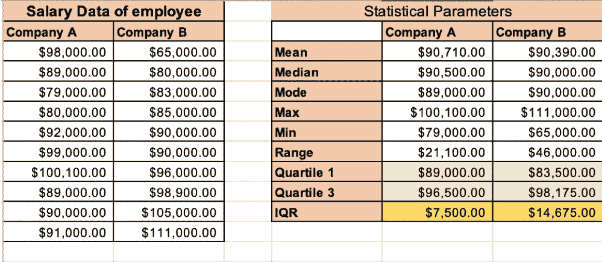

# 计算离差的度量

> 原文：<https://medium.com/analytics-vidhya/calculating-measure-of-dispersion-da8e9fa7ef83?source=collection_archive---------11----------------------->

*这是商业统计系列的第二篇文章*

欢迎再次光临！如果您需要复习本系列的前一篇文章，请参考下面的链接:

 [## 商业统计#1

### 作为一名数据科学家，您收到数据集后的第一件事是什么？应用机器学习…

medium.com](/@jain.nikhil04/business-statistics-1-b9b09730069b) 

到目前为止，我们已经了解到，集中趋势的度量给出了一个关于如何使用平均值、众数和中位数来汇总数据的很好的想法。当我们在数据分析中更进一步时，我们不能只使用这些测量来总结我们的观察。我们需要计算额外的参数，这些参数可以帮助我们了解我们的数据集与中心趋势参数的差异程度。这些参数的计算被称为离差的度量。

# 分散/扩散的度量

我们再举一个例子来理解这个概念。我们讨论的是来自某个随机公司 A 和 b 的工资数据。为了便于理解，公司 A 和 b 的集中趋势参数(即平均值和中值)几乎相似。

但是，我们可以看到，B 公司的工资差距比 a 公司大。基于这一点，我们不能断定该公司的工资是否遵循相同的平均范围模式。那么，如何将这种差异转化为一些有意义的描述性统计数据呢？让我们浏览一下我们在统计中用来分析数据的一些描述性术语:

**1。Range:** Range 是数据集中最大值和最小值之差。数据集范围越小意味着离差越小，数据集范围越大意味着离差越大。

Excel 命令:" =MAX(数字 1，数字 2，…。)— MIN(数字 1，数字 2，…) "

公司 A 的最高工资为 100，100 美元，最低工资为 79，000 美元，范围为 21，100 美元。B 公司的最高工资为 111，000 美元，最低工资为 65，000 美元，范围为 46，000 美元。我们现在可以自信地说，更高的范围驱动数据的更大传播。

**2。四分位距(IQR):** 四分位距是高级统计分析中广泛使用的参数。在我们继续之前，让我们先弄清楚关于四分位数的理解。Quartile 将数据按升序分成四等份。这有助于我们可视化不同范围的数据。它们分别用 Q0、Q1、Q2、Q3 和 Q4 表示。

Q0 =数据序列中的最小数

Q1 =以升序排列的数据系列前半部分的中间值

Q2 =数据系列的中值

Q3 =按升序排列的数据系列后半部分的中间值

Q4 =数据系列中的最大数字

Excel Command = "QUARTILE。INC(array，quart)"；Array 是数据系列，Quart 是我们要计算的从 0 到 4 的四分位数。

我们还可以使用之前已经学习过的 excel 命令来计算四分位数 0、2 和 4:

Q0 = " MIN(array)"；

Q2 = "中位数(数组)"；

Q4 = "最大值(阵列)"

让我们通过这种可视化来理解这一概念，并将四分位距(IQR)定义为:

> **四分位距(IQR) = Q3- Q1**

Excel Command = "QUARTILE。INC(array，3) —四分位数。INC(array，1)"

当我们分别计算 A 公司和 B 公司的 IQR 范围时，结果是 7500 美元和 14675 美元。通过避免异常值，计算中位数+/- IQR 范围可以更好地了解样本总体数据，这是范围无法实现的。

> **现在我们已经了解了 Range 和 IQR，但哪一个更受欢迎呢？IQR 通常被视为比极差更好的衡量指标，因为它不受异常值的影响。在现实生活中，我们总是倾向于获取样本数据，而不是对整个群体进行分析，因为这样成本更低。这个样本数据可以从 IQR 收集，以获得精确和清晰的统计数据。**

在下一篇文章中，我们将学习箱线图、标准差、切比雪夫定理和方差。到时候…学习愉快！我希望到目前为止你喜欢学习。请在评论区告诉我你的反馈。

#数据分析#统计#统计分析#业务分析#回归#数据科学# excel #数据驱动业务#数据驱动决策#分析#分析#隔离时间#数据#数据科学家#优秀培训#数据分析#学习#产品管理#数据分析#学习#产品管理#标准偏差# IQR #方差#范围