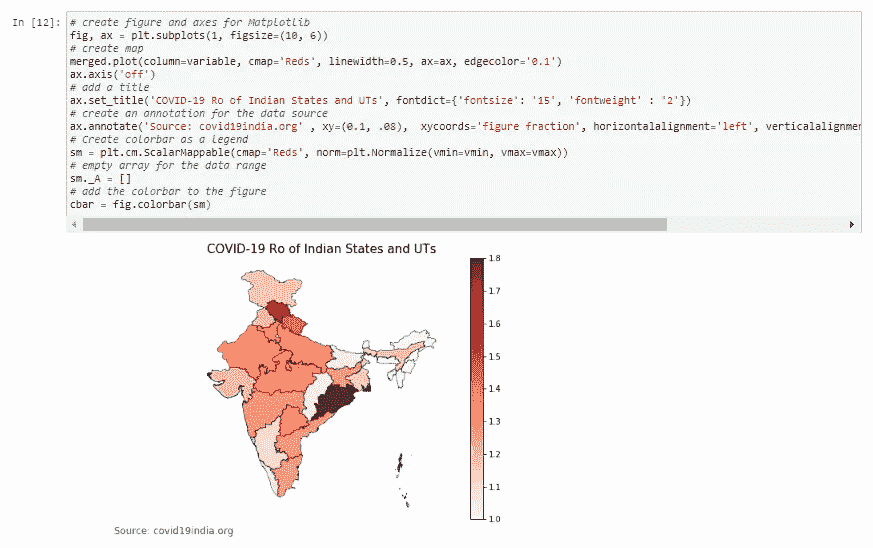

# 计算印度新冠肺炎的再现数(Ro)并使用 Geopandas 和 Matplotlib 对其进行可视化

> 原文：<https://medium.com/analytics-vidhya/calculating-the-reproduction-number-ro-of-covid-19-in-india-and-visualizing-the-same-using-e9a5d35ca64c?source=collection_archive---------12----------------------->


# 介绍

由新型冠状病毒新型冠状病毒引起的新冠肺炎病毒于 1 月下旬通过意大利游客抵达印度海岸。自那以后，截至 2020 年 4 月 5 日，已确认感染了至少 4289 条生命。全国各地的政府都进行了干预，要求其居民通过封锁、测试有症状的个人并追踪他们的接触者来与其他人保持社交距离。

在流行病学中，一种感染的基本再生数(Ro——读作 R——零)可以被认为是在所有个体都易受感染的人群中由一个病例直接产生的预期病例数。该定义描述了没有其他个体被感染或免疫的状态。

在本文中，解释了计算印度每个邦/联邦领地的 Ro 并对其进行可视化的 python 代码。

# 数据来源

各州确诊病例的时间序列数据从病例追踪网站【https://covid19india.org[托管的](https://covid19india.org)[谷歌文档](https://docs.google.com/spreadsheets/d/e/2PACX-1vSc_2y5N0I67wDU38DjDh35IZSIS30rQf7_NYZhtYYGU1jJYT6_kDx4YpF-qw0LSlGsBYP8pqM_a1Pd/pubhtml#)获得。


印度新冠肺炎病例的时间序列

# 计算 Ro

Ro 通过以下公式计算:

EXP((LN(Population/((1/(case[current]/(case[start]* Population)))-1))/(current-start))
其中，
a. LN 为自然对数；
b. case[start]是起始日的案例数；
c .病例[当前]是当前的病例数
d .人口是该州的人口/UT
e .当前=从爆发开始的天数，start = 0

# Python 代码

## 导入案例时间序列文件

首先导入案例时间序列文件。

导入案例时间序列文件

## 声明超参数

接下来，设置超参数。这些是回望值，基于这些值计算 Ro 和印度人口。

声明超参数

## 计算每个状态/UT 的 Ro

声明列表，其中存储了州/ut 的名称及其 Ro。此外，基于计算的 Ro，对第二天的累积病例数进行预测。

计算每个州/UT 的 Ro 并预测第二天的病例数

## 将 Ro 写入数据帧

州/ut 的名称、它们的 Ro 和预测的累积案例被写入新的数据帧，该数据帧将用于地理空间可视化。

将 Ro 写入数据帧


数据帧的内容

## 导入 Geopandas 和 Shapefile

为了可视化每个状态/UT 的 Ro，使用以下命令下载 geopandas 库:

```
pip install geopandas
```

如果您在下载软件包时由于不兼容的依赖关系而遇到困难，那么本指南会有所帮助。

接下来，印度的 shapefile 从[这里](https://www.igismap.com/download-india-boundary-shapefile-free-states-boundary-assembly-constituencies-village-boundaries/)下载。


下载免费地理数据的网站

shapefiles 将作为包含各种文件类别的压缩文件夹下载。格式*的文件。shp* ，*。shx* ，*。dbf* ，*。prj* 和*。cpg* ，需要解压到工作目录。

导入 Geopandas 和 Shapefile

## 合并地理数据框架和数据框架

地理数据框架和数据框架在州/UT 名称要素上合并。

合并数据帧

## Ro 生成并显示叶绿素图

最后，在 Ro 的基础上构建并显示氯普图。

产生氯过剩



显示氯体积

本文提到的原始文件、代码和笔记本可以在 [this github repo](https://github.com/AyanDg27/COVID-19-India) 找到。

> — -BEGIN 比特币签名消息— -
> 计算新冠肺炎在印度的再现数(Ro)并使用 Geopandas 和 Matplotlib 将其可视化
> —-BEGIN 签名—-
> 1 hzwkjkeaozftsajdw 6 akkxp 45 agdiezn
> hccn 5 iww 2 xsd/cuml 0 iuows 4 zfyoqmta 3 qx 2 yqoykwd 2 sic I2C qklfhrkngciiya/0 uisk 8 f+tur 0++