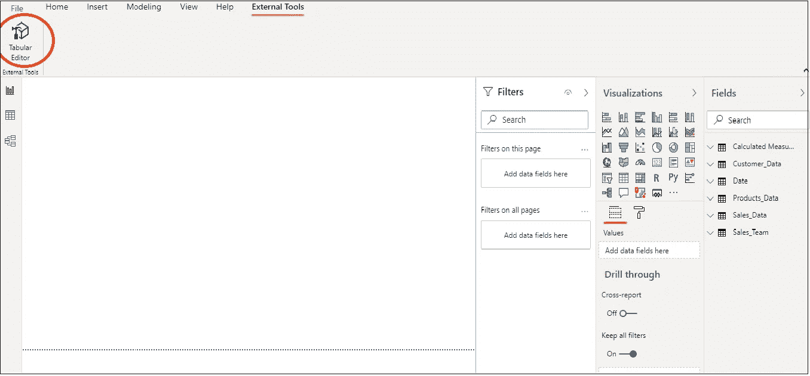
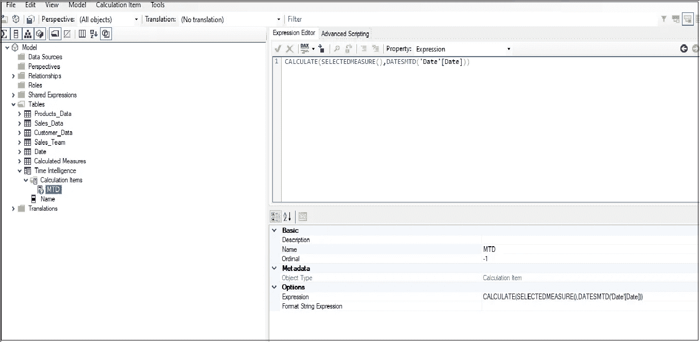
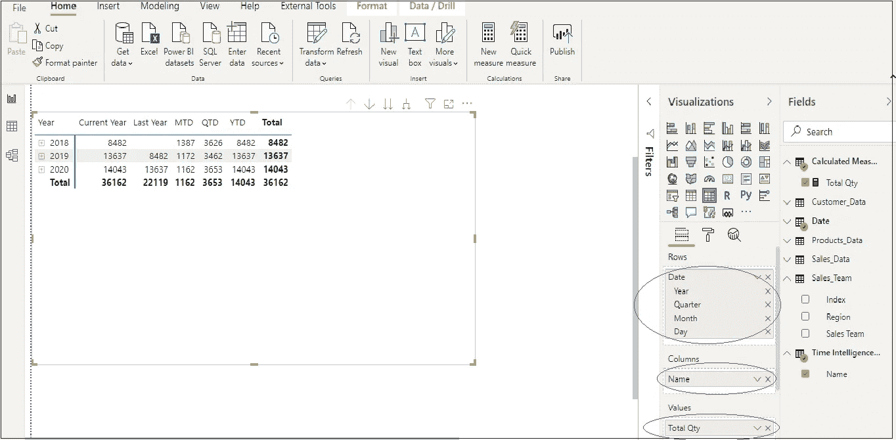

# 计算组——减少 PowerBI 中度量的有效方法

> 原文：<https://medium.com/analytics-vidhya/calculation-groups-an-effective-way-to-reduce-measures-in-powerbi-a28d9d55a573?source=collection_archive---------5----------------------->

## *学习 Power BI 中计算组的概念*

图片由 Sarah Pflug 提供，来自 Burst

微软在 2020 年 7 月发布的 Power BI 中引入了从 Power BI 桌面启动外部工具的能力(目前是预览功能)。借助此功能，表格编辑器现在可以与 Power BI 集成，并允许用户在 Power BI 中轻松创建计算组。

**计算组的好处是什么**

我们都知道在创建使用相同的计算来计算不同参数的值的度量时所付出的痛苦和努力；特别是时间情报措施。

例如，为了计算“销售额”和“订单数量”这两个字段的月初至今(MTD)、季初至今(QTD)、年初至今(YTD)和上一年(PY)的值，需要为这些计算中的每一项创建单独的度量，这相当于 8 个度量。试想，如果时间智能计算也要做两个以上的领域；例如，退回物品价值和退回物品数量；**权力毕创造的总度量衡将是 16！！**这将随着每个字段/参数的增加而增加。

故事并没有到此结束！！然后，用户需要在视觉效果中选择并单独使用创建的度量。这看起来像是创建使用相同计算的多个度量的无用练习。

在这种情况下，计算小组可以充当救星。它消除了为每个计算创建单独度量的需要，并减少了在 PowerBI 中创建的度量总数。让我们开门见山，直接进入这里的过程！！

**计算组如何工作以及创建计算组的过程**

要创建计算组，需要遵循以下步骤:

1.  从 [www .下载并安装表格编辑器。tabulareditor.com](https://tabulareditor.com/)
2.  在 PowerBI 桌面预览功能中，启用“使用增强的 metadataformat 存储数据集”。
3.  在 PowerBI Desktop 中，获取数据并创建数据模型后，单击“外部工具”选项卡。

图 1:可从外部工具选项卡访问的表格编辑器功能

3.单击表格编辑器，启动表格编辑器，其中包含模型中可用的表格。在表格编辑器中，可以通过右键单击表>新建>计算组来创建计算组

4.可以将计算组视为存储多个度量值(称为计算项)的文件夹/表。在这里，我创建了一个新的计算组——“时间智能测量”。右键单击计算组并创建一个计算项— MTD(月初至今)。下面的屏幕截图显示了带有 DAX 语句的计算项-MTD:

MTD → CALCULATE(SELECTEDMEASURE()，DATESMTD('Date'[Date]))

注意:不要使用要计算 MTD 值的字段值/参数(如销售额、订单数量),而是使用 SELECTEDMEASURE()函数

图 2:创建计算项目(MTD)

5.同理，多个计算项；例如，QTD(季度至今)、YTD(年初至今)、PY(前一年值)可以使用以下 DAX 语句创建:

QTD → CALCULATE(SELECTEDMEASURE()，datesktd(' Date '[Date]))

YTD → CALCULATE(SELECTEDMEASURE()，DATESYTD('Date'[Date]))

PY → CALCULATE(SELECTEDMEASURE()，SAMEPERIODLASTYEAR(' Date '[Date]))

6.通过在表格编辑器中单击文件>保存来保存计算组，然后转到 PowerBI Desktop。创建的计算组将作为只有一个字段/列“名称”的表出现在 PowerBI 桌面字段部分。

7.现在 PowerBI 的真正力量开始发挥作用了！要查看订单数量 MTD、QTD、YTD 和去年的值，请选择一个矩阵可视化并拖动字段/度量，如下图所示:

图 3:显示订单数量的时间智能值的矩阵可视化

*在上图中，总数量=总和(Sales _ Data[订单数量])。

8.请注意，计算组仅适用于显式 DAX 度量，不适用于隐式 DAX 度量。例如，在 Power BI 中，当用户将列拖动到可视区域以查看聚合值时，会创建隐式度量，而不会创建显式度量。因此，我在这里创建了“总数量”度量。

9.当用户将**名称**项从计算组拖到**列**区域时，在表格编辑器中创建的每个计算项(MTD、QTD、YTD、Last Year)显示为单独的一列。

10.同样，如果时间智能函数值也要为报表中的另一个字段显示，比如销售额，则不需要为其创建单独的度量。只需创建一个显式度量值——“总销售额”= Sum(Sales)，并将其添加到矩阵的 Values 部分，让 Power BI 完成其余工作。

**结论:**

在这个新引入的特性的帮助下，用户现在可以节省在他们的模型中创建和维护度量的大量时间。现在，有了这个特性，只需在 PowerBI 中创建基本度量，并使用计算组以快速有效的方式创建所有基本度量的时间智能表示！！