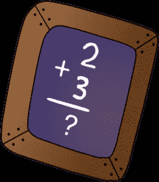

# Rails 6 中数据库记录使用的计算方法

> 原文：<https://medium.com/analytics-vidhya/calculations-methods-used-on-database-records-in-rails-6-f147221dd5f6?source=collection_archive---------10----------------------->

你好，

我们将讨论一些有用的方法，当我们需要使用数据库记录进行一些计算时，这些方法非常方便


克里斯·利维拉尼在 [Unsplash](https://unsplash.com?utm_source=medium&utm_medium=referral) 上的照片

1.  **平均值:**

> 语法:**平均值**(列名)

你们大多数人已经知道这个 rails 方法了。听起来它的工作是获取给定列的平均值。

**例如:**

**用户**。平均(**:年龄** ) `*# => 22.5*`

> Sql 查询:
> 
> 选择 AVG(“用户”)。“年龄”)与“用户”

**2。计数:**

这是我们 rails 开发人员经常使用的一种方法，它的工作是统计记录，这就是**点。**


计数方法

**例如:**

```
User.count
*# => the total count of all users*

User.count(:age)
*# => returns the total count of all users whose age is present in database*

User.count(:all)
*# => performs a COUNT(*) (:all is an alias for '*')*

User.distinct.count(:age)
*# => counts the number of different age values*
```

如果将 count 与 group method 一起使用，它将返回一个哈希，该哈希的键表示聚合列，值是各自的数量。

如果`[count](https://api.rubyonrails.org/classes/ActiveRecord/Calculations.html#method-i-count)`与 select 方法一起使用，它将对选择的列进行计数。

```
User.select(:age).count
*# => counts the number of different age values*
```

> Sql 查询:
> 
> **选择计数("用户")。“年龄”)来自“用户”**

**3。id:**

如果你想挑选一个表的所有 id，这是它。

注意:它使用主键进行提取。


ids 方法

**例如:**

User.ids

它以数组的形式返回。

> Sql 查询
> 
> 选择“用户”。“用户”的“id”

**4。最大值&最小值:**

听起来像是计算给定列的最大值和最小值。返回的值与列的数据类型相同，如果没有行，则返回`nil`。


最小和最大方法

**例如:**

```
User.maximum(:age) *# => 93*User.minimum(:age) *# => 7*
```

**5。拔毛:**

> 语法:**选取**(*列名)


采摘方法

使用`[pluck](https://api.rubyonrails.org/classes/ActiveRecord/Calculations.html#method-i-pluck)`作为选择一个或多个属性的快捷方式，而无需加载一堆记录来获取您想要的属性。

Pluck 返回一个属性值的`[Array](https://api.rubyonrails.org/classes/Array.html)`,该属性值被类型转换以匹配所选取的列名

```
User.pluck(:name)
*# SELECT users.name FROM users*
*# => ['David', 'Jeremy', 'Jose']*

User.pluck(:id, :name)
*# SELECT users.id, users.name FROM users*
*# => [[1, 'David'], [2, 'Jeremy'], [3, 'Jose']]*
```

**6。挑选:**

这是 rails 6 中引入的一种新方法，从当前关系的指定列中选取值。这是`relation.limit(1).pluck(*column_names).first`的简写，主要在你有一个已经缩小到单行的关系时有用。


就像`[pluck](https://api.rubyonrails.org/classes/ActiveRecord/Calculations.html#method-i-pluck)`，`[pick](https://api.rubyonrails.org/classes/ActiveRecord/Calculations.html#method-i-pick)`只会加载实际值，而不是整个记录对象，所以它也更高效。与 pluck 一样，该值也是由列类型进行类型转换的。

**Ex:**

```
User.where(id: 1).pick(:name)
*# SELECT User.name FROM users WHERE id = 1 LIMIT 1*
*# => 'David'*
```

**7。总和:**

计算给定列中值的总和。如果没有行，返回的值与列的数据类型相同，`0`。


总和法

```
User.sum(:age) *# => 4562*
```

**8。计算:**

如果你想做以上所有的方法，除了在另一个方法中选择快捷方式。



计算器

> 语法:**计算**(运算，列名)

```
User.calculate(:count, :all) *# The same as User.count*
```