# 使用 Django 和 Dialogflow 的计算器聊天机器人

> 原文：<https://medium.com/analytics-vidhya/calculator-chatbot-dialo-e9f8e08d07af?source=collection_archive---------3----------------------->

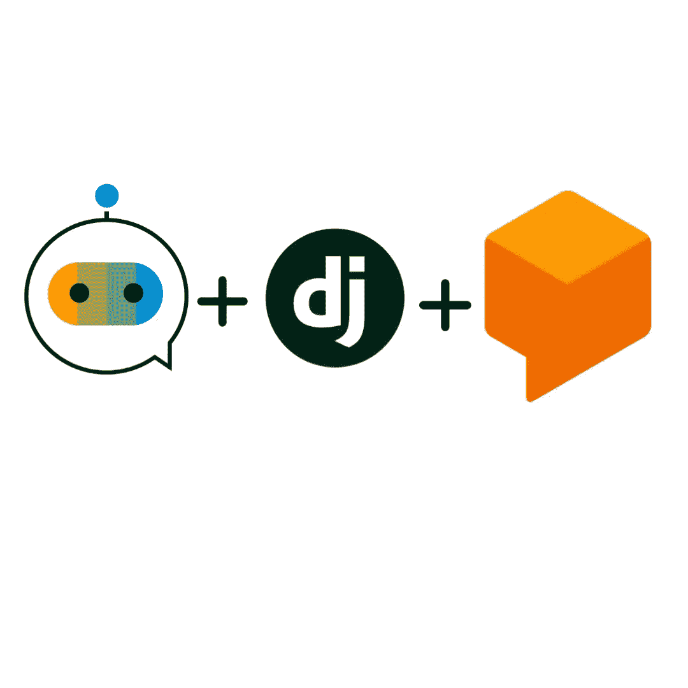

希望你们都已经使用谷歌对话流聊天机器人只是为了在前端互动。但在这里，我想解释一下如何使用 webhook 概念创建一个交互式聊天机器人。Webhooks 是当有事情发生时，应用程序自动发送的消息。在这里，我创建了一个简单的计算器聊天机器人，它识别用户想要执行的算术运算，并产生相同的结果。

在我们继续下一步之前，你需要准备好以下东西:

*   计算机编程语言
*   Django 框架——处理 webhook 的 Python web 框架
*   [Ngrok](https://ngrok.com/) —全球访问您的本地主机
*   谷歌[对话流](https://cloud.google.com/dialogflow/docs/)

**在对话流中创建设置:**

*   在 Google dialogflow 中创建名为 **operations** 的实体
*   参考下面我为运营实体创建的截图，

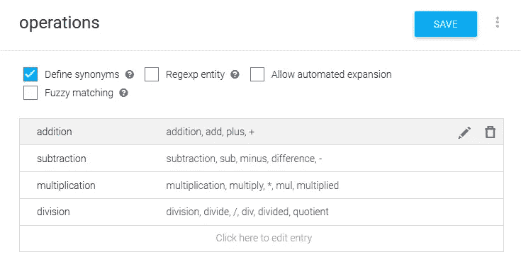

下面是参考文献及其相应同义词的列表

现在让我们创建聊天机器人的意图。因为我要做 4 种算术运算，所以我创建了 4 种不同的意图。

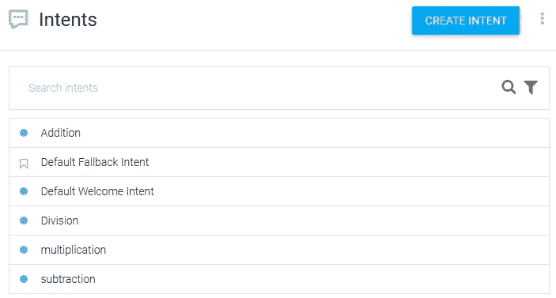

意向列表

培训意图:

现在是时候给我们已经创造的意图提供训练短语了。下面我已经给出了我已经给出的训练短语的例子。以类似的方式给出所有其他意图的训练短语。确保给出尽可能多的训练短语，因为这将有助于对话流轻松了解用户的意图。添加训练短语后，务必保存它。

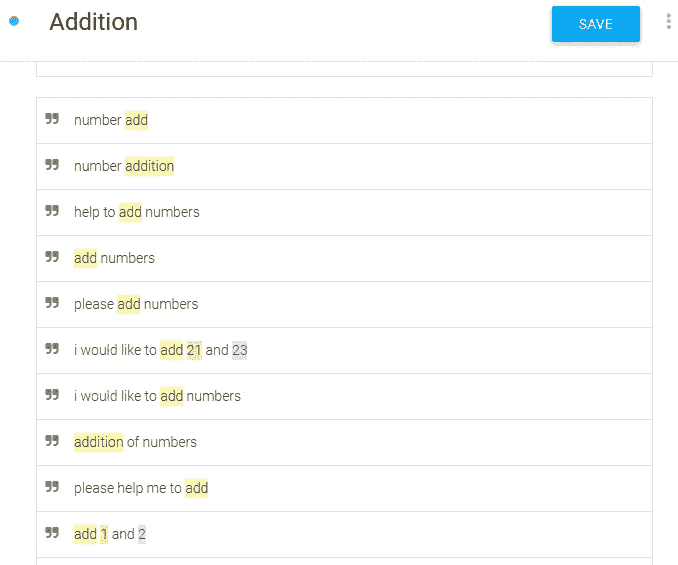

训练短语

请确保将培训短语与实体操作和编号对应起来，如下所示。

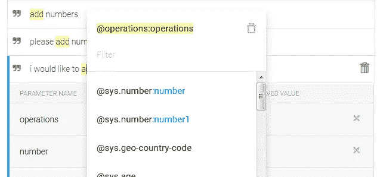

Add 是我们定义的操作实体，numbers 是内置实体。

**动作和参数:**

为了获得用户正在寻找的操作，我们需要定义动作。此外，为了获得我们需要执行的数字和操作，我们需要通过选择 required 复选框来强制执行数字和操作。选择提示，并添加您想问用户的问题，以防未提供所需的详细信息。

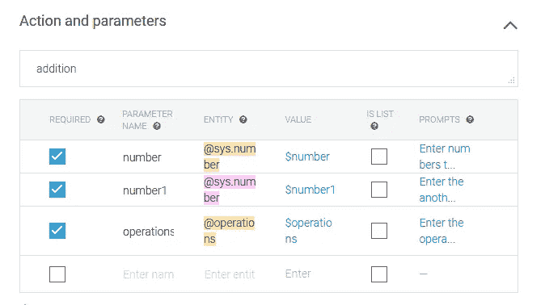

动作需要定义为加法

下面的屏幕截图定义了如果用户错过了一个数字，机器人将询问的提示:

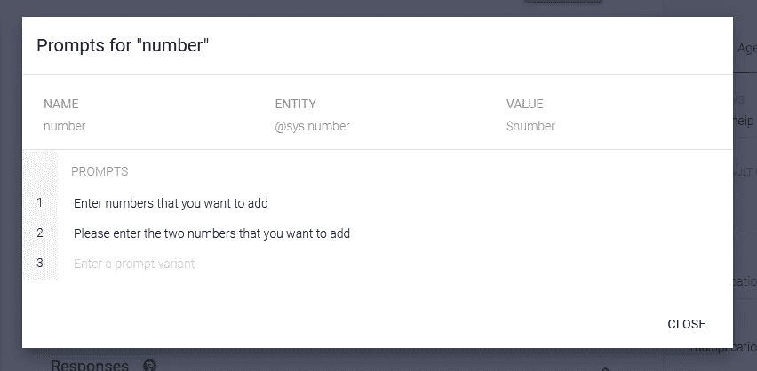

现在启用位于意图末尾的 webhook 按钮，

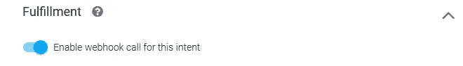

以同样的方式对我们已经定义的其他三个意图(减法、乘法和除法)做同样的事情。

制作 Django 框架设置:

在 Django 框架中创建项目，并创建一个名为算术的应用程序。

```
django-admin startproject calculator_chatbot
python manage.py startapp arithmetic
```

创建应用程序后，请确保将其添加到 settings.py 的已安装应用程序中

```
INSTALLED_APPS = [
    'django.contrib.admin',
    'django.contrib.auth',
    'django.contrib.contenttypes',
    'django.contrib.sessions',
    'django.contrib.messages',
    'django.contrib.staticfiles',
    '**arithmetic**',
]
```

要运行服务器，请使用下面的命令，

```
python manage.py runserver
```

现在，让我们通过在 calculator_chatbot 文件夹的 urls.py 中添加以下代码来为我们新创建的应用程序创建 url，如下所示:

```
from django.contrib import admin
from django.urls import path, include
from arithmetic import viewsurlpatterns = [
    path('admin/', admin.site.urls),
    path('arithmetic/', include('arithmetic.urls')),
]
```

为了访问算术应用程序中的网页，在算术应用程序文件夹中创建一个 urls.py 文件，并在其中添加以下代码。

现在让我们在 views.py 中创建它们相应的视图，

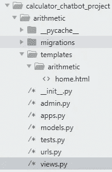

文件夹将如上所示可见

> 在 app 文件夹(算术)中创建一个名为 templates 的文件夹，在其中创建另一个名为算术的子文件夹，并在其中创建 home.html 来检查 Django 框架。**注意:这只是为了测试框架 url 是否工作正常。**

**让本地主机在全球可用:**

现在确保运行 Django 服务器，并从互联网上下载 ngrok。安装 ngrok 后，使用命令提示符进入文件夹，并键入以下命令来运行应用程序。

```
ngrok http 8000
```

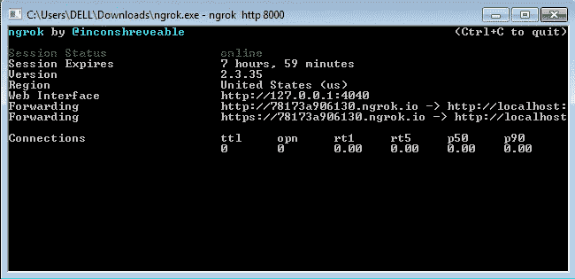

运行该命令后，它将看起来像在图像中

现在复制转发 url 和本地主机 url，粘贴到 settings.py 的 Allowed_host 中如下，

```
ALLOWED_HOSTS = ['127.0.0.1',
'78173a906130.ngrok.io'
]
```

同样的方法在启用后将 url 粘贴到 dialogflow fulfillment 窗口的 webhook 中，并且不要忘记保存它，

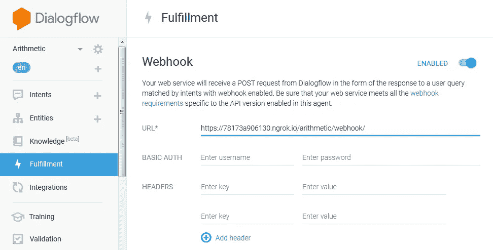

确保在 url 的末尾添加/算术/webhook。也能实现所有的意图。

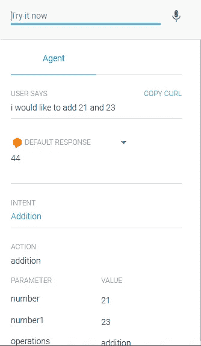

最终聊天机器人

现在是使用聊天机器人的时候了。当你给出训练短语时，聊天机器人会识别你的意图并得到号码。然后，它将通过 webhook 将其传递给本地主机，并获得实现响应。

是啊！我们做到了。如果您仍然面临任何问题，请从 git 资源库— [GIT](https://github.com/Siddhu2/calculator-chatbot) 下载我的代码。快乐编码:-)