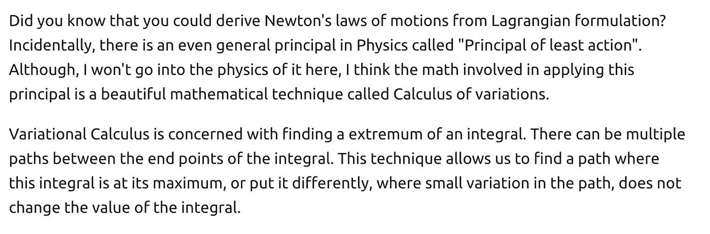
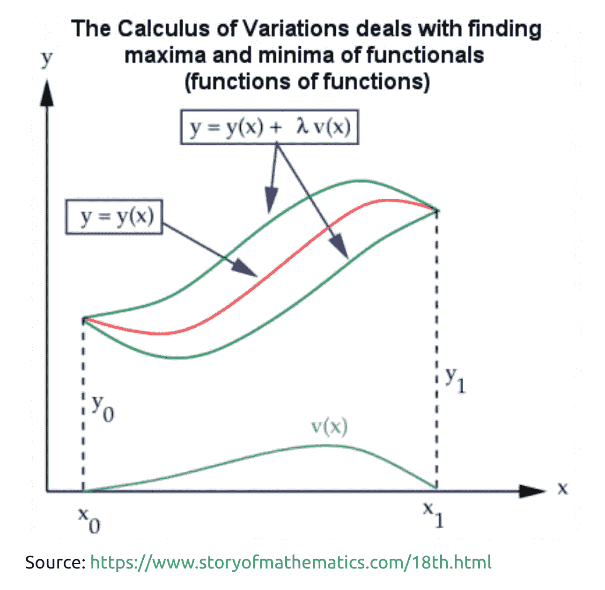
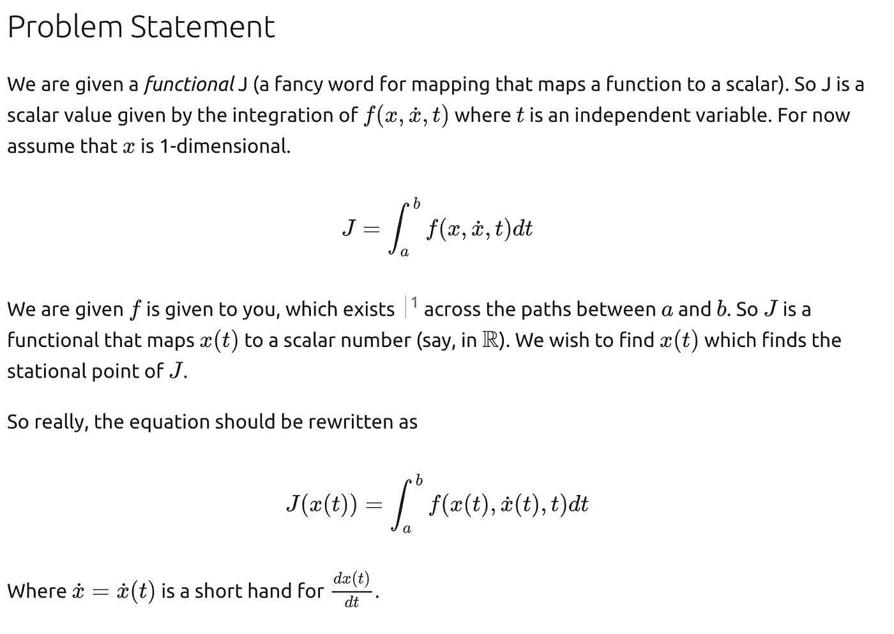
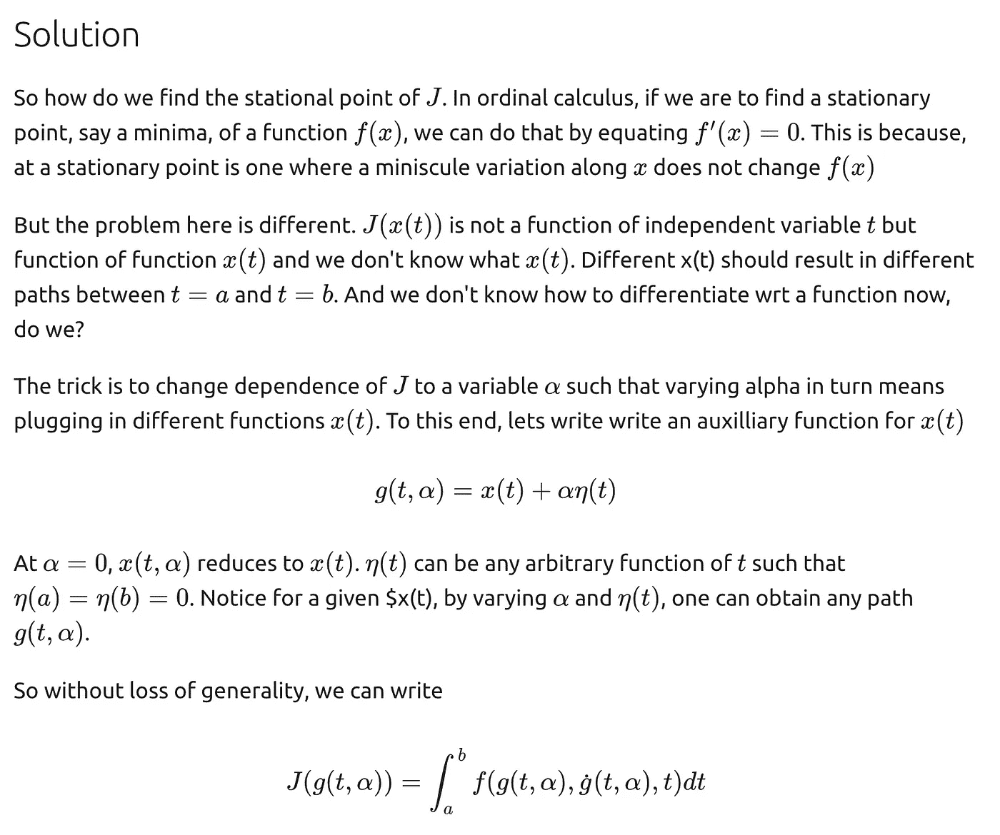
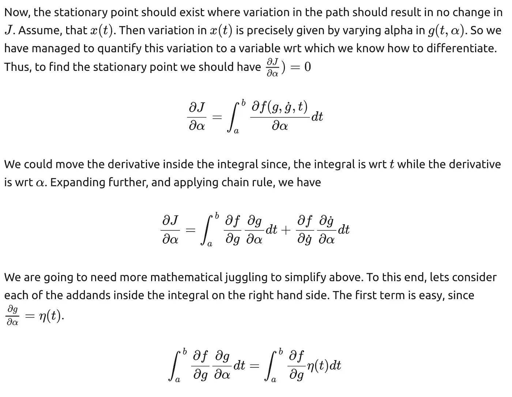
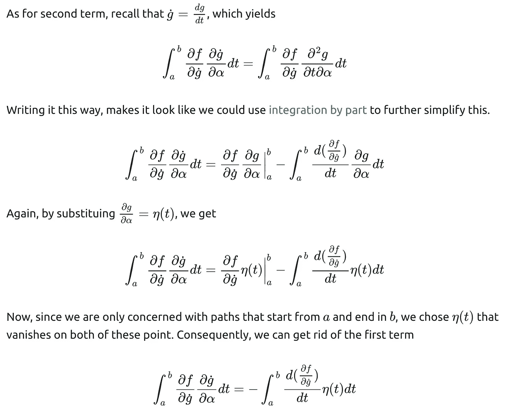
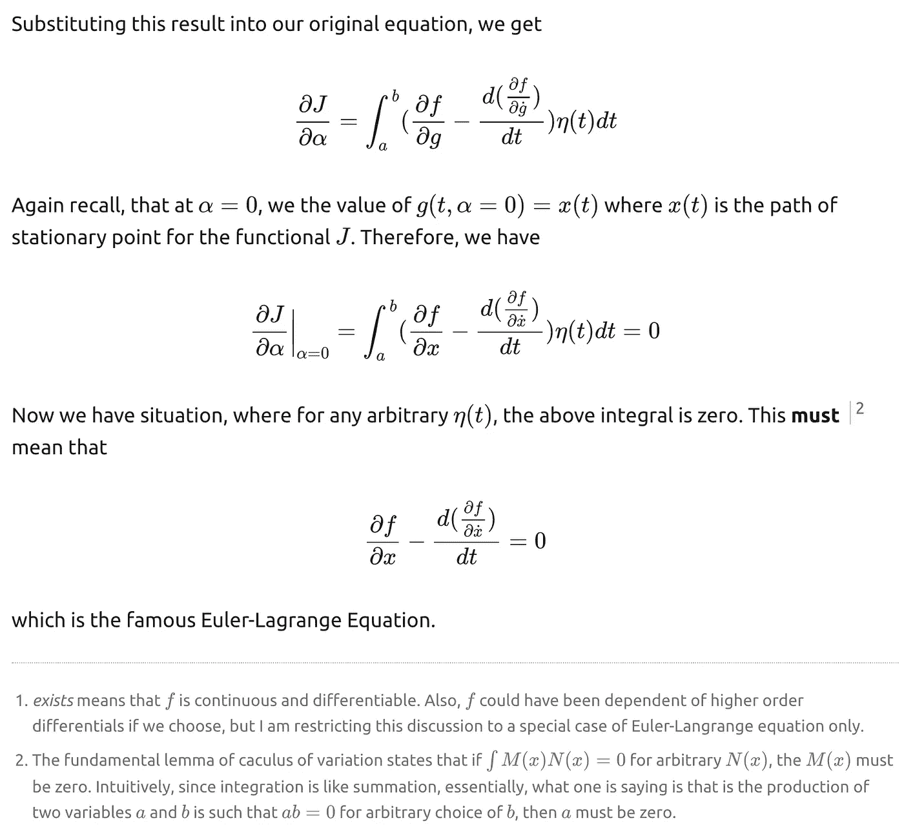

# 变分法:欧拉-拉格朗日方程

> 原文：<https://medium.com/analytics-vidhya/calculus-of-variations-euler-lagrange-equation-f7abfbffd9ef?source=collection_archive---------7----------------------->

注意:介质不允许使用乳胶。原文可以在这里找到[。](https://abhitopia.com/Maths/variational_calculus/)

