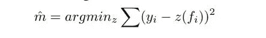

# 机器学习中的校准

> 原文：<https://medium.com/analytics-vidhya/calibration-in-machine-learning-e7972ac93555?source=collection_archive---------0----------------------->

在这个博客中，我们将学习什么是校准，为什么以及何时应该使用它。

图像取自鞋盒测听

当属于一个类别的数据点的概率估计非常重要时，我们校准我们的模型。

校准是将实际输出与系统给出的预期输出进行比较。现在让我从机器学习的角度来看这个问题。

**在校准中，我们试图改进我们的模型，使预测的概率分布和行为与训练数据中观察到的概率分布和行为相似。**

假设我们有一个小样本的数据点。假设样本中有 10 个点，这 10 个点中有 7 个属于正类，3 个属于负类。那么正点数的分数是 0.7( **观察概率**)。这意味着该样本中的一个点有 70%的概率得到一个类标签为正。现在我们将取模型预测的概率估计值的平均值(**预测概率**)。我们预计这个平均值在 0.7 左右。如果这个值远离 0.7，那么我们的模型没有被校准。下图显示了模型完全校准时的理想情况。我们实际上没有得到这个图。

**现在，按照以下步骤绘制校准图。**

1.  创建一个数据集，它有两列，一列是实际标签，另一列是模型给出的预测概率。
2.  按照模型预测的概率的升序对此数据集进行排序。
3.  现在将数据集分成一些固定大小的箱。如果数据集很大，则保持 bin 大小较大，反之亦然。
4.  现在计算每个箱中实际阳性的分数和模型预测的平均概率。
5.  用 y 轴上的正数分数和 x 轴上的平均概率绘制一个图表。

> 在理解如何防止你的模型过拟合和欠拟合时遇到困难，那么浏览这个 [**博客**](https://towardsdatascience.com/overfitting-and-underfitting-in-machine-learning-89738c58f610) 。

 [## 机器学习中的过拟合和欠拟合

### 在这篇文章中，你将了解什么是过度拟合和欠拟合。您还将学习如何防止模型…

towardsdatascience.com](https://towardsdatascience.com/overfitting-and-underfitting-in-machine-learning-89738c58f610) 

# 有两种校准方法。

1.  **Sigmoid/ Platt 的:**在这种技术中，我们使用 Sigmoid 函数的微小变化来拟合预测概率的分布，以适应在训练数据中观察到的概率分布。我们实际上根据实际标签对模型的输出执行逻辑回归。使用的数学函数如下所示:

用于普拉特校准的修正 Sigmoid 函数

现在，为了执行校准，我们必须学习两个参数 A 和 B 的值。我们使用梯度下降来学习，您可以使用自己选择的任何优化算法。数学公式如下所示。

更新超参数 A 和 b 的数学公式。

**用 Python 编码 Sigmoid 校准**:

sigmoid 校准的简单实现如下。

sigmoid 校准的实现

2.**等张:**在技术上我们用分段常数非减函数代替 sigmoid 函数。在这种情况下，我们以分段的方式进行线性回归拟合。给定一个模型，fi 作为预测值，yi 作为实际目标值，然后我们做如下假设

等渗校准中的假设

其中 m 是等张函数。现在给定训练集{fi，yi}，我们试图找到最小化以下等式的保序函数 m^by。

用来解决这个问题的算法叫做**成对相邻违规者算法。**算法的伪代码如下。

成对相邻违规者算法

# 将校准应用于真实数据集:

我们可以通过使用 python 中 **sklearn 库**中的 **CalibratedClassifierCv 类**来应用校准。对于 sigmoid 校准，只需在创建此类对象时传递“sigmoid ”,对于等渗校准，只需传递等渗。

现在，在应用校准之前，我们必须通过绘制实际概率的**可靠性图**和测试数据集上模型预测的概率来**诊断校准**。在 sklearn 中，我们使用**校准 _ 曲线**方法。

在这篇博客中，我将使用亚马逊美食评论数据集对 SVM 模型进行校准。数据集的链接如下

数据集:[https://www.kaggle.com/snap/amazon-fine-food-reviews](https://www.kaggle.com/snap/amazon-fine-food-reviews)

首先让我们诊断校准。所以让我们看看代码本身。

绘制可靠性图以诊断校准的代码

无校准的可靠性图

现在让我们使用**乙状结肠校准**，看看结果。

sigmoid 校准代码

sigmoid 校准后的可靠性图。

现在让我们用**等渗校准**看看结果。

等渗校准代码

等渗校准后的可靠性图。

因此，我们可以看到，在应用校准后，模型预测的概率有了明显的提高。我们还可以看到，等渗校准在使概率值更接近对角线方面表现得更好。

# 现在我认为，

图片来自 giphy

暂时就这些了。如果你有任何问题，请写在评论里。

浏览此 [**博客**](/analytics-vidhya/long-short-term-memory-lstm-in-keras-2b5749e953ac) 开始学习 LSTMs。

 [## Keras 的长短期记忆(LSTM)

### 在这篇文章中，你将学习如何在 Keras 建立一个 LSTM 网络。这里我将解释所有的小细节…

medium.com](/analytics-vidhya/long-short-term-memory-lstm-in-keras-2b5749e953ac) 

如果你是深度学习的新手，想知道 LSTM 网络中参数的数量是如何计算的，可以去看看这个 [**博客**](/analytics-vidhya/guide-to-lstms-for-beginners-ac9d1fc86176) 。

 [## LSTMs 初学者指南。

### 在这个博客中，你将了解什么是 LSTM，为什么我们需要它，以及 LSTM 的内部建筑概况。

medium.com](/analytics-vidhya/guide-to-lstms-for-beginners-ac9d1fc86176)