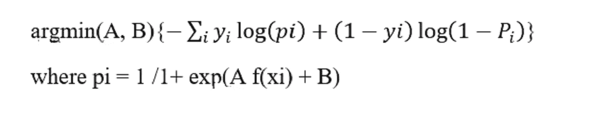

# 模型的校准

> 原文：<https://medium.com/analytics-vidhya/calibration-of-models-afd2d8c1646f?source=collection_archive---------5----------------------->

校准意味着将变换分类器得分转化为类成员概率。

校准模型给出了每个数据点属于特定类别的概率。

# **需要校准**

执行分类时，您不仅希望预测类别标签，还希望获得各个标签的概率。这个概率给了你对预测的某种信心。

概率分数为更高级的性能指标打开了一扇门。例如日志丢失。

朴素贝叶斯等模型做出不切实际的独立性假设，将概率推向 0 和 1。

支持向量机、提升的树和提升的树桩往往会将预测概率推离 0 和 1。这损害了他们预测的概率的质量，并在预测的概率中产生特征性的 s 形失真。

贷款违约预测——银行通常会设置概率阈值，如果违约概率超过 30%则自动拒绝，等等。

广告点击预测——决定显示什么广告，出价多少。你可以使用一个基线点击率(CTR ),并将你的预测与此进行比较，看看你愿意为这个广告印象多付多少钱。

# 可靠性图表(校准曲线)

可靠性图是实际概率值(y 轴)相对于预测概率值(x 轴)的相对频率的线图。

制作可靠性图表的步骤:

1.  在交叉验证数据集上使用 predict_proba()获得预测分数。
2.  按升序排列。
3.  将它们分组到某个“k”大小的箱中，其中 k 个数据集:
4.  让我们来看看这个数据集:
5.  我们的**目标**是给定每个产品的评论，将它们分为正面或负面。

## 以下是分类的步骤:

**预处理文本**(停用词移除、词干、小写转换等)。)

使用 **Tfidf 将文本转换成矢量。**

应用 SVM 模型。

现在，我们来到我们的主要目标，即绘制**校准图。**

按升序对预测的概率得分进行排序。

1.  2.将排序的概率和实际 y 分成多个箱(箱大小=100)
2.  3.取每个箱的实际“y”和预测概率的平均值。
3.  4.在 y 轴上绘制实际 y 的平均值，在 x 轴上绘制预测概率的平均值。

我们可以看到，交叉验证数据上的校准图偏离了理想直线。

1.  扭曲的形状也是 s 形的。

**为什么绘制校准曲线**

校准曲线让我们了解模型预测的概率得分。

这对于确定何时使用校准非常有帮助。

在上图中，我们可以清楚地看到，SVM 模型没有给出正确的概率得分。

校准图对于选择校准技术也很有用。

# 因为失真是 s 形的，所以我们使用普拉特标度。

**校准技术**

通常有两种用于校准的技术。

**普拉特校准**

**等渗回归**

**普拉特校准**

# Platt (1999)提出将 SVM 预测通过一个 sigmoid 来转换成后验概率。

设一个学习方法的输出是 f(x)。要获得校准的概率，请将输出通过一个 sigmoid:

1.  P(y = 1|f(x)) = 1/( 1 + exp(A f(x) + B))
2.  梯度下降用于找到 A 和 B，使得它们是以下问题的解:

# 在这里，易是实际的标签。

交叉验证数据集用于训练这个 s 形方程，并通过最小化对数损失找到正确的 A 和 B。

让我们对上面的亚马逊美食评论数据集应用普拉特校准。

我们可以清楚地看到，普拉特缩放提高了我们的概率得分。

校准曲线几乎更接近直线。

**保序回归**

sigmoid 变换对某些学习方法很有效，但对另一些则不适用。

Zadrozny 和 Elkan (2001- 2002)成功地使用了一种基于保序回归的更通用的方法来校准来自支持向量机、朴素贝叶斯、增强朴素贝叶斯和决策树的预测。

这种方法更一般，因为唯一的限制是映射函数是保序的(单调递增)。

上面的校准图看起来不像 s 形曲线，但它是单调递增的，即满足 f(x_i) < f(x_j) fro x_i < x_j. In other words, the data in the given training set is itself monotonically increasing with respect to x.

# That is, given the predictions f(xi) from a model and the true targets yi , the basic assumption in Isotonic Regression is that: yi = m(f(xi) + b,where m is an isotonic (monotonically increasing) function.

Then, given a train set (f(xi) , yi), the Isotonic Regression problem is finding the isotonic function m such that

We use **成对相邻违反者(PAV)** 算法来寻找解决方案。

以下是步骤:

根据交叉验证数据上的 fi 对训练集(fi，yi)进行排序。

初始化 m(i，i) = yi，w(i，i) = 1

当存在 I 使得 m(k，i-1) > m(i，l)时

I .集合 w(k，l)=w(k，i-1)+w(i，l)

二。集合 m( k，l) = (w(k，i1)m(k，i1)+w(I，l)m( i，l)/w(k，l)

1.  三。将 m( k，i1)和 m( i，l)替换为 m( k，l)
2.  4.输出步进常量。函数:m(f) = m( i，j)，对于 fi
3.  让我们对亚马逊美食评论应用等渗回归:

**结论:**

当预测概率呈 s 形失真时，普拉特标度最有效。

保序回归是一种更强大的校准方法，可以校正任何单调失真。但是，保序回归容易过度拟合。

一般来说，当我们有大量交叉验证数据时，我们应该使用保序回归，否则应该进行 platt 标度。

**参考文献:**

# [https://machine learning mastery . com/calibrated-classification-model-in-scikit-learn/](https://machinelearningmastery.com/calibrated-classification-model-in-scikit-learn/)

[https://jmetzen.github.io/2015-04-14/calibration.html](https://jmetzen.github.io/2015-04-14/calibration.html)

[http://danielnee.com/tag/isotonic-regression/](http://danielnee.com/tag/isotonic-regression/)

一般来说，当我们有大量交叉验证数据时，我们应该使用保序回归，否则应该进行 platt 标度。

# **参考文献:**

1.  [https://machine learning mastery . com/calibrated-class ification-model-in-sci kit-learn/](https://machinelearningmastery.com/calibrated-classification-model-in-scikit-learn/)
2.  【https://jmetzen.github.io/2015-04-14/calibration.html 
3.  [http://danielnee.com/tag/isotonic-regression/](http://danielnee.com/tag/isotonic-regression/)