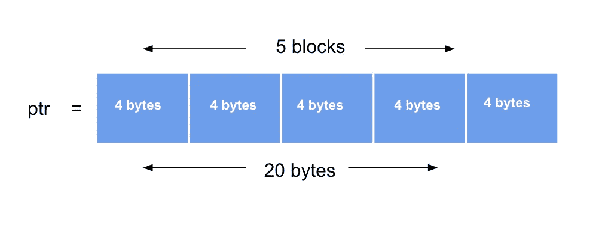
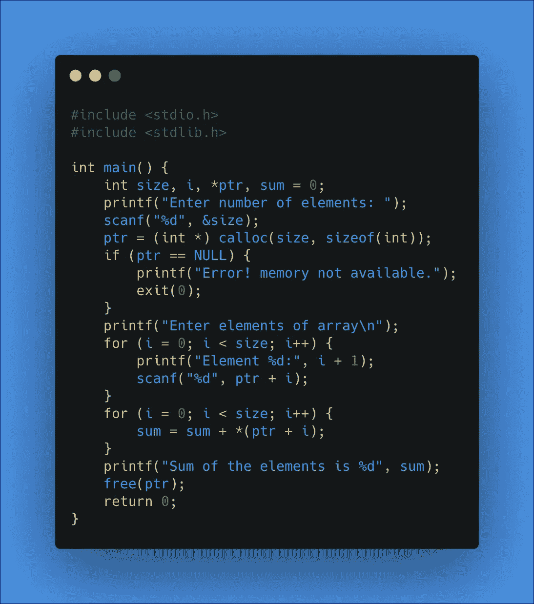
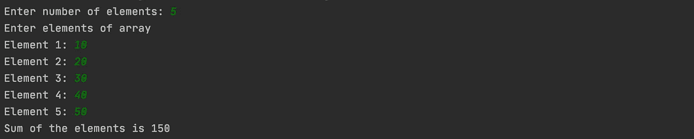

# calloc ( )-动态内存分配

> 原文：<https://medium.com/analytics-vidhya/calloc-dynamic-memory-allocation-562ab4276367?source=collection_archive---------19----------------------->

在上一篇文章中，我们简要讨论了 malloc()并使用 malloc()的概念解决了一个问题。如果你想研究它，那么这里是 [**链接**](/@bindu.khadka.np/dynamic-memory-allocation-863d8e2e7e61) 。为了更好地理解这个主题，我还写了一篇关于如何为 C 程序分配内存以及栈和堆的概念的文章，这里是关于这个主题的 [**链接**](/@bindu.khadka.np/memory-allocation-in-c-f9bac69c70d4) 。

读完这两篇文章后，你可能对 calloc()有了一点了解。现在是时候深入这个话题了。

calloc()是另一个内存管理函数，用于动态分配多个内存块。它通常用于在运行时请求存储派生数据类型(如数组和结构)的内存空间。

此函数的声明:

```
ptr = ( cast-type *) calloc (n, elem-size);
```

它需要两个参数。第一个参数定义数组必须能够容纳的项数，第二个参数以字节为单位指定每个项的大小。

示例:

```
ptr = (int * ) calloc (5, sizeof(int)
```

成功执行该语句后，calloc()函数将分配 5 个块，每个块的大小为 4 个字节。所有字节都被初始化为零，并返回一个指向所分配区域的第一个字节的指针。如果没有足够的可用空间，则返回一个空指针。

下图可以很好地说明这一点:



到目前为止，我们已经知道 calloc()函数是如何工作的。现在让我们实现这个概念来解决一个问题:

计算数组中所有存储元素总和的程序。

```
ptr=(int *) calloc (size,sizeof(int));
```

这里 **ptr** 是一个类型为 **int** 的指针，而 **size** 是一个类型为 **int、**的变量，在执行完这条语句后，你将赋予变量 **size** 的值将是内存内部分配的总块数，每个块的大小将等于 4 个字节，因为 **int** 的大小通常为 4 个字节。

```
if (ptr == NULL) {
    printf("Error! memory not available.");
    exit(0);
}
```

如果指针 ptr 指向 NULL，该语句会显示一个错误，也就是说，如果内存中没有可供分配的空间，它只会显示一条错误消息。

```
for (i = 0; i < size; i++) {
    printf("Element %d:", i + 1);
    scanf("%d", ptr + i);

}
```

这个语句只是读取输入的元素。

```
for (i = 0; i < size; i++) {
    sum = sum + *(ptr + i);
}
```

这段代码简单地将一个数组的所有元素相加。

注意: ***** 符号用于访问指针指向的元素。

```
free(ptr);
```

一旦你使用 calloc 分配内存，并且你已经在你的程序中使用完了它，它必须使用函数 ***free()*** 返回给系统。

这是整个程序的样子:



输出:



这都是关于 calloc()的，在下一篇文章中我们将讨论 realloc()。