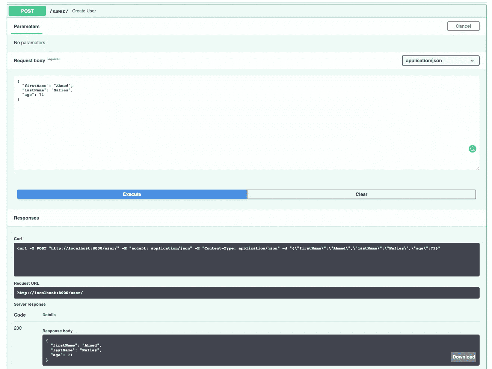

# 带 FastAPI 和 Pydantic 的茶包模型

> 原文：<https://medium.com/analytics-vidhya/camel-case-models-with-fast-api-and-pydantic-5a8acb6c0eee?source=collection_archive---------0----------------------->

## 最简单的方法是在保持模型大小写不变的情况下拥有骆驼式 JSON 请求/响应体

# 介绍

我花了一段时间才弄明白如何将 camel-caseing 用于我一直在从事的快速 API 微服务端点之一，同时保持“模型”字段的蛇形封装。

关于 [FastAPI](https://fastapi.tiangolo.com/) 和 [Pydantic](https://pydantic-docs.helpmanual.io/) 的文档非常棒，但是它并没有用一个简单易懂的例子来描述这部分。这就是为什么我决定创建这个教程。

我还创建了一个名为`fastapi_camelcase`的包，你可以使用`pip`安装并立即使用，我在这里写了一篇关于它的文章。

*提示*:本教程假设您对 FAST API 有一些经验，并且知道如何使用 Pydantic 模型创建 REST 端点

# 问题是

让我们假设您有下面的应用程序，该应用程序公开了一个 API 端点，该端点在您的“models.py”中表示一个名为“User”的资源

```
from pydantic import BaseModel

class User(BaseModel):
    first_name: str
    last_name: str = None
    age: int
```

您有了包含“运行”配置的“main.py”

```
import uvicorn
from fastapi import FastAPI
from models import User

app = FastAPI()

@app.post("/user/", response_model=User)
async def create_user(user: User):
    return user

if __name__ == "__main__":
    uvicorn.run(app, host="0.0.0.0", port=8000)
```

如果您运行该应用程序

```
python main.py
```


snake_case 请求/回复

正如我们所料，我们将在 OpenAPI 文档中看到蛇形的请求/响应体。现在我们可以将字段名改为 camelCase，但这不符合 PEP-8 标准。


# Pydantic 别名

pydantic 模型的别名可以在 camel case 而不是 snake case 的 JSON 序列化中使用，如下所示:

```
from pydantic import BaseModel, Field

class User(BaseModel):
    first_name: str = Field(..., alias='firstName')
    last_name: str = Field(..., alias='lastName')
    age: int = Field(..., alias='age')
```

我们在 camelCase 中创建我们的模式


camel-case 请求/响应主体

如果我们有 1000 个字段而不是 3 个，我们现在怎么办？我希望有一个神奇的别名生成器。

**幸好有:)**

## 别名生成器

Pyndantic 有一个控制模型行为的 [Config](https://pydantic-docs.helpmanual.io/usage/model_config/) 类。我们可以为所有模型字段生成别名，如下所示:

```
from pydantic import BaseModel
from humps import camelize

def to_camel(string):
    return camelize(string)

class User(BaseModel):
    first_name: str
    last_name: str = None
    age: float

    class Config:
        alias_generator = to_camel
```

现在让我们试一试


内部服务器错误

内部服务器错误？说什么？


错误日志

当然，我们使用别名(camelCase)而不是字段名(snake_case)，我希望有一个简单的方法来解决这个问题

**幸好有:D**

所需要做的就是将以下内容添加到模型配置类中

```
allow_population_by_field_name = True
```

所以我们的模型现在应该是这样的

```
from pydantic import BaseModel
from humps import camelize

def to_camel(string):
    return camelize(string)

class User(BaseModel):
    first_name: str
    last_name: str = None
    age: float

    class Config:
        alias_generator = to_camel
        allow_population_by_field_name = True
```

让我们再试最后一次



成功的宁静

然后嘣！，我们所有的代码都在 snake_case 中，请求/响应和文档都在 camelCase 中，这不是很棒吗？

# 最后一个增强

我们可能会有许多 API 端点使用的许多模型，我们希望在它们之间使用 camelCase，对吗？大概是:)

现在让我们使用继承的力量

```
from pydantic import BaseModel
from humps import camelize

def to_camel(string):
    return camelize(string)

class CamelModel(BaseModel):
    class Config:
        alias_generator = to_camel
        allow_population_by_field_name = True class User(CamelModel):
    first_name: str
    last_name: str = None
    age: int
```

太好了，现在你可以继承`CamelModel`而不是`BaseModel`了，尽情享受吧！！！

按照上面的教程，我创建了一个简单易用的包。

`pip install fastapi_camelcase`

```
from fastapi_camelcase import CamelModelclass User(CamelModel):
    first_name: str
    last_name: str = None
    age: int
```

这个例子的完整代码可以在 github 的找到