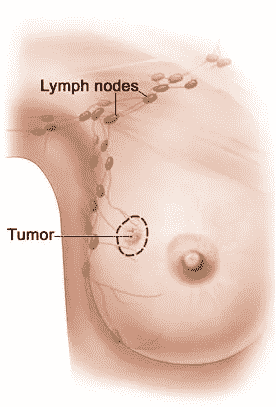
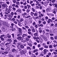
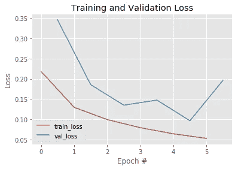
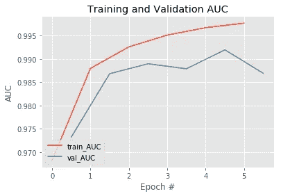
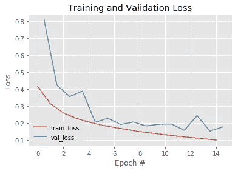
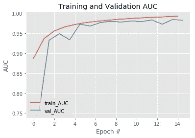

# Camelyon16:在淋巴结活检中检测乳腺癌转移

> 原文：<https://medium.com/analytics-vidhya/camelyon16-detecting-breast-cancer-metastases-in-lymph-node-biopsies-8de6ae6cd4f4?source=collection_archive---------9----------------------->

在过去的几个月里，我一直在使用 Kaggle 上的数据集进行癌症检测项目。[0]我在下面总结了我的工作——欢迎提出任何想法或建议！

# 有什么问题？

癌症可以转移或扩散到身体的其他部位，而不是它的发源地。特别是，根据卡米里恩网站，“腋下的淋巴结是乳腺癌最容易扩散的地方。”[1]如果乳腺癌已经转移到淋巴结，预后较差。然而，识别淋巴结转移是一件“乏味、耗时且容易被误解”的事情。[1]因此，Kaggle 挑战和这个项目的目标是创建一个可以在淋巴结图像中自动检测乳腺癌转移的模型。这种模型可以减少病理学家的工作量，并提高诊断精度和召回率。



乳腺癌可以转移到腋下的淋巴结。

# 有哪些数据可用？

Camelyon16 数据集由 400 个淋巴结的苏木精-伊红(H&E)全切片图像组成，并标记了转移区域。Kaggle challenge 进一步将数据分解为 96×96 像素的图像，这些图像来自原始的整片图像。如果在中心 32×32 像素区域中有至少一个癌症组织像素，则每个图像被标记为阳性；否则，它被标记为负面。有 220，000 张训练图像和 570，000 张评估图像，其中大约 60/40 的图像分为正反两部分。



阳性数据点(包含癌组织)

# 问题设置—培训/开发集和指标

我决定分出 10%的训练数据作为开发集，我可以用它来比较不同模型的功效。我还决定使用 AUC(ROC 曲线下的面积)作为我的主要发展指标，它代表了模型将随机选择的正面例子排在随机选择的负面例子之上的概率。在处理类别不平衡时，AUC 是一个比准确性更好的指标-举个简单的例子，如果阴性/阳性分裂是 99/1，那么分类器可以通过简单地预测阴性来实现高准确性。

# 数据扩充

一种综合增加计算机视觉任务中训练数据量的常用技术是对数据进行变换。我决定通过应用-90 到 90 度之间的随机旋转，以及以 0.5 的概率水平和/或垂直翻转图像，来创建每个训练数据图像的副本。请注意，亮度衰减、裁剪和剪切等其他变换也是可能的，但我选择不应用这些变换，因为它们可能会引入与结果相关的伪像，例如剪切可能会在细胞形状中引入形态异常。

```
from imgaug import augmenters as iaaseq = iaa.Sequential([
   iaa.Affine(rotate=(-90, 90)), # Rotate image between -90 and 90 degrees
   iaa.Fliplr(0.5), # horizontally flip 50% of all images
   iaa.Flipud(0.5), # vertically flip 50% of all images
])
```

我只增加了训练数据，而没有增加开发数据——原因是我们希望开发和测试数据尽可能接近我们关心的实际数据，以便我们对它们的度量读数反映“真实”的、未增强的淋巴结图像的真实性能。

还要注意，在将数据分成训练集和开发集之后进行扩充是很重要的；否则，您可能会以训练数据泄漏而告终，其中一个增强版本的训练映像会出现在您的开发集中。

在数据扩充之后，我们最终得到 397k 训练数据图像和 21k 开发集图像。

# 基线模型—逻辑回归

作为基线模型，我创建了一个逻辑回归，将 96x96x3 图像中的每个像素作为输入。我用 Keras/Tensorflow 来做。

```
lr_model = Sequential()
lr_model.add(Flatten(input_shape=(96, 96, 3)))
lr_model.add(Dense(1))
lr_model.add(Activation('sigmoid'))lr_model.compile(
  optimizer='adam',
  loss='binary_crossentropy',
  metrics=['accuracy', 'AUC']
)lr_model.fit(
    x=train_x,
    y=train_y,
    validation_data=(validation_x, validation_y),
    epochs=1,
    batch_size=32,
    shuffle=True,
)
```

基线模型达到了以下指标:

*   培训损失:0.8519
*   训练精度:0.5782
*   训练 AUC: 0.5975
*   发展损失:1.4036
*   dev 精度:0.4034
*   开发 AUC: 0.7228

显然，还有很大的改进空间！我们应该优先考虑哪些后续步骤？正如吴恩达在他关于深度学习的课程中提到的[2]，我们应该看看贝叶斯误差(最低可能实现的误差)，训练误差和 dev 误差。这里，我们将 AUC 作为主要指标，但我们可以计算出误差为 1-AUC。我们也可以假设贝叶斯误差约为 0，对应于 Kaggle 排行榜上取得的最好成绩(~1)。由于训练误差和开发误差都明显高于贝叶斯误差，我们可以得出结论，我们有一个偏差问题-最有可能的是，模型不够复杂，无法捕捉数据中的相互作用。这意味着我们应该训练一个更大的模型。

# 迁移学习——NASNet 模型

计算机视觉任务的一个常见出发点是使用另一个视觉任务的预训练模型，并针对手头的任务进行微调。这被称为迁移学习。

让我们试试 NASNetMobile 模型，它可以通过 Tensorflow/Keras 库获得，并在 ImageNet 上展示了最先进的性能。由于 NASNetMobile 将 224x224px 像素的图像作为输入，那么这个模型如何适用于 96×96 像素的输入图像呢？答案是，我们只使用模型中的卷积层和池层，它们对输入维度没有要求；我们消除了顶部的全连接层，因为它期望从 conv/池层获得一定大小的输出量。

作为最初的方法，我决定将输出音量变平，然后用一个神经元将其输入到一个密集的层中。我还决定解冻 NASNet 模型参数，因为训练数据集似乎足够大，可以训练这样大小的模型。

```
inputs = Input((96, 96, 3))
base_model = NASNetMobile(include_top=False, input_tensor=inputs, weights=’imagenet’)
x = base_model(inputs)
x = Flatten()(x)
x = Dense(1, activation=”sigmoid”)(x)
model = Model(inputs, x)model.compile(
  optimizer=Adam(1e-4),
  loss=’binary_crossentropy’,
  metrics=[‘accuracy’, ‘AUC’])model.fit(
  x=train_x,
  y=train_y,
  validation_data=(validation_x, validation_y),
  epochs=6,
  batch_size=32,
  shuffle=True,
  callbacks=[model_checkpoint],
)
```

这产生了以下指标:

*   列车损失:0.053
*   训练 AUC: 0.9977
*   发展损失:0.097
*   开发 AUC: 0.9920



整个训练时期的训练和开发损失



在培训时期培训和开发 AUC

现在，我们已经消除了大部分偏差问题—贝叶斯误差和训练误差之间的差距是 1–0.9977 = 0.0023。训练误差和开发误差之间的差距是 0.9977–0.9920 = 0.057，这告诉我们，我们需要专注于解决方差问题。我们可以通过正则化模型来做到这一点，通过辍学或 L2 正则化。

# 能不能加快训练速度？

训练 NASNet 模型需要很长时间，每个时期大约 1300 秒，即使在 GPU 上训练也是如此。由于我是在 Google Cloud 上训练的，所以我可以使用四个 GPU，并想知道我是否可以使用它们来加快训练速度。

我尝试在 TensorFlow 中使用 MirroredStrategy 来实现这一点:

```
with tf.distribute.MirroredStrategy().scope():
   # Create, compile, and fit model
   # ...
```

MirroredStrategy 将模型的所有变量复制到每个 GPU，并将正向/反向传递计算分批分配给所有 GPU。然后，它使用 all-reduce 合并来自每个 GPU 的渐变，然后将结果应用到每个 GPU 的模型副本。本质上，它是划分批处理并将每个块分配给一个 GPU。

令人惊讶的是，使用 MirroredStrategy 最初使训练变得更慢——2200 秒比 1300 秒！我将此归因于 32 的批处理大小相对较小，因此分割批处理的开销可能超过了使用多个 GPU 节省的时间。

然后，我使用了更大的批量 1024。这导致了 6 倍的训练加速，从每历元 1300 秒到 218 秒。然而，虽然这导致了与之前类似的培训损失(0.046)，但是 dev 损失却激增至 2.34。

事实证明，增加批量大小会显著增加泛化差距——训练和开发性能之间的差距。原因是较大的批量往往会导致“急剧最小化”，这不能很好地推广到新数据，而较小的批量会引入一些噪声，使它们能够避开这些“急剧最小化”，而有利于推广得更好的“平坦最小化”。[3]不幸的是，这意味着更大的批量，以及并行化带来的相应加速是不可能的，除非采用技术来改善大批量的泛化能力。*

*其他人之前观察到，增加学习率可以消除大批量上的泛化差距；然而，我发现这样做并没有带来任何收获。

# 前期培训有帮助吗？

我们在上面看到，从简单的逻辑回归模型转移到预先训练的 NASNet 模型显著提高了 AUC。然而，这是因为 NASNet 是预训练的，还是仅仅因为 NASNet 的架构更复杂，因此更能够学习训练数据中的交互？换句话说，前期培训真的有帮助吗？

为了回答这个问题，我运行了一个相同的运行，使用随机初始化的权重，而不是预先训练的 ImageNet 权重。如下图所示，模型需要更长的时间来学习并达到良好的性能——即使在 15 个时期后，模型仍然没有仅在 6 个时期后预训练模型的性能好！



由于我只训练了 15 个时期的模型，我不确定它最终是否会赶上预训练的版本——但我们可以合理地得出结论，随机初始化的模型需要更长的时间来匹配预训练模型的性能，如果它曾经达到过的话。

# 参考

[0][https://www . ka ggle . com/c/organisationic-cancer-detection/overview](https://www.kaggle.com/c/histopathologic-cancer-detection/overview)

[1]https://camelyon16.grand-challenge.org/Background/

[2][https://www . coursera . org/learn/neural-networks-deep-learning](https://www.coursera.org/learn/neural-networks-deep-learning/home/welcome)/

[3][https://openreview.net/pdf?id=H1oyRlYgg](https://openreview.net/pdf?id=H1oyRlYgg)