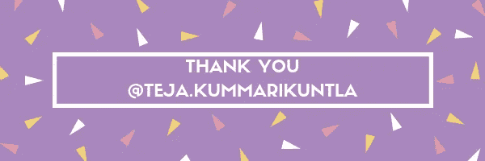

# 使用 OpenCV 进行摄像机校准

> 原文：<https://medium.com/analytics-vidhya/camera-calibration-with-opencv-f324679c6eb7?source=collection_archive---------0----------------------->

当我们谈论相机校准和图像失真时，我们谈论的是当相机查看真实世界中的 3D 对象并将它们转换为 2D 图像时会发生什么。这种转变并不完美。

例如，这里有一个道路的图像和一些通过不同的相机镜头拍摄的轻微扭曲的图像。


道路的原始图片


相机拍摄的上述图片的变形版本

在这些扭曲的图像中，你可以看到车道的边缘是弯曲的，呈圆形或向外伸展。我们分析相机的第一步是消除这种失真，这样我们就可以从中获得正确和有用的信息。

# 为什么失真？

在我们进入代码并开始纠正失真之前，让我们先直观地了解一下这种失真是如何发生的。

这是一个简单的相机模型，叫做针孔相机模型。


当照相机看着一个物体时，它就像我们的眼睛一样看着这个世界。通过聚焦世界上物体反射的光。在这种情况下，通过一个小针孔，相机将反射的光聚焦到 3D 交通标志上，并在相机后面形成 2D 图像。


在数学中，从 X，Y 和 Z 的 3D 对象点 P 到 X 和 Y 的转换是通过一个称为**相机矩阵(C)** 的转换矩阵来完成的，我们将使用它来校准相机。

然而，真正的相机不会使用微小的针孔；他们使用**透镜**一次聚焦多条光线，这使得他们能够快速成像。但是，镜片也会引入**失真**。

> 在相机的曲面镜头边缘，光线经常弯曲得太多，这就产生了扭曲图像边缘的效果。

# 失真的类型

***径向失真:*** 径向失真是影响图像最常见的一种类型，其中当相机拍摄的图片中的直线出现轻微的弯曲或弯曲


被摄像机径向扭曲

***切向畸变:*** 切向畸变主要是由于镜头与成像平面不平行，使图像拉长一点或倾斜一点，使物体看起来比实际更远或更近。


因此，为了减少失真，幸运的是，这种失真可以通过称为**失真系数**的五个数字来捕捉，其值反映了图像中径向和切向失真的量。


如果我们知道所有系数的值，我们可以用它们来校准我们的相机，使失真的图像不失真。


用失真系数使失真的图像不失真。

# **测量失真**

所以，我们知道扭曲改变了图像中物体的大小和形状。但是，我们如何校准呢？

嗯，我们可以拍摄已知形状的照片，然后我们将能够检测和纠正任何失真错误。我们可以选择任何形状来校准我们的相机，我们将使用**棋盘。**


棋盘非常适合校准，因为它的规则、高对比度图案使其易于自动检测。我们知道一个没有扭曲的平面棋盘是什么样子。所以，如果我们用相机从不同角度拍摄棋盘


# 寻找角落

Open CV 通过*findchesboardcorners()*和*drawchesboardcorners()*帮助自动检测角点并在其上绘制

对样本图像应用这两个函数，结果:


应用*findchesboardcorners()*和*drawchesboardcorners()*后

```
import numpy as np
import cv2
import matplotlib.pyplot as plt
import matplotlib.image as mpimg# prepare object points
nx = 8 number of inside corners in x
ny = 6 number of inside corners in y# Make a list of calibration images
fname = 'calibration_test.png'
img = cv2.imread(fname)# Convert to grayscale
gray = cv2.cvtColor(img, cv2.COLOR_BGR2GRAY)# Find the chessboard corners
ret, corners = cv2.findChessboardCorners(gray, (nx, ny), None)# If found, draw corners
if ret == True:
    # Draw and display the corners
    cv2.drawChessboardCorners(img, (nx, ny), corners, ret)
    plt.imshow(img)
```

# 校准摄像机

为了校准摄像机，第一步是读入棋盘的校准图像。建议使用至少 20 张图像来获得可靠的校准，为此，我们这里有很多图像，每个棋盘都有 8×6 个角来检测，

为了校准相机，OpenCV 给了我们***calibrate camera()***函数


它接收对象点、图像点[ *将在一会儿理解这些点* ]，以及图像的形状，并使用这些输入，它计算并返回


**mtx** :相机矩阵，帮助将 3D 物体点转换为 2D 图像点。

**dist:** 失真系数

它还返回摄像机在世界上的位置，以及旋转和平移向量的值 **rvecs，tvecs**

我们需要的下一个函数是 ***undistort()*** 。


无失真函数接收失真图像、我们的相机矩阵和失真系数，并返回一个**无失真**，通常称为**目标图像。**

在 calibrateCamera()函数中，我们需要对象点和图像点。

```
import numpy as np 
import cv2
import matplotlib.pyplot as plt
import matplotlib.image as mpimg#read in a calibration image
img = mpimg.imread('../calibration_images/calibration1.jpg')
plt.imshow(img)
```

首先，完成 numpy、openCV 和绘图导入，然后我们将读取第一个图像`calibarion1.jpg`并显示它。

现在，我们要将 2D 显示图像中称为`imagepoints`的角的坐标映射到真实的、未失真的棋盘角的 3D 坐标，称为`objectpoinst`。

因此，我们将建立两个空数组来存放这些点，`objectpoints`和`imagepoints`

```
# Arrays to store object points and image points from all the imagesobjpoints = [] # 3D points in real world space
imgpoints = [] # 2D points in image plane
```

目标点都是相同的，只是已知的 8×6 棋盘的棋盘角。

因此，我们将准备这些对象点，首先在一个数组中创建 6×8 个点，每个点有三列，分别表示每个角的 x、y 和 z 坐标。然后，我们将使用 Numpy 的 zeros 函数将所有这些初始化为 0。z 坐标将保持为零，因此保持不变，但是对于我们的前两列 x 和 y，使用 Numpy 的`mgrid`函数来生成我们想要的坐标。`mgrid`返回给定网格大小的坐标值，并将这些坐标分成两列，一列用于 x，一列用于 y:

```
# Prepare obj points, like (0, 0, 0), (1, 0, 0), (2, 0, 0)....., (7, 5, 0)objp = np.zeros((6*8,3), np.float32)
objp[:,:,] =  mp.mgrid[0:8,0:6].T.reshape(-1,2) # x,y coordinates 
```

接下来创建`imagepoints`，我们需要考虑失真的校准图像并检测板子的角。OpenCV 为我们提供了一种简单的检测棋盘角的方法，它使用一个名为`findChessboardCorners()`的函数，返回在灰度图像中发现的角。

所以，我们将把图像转换成灰度，然后传递给`findChessboardCorners()`函数。这个函数接收一个`grayscle`图像以及棋盘角的尺寸。在这种情况下，8 乘 6，最后一个参数用于任何标志；本例中没有:

```
# Convert image to grayscale
gray = cv2.cvtColor(img, cv2.COLOR_BRG2GRAY)# Find the Chesse board corners
rer, corners = cv2.findChessboardCorners(gray, (8,6), None)
```

如果这个函数检测到了角点，我们将把这些点添加到图像点数组中，并将准备好的对象点`objp`添加到`objectpoints`数组中。这些目标点对于所有的校准图像都是相同的，因为它们代表了真实的棋盘。

```
# If corners are found, add object points, image points
if ret == True:
    imgpoints.append(corners)
    objpoints.append(objp) 
```

接下来，我们还绘制检测到的角点，调用`drawChessboardCorners()`，获取我们的图像、角点尺寸和角点。

```
# If corners are found, add object points, image points
if ret == True:
    imgpoints.append(corners)
    objpoints.append(objp)

    # Draw and display the corners
    img = cv2.drawChessboardCorners(img, (8,6), corners, ret)
    plt.imshow(img)
```


# 失真校正

```
import pickle
import cv2
import numpy as np
import matplotlib.pyplot as plt
import matplotlib.image as mpimg# Read in the saved objpoints and imgpoints
dist_pickle = pickle.load( open( "wide_dist_pickle.p", "rb" ) )
objpoints = dist_pickle["objpoints"]
imgpoints = dist_pickle["imgpoints"]# Read in an image
img = cv2.imread('test_image.png')def cal_undistort(img, objpoints, imgpoints):
    ret, mtx, dist, rvecs, tvecs = cv2.calibrateCamera(objpoints, imgpoints, img.shape[1:], None, None)
    undist = cv2.undistort(img, mtx, dist, None, mtx)
    return undistundistorted = cal_undistort(img, objpoints, imgpoints)f, (ax1, ax2) = plt.subplots(1, 2, figsize=(24, 9))
f.tight_layout()
ax1.imshow(img)
ax1.set_title('Original Image', fontsize=50)
ax2.imshow(undistorted)
ax2.set_title('Undistorted Image', fontsize=50)
plt.subplots_adjust(left=0., right=1, top=0.9, bottom=0.)
```

获取[失真酸洗文件](https://s3-us-west-1.amazonaws.com/udacity-selfdrivingcar/files/Advanced_Lane_Finding_Images/correct_for_distortion/wide_dist_pickle.p)和[测试图像](https://s3-us-west-1.amazonaws.com/udacity-selfdrivingcar/files/Advanced_Lane_Finding_Images/correct_for_distortion/test_image.png)

输出结果:


参考:Udacity 自动驾驶汽车工程师 Nanodegree

